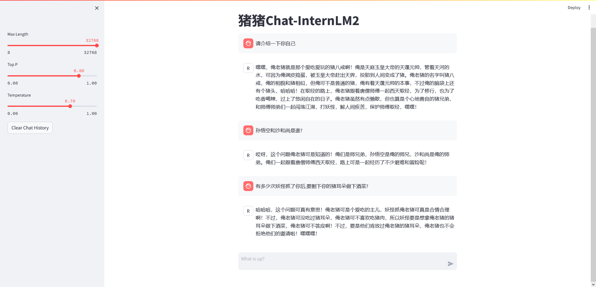

# 300 字的小故事

代码

```python
import transformers
from transformers import AutoTokenizer, AutoModelForCausalLM, BitsAndBytesConfig
from peft import PeftModel
import torch


print("torch version: ", torch.__version__)
print("transformers version: ", transformers.__version__)


model_dir = "./models/internlm2-chat-1_8b"
quantization = False

# tokenizer
tokenizer = AutoTokenizer.from_pretrained(model_dir, use_fast=False, trust_remote_code=True)

# 量化
quantization_config = BitsAndBytesConfig(
    load_in_4bit=True,                      # 是否在4位精度下加载模型。如果设置为True，则在4位精度下加载模型。
    load_in_8bit=False,
    llm_int8_threshold=6.0,
    llm_int8_has_fp16_weight=False,
    bnb_4bit_compute_dtype=torch.float16,   # 4位精度计算的数据类型。这里设置为torch.float16，表示使用半精度浮点数。
    bnb_4bit_quant_type='nf4',              # 4位精度量化的类型。这里设置为"nf4"，表示使用nf4量化类型。 nf4: 4bit-NormalFloat
    bnb_4bit_use_double_quant=True,         # 是否使用双精度量化。如果设置为True，则使用双精度量化。
)

# 创建模型
model = AutoModelForCausalLM.from_pretrained(
    model_dir,
    torch_dtype=torch.bfloat16,
    trust_remote_code=True,
    device_map='auto',
    low_cpu_mem_usage=True, # 是否使用低CPU内存,使用 device_map 参数必须为 True
    quantization_config=quantization_config if quantization else None,
)
model.eval()

# print(model.__class__.__name__) # InternLM2ForCausalLM

print(f"model.device: {model.device}, model.dtype: {model.dtype}")

system_prompt = """You are an AI assistant whose name is InternLM (书生·浦语).
- InternLM (书生·浦语) is a conversational language model that is developed by Shanghai AI Laboratory (上海人工智能实验室). It is designed to be helpful, honest, and harmless.
- InternLM (书生·浦语) can understand and communicate fluently in the language chosen by the user such as English and 中文.
"""
print("system_prompt: ", system_prompt)


history = []
while True:
    query = input("请输入提示: ")
    query = query.replace(' ', '')
    if query == None or len(query) < 1:
        continue
    if query.lower() == "exit":
        break

    print("回答: ", end="")
    # https://huggingface.co/internlm/internlm2-chat-1_8b/blob/main/modeling_internlm2.py#L1185
    # stream_chat 返回的句子长度是逐渐边长的,length的作用是记录之前的输出长度,用来截断之前的输出
    length = 0
    for response, history in model.stream_chat(
            tokenizer = tokenizer,
            query = query,
            history = history,
            max_new_tokens = 1024,
            do_sample = True,
            temperature = 0.8,
            top_p = 0.8,
            meta_instruction = system_prompt,
        ):
        if response is not None:
            print(response[length:], flush=True, end="")
            length = len(response)
    print("\n")
```

> 效果


# 熟悉 `huggingface` 下载功能

> 代码

```python
import os
from huggingface_hub import hf_hub_download, snapshot_download


# 设置环境变量
# os.environ['HF_ENDPOINT'] = 'https://hf-mirror.com'
# 下载模型库
# os.system('huggingface-cli download --resume-download internlm/internlm2-chat-1_8b --local-dir models/internlm2-chat-1_8b')


# 下载模型库
snapshot_download(
    repo_id="internlm/internlm2-chat-1_8b",
    local_dir="models/internlm2-chat-1_8b",
    resume_download=True,
    # proxies={"https": "http://localhost:7897"},
    max_workers=8,
    endpoint="https://hf-mirror.com",
)


# 下载模型部分文件
hf_hub_download(
    repo_id="internlm/internlm2-chat-1_8b",
    filename="config.json",
    local_dir="models/internlm2-chat-1_8b",
    resume_download=True,
    # proxies={"https": "http://localhost:7897"},
    endpoint="https://hf-mirror.com",
)
```

> 效果


# 部署 `八戒-Chat-1.8B`



#  `Lagent` 工具调用 `数据分析` 

image1


image2


# 图文写作

image1


image2


image 3


# 图片理解

image1


image2


