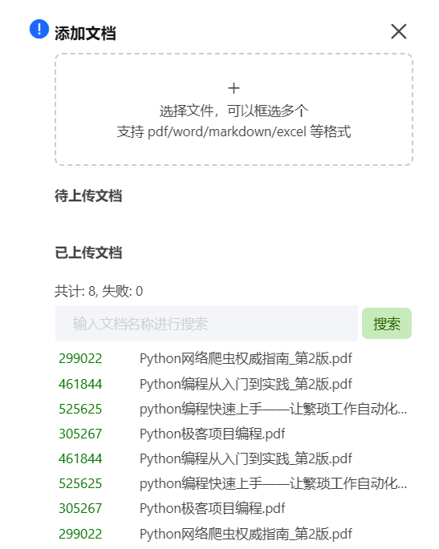
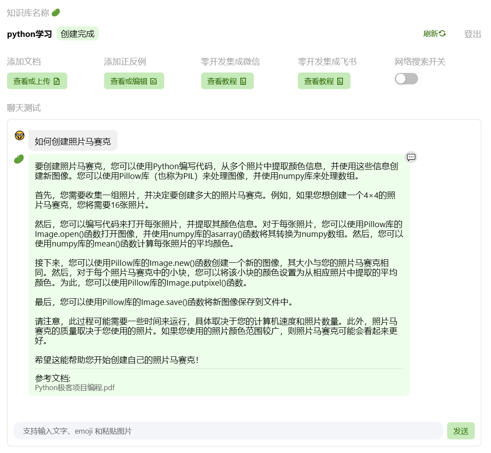
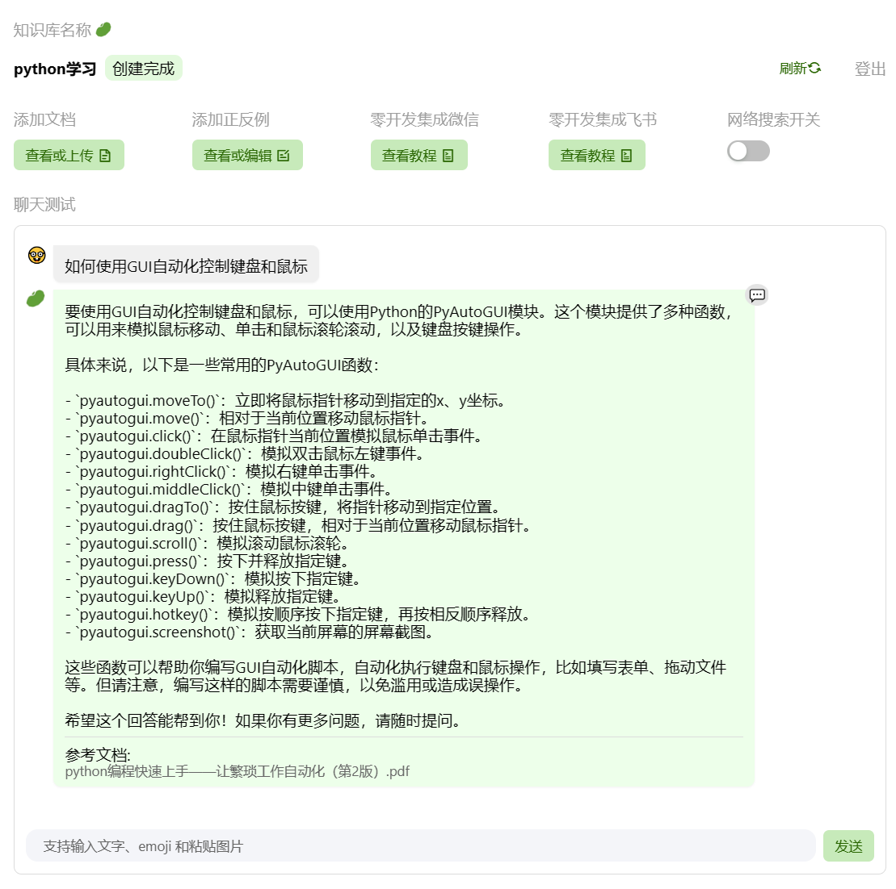

# 1. 在[茴香豆 Web 版](https://openxlab.org.cn/apps/detail/tpoisonooo/huixiangdou-web)中创建自己领域的知识问答助手

我使用了一些python教程的pdf作为rag的数据，数据上传了2次，显示有重复，不过在我询问过开发人员后，确认数据会去重，所以无影响。



## Conway游戏

提问为“请介绍一下Conway游戏，并告诉我实现步骤”，模型正确回答。


全部回答为，在结尾可以看到正确使用了提供的pdf

```
Conway游戏，也称为生命游戏，是一种细胞自动机模型，由英国数学家John Conway在1970年提出。它基于一些简单的规则，模拟出复杂的行为模式。以下是实现Conway游戏的步骤：

1. **初始化游戏状态**：使用一个二维数组（或列表的列表）来表示游戏空间。每个元素可以是活细胞（例如，用字符`#`表示）或死细胞（用空格字符表示）。

2. **定义游戏规则**：根据Conway游戏的规则，一个活细胞（`#`）在下一个时间步是否存活取决于它周围8个邻居中活细胞的数量。如果邻居中有2或3个活细胞，则该细胞保持存活；如果邻居中活细胞数量超过3个或少于2个，则该细胞死亡。死细胞（空格）在下一个时间步变为活细胞的条件是恰好有3个邻居是活的。

3. **实现游戏逻辑**：编写代码来遍历整个游戏空间，并根据上述规则更新每个细胞的状态。这通常涉及创建一个新的二维数组来存储下一时间步的状态，然后复制当前状态到新的数组，并根据规则更新每个单元格的值。

4. **显示游戏进度**：可以使用图形界面库（如Pygame）来绘制游戏空间，并实时更新每个时间步的状态。或者，简单的文本输出也可以展示游戏进展，如打印出每个时间步的空格和`#`字符来表示活细胞和死细胞。

5. **持续游戏循环**：重复步骤3和4，直到满足某个终止条件（如达到最大时间步数、用户手动停止游戏等）。

6. **优化性能**：对于大型游戏空间，遍历整个二维数组可能会导致性能问题。可以通过只更新那些发生变化的单元格来优化代码，从而减少不必要的计算。

7. **添加额外功能**：为了让游戏更有趣，可以添加一些额外的功能，比如随机初始化、暂停/继续游戏、保存游戏状态等。

通过遵循上述步骤，你可以实现一个基本的Conway游戏模拟器。随着对代码的优化和功能的扩展，你可以创建一个更加丰富和吸引人的游戏体验。
参考文档: 
python编程快速上手——让繁琐工作自动化（第2版）.pdf
```

## 万花尺

提问为“实现万花尺玩具需要使用什么库并有哪些注意点呢？”，模型使用了正确的文档并正确回答。


## 仿真鸟群

问题为“介绍一下仿真鸟群的定义和规则”，使用了正确的pdf并回答正确。


## 爬虫

提问为“使用python从web抓取信息该怎么做？”，找到了正确的文档，但提示检测到敏感内容，无法显示。


更换问题为“如何使用python抓取网页”，查询文档进行了更换，问题成功回答。


全部回答为

````
要使用Python抓取网页，可以使用以下步骤：

1. 导入所需的Python库，如`urllib.request`和`bs4`。
2. 使用`urlopen()`函数打开网页并获取HTML内容。
3. 创建一个`BeautifulSoup`对象来解析HTML内容。
4. 使用`BeautifulSoup`对象查找并提取所需的数据。
5. 处理异常，如网络连接错误、HTML标签不存在等。
6. 如果需要，可以保存抓取的数据到文件或数据库中。

以下是一个简单的示例代码：

```
from urllib.request import urlopen
from bs4 import BeautifulSoup

url = "https://example.com"
html = urlopen(url)

soup = BeautifulSoup(html, 'html.parser')

title = soup.title.string
print(title)
```

在这个例子中，我们使用`urlopen()`函数打开网页，然后使用`BeautifulSoup`对象解析HTML内容并提取网页标题。

请注意，在实际应用中，可能需要处理更复杂的HTML结构和异常情况。因此，建议详细了解`BeautifulSoup`库的用法和错误处理机制。
参考文档: 
Python网络爬虫权威指南_第2版.pdf
````

## 照片马赛克

问题为“如何创建照片马赛克”，RAG找到了正确的文档，模型正确回答了问题。



## 自动化控制键盘和鼠标

问题为“如何使用GUI自动化控制键盘和鼠标”，使用正确的文档，模型正确回答了问题。



# 2.在 `InternLM Studio` 上部署茴香豆技术助手

> huixiangdou是什么


> 茴香豆怎么部署到微信群

