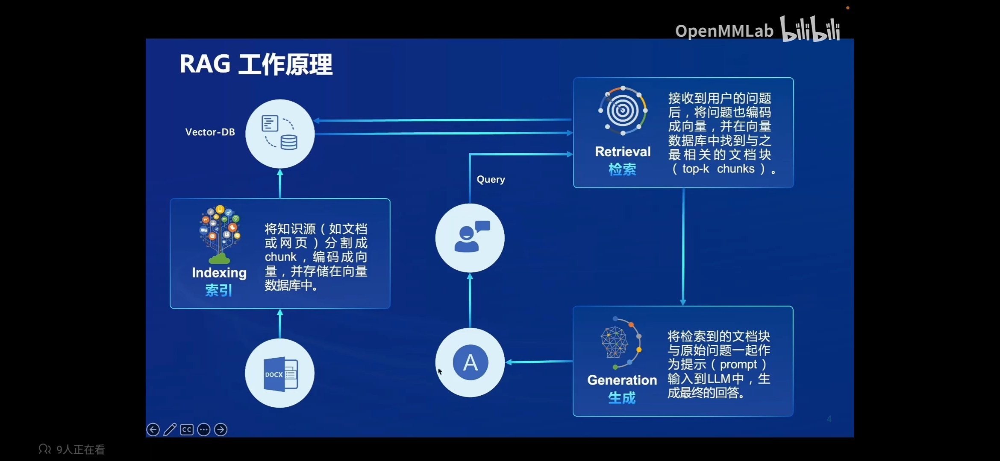
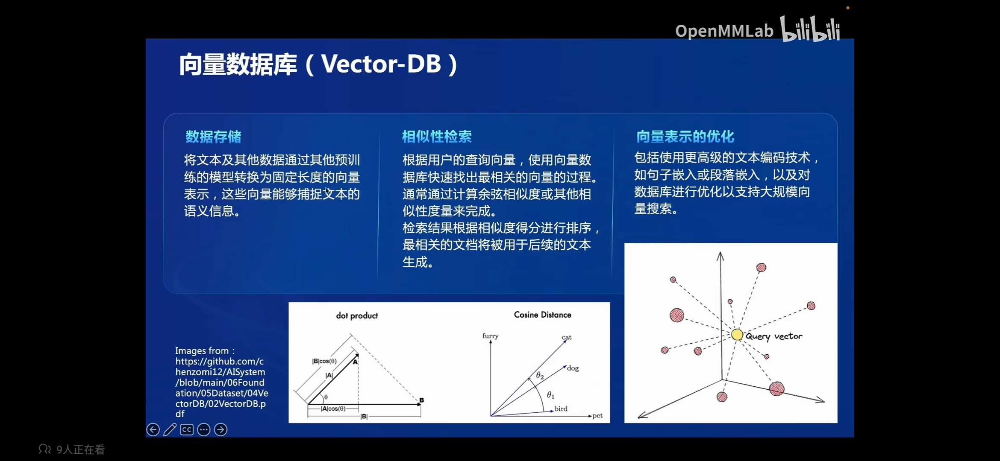
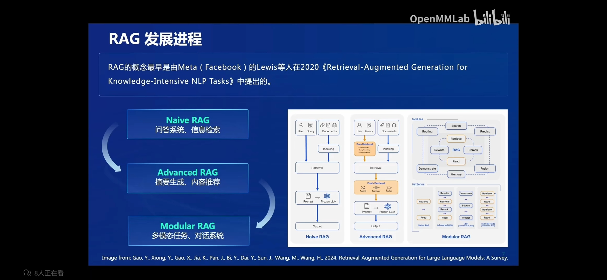
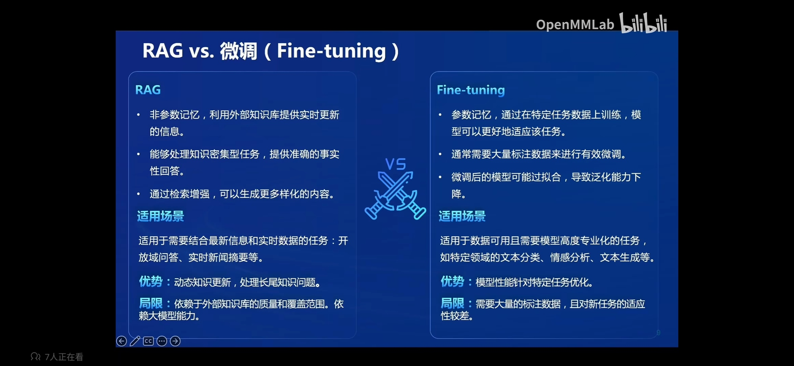
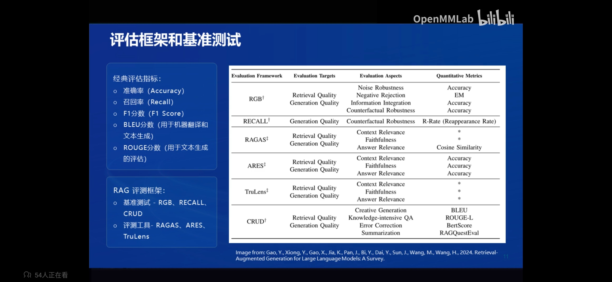
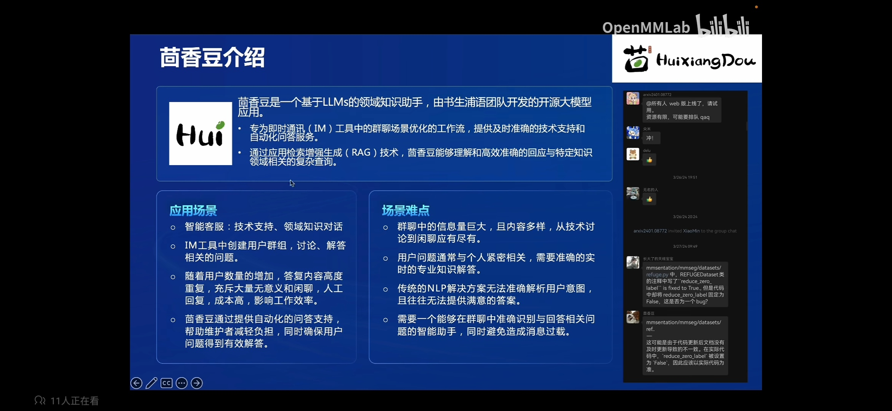
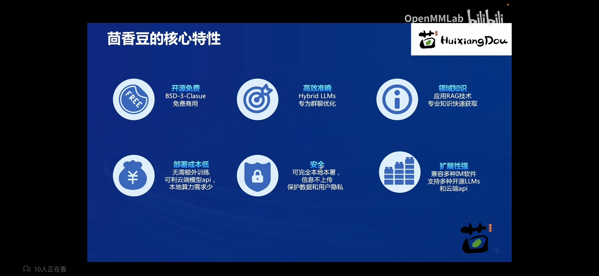
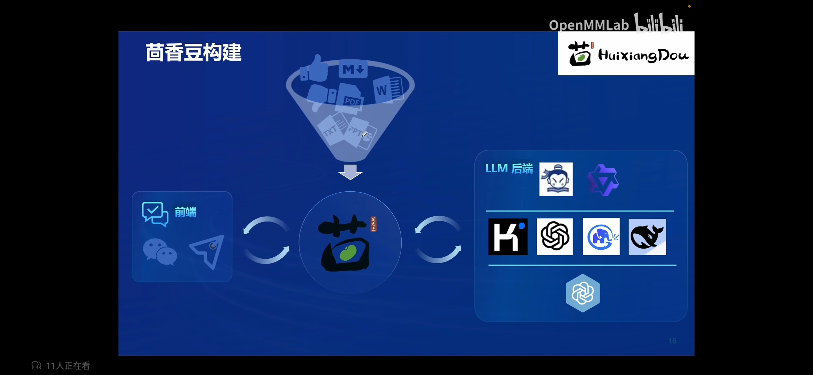

# RAG技术概述

RAG是一种结合了检索和生成的技术，可以通过利用外部知识来增强大语言模型。它通过检索与用户输出相关的信息片段，并结合这些信息来生成更准确、更丰富的回答。

主要目的是为了解决LLMs在处理知识密集任务是可能遇到的挑战，比如幻觉、过时的知识，输出结果缺乏可追溯的推理过程。可以提供更准确的回答，同时降低成本，实现外部记忆。

主要应用为：问题系统，文本生成，信息检索。

## RAG工作原理

经典RAG分为3个部分：

- 索引：将知识源分段，编码为向量并存储在向量数据库中。
- 检索：接收问题，将问题编码为向量，在向量数据库中找到最相关的文档块。
- 生成：将检索到的问题块与原始问题一起作为提示（prompt）输送给LLM，生成最终问答。

## 向量数据库

专门存储固定长度向量的数据库，向量是通过预训练的语言模型将文本转换成的，不同的语言模型转换的向量不同。

在查询时，将查询向量和数据库中的向量进行对比得到最相似的向量，相似度一般通过计算余弦相似度、点积相似度获得。

数据库优化：

- 使用更高级的文本编码技术，如句子嵌入或者段落嵌入，以及使用更好的预训练模型。
- 对数据库进行优化，支持大规模向量搜索。

## RAG发展

RAG是由Meta的Lewis等人在2020年提出的。提出时间虽然短，但是发展迅速，已经提出了3中范式。

- Naive RAG：就是之前提到的只有索引、检索、生成构成的系统。主要被应用在问答系统、检索系统中。

- Advanced RAG：在Naive RAG基础上对检索前后都进行增强，在检索之前对问题进行路由扩展、重写等操作，检索后对检索到的信息进行重排序、融合、总结等处理，是信息处理和收集的效果更高。让RAG可以应用在摘要生成、内容推荐等领域。

- Modular RAG：将RAG和后续的优化技术功能都模块化，可以根据实际业务定制，完成如多模态任务、对话系统等更高级的任务。

  ## RAG常见优化方法

### 提升向量数据库质量

- 嵌入优化：结合稀疏编码器、密集检索器和使用多任务的方式来增强嵌入的性能

- 索引优化：增强数据粒度，优化索引结构，添加原数据，混合检索等策略提升索引指令

### 查询过程优化

- 查询优化：通过查询扩展，对查询问题进行重写来使原始问题更清晰让问题更适合检索任务。使用多个类似的查询获取多个答案。(Advanced RAG的前检索部分)

- 上下文管理：通过重排，上下文选择/压缩来减少冗余信息来提高大模型的效率，可以使用小一点的语言模型来检测和移除不重要的标记。训练信息提取模型来提取关键信息。(Advanced RAG的后检索部分)

### 检索优化

- 迭代检索：在RAG过程中根据检索到的结果，多次迭代检索知识，为大模型生成提供全面的知识基础。
- 递归检索：通过迭代细化查询来改进搜索结果的深度和相关性。使用链式推理来指导检索过程。根据检索结果细化检索过程。
- 自适应检索：使用Flare和Self-RAG等让大模型能够自主决定检索的最佳时机和内容。

### LLM微调

- 检索微调：使用检索的方式对模型进行微调，让模型适应检索的过程和内容。
- 生成微调：对生成过程进行微调。
- 双重微调：使用上面两种方式进行微调。

## RAG vs 微调

### RAG：

- 非参数记忆，利用外部知识提供实时更新的信息。
- 能够处理知识密集型任务，提供准确的事实性回答。
- 通过检索增强，可以生成更多样化的内容

适用场景：针对小数据样本的数据库，或者适用于需要结合最新信息和实时数据的任务，如开放域问答、实时新闻摘要等。

优势：实时知识更新，处理长尾知识问题，以及问题回答可以溯源。

局限：依赖外部知识库的质量和覆盖范围。依赖大模型的能力，如果大模型能力不行，RAG技术也无法弥补它的缺陷。

### Fine-tuning

- 参数记忆，通过在特定任务数据上训练，模型可以更好地适应该任务。
- 通常需要大量标注数据来进行有效微调。
- 微调后的模型可能过拟合，导致泛化能力下降。

适用场景：数据可用且需要模型高度专业化的任务，如特定领域的文本分类、情感分析、文本生成等。

优势：模型性能针对特定任务优化。

局限：需要大量标注数据，且对新任务的适应性较差。

## LLM模型优化方法比较

上图X轴代表任务对模型适配度的需求，Y轴代表任务对额外知识的需求。

提示工程在面对外部知识需求和模型适配度的表现都比较差，它不能适用新的知识，对特定任务也难有很好的表现。

微调适用于对外部知识需求不高，但对模型适配度较高的场景。

RAG适用于高外部知识需求，但对模型适配度要求不高的场景。

检索微调、生成微调、双重微调+提示工程适用于既要求高外部知识，又要求模型适配度高的场景。

## RAG 评估框架和基准测试

通常将RAG模型的检索和生成阶段分开评价。

经典评估指标如准确率、召回率、BLEU分数等这些都可以应用于RAG的检索和生成过程。

除此之外针对RAG任务还有专门的评估框架，可以从对抗噪音的鲁棒性、拒答能力，信息融合能力、回答的真实性、准确性、纠错能力多维度评估模型能力。

RAG基准测试有RGB、RECALL、CRUD。

RAG评测工具有 RAGAS、ARES、TruLens。

# 茴香豆介绍

## 基础介绍

茴香豆是一个基于LLMs的领域知识注释，专为及时通讯工具中的群聊场景优化的工作流，可以提供及时准确的技术支持和自动化问答服务。

通过RAG技术，茴香豆能够理解和高效准确的回应与特定领域相关的复杂查询。

场景难点：

- 群聊中信息量大，内容多样
- 用户问题通常与特定领域特定场景相关，需要专门知识解答
- 传统NLP任务无法准确解析用户意图，也无法提供满意的答案
- 智能助手需要在群聊中准确识别问答相关问题，同时避免消息过载

## 核心特性

- 开源免费，BSD-3-Clause 协议，免费商用
- 高效准确，可以使用多个LLM进行群聊
- 领域知识，使用RAG技术，可以快速获取领域知识
- 部署成本低，无须训练，可以利用大模型api，本地部署算力需求小
- 安全，可以本地部署，信息不上传
- 扩展性强，支持多种聊天软件和多种模型

## 茴香豆构建

主要分为4部分：

- 领域知识，支持markdow、txt、word、ppt、pdf等文件格式。也可以设置接受的问题和拒答问题来
- 前端、微信等聊天工具对接
- 大模型后端，支持开源的InternLM、Qwen，闭源的Chatgpt、Kimi等模型
- 豆哥将三个部分整合起来，打通工作流，形成智能领域问答助手。

## 茴工作流

茴香豆工作流分为3个部分：预处理 -> 拒答工作流 -> 应答工作流

预处理：将用户问题筛选，转化为合适的问询

拒答工作流：通过对问询分析，以及和数据库中示例问题(可回答问题/拒答问题)来给出相关性得分，根据得分判断是否进入应答环节

应答工作流：大模型根据问询和检索结果进行回答。

拒答工作流主要是为了让模型适用于不同的应用场景，根据实际场景不同调整茴香豆的应答频率、应答范围。

## 完整工作流

为了生成更加准确的结果，茴香豆应答模型使用了多来源检索，混合大模型来生成应答。

不仅可以使用本地数据库，还能使用在线搜索、知识图谱综合数据，通过评分进行筛选获取的数据，增加数据的严谨性。

回答之前还有专门的安全检查模型，确保输出的安全性。