# Finetune简介

## 为什么需要微调

很多大语言模式是基础模型，是为了一般性任务做的预训练，而把它应用于特定下游任务，表现可能不如领域内训练的模型，所以说要对他进行领域内微调，提高它在特定领域的表现。

下图显示了一期的优秀同学在将基础大模型微调后，应用于各个领域的实际案例。

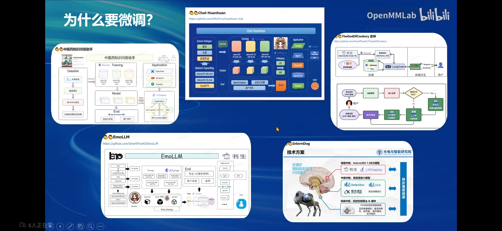

## 两种Finetune范式

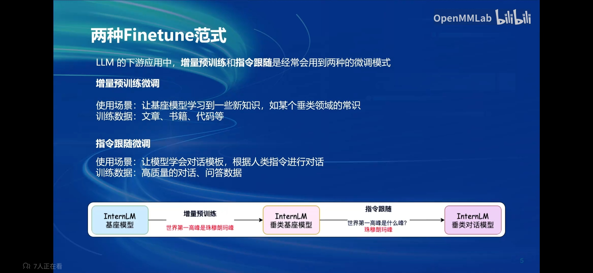

Finetune主要分为增量预训练和指定跟随两种微调方式。

增量预训练是为了让模型获得一些新的知识，比如某个垂直领域的知识。训练的数据通常为文章、论文、书籍、代码等。主要目的不是让模型学会对话，因此不需要对话数据。上图增量预训练显示了给模型添加"世界第一高峰是珠穆朗玛峰"这个知识。

指令跟随微调是为了让模型学会对话，让模型跟随人类指令进行对话。训练的数据是高质量的对话和问答数据。如果想让模型以某种口吻对话，也可以使用这种方式。上图中指令跟随是创造"世界第一高峰是什么峰？珠穆朗玛峰"这样的问答对，给模型问题，让模型预测答案。

下面图片展示了2种微调范式的例子，上面的线展示了没经过指令微调或者只进行了增量预训练的模型，问模型"什么是肺癌？"，模型的回答可能是"什么是胃癌？什么是肝癌?"，并不会正确回答你的问题，而是单纯拟合训练数据分布。

下面是经过指令微调之后，模型就可以正确回答问题了。

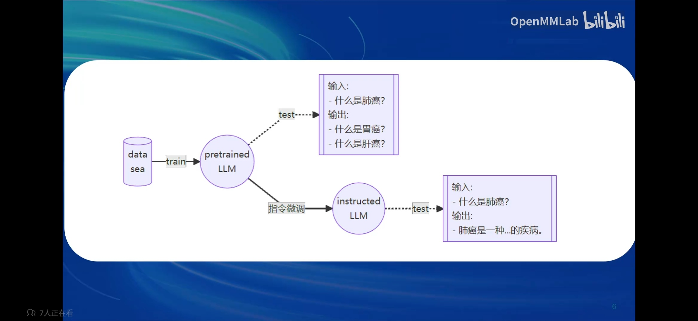

## 一条数据的一生

### 将数据转换为对话格式

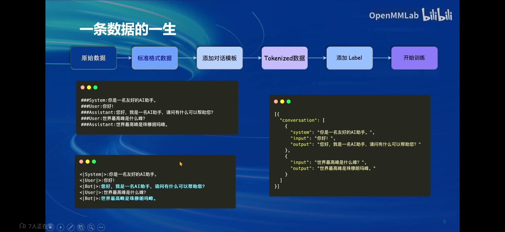

获取的数据需要转换为框架能识别的格式才能拿来训练。

上图左上角将原始数据转化为标准对话格式，先要添加系统提示，给用户和模型分配角色，然后构造对话模板，将"世界最高峰是珠穆朗玛峰"转换为"世界最高峰是什么峰？世界最高峰是珠穆朗玛峰。"。

上图右侧显示了保存在 json 中的对话，XTuner 使用的是这种格式，需要将对话数据转换为这种 json 格式保存。

上图左下角为InternLM2模型对话的模板，需要添加特殊标记。蓝色的问题代表模型要预测的的部分。

### 对话模板

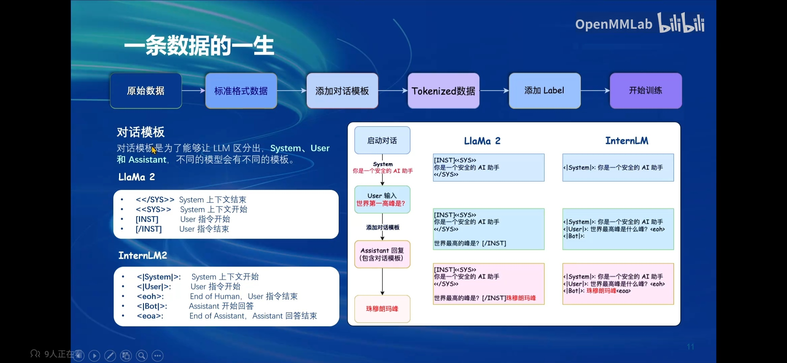

为了让模型能够区分出 System、User、Assistant 各个部分的问题，模型会用对话模板进行区分，不同模型有不同的模板。上图展示了 LLaMa 和 InternLM2 模型的对话模板。我们只需要准备对应 json 格式的数据即可，不需要手动应用模板，XTuner 已经实现了这个功能。

### 添加label

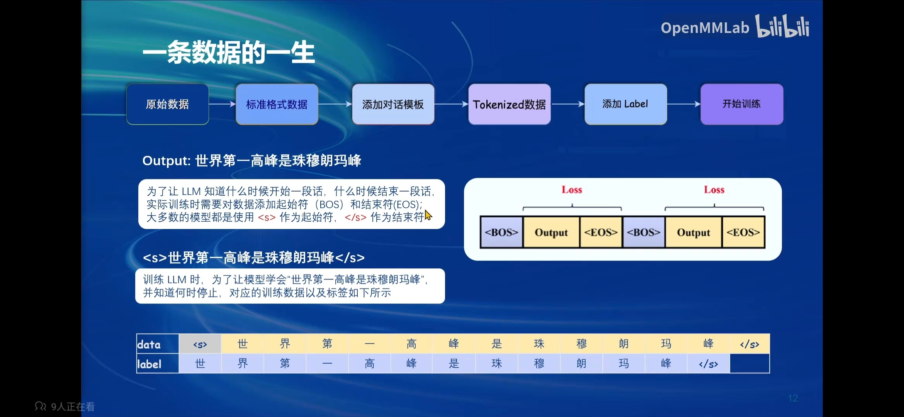

训练时为了让模型知道段落开始和结束，需要添加起始符号和结束符号，一般使用 `<s>` 作为起始符号，使用 `</s>` 作为结束符号。

模型训练时要有 label，我们只需要将训练的数据文字向前位移一步，就可以创造 label，模型会预测下一个字，并且 XTuner 实现了多段文字拼接，同时训练多个段落。不同段落使用分隔符分割。

下图展示了训练对话数据时的 data 和 label 的构造，模型只会在预测的 label 上计算 loss。

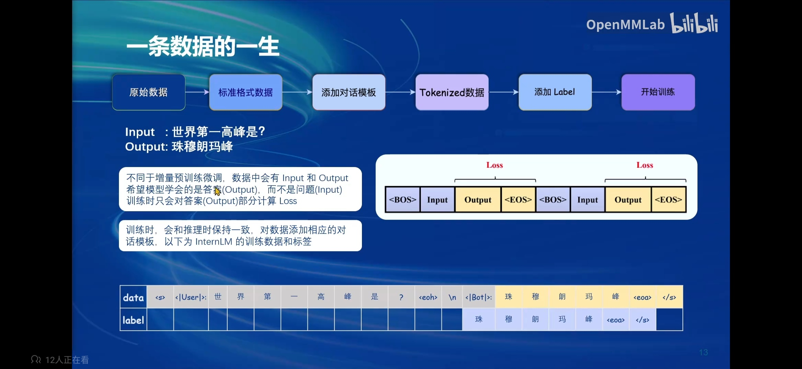

## LoRA&QLoRA

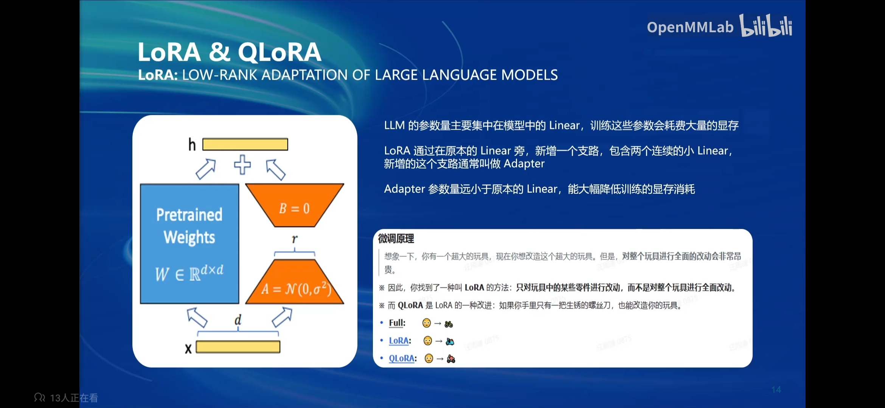

LLM 参数量主要在 Linear，训练 Linear 会消耗大量显存。LoRA 的做法是在原本的 Linear 旁边新增一个旁路，使用2个连续的小的 Linear 去微调原本的 Linear，输入的数据通过2个分支后相加。这2个 Linear 的参数量远小于原本的 Linear，训练时会大幅度节省显存。

假设原本 Linear 权重形状为 `HxW`，新增的2个 Linear 的权重形状为 `HxN` 和 `NxW`，`N<<H,W`，这2个权重矩阵相乘就得到和原本权重相同的形状，在训练时得到的输出也是相同的，可以相加得到最终结果；在推理时可以将这两个权重相乘加进原本的权重中，这样就不会增加推理延迟了。注意这2个 Linear 的权重初始化，第一个 Linear 权重使用高斯初始化，第二个 Linear 权重初始化为0，是为了不影响原本的 Linear 权重。除了2个线性层之外，LoRA还有一个 $\alpha$ 参数，它会乘在2个 Linear 的结果之上，用来调整2个 Linear 的效果强弱，在推理融合的时候也是要乘上它再和原本权重相加的。

QLoRA 是 LoRA 的一种改进，将原本基座模型的权重由 FP16/BF16 量化为 4bit 权重，进一步降低了训练模型所需要的显存需求。

下图所示，全参微调会让优化器占用大量的显存，而LoRA训练的参数更少，优化器占用显存就更小了，不过注意的是模型都是16bit的，占用空间没有变小，而QLoRA使用了4bit的模型，让模型占用也随之减少，同时它也允许将优化器参数 offload 到内存上，需要时再移动到显存上，进一步降低显存需求。

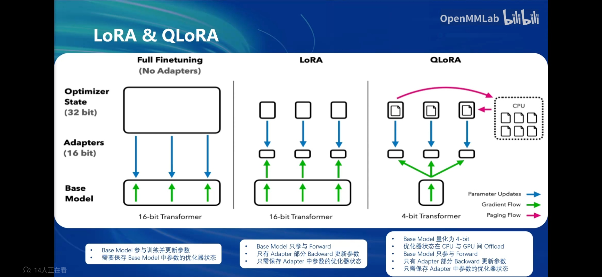

# XTuner介绍

## 简介

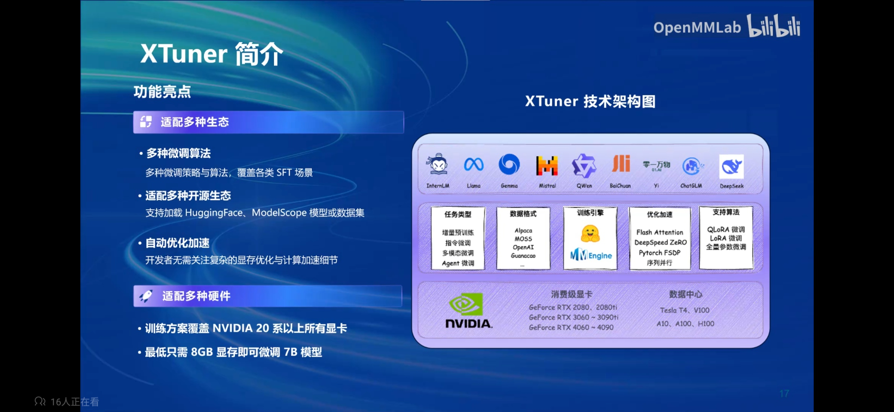

XTuner是一个大模型微调工具箱，以配置文件的形式封装了大部分微调场景，0基础的非专业人员也能一键微调。

适配多种生态

- 拥有多种微调算法

  支持多种微调策略和算法，覆盖多种 SFT 场景，包括增量预训练、指令微调、多模态微调、Agent 微调。

- 适配多种开源生态

  支持加载 HuggingFace、ModelScope 模型或数据集。

  支持 InternLM、LLaMa、Mistral 等模型。

  支持 Alpaca、Moss、OpenAI 等数据集。

- 自动开启加速

  支持 Flash Attention、DeepSpeed ZeRO、Pytorch FSDP、序列并行等策略，开发者无需关注细节，XTuner 自动优化加速。

适配多种硬件：

- 支持 20 系以上显卡
- 最低只需8GB显存即可微调 7B 模型

## 性能对比

与 LLaMa-Factory 对比，训练速度在不同量级的模型都快。

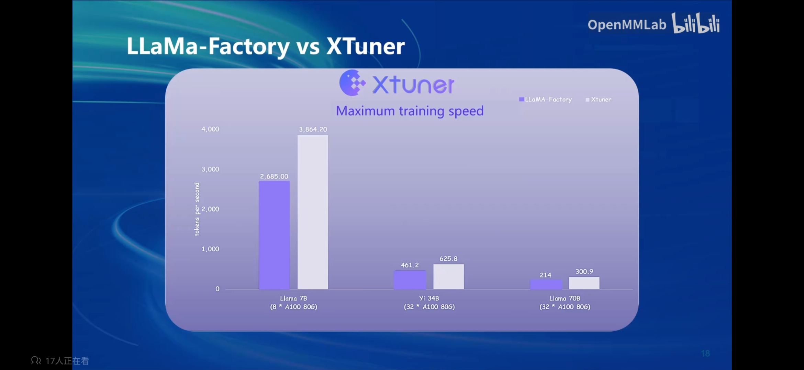

并且训练相同模型，XTuner 模型支持更长的 token 训练。

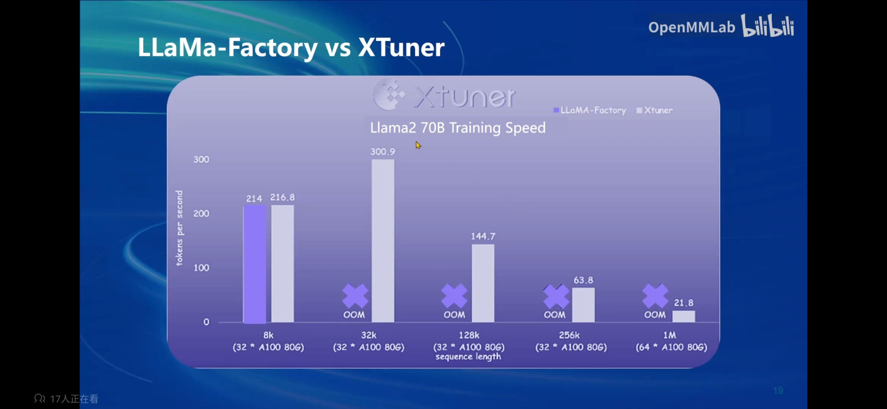

## 快速上手

### 安装

```sh
pip install xtuner
```

### 挑选配置模板

```sh
xtuner list-cfg -p internlm2_1_8b
```

运行命令

```sh
(lm) root@intern-studio-030876:~/xtuner0117/ft# xtuner list-cfg -p internlm2_1_8b
==========================CONFIGS===========================
PATTERN: internlm2_1_8b
-------------------------------
internlm2_1_8b_full_alpaca_e3
internlm2_1_8b_qlora_alpaca_e3
=============================================================
```

### 复制模板

```sh
xtuner copy-cfg internlm2_1_8b_qlora_alpaca_e3
```

运行命令

```sh
(lm) root@intern-studio-030876:~/xtuner0117/ft# xtuner copy-cfg internlm2_1_8b_qlora_alpaca_e3 /root/xtuner0117/ft/config
Copy to /root/xtuner0117/ft/config/internlm2_1_8b_qlora_alpaca_e3_copy.py
(lm) root@intern-studio-030876:~/xtuner0117/ft# mv /root/xtuner0117/ft/config/internlm2_1_8b_qlora_alpaca_e3_copy.py /root/xtuner0117/ft/config/internlm2_1_8b_qlora_self_e2.py
(lm) root@intern-studio-030876:~/xtuner0117/ft# python print_dir_tree.py ./config
|-- config/
    |-- internlm2_1_8b_qlora_self_e2.py
```

config命名规则为

|          |              |                      |
| -------- | ------------ | -------------------- |
| 模型名   | internlm_20b | 无 chat 代表基座模型 |
| 使用算法 | qlora        |                      |
| 数据集   | oasst1       |                      |
| 数据长度 | 512          |                      |
| Epoch    | e3、epoch3   |                      |

### [数据格式介绍](https://github.com/InternLM/xtuner/blob/main/docs/zh_cn/user_guides/dataset_format.md)

### 修改配置文件

[配置文件介绍](https://github.com/InternLM/xtuner/blob/main/docs/zh_cn/user_guides/config.md)

整体的配置文件分为五部分：

1. **PART 1 Settings**：涵盖了模型基本设置，如预训练模型的选择、数据集信息和训练过程中的一些基本参数（如批大小、学习率等）。
2. **PART 2 Model & Tokenizer**：指定了用于训练的模型和分词器的具体类型及其配置，包括预训练模型的路径和是否启用特定功能（如可变长度注意力），这是模型训练的核心组成部分。
3. **PART 3 Dataset & Dataloader**：描述了数据处理的细节，包括如何加载数据集、预处理步骤、批处理大小等，确保了模型能够接收到正确格式和质量的数据。
4. **PART 4 Scheduler & Optimizer**：配置了优化过程中的关键参数，如学习率调度策略和优化器的选择，这些是影响模型训练效果和速度的重要因素。
5. **PART 5 Runtime**：定义了训练过程中的额外设置，如日志记录、模型保存策略和自定义钩子等，以支持训练流程的监控、调试和结果的保存。

一般来说我们需要更改的部分其实只包括前三部分，而且修改的主要原因是我们修改了配置文件中规定的模型、数据集。后两部分都是 XTuner 官方帮我们优化好的东西，一般而言只有在魔改的情况下才需要进行修改。下面我们将根据项目的要求一步步的进行修改和调整吧！

**常用超参**

| 参数名                     | 解释                                                         |
| -------------------------- | ------------------------------------------------------------ |
| **data_path**              | 数据路径或 HuggingFace 仓库名                                |
| **max_length**             | 单条数据最大 Token 数，超过则截断                            |
| **pack_to_max_length**     | 是否将多条短数据拼接到 max_length，提高 GPU 利用率           |
| **accumulative_counts**    | 梯度累积，每多少次 backward 更新一次参数                     |
| **sequence_parallel_size** | 并行序列处理的大小，用于模型训练时的序列并行                 |
| **batch_size**             | 每个设备上的批量大小                                         |
| **dataloader_num_workers** | 数据加载器中工作进程的数量                                   |
| **max_epochs**             | 训练的最大轮数                                               |
| **optim_type**             | 优化器类型，例如 AdamW                                       |
| **lr**                     | 学习率                                                       |
| **betas**                  | 优化器中的 beta 参数，控制动量和平方梯度的移动平均           |
| **weight_decay**           | 权重衰减系数，用于正则化和避免过拟合                         |
| **max_norm**               | 梯度裁剪的最大范数，用于防止梯度爆炸                         |
| **warmup_ratio**           | 预热的比例，学习率在这个比例的训练过程中线性增加到初始学习率 |
| **save_steps**             | 保存模型的步数间隔                                           |
| **save_total_limit**       | 保存的模型总数限制，超过限制时删除旧的模型文件               |
| **prompt_template**        | 模板提示，用于定义生成文本的格式或结构                       |
| ......                     | ......                                                       |

配置文件示例

```python
# Copyright (c) OpenMMLab. All rights reserved.
import torch
from datasets import load_dataset
from mmengine.dataset import DefaultSampler
from mmengine.hooks import (CheckpointHook, DistSamplerSeedHook, IterTimerHook,
                            LoggerHook, ParamSchedulerHook)
from mmengine.visualization import Visualizer, LocalVisBackend, TensorboardVisBackend
from mmengine.optim import AmpOptimWrapper, CosineAnnealingLR, LinearLR
from peft import LoraConfig
from torch.optim import AdamW
from transformers import (AutoModelForCausalLM, AutoTokenizer,
                          BitsAndBytesConfig)

from xtuner.dataset import process_hf_dataset
from xtuner.dataset.collate_fns import default_collate_fn
from xtuner.dataset.map_fns import openai_map_fn, template_map_fn_factory
from xtuner.engine.hooks import (DatasetInfoHook, EvaluateChatHook,
                                 VarlenAttnArgsToMessageHubHook)
from xtuner.engine.runner import TrainLoop
from xtuner.model import SupervisedFinetune
from xtuner.parallel.sequence import SequenceParallelSampler
from xtuner.utils import PROMPT_TEMPLATE, SYSTEM_TEMPLATE

#######################################################################
#                          PART 1  Settings                           #
#######################################################################
# Model
pretrained_model_name_or_path = '/root/xtuner0117/ft/internlm2-chat-1_8b'
use_varlen_attn = False

# Data
alpaca_en_path = '/root/xtuner0117/ft/data/personal_assistant.json'
prompt_template = PROMPT_TEMPLATE.default
max_length = 1024
pack_to_max_length = True

# parallel
sequence_parallel_size = 1

# Scheduler & Optimizer
batch_size = 1  # per_device
accumulative_counts = 16
accumulative_counts *= sequence_parallel_size
dataloader_num_workers = 0
max_epochs = 2
optim_type = AdamW
lr = 2e-4
betas = (0.9, 0.999)
weight_decay = 0
max_norm = 1  # grad clip
warmup_ratio = 0.03

# Save
save_steps = 300
save_total_limit = 3  # Maximum checkpoints to keep (-1 means unlimited)

# Evaluate the generation performance during the training
evaluation_freq = 300
SYSTEM = SYSTEM_TEMPLATE.alpaca
evaluation_inputs = ['请你介绍一下你自己', '你是谁', '你是我的小助手吗']

#######################################################################
#                      PART 2  Model & Tokenizer                      #
#######################################################################
tokenizer = dict(
    type=AutoTokenizer.from_pretrained,
    pretrained_model_name_or_path=pretrained_model_name_or_path,
    trust_remote_code=True,
    padding_side='right')

model = dict(
    type=SupervisedFinetune,
    use_varlen_attn=use_varlen_attn,
    llm=dict(
        type=AutoModelForCausalLM.from_pretrained,
        pretrained_model_name_or_path=pretrained_model_name_or_path,
        trust_remote_code=True,
        torch_dtype=torch.float16,
        quantization_config=dict(
            type=BitsAndBytesConfig,
            load_in_4bit=True,
            load_in_8bit=False,
            llm_int8_threshold=6.0,
            llm_int8_has_fp16_weight=False,
            bnb_4bit_compute_dtype=torch.float16,
            bnb_4bit_use_double_quant=True,
            bnb_4bit_quant_type='nf4')),
    lora=dict(
        type=LoraConfig,
        r=64,
        lora_alpha=16,
        lora_dropout=0.1,
        bias='none',
        task_type='CAUSAL_LM'))

#######################################################################
#                      PART 3  Dataset & Dataloader                   #
#######################################################################
alpaca_en = dict(
    type=process_hf_dataset,
    dataset=dict(type=load_dataset, path='json', data_files=dict(train=alpaca_en_path)),
    tokenizer=tokenizer,
    max_length=max_length,
    dataset_map_fn=openai_map_fn,
    template_map_fn=dict(
        type=template_map_fn_factory, template=prompt_template),
    remove_unused_columns=True,
    shuffle_before_pack=True,
    pack_to_max_length=pack_to_max_length,
    use_varlen_attn=use_varlen_attn)

sampler = SequenceParallelSampler \
    if sequence_parallel_size > 1 else DefaultSampler
train_dataloader = dict(
    batch_size=batch_size,
    num_workers=dataloader_num_workers,
    dataset=alpaca_en,
    sampler=dict(type=sampler, shuffle=True),
    collate_fn=dict(type=default_collate_fn, use_varlen_attn=use_varlen_attn))

#######################################################################
#                    PART 4  Scheduler & Optimizer                    #
#######################################################################
# optimizer
optim_wrapper = dict(
    type=AmpOptimWrapper,
    optimizer=dict(
        type=optim_type, lr=lr, betas=betas, weight_decay=weight_decay),
    clip_grad=dict(max_norm=max_norm, error_if_nonfinite=False),
    accumulative_counts=accumulative_counts,
    loss_scale='dynamic',
    dtype='float16')

# learning policy
# More information: https://github.com/open-mmlab/mmengine/blob/main/docs/en/tutorials/param_scheduler.md  # noqa: E501
param_scheduler = [
    dict(
        type=LinearLR,
        start_factor=1e-5,
        by_epoch=True,
        begin=0,
        end=warmup_ratio * max_epochs,
        convert_to_iter_based=True),
    dict(
        type=CosineAnnealingLR,
        eta_min=0.0,
        by_epoch=True,
        begin=warmup_ratio * max_epochs,
        end=max_epochs,
        convert_to_iter_based=True)
]

# train, val, test setting
train_cfg = dict(type=TrainLoop, max_epochs=max_epochs)

#######################################################################
#                           PART 5  Runtime                           #
#######################################################################
# Log the dialogue periodically during the training process, optional
custom_hooks = [
    dict(type=DatasetInfoHook, tokenizer=tokenizer),
    dict(
        type=EvaluateChatHook,
        tokenizer=tokenizer,
        every_n_iters=evaluation_freq,
        evaluation_inputs=evaluation_inputs,
        system=SYSTEM,
        prompt_template=prompt_template)
]

if use_varlen_attn:
    custom_hooks += [dict(type=VarlenAttnArgsToMessageHubHook)]

# configure default hooks
default_hooks = dict(
    # record the time of every iteration.
    timer=dict(type=IterTimerHook),
    # print log every 10 iterations.
    logger=dict(type=LoggerHook, log_metric_by_epoch=False, interval=10),
    # enable the parameter scheduler.
    param_scheduler=dict(type=ParamSchedulerHook),
    # save checkpoint per `save_steps`.
    checkpoint=dict(
        type=CheckpointHook,
        by_epoch=False,
        interval=save_steps,
        max_keep_ckpts=save_total_limit),
    # set sampler seed in distributed evrionment.
    sampler_seed=dict(type=DistSamplerSeedHook),
)

# configure environment
env_cfg = dict(
    # whether to enable cudnn benchmark
    cudnn_benchmark=False,
    # set multi process parameters
    mp_cfg=dict(mp_start_method='fork', opencv_num_threads=0),
    # set distributed parameters
    dist_cfg=dict(backend='nccl'),
)

# set visualizer
visualizer = dict(
    type=Visualizer,
    vis_backends=[dict(type=LocalVisBackend), dict(type=TensorboardVisBackend)]
)

# set log level
log_level = 'INFO'

# load from which checkpoint
load_from = None

# whether to resume training from the loaded checkpoint
resume = False

# Defaults to use random seed and disable `deterministic`
randomness = dict(seed=None, deterministic=False)

# set log processor
log_processor = dict(by_epoch=False)
```

### 训练流程

#### 常规训练

当我们准备好了配置文件好，我们只需要将使用 `xtuner train` 指令即可开始训练。

我们可以通过添加 `--work-dir` 指定特定的文件保存位置，默认保存在 `./work_dirs/{配置文件名}` 目录下。

```sh
# 指定保存路径
xtuner train internlm2_1_8b_qlora_self_e2.py --work-dir ./train
```

在输入训练完后的文件如下所示：

```sh
|-- train/
    |-- internlm2_1_8b_qlora_self_e2.py
    |-- iter_600.pth
    |-- last_checkpoint
    |-- iter_768.pth
    |-- iter_300.pth
    |-- 20240406_203957/
        |-- 20240406_203957.log
        |-- vis_data/
            |-- 20240406_203957.json
            |-- eval_outputs_iter_599.txt
            |-- eval_outputs_iter_767.txt
            |-- scalars.json
            |-- eval_outputs_iter_299.txt
            |-- config.py
```

#### 使用 deepspeed 来加速训练

除此之外，我们也可以结合 XTuner 内置的 `deepspeed` 来加速整体的训练过程，共有三种不同的 `deepspeed` 类型可进行选择，分别是 `deepspeed_zero1`, `deepspeed_zero2` 和 `deepspeed_zero3`。

DeepSpeed是一个深度学习优化库，由微软开发，旨在提高大规模模型训练的效率和速度。它通过几种关键技术来优化训练过程，包括模型分割、梯度累积、以及内存和带宽优化等。DeepSpeed特别适用于需要巨大计算资源的大型模型和数据集。

在DeepSpeed中，`zero` 代表“ZeRO”（Zero Redundancy Optimizer），是一种旨在降低训练大型模型所需内存占用的优化器。ZeRO 通过优化数据并行训练过程中的内存使用，允许更大的模型和更快的训练速度。ZeRO 分为几个不同的级别，主要包括：

- **deepspeed_zero1**：这是ZeRO的基本版本，它优化了模型参数的存储，使得每个GPU只存储一部分参数，从而减少内存的使用。

- **deepspeed_zero2**：在deepspeed_zero1的基础上，deepspeed_zero2进一步优化了梯度和优化器状态的存储。它将这些信息也分散到不同的GPU上，进一步降低了单个GPU的内存需求。

- **deepspeed_zero3**：这是目前最高级的优化等级，它不仅包括了deepspeed_zero1和deepspeed_zero2的优化，还进一步减少了激活函数的内存占用。这通过在需要时重新计算激活（而不是存储它们）来实现，从而实现了对大型模型极其内存效率的训练。

选择哪种deepspeed类型主要取决于你的具体需求，包括模型的大小、可用的硬件资源（特别是GPU内存）以及训练的效率需求。一般来说：

- 如果你的模型较小，或者内存资源充足，可能不需要使用最高级别的优化。
- 如果你正在尝试训练非常大的模型，或者你的硬件资源有限，使用deepspeed_zero2或deepspeed_zero3可能更合适，因为它们可以显著降低内存占用，允许更大模型的训练。
- 选择时也要考虑到实现的复杂性和运行时的开销，更高级的优化可能需要更复杂的设置，并可能增加一些计算开销。

```sh
# 使用 deepspeed 来加速训练
xtuner train internlm2_1_8b_qlora_self_e2.py --work-dir ./train_deepspeed --deepspeed deepspeed_zero2
```

通过 `deepspeed` 来训练后得到的权重文件和原本的权重文件是有所差别的，原本的仅仅是一个 .pth 的文件，而使用了 `deepspeed` 则是一个名字带有 .pth 的文件夹，在该文件夹里保存了两个 .pt 文件。当然这两者在具体的使用上并没有太大的差别，都是可以进行转化并整合。

```sh
|-- train_deepspeed/
    |-- internlm2_1_8b_qlora_self_e2.py
    |-- zero_to_fp32.py
    |-- last_checkpoint
    |-- iter_600.pth/
        |-- bf16_zero_pp_rank_0_mp_rank_00_optim_states.pt
        |-- mp_rank_00_model_states.pt
    |-- 20240406_220727/
        |-- 20240406_220727.log
        |-- vis_data/
            |-- 20240406_220727.json
            |-- eval_outputs_iter_599.txt
            |-- eval_outputs_iter_767.txt
            |-- scalars.json
            |-- eval_outputs_iter_299.txt
            |-- config.py
    |-- iter_768.pth/
        |-- bf16_zero_pp_rank_0_mp_rank_00_optim_states.pt
        |-- mp_rank_00_model_states.pt
    |-- iter_300.pth/
        |-- bf16_zero_pp_rank_0_mp_rank_00_optim_states.pt
        |-- mp_rank_00_model_states.pt
```

### 模型转换

模型转换的本质其实就是将原本使用 Xtuner 训练出来的模型权重文件转换为目前通用的 Huggingface 格式文件，那么我们可以通过以下指令来实现一键转换。

```sh
# 创建一个保存转换后 Huggingface 格式的文件夹
mkdir -p huggingface

# 模型转换
# xtuner convert pth_to_hf ${配置文件地址} ${权重文件地址} ${转换后模型保存地址}
xtuner convert pth_to_hf config/internlm2_1_8b_qlora_self_e2.py train_deepspeed/iter_960.pth huggingface
```

转换后的文件夹结构为

```
|-- /
    |-- adapter_config.json
    |-- xtuner_config.py
    |-- adapter_model.bin
    |-- README.md
```

### 模型整合

对于 LoRA 或者 QLoRA 微调出来的模型其实并不是一个完整的模型，而是一个额外的层（adapter）。那么训练完的这个层最终还是要与原模型进行组合才能被正常的使用。

而对于全量微调的模型（full）其实是不需要进行整合这一步的，因为全量微调修改的是原模型的权重而非微调一个新的 adapter ，因此是不需要进行模型整合的。


在 XTuner 中也是提供了一键整合的指令，但是在使用前我们需要准备好三个地址，包括原模型的地址、训练好的 adapter 层的地址（转为 Huggingface 格式后保存的部分）以及最终保存的地址。

```sh
# 进行模型整合
# xtuner convert merge  ${NAME_OR_PATH_TO_LLM} ${NAME_OR_PATH_TO_ADAPTER} ${SAVE_PATH}
xtuner convert merge internlm2-chat-1_8b huggingface final_model
```

整合后的文件结构，发现和原本模型文件夹相同

```sh
|-- /
    |-- tokenizer.model
    |-- config.json
    |-- pytorch_model.bin.index.json
    |-- pytorch_model-00001-of-00002.bin
    |-- tokenization_internlm2.py
    |-- tokenizer_config.json
    |-- special_tokens_map.json
    |-- pytorch_model-00002-of-00002.bin
    |-- modeling_internlm2.py
    |-- configuration_internlm2.py
    |-- tokenizer.json
    |-- generation_config.json
    |-- tokenization_internlm2_fast.py
```

### 对话测试

在 XTuner 中也直接的提供了一套基于 transformers 的对话代码，让我们可以直接在终端与  Huggingface  格式的模型进行对话操作。我们只需要准备我们刚刚转换好的模型路径并选择对应的提示词模版（prompt-template）即可进行对话。假如  prompt-template 选择有误，很有可能导致模型无法正确的进行回复。

```sh
# 与模型进行对话

# xtuner chat ${NAME_OR_PATH_TO_LLM} --prompt-template {prompt-template}
xtuner chat final_model --prompt-template internlm2_chat
```

## XTuner支持工具类对话

XTuner 除了支持常见的文本和多模态对话之外，还支持工具类的调用，下图展示了调用搜索引擎、计算器的示例。

详情见 HuggingFace 仓库 xtuner/Llama-2-7b-qlora-moss-003-sft 。

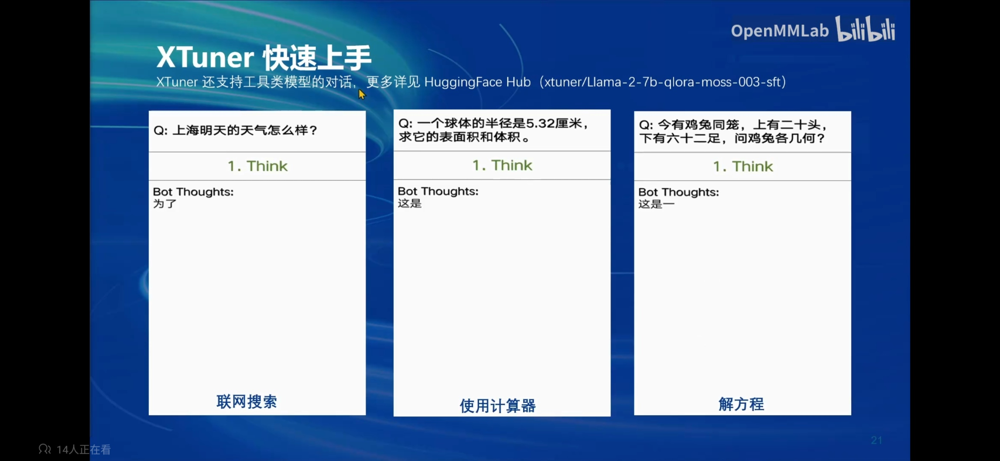

## 数据引擎

### 支持多种数据集和对话模板

XTuner 内置一些数据引擎，支持将一些开源格式个数据集进行转换，不需要转换数据集即可进行训练。还支持多种模型的对话模板，方便微调不同的模型。

下图支持了一些支持的数据集和对话模板。

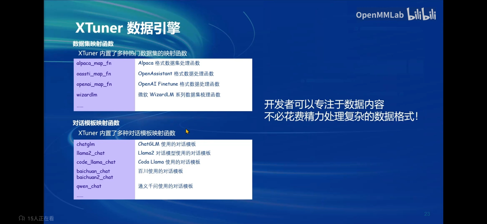

### 支持多样本拼接

训练过程中支持多数据样本拼接，一次训练可以使用多条数据，增加并行性，充分利用 GPU 资源。

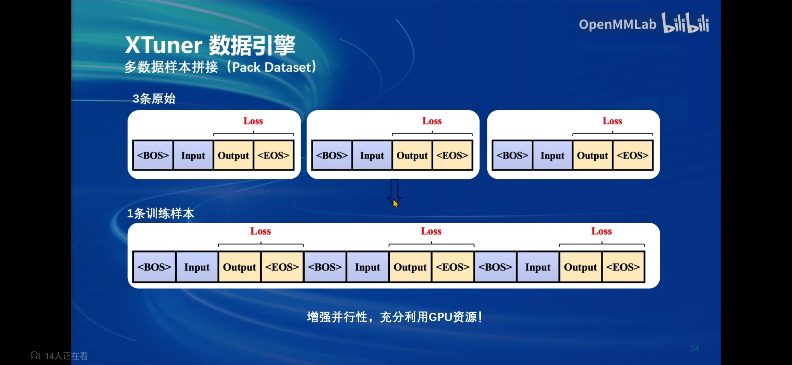

# 8GB 显存玩转 LLM

XTuner 支持使用8GB 的显存微调 LLM。主要是使用了 Flash Attention 和 DeepSpeed 这2个库。

Flash Attention 这个库主要是对 Attention 计算并行化，对矩阵乘法和 Softmax 都进行分块计算，避免了计算过程中的 Attention Score NxN 的显存占用。

ZeRO 优化主要是对模型训练过程中的模型权重，优化器状态和模型梯度进行分片存储，减少显存占用。在单 GPU 上训练也能大幅减少显存。

Flash Attention 加速原理：https://www.zhihu.com/question/611236756

李沐老师讲解的ZeRO论文：https://www.bilibili.com/video/BV1tY411g7ZT

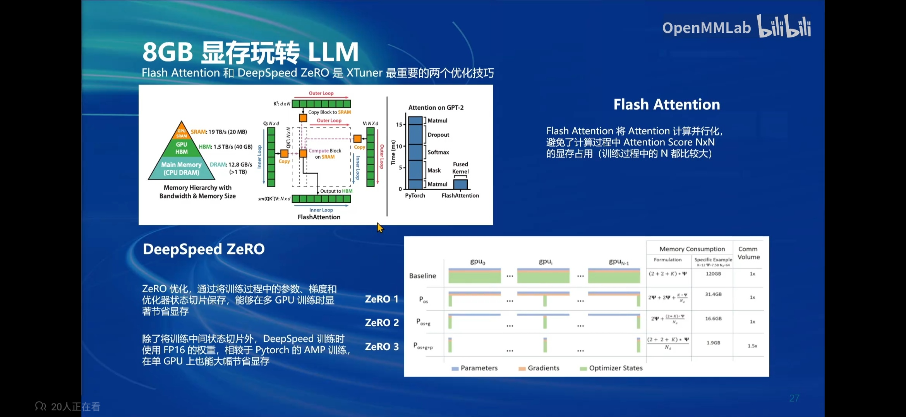

使用 Flash Attention 和 DeepSpeed 虽然能大幅度降低训练成本，但是使用门槛较高，需要复杂的配置，甚至修改代码。下图左侧为 DeepSpeed 的配置选项，有很多的参数，使用好 DeepSpeed 要话很多的时间去学习。而 XTuner 在训练时自动启动了 Flash Attention，使用 DeepSpeed也只需要在命令后添加 `--deepspeed deepspeed_zero2` 命令就可以启动 DeepSpeed 训练。

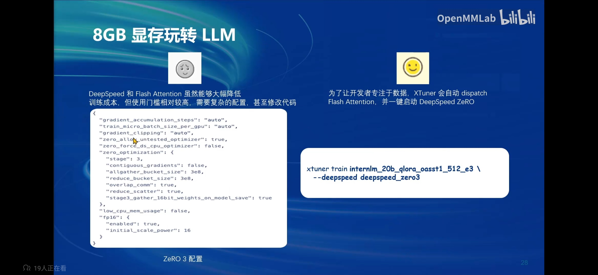

下图显示了使用了 Flash Attention 和 DeepSpeed 之后，在不同数据长度时的显存占用，可以看到数据长度越长，显存占用的减少越明显。在数据长度为512时，可以在8GB显存上训练7B的模型。

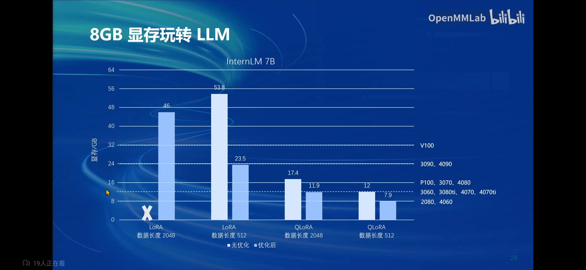


# InternLM2 1.8B 模型

InternLM2 1.8B 模型是一个小型的 LLM，在 FP16 精度下，仅需要4GB显存即可运行，微调模型仅需要8GB显存，可以收非常适合初学者使用，用以深入了解和掌握大模型的全链路。

InternLM2 1.8B 开源了3个版本。分别为 InternLM2-1.8B，是一个基础模型，是拥有高质量和高适应灵活性的模型。InternLM2-Chat-1.8B-SFT，使用过 SFT 后得到的模型。InternLM2-Chat-1.8B，使用在线 RLHF 在 InternLM2-Chat-1.8B-SFT 上进一步对齐人类偏好。指令跟随能力更强，聊天体验和函数调用功能更好，推荐下游应用程序使用。

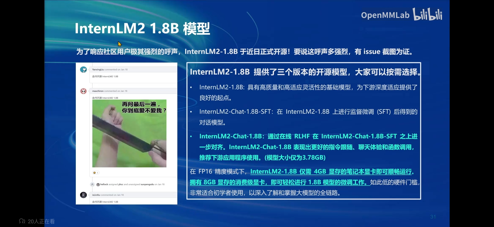


# 多模态

文本单模态模型，输入只有文本，通过一个 Embedding 模型将文本转化为文本向量，然后把向量给 LLM 得到文本输出。

文本+图像多模态模型，在文本处理上和文本单模态模型相同，不过添加了另一个图像输入分支，通过一个 Image Projector 将图像转换为图像向量，然后和文本向量一起给 LLM，得到文本输出。

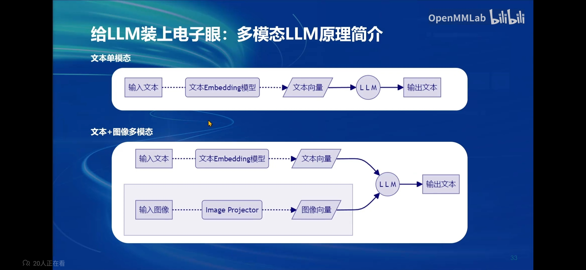

XTuner 支持 LLaVA 多模态模型。它的主要训练方式为：

1. 先使用 GPT-4V 模型对图像进行描述，构造出大量  \<question text\> \<image\>--\<answer text\> 数据对。
2. 利用这些数据对，配合单模态的文本 LLM 和一个冻结的 Image Backbone，训练出一个 Image Projector
3. 使用图像对话数据微调 Image Projector 和 LLM，Image Backbone 仍然冻结，让模型具有对话能力。

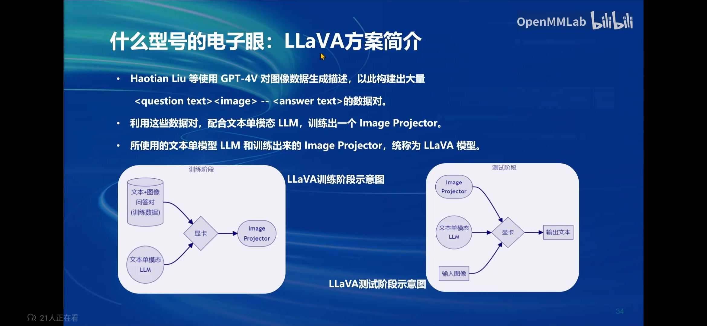

Image Projector 的训练和测试，和 LoRA微调方案很想，两者都是在已有的 LLM 的基础上，用新数据训练一个小的文件。

LLM 在 套上 LoRA 之后，才有了新的角色；LLM 套上 Image Projector 之后，才能理解图像。

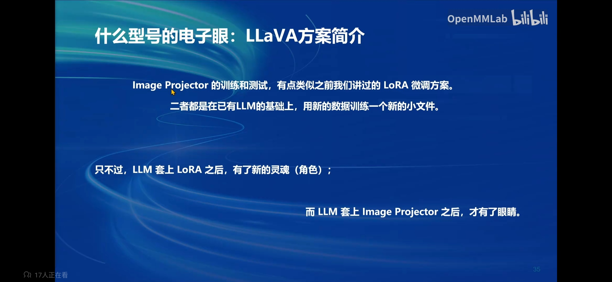

在 Pretrain 阶段，会使用大量的图片和简单的文本（文本标题）数据对对模型训练，让模型理解图像中的普遍特征。经过预训练之后，模型已经能够拥有视觉能力了，不过由于训练时只输出了图片标题，因此模型只能输出图片标题，为了能让模型拥有图片对话能力，要使用对话数据集让模型说话，通过人工构造对话数据（下图右侧）来微调模型，微调之后模型就具有了对于图片的精确描述和对话能力。

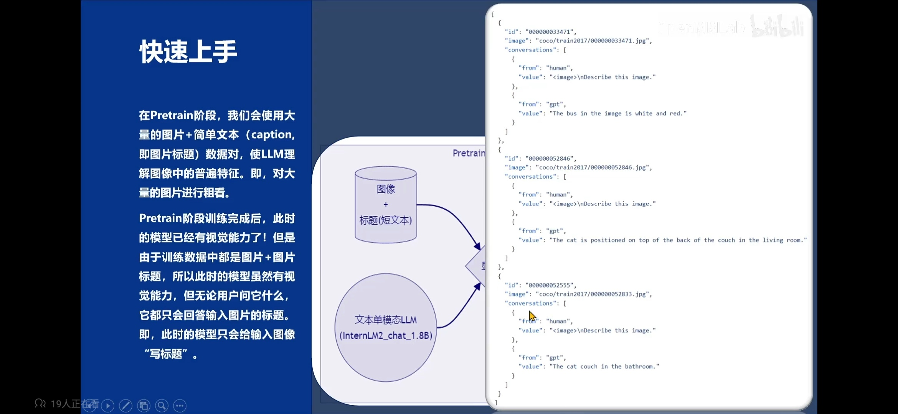

