# 大模型微调数据构造

## 课程简介

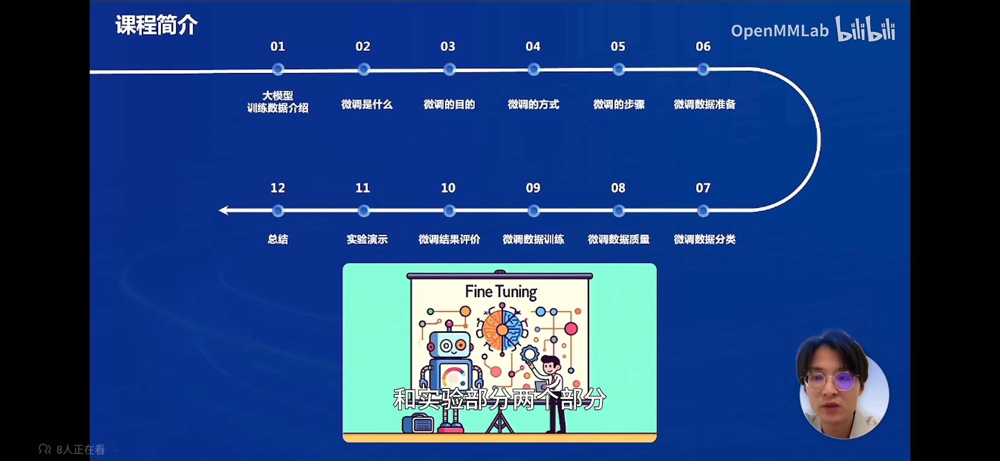

## 大模型训练数据介绍

大模型训练一般需要3个步骤：预训练 -> SFT -> RLHF

预训练：

- 数据集很大， 从网络、书籍等地方获取的文本数据
- 算力很大上千张显卡，数个月的周期
- 训练方式：预测下一个 token 的方式

SFT：

- 对话数据，规模小，数据质量很好
- 算力要求较小

RLHF：

- 训练一个奖励模型，人对模型的输出进行排序和打分

- 数据数量少，质量高

- 使用奖励模型通过强化学习微调大模型

  给大模型 prompt，模型给多个输出，奖励模型打分排序，通过强化学习训练大模型，让模型输出对齐人类

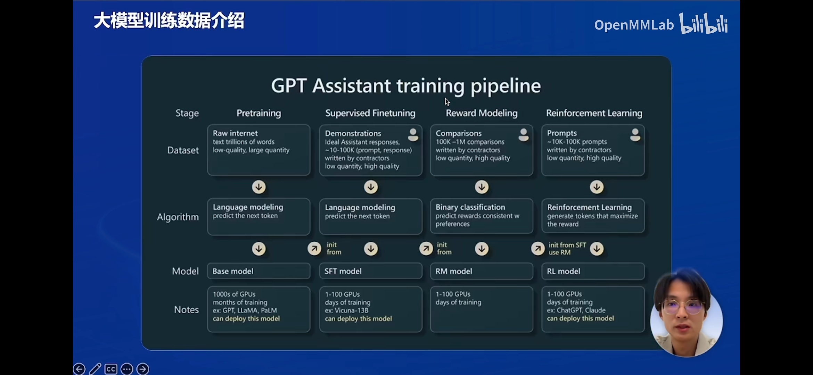

## 微调是什么

预训练：

- 数据来源：网络、论文、书籍
- 特点：无标签、规模大、质量低、内容杂
- 训练完成后模型没法对话，而是拟合之前训练的数据

微调：

- 数据来源：人工或模型标注的问答对、指令集

- 特点：规模小、质量高、面向特定任务场景
- 训练完成后可以和人类对话

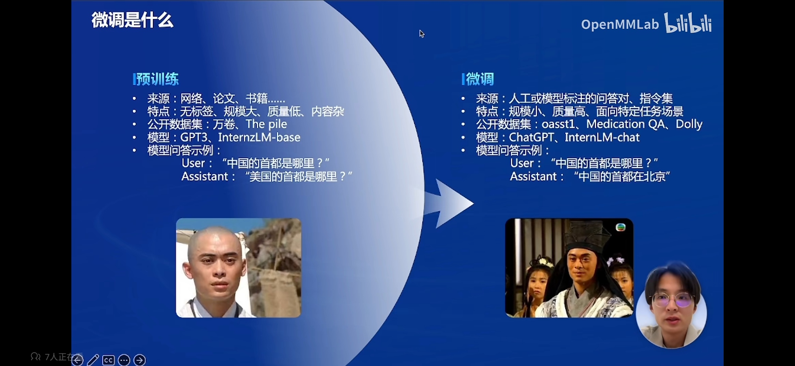

## 书生万卷

https://openxlab.org.cn/datasets/OpenDataLab/WanJuan1_dot_0

https://openxlab.org.cn/datasets/OpenDataLab/WanJuanCC

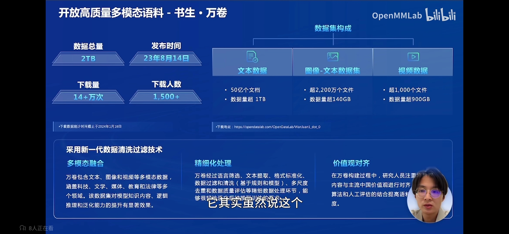

## 大模型微调和指令微调

- 大模型微调（Fine-tuning）

大模型微调（Fine-tuning）是指在已经预训练好的大型语言模型基础上，使用特定的数据集进一步的训练，以使模型适应特定任务或领域。

其根本原理在于，机器学习模型只能够代表它所接收到的数据集的逻辑和理解，而对于其没有获得的数据样本，其并不能很好地识别/理解，且对于大模型而言，也无法很好地回答特定场景下的问题。

例如，一个通用大模型涵盖了许多语言信息，并能够进行流畅的对话。但是如果需要医药方面能够很好地回答患者问题的应用，就需要为这个通用大模型提供很多新的教据以供学习和理解。例如，布洛芬到底能否和感冒药同时吃？为了确定模型可以回答正确，我们就需要对基础横型进行微调。

- 指令微调（Instructiontuning）

指令微调（Instructiontuning）是大模型微调的一个子集，是指在少量数据或有限数据条件下，从已有数据中识别出最有价值的核心样本，并通过微调模型的指令来帮助模型获取下游任务的知识，从而实现可比甚至更好的性能。

这种方法主要针对预训练语言模型，因为LLM需要大量数据来训练，但在某些情况下，如果我们只希望优化特定任务的性能，则只需要在目标任务数据上微调模型的指令，而不是在大量数据上进行微调，可以大大节省时间和计算资源。

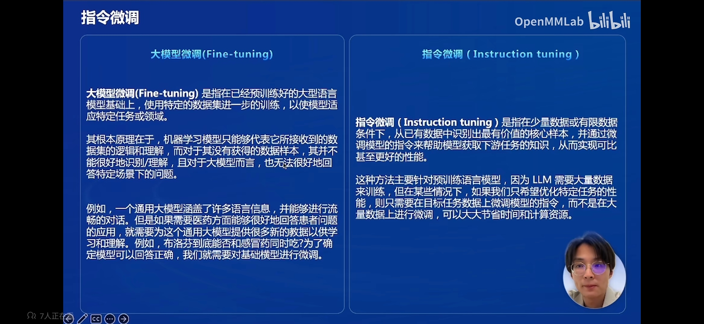

## 微调的目的

模型微调主要有一下目的：

- 预训练模型无法满足需求：如专业问答、组织自身的信息
- Prompt Engineering 局限性：虽然 Prompt Engineering 可以实现应用，但是 token 输入过长、推理成本高、效果不理想
- 数据安全问题：企业内部数据、敏感数据
- 需要个性化服务：如角色扮演

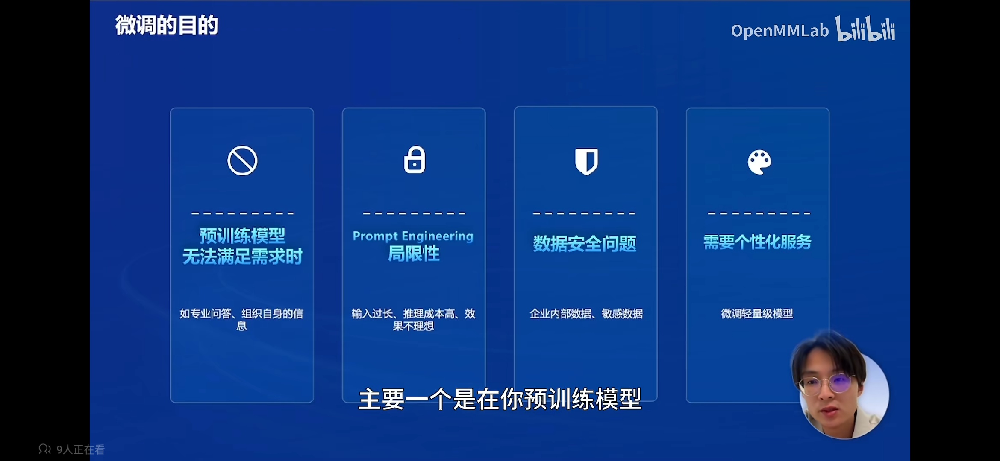

目的：

- 模型性能：

  微调可以减少幻觉，让模型遵循指令/流畅问答、可以面向特定任务场景进行微调

- 数据安全：

  可以私有化部署、保护数据资产、防止隐私泄露

- 经济性：

  微淘可以降低训练成本、提高训练效率、动态学习能力（不断收集数据和反馈，快速迭代模型）

- 可靠性：

  微调基于成熟模型、通过微调方式可以减少出错几率

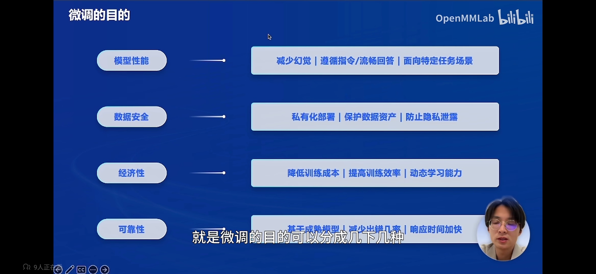

## 微调的方式

从参数规模划分：

- 全参微调
- 参数效率微调：Prompt Tuning、Prefix Tuning、LorRA、QLoRA

从训练数据划分：

- SFT：对话数据
- RLHF：通过人的反馈
- RLAIF：通过 AI 代替人的反馈

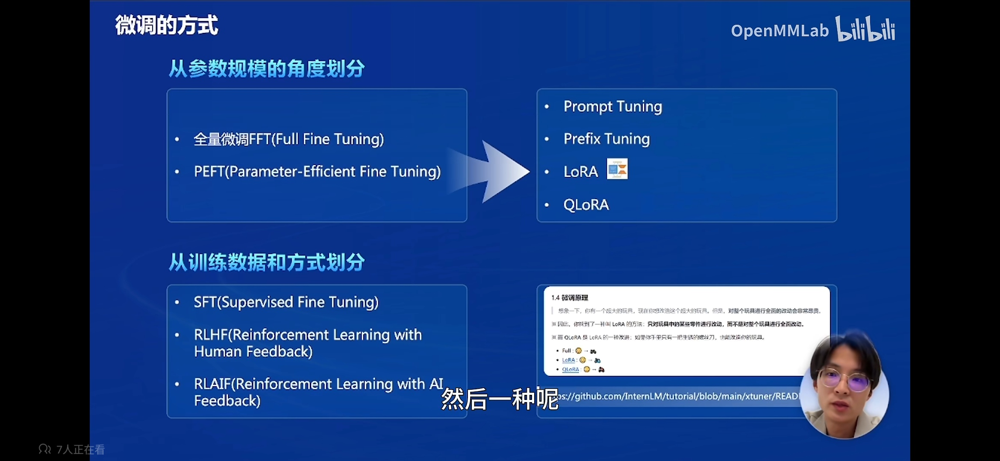

## 微调的步骤

1. 明确目标任务（角色扮演、数学、写作.） 
2. 选择和测试基座模型（可以先选一个小模型进行验证）
3. 数据准备（收集、清洗、预处理、标注、划分...）
4. 设定微调策略（LoRA、QLoRA）
5. 设置超参（学习率、批量大小、训练轮数）
6. 模型初始化
7. 开始微调训练
8. 模型评估和调优（调整数据、策略、超参）
9. 模型性能测试 
10. 模型部署应用

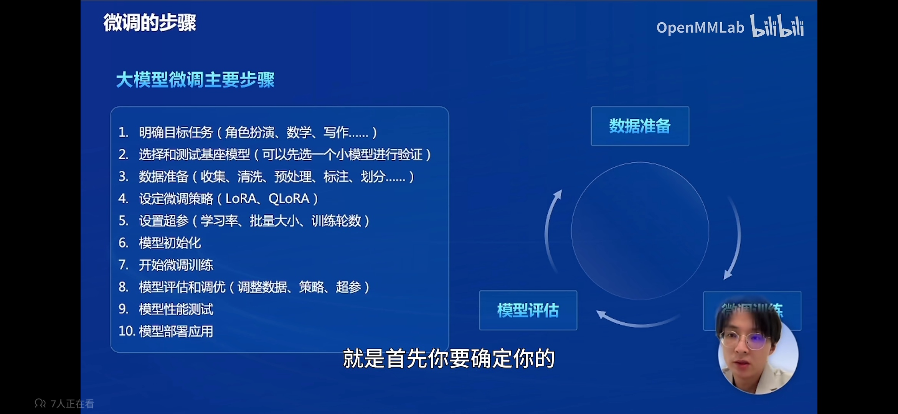

微调数据处理：

1. 收集数据：
   - 在网络上爬取数据
   - 使用公开数据
   - 通过人工构造数据
2. 数据扩充：
   - 获取数据后，如果数据不够，可以用数据增强
   - 使用 Self-instruct（构建种子指令， 通过大模型生成对话数据对，质量有待商榷）
   - 将非对话数据转换为对话数据
   - 详情请见 [微调数据构造](#微调数据构造)
3. 数据处理：
   - 包括格式转换
   - 划分训练集和测试集
   - 开始自定义微调

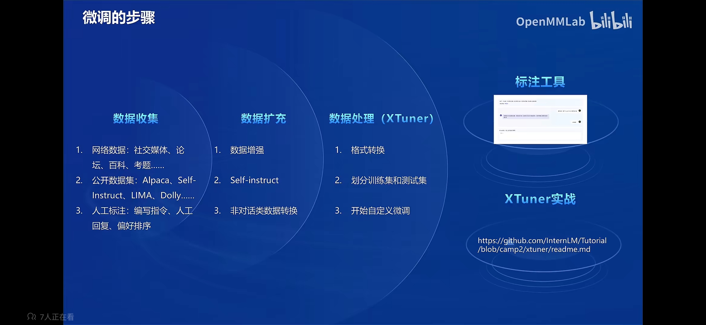

## 微调数据准备

按任务类型划分：

- 开放式问答
- 闭域问答
- 摘要生成
- 翻译
- 写作
- 代码
- 角色扮演
- 。。。

按数据类型划分：

- 单轮文本对话
- 多轮文本对话
- 多模态对话
- 交互式对话
- 结构化知识数据：知识图谱、数据库
- 非结构化信息数据：pdf、网页、excel
- 。。。

按垂直领域划分：

- 通用领域
- 医疗
- 金融·
- 法律·
- 生活
- 娱乐
- 。。。

按数据来源划分：

- 公开数据集
- 众包标注·
- 合成数据
- 私有数据：如企业内部数据
- 。。。

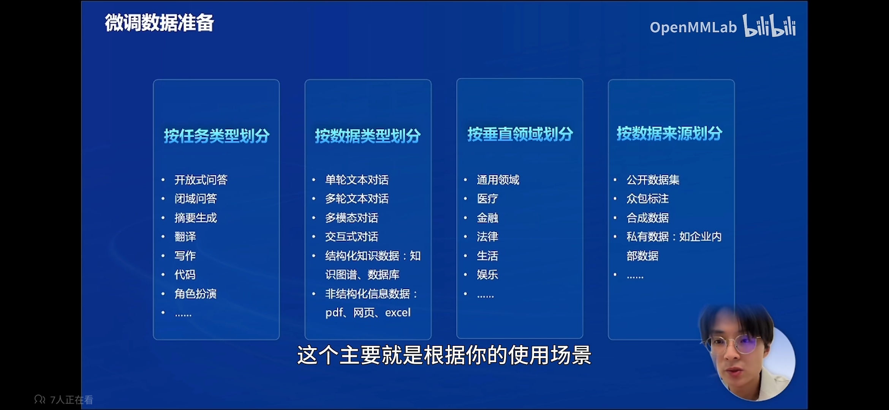

## 微调数据质量

好的微调数据：

- 数据质量高
- 多样性
- 真实数据
- 数据量多（数据量没有质量重要）

差的微调数据：

- 数据质量低
- 同质性
- 生成的数据
- 数据量少

《LIMA：Less Is More for Alignment》：当扩大数据量而不同时扩大提示多样性时，收益会大大减少，而在优化数据质量时，收益会大大增加。

《MAYBE ONLY 0.5% DATA IS NEEDED》：特定任务的模型可能从固定的任务类型中获益，以获得更高的性能：指令格式的多样性可能对特定任务模型的性能影响很小；即使是少量的数据（1.9Mtokens）也能为特定任务模型的指令调整带来可喜的结果。

《COIG-CQIA: Quality is All You Need for Chinese Instruction Fine-tuning》：使用弱智吧数据训练的大模型，跑分超过百科、知乎、豆箍书等平台，基至是研究团队精心挑选的数据集。

分析：1）指令多样性。2）用词准确且简洁。

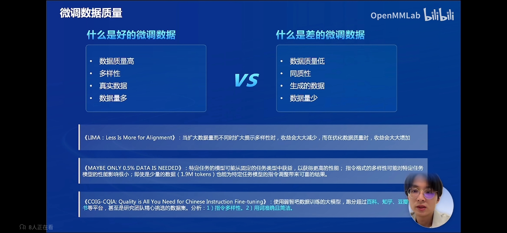

## 微调结果评价

- 人工评价：最可靠
- 评测工具：训练通用模型可以使用，得到客观评价结果
- 模型排名

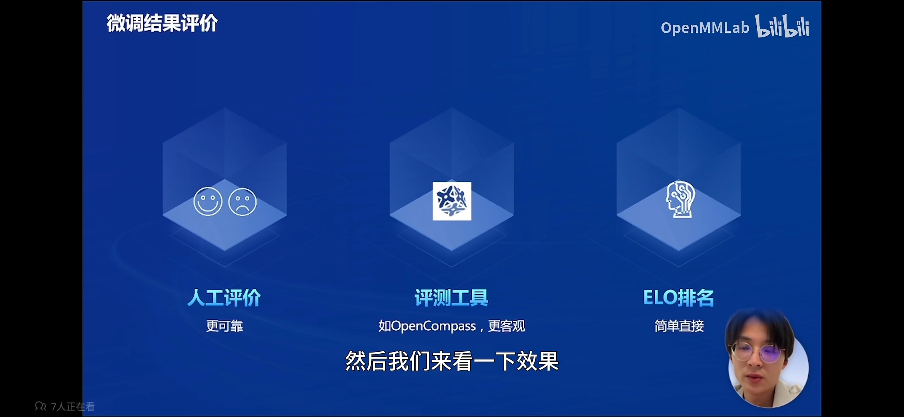

# 微调数据构造

https://github.com/Focusshang/Tutorial/tree/main/FineTune

## 数据构造

首先介绍下如何构造高质量的SFT数据：

1. 数据选择和采集

微调数据的选择应该基于目标应用场景：

- 领域相关性：选择与预期应用场景密切相关的文本数据。例如，如果目标是法律助理，应选择法律文档和案例。本实验目的是提升模型的推理和识别逻辑陷阱的能力，因此选择弱智吧的数据。
- 质量高：这里指的是问题和回答都要是高质量的，通常需要语法正确，信息准确，风格一致。具体来说，好的回复应该遵循“无害（Harmless）、诚实（Honest）、有帮助（Helpful）”的三H原则。其中Harmless最重要，即回复应避免有害内容、保护隐私、同时避免文化偏见和刻板印象；其次是Honest，即回复应当是真实的，而不是虚构的事实；最后是Helpful，即回复是否能帮助到使用者，这个方面通常比较主观。
- 多样性：确保数据覆盖所有相关子话题，以促进模型的泛化能力。

2. 数据预处理

为了提高模型的效率和效果，数据预处理是必不可少的步骤：

- 清洗：去除无关的内容，如广告、HTML标签、无意义的填充词等。
- 标准化：统一词汇的格式，比如时间、日期、货币单位等。
- 分词：根据目标模型的需求进行适当的分词处理。
- 去噪声：消除文本中的错误，如拼写错误、语法错误等。

3. 数据标注

由于微调数据规模不大，因此可以通过标注的方式来进行构造，这里有两种不同的标注方法：

- 人工标注：由人工专家进行标注，确保标注的准确性和一致性。采用人工的方式成本比较高，但质量相对较好，尤其在涉及一些专业领域的时候，领域专家能够更好的理解问题并给出回复。这里介绍下我们的仓库：[OpenDataLab](https://github.com/opendatalab).，里面主要是一些数据处理工具，预计2024年5月会开源一个专门用于大语言模型标注的免费的标注工具。
- 自动标注：使用已有的模型进行初步标注，然后由人工校验和修正。可以采用GPT4来生成回复，再由人工来判断回答的好坏，并进行修正。

4. 数据增强

数据增强可以提高模型的鲁棒性和泛化能力，方法有：

- 文本重述：用不同的方式表达同一意思，增加文本的多样性。
- 翻译循环：将文本翻译成一种语言，然后再翻译回原语言，通常用于生成新的文本表达。
- 合成数据生成：使用规则或模型生成新的训练样本。

5. 数据划分

通常分为训练集、验证集和测试集。合理划分数据，确保模型能在未见过的数据上进行有效的泛化测试。