# SSH

**SSH**全称Secure Shell，中文翻译为安全外壳，它是一种**网络安全协议**，通过加密和认证机制实现安全的访问和文件传输等业务。SSH 协议通过对网络数据进行加密和验证，在不安全的网络环境中提供了安全的网络服务。

SSH 是（C/S架构）由**服务器**和**客户端**组成，为建立安全的 SSH 通道，双方需要先建立 TCP 连接，然后协商使用的版本号和各类算法，并生成相同的**会话密钥**用于后续的对称加密。在完成用户认证后，双方即可建立会话进行数据交互。

那在后面的实践中我们会**配置SSH密钥**，配置密钥是为了当我们远程连接开发机时不用重复的输入密码，那**为什么要进行远程连接呢**？

远程连接的好处就是，如果你使用的是远程办公，你可以通过SSH远程连接开发机，这样就可以在本地进行开发。而且如果你需要跑一些本地的代码，又没有环境，那么远程连接就非常有必要了。

## ssh 基本连接

> 连接命令

```
ssh user@hostname
```

> SSH的默认端口是22，也就是说，你的登录请求会送进远程主机的22端口。使用p参数，可以修改这个端口

```
ssh user@hostname -p 2222
```

## 端口转发

将本地端口映射到远端主机端口

```
ssh -C -f -N -g -L 本地端口:目标IP:目标端口 用户名@目标IP

ssh -CNg -L 8888:127.0.0.1:8888 user@hostname
ssh -CNg -L 7860:127.0.0.1:7860 root@ssh.intern-ai.org.cn -p 33344
```

将远端主机端口映射到本地端口

```
ssh -C -f -N -g –R 本地端口:目标IP:目标端口 用户名@目标IP
```

其中

-C：是进行数据压缩。

-f：是后台认证用户/密码，通常和-N连用，不用登录到远程主机。只有当提示用户名密码的时候才转向前台。

-N：是不执行远端命令，在只是端口转发时这条命令很有用处。

-g ：在-L/-R/-D参数中，是允许远端主机连接本地转发端口，如果不加这个参数，只允许本地主机建立连接。

-L：将本地端口映射到远端主机端口。`本地端口:目标IP:目标端口`。

　　将本地机(客户机)的某个端口转发到远端指定机器的指定端口。

-R，将远端主机端口映射到本地端口。`本地端口:目标IP:目标端口`。

　　将远程主机(服务器)的某个端口转发到本地端指定机器的指定端口。

-p ：被登录的ssd服务器的sshd服务端口。

-D：port 指定一个本地机器 “动态的'’ 应用程序端口转发。

## 尝试连接

直接使用 powershell 连接

```sh
ssh -p 33344 root@ssh.intern-ai.org.cn -o StrictHostKeyChecking=no -o UserKnownHostsFile=/dev/null

# 之后输入密码即可连接
```

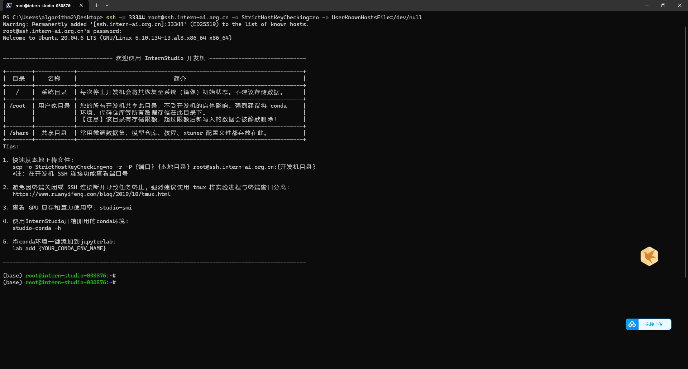

使用 vscode 连接

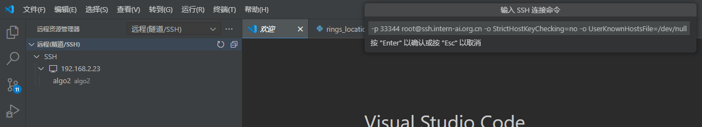

点击连接

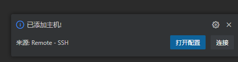

之后输入密码进行连接

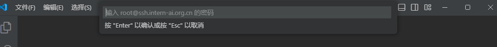

连接后打开文件夹，再输入一遍密码即可

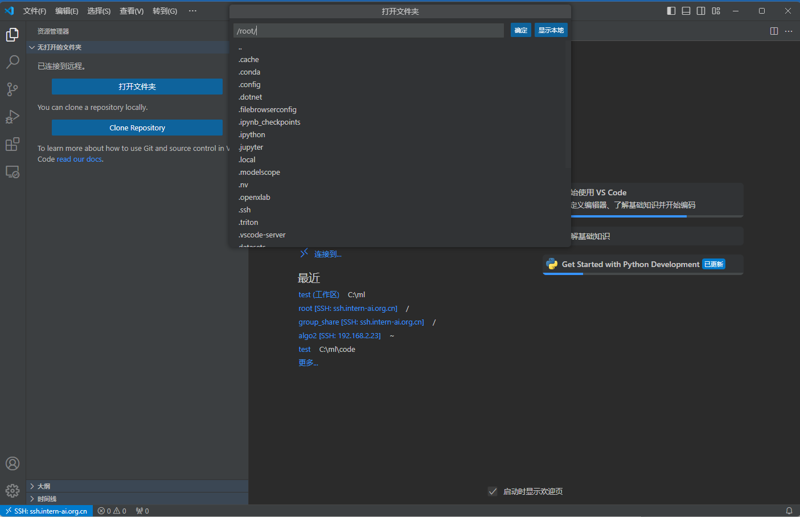

连接成功

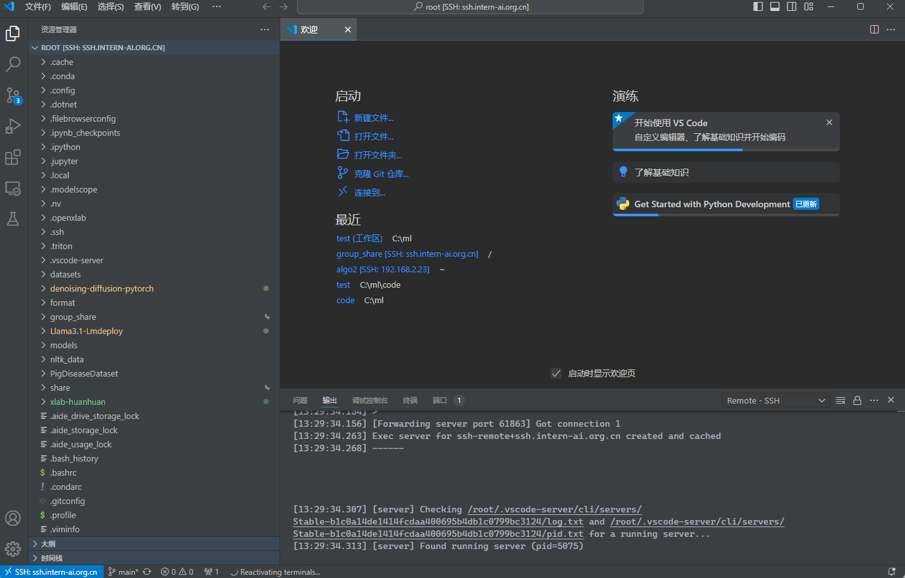

## 配置SSH密钥进行SSH远程连接

> SSH密钥是一种安全便捷的登录认证方式，用于在SSH协议中进行身份验证和加密通信。

**ssh-keygen**支持RSA和DSA两种认证密钥。

常用参数包括：

- -t：指定密钥类型，如dsa、ecdsa、ed25519、rsa。
- -b：指定密钥长度。
- -C：添加注释。
- -f：指定保存密钥的文件名。
- -i：读取未加密的ssh-v2兼容的私钥/公钥文件。

这里我们使用RSA算法生成密钥，命令为：

```
ssh-keygen -t rsa
```

输入命令后**一路回车**就可以了，这里的密钥默认情况下是生成在`~/.ssh/`目录下的，`~`表示的是家目录，如果是windows就是`C:\Users\{your_username}\`。在powerShell中可以使用`Get-Content`命令查看生成的密钥，如果是linux操作系统可以使用`cat`命令。

## 端口映射

**端口映射**是一种网络技术，它可以将外网中的任意端口映射到内网中的相应端口，实现内网与外网之间的通信。通过端口映射，可以在外网访问内网中的服务或应用，实现跨越网络的便捷通信。

```sh
ssh root@ssh.intern-ai.org.cn -p 33344 -CNg -L 7860:127.0.0.1:7860 -o StrictHostKeyChecking=no
```

- `-p 33344`：是指定 SSH 连接的端口为 33344。

- `root@ssh.intern-ai.org.cn`：表示要以 `root` 用户身份连接到 `ssh.intern-ai.org.cn` 这个主机。

- ```
  -CNg
  ```

  ：

  - `-C` 通常用于启用压缩。
  - `-N` 表示不执行远程命令，仅建立连接用于端口转发等。
  - `-g` 允许远程主机连接到本地转发的端口。

- `-L {本地机器_PORT}:127.0.0.1:{开发机_PORT}`：这是设置本地端口转发，将本地机器的指定端口（由 `{本地机器_PORT}` 表示）转发到远程主机（这里即 `ssh.intern-ai.org.cn`）的 `127.0.0.1` （即本地回环地址）和指定的开发机端口（由 `{开发机_PORT}` 表示）。

- `-o StrictHostKeyChecking=no`：关闭严格的主机密钥检查，这样可以避免第一次连接时因为未知主机密钥而产生的提示或错误。

# Linux 基础命令

这一部分我会带着大家了解Linux的一些**基础操作**，还有使用一些工具。让大家能够在遇到问题的时候，可以自行解决，如果大家有遇到什么问题的话，也可以在这里评论，我会及时给大家回答。

因为我们使用**开发机**时很少使用到**权限管理**，所以我们就不介绍了。（后面的操作均在VScode的终端中进行）

## 文件管理

在 Linux 中，常见的文件管理操作包括：

- **创建文件**：可以使用 `touch` 命令创建空文件。
- **创建目录**：使用 `mkdir` 命令。
- **目录切换**：使用`cd`命令。
- **显示所在目录**：使用`pwd`命令。
- **查看文件内容**：如使用 `cat` 直接显示文件全部内容，`more` 和 `less` 可以分页查看。
- **编辑文件**：如 `vi` 或 `vim` 等编辑器。
- **复制文件**：用 `cp` 命令。
- **创建文件链接**：用`ln`命令。
- **移动文件**：通过 `mv` 命令。
- **删除文件**：使用 `rm` 命令。
- **删除目录**：`rmdir`（只能删除空目录）或 `rm -r`（可删除非空目录）。
- **查找文件**：可以用 `find` 命令。
- **查看文件或目录的详细信息**：使用`ls`命令，如使用 `ls -l`查看目录下文件的详细信息。
- **处理文件**：进行复杂的文件操作，可以使用`sed`命令。

这里介绍几种我们在课程中会使用到的命令：

### **touch**

我们可以使用touch快速的创建文件，这样我们不用手动点击进行创建了。例如我们要创建一个`demo.py`文件:


### **mkdir**

同样的使用方法，如果要创建一个名为`test`的目录：

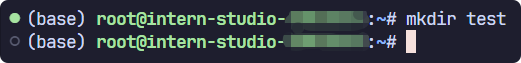

### **cd**

这个命令会是使用最多的一个命令，在使用之前需要为没有计算机基础的同学讲一下目录结构，画一张图让大家理解：

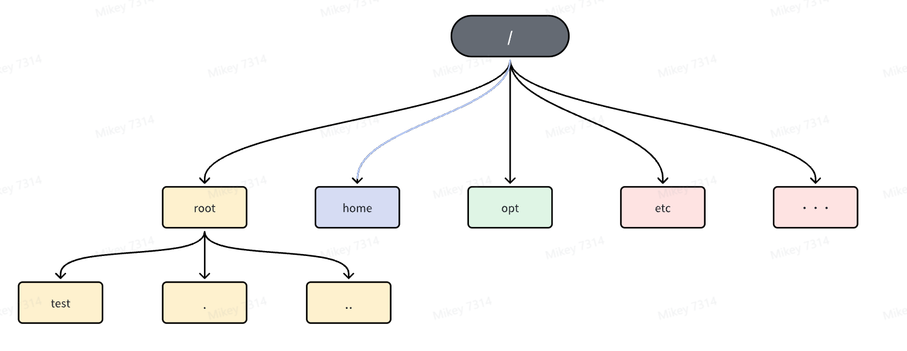


我们现在使用的是`root`目录，也是root用户的家目录`~`，linux操作系统中`/`表示根目录，根目录下有许多系统所需的目录和文件，刚才我们创建的目录就存在与`root`目录下，其中`.`表示的是当前目录，`..`表示的上级目录。如果我现在要进入到`test`目录，然后回到`root`目录，我们可以这样操作：

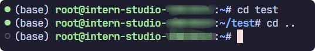

### **pwd**

我们可以使用`pwd`命令查看当前所在的目录：这样可以方便我们确定我们当前所在哪个目录下面。

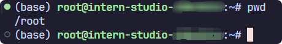

### **cat**

`cat`命令可以查看文件里面的内容，更多的使用命令可以使用`--help`命令查看：

- -a，--show-all等价于-vET
- -b，--number-non空白数非空输出行，覆盖-n
- -e,   等价于-vE
- -E，--show-结束显示$在每一行的末尾
- -n，--number编号所有输出行
- -s，--crick-空白抑制重复的空输出行
- -t，等价于-vT
- -t，--show-tabs将制表符显示为^I
- -v，--show非打印使用^和M-表示法，LFD和TAB除外

### **vi or vim**

当我们需要编辑文件的时候可以使用`vi`或者`vim`命令，当你进入文件编辑以后，有三种模式：

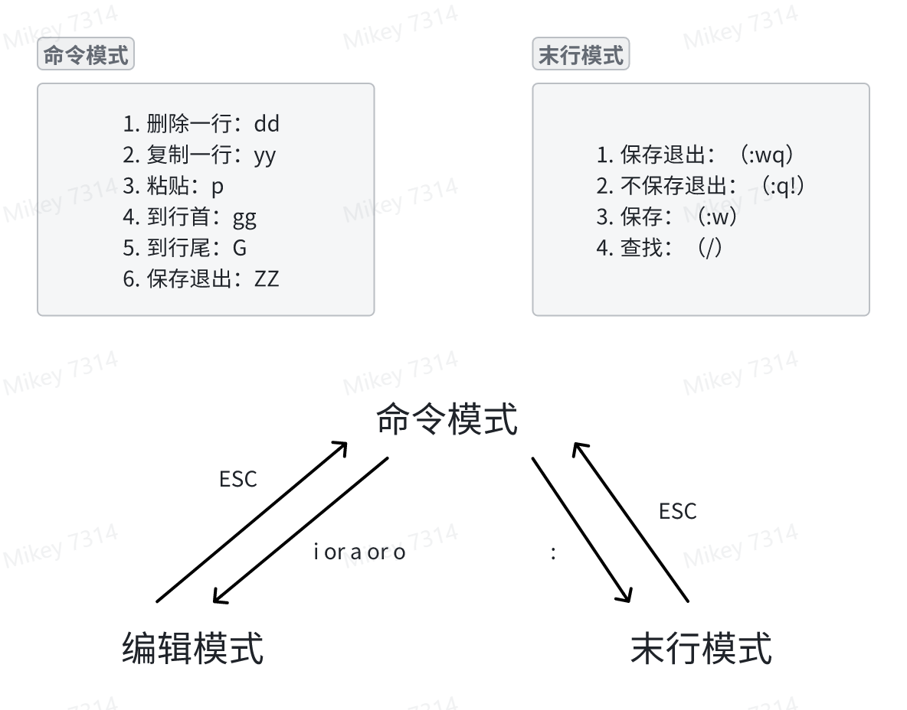


进入编辑模式可以使用`i`，vim的方便之处就是可以在终端进行简单的文件修改。

### **cp 和 ln（重点）**

**`cp`****命令在后面课程中会经常用到，它是用来将一个文件或者目录复制到另一个目录下的操作，常用的使用有：**

- 复制文件：`cp 源文件 目标文件`
- 复制目录：`cp -r 源目录 目标目录`

但是如果我们是要使用模型的话，这种操作会占用大量的磁盘空间，所以我们一般使用`ln`命令，这个就和windows的快捷方式一样。linux中链接分为两种 : **硬链接**(hard link)与**软链接**(symbolic link)，硬链接的意思是一个档案可以有多个名称，而软链接的方式则是产生一个特殊的档案，该档案的内容是指向另一个档案的位置。硬链接是存在同一个文件系统中，而软链接却可以跨越不同的文件系统。

所以我们一般使用软连接，它的常用的使用方法如下：

```
ln [参数][源文件或目录][目标文件或目录]
```

参数如下：

- -s：创建软链接（符号链接）也是最常用的；
- -f：强制执行，覆盖已存在的目标文件；
- -i：交互模式，文件存在则提示用户是否覆盖；
- -n：把符号链接视为一般目录；
- -v：显示详细的处理过程。

### **mv 和 rm**

`mv`命令和`rm`命令的使用方式很相似，但是`mv`是用来移动文件或者目录的，同时还可以进行重命名。`rm`命令则是用来删除文件或者目录的。

常用的使用方法如下：

- **mv 命令**：

常用参数：

- `-i`：交互模式，覆盖前询问。
- `-f`：强制覆盖。
- `-u`：只在源文件比目标文件新时才进行移动。

使用示例：

- `mv file1.txt dir1/`：将文件 `file1.txt` 移动到目录 `dir1` 中。
- `mv file1.txt file2.txt`：将文件 `file1.txt` 重命名为 `file2.txt`。

- **rm 命令**：

常用参数：

- `-i`：交互模式，删除前询问。
- `-f`：强制删除，忽略不存在的文件，不提示确认。
- `-r`：递归删除目录及其内容。

使用示例：

- `rm file.txt`：删除文件 `file.txt`。
- `rm -r dir1/`：递归删除目录 `dir1` 及其所有内容。

删除目录的命令也可以使用`rmdir`。

### **find**

`find`命令是Linux系统中一个强大的文件搜索工具，它可以在指定的目录及其子目录中查找符合条件的文件或目录，并执行相应的操作。

以下是`find`命令的一些常见用法：

1. **按文件名查找**：使用`-name`选项按照文件名查找文件。例如，`find /path/to/directory -name "file.txt"`将在指定目录及其子目录中查找名为`file.txt`的文件。
2. **按文件类型查找**：使用`-type`选项按照文件类型查找文件。例如，`find /path/to/directory -type f`将查找指定目录及其子目录中的所有普通文件。
3. **按文件大小查找**：使用`-size`选项按照文件大小查找文件。例如，`find /path/to/directory -size +100M`将查找指定目录及其子目录中大于100MB的文件。
4. **按修改时间查找**：使用`-mtime`、`-atime`或`-ctime`选项按照文件的修改时间、访问时间或状态更改时间查找文件。例如，`find /path/to/directory -mtime -7`将查找指定目录及其子目录中在7天内修改过的文件。
5. **按文件权限查找**：使用`-perm`选项按照文件权限查找文件。例如，`find /path/to/directory -perm 755`将查找指定目录及其子目录中权限为755的文件。
6. **按用户或组查找**：使用`-user`或`-group`选项按照文件的所有者或所属组查找文件。例如，`find /path/to/directory -user username`将查找指定目录及其子目录中属于用户`username`的文件。
7. **执行操作**：使用`-exec`选项可以对找到的文件执行相应的操作。例如，`find /path/to/directory -name "*.txt" -exec rm {} \;`将删除找到的所有以`.txt`结尾的文件。

### **ls**

`ls`命令可以用来列出目录的内容以及**详细信息**。

常用参数及使用方法如下：

- `-a`：显示所有文件和目录，包括隐藏文件（以`.`开头的文件或目录）。
- `-l`：以长格式显示详细信息，包括文件权限、所有者、大小、修改时间等。
- `-h`：与`-l`结合使用，以人类可读的方式显示文件大小（如`K`、`M`、`G`等）。
- `-R`：递归列出子目录的内容。
- `-t`：按文件修改时间排序显示。、

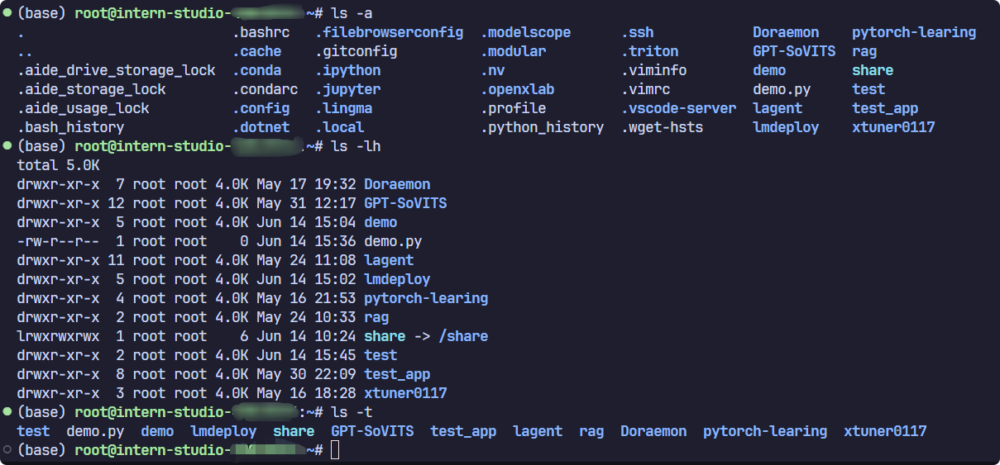

### **sed**

`sed`命令是一种流编辑器，主要用于文本处理，在处理复杂的文件操作时经常用到，在后续的课程中会使用到，`sed`命令常用参数及使用示例如下：

- **参数说明：**
  - `-e<script>` 或 `--expression=<script>`：直接在命令行中指定脚本进行文本处理。
  - `-f<script文件>` 或 `--file=<script文件>`：从指定的脚本文件中读取脚本进行文本处理。
  - `-n` 或 `--quiet` 或 `--silent`：仅打印经过脚本处理后的输出结果，不打印未匹配的行。
- **动作说明：**
  - `a`：在当前行的下一行添加指定的文本字符串。
  - `c`：用指定的文本字符串替换指定范围内的行。
  - `d`：删除指定的行。
  - `i`：在当前行的上一行添加指定的文本字符串。
  - `p`：打印经过选择的行。通常与 `-n` 参数一起使用，只打印匹配的行。
  - `s`：使用正则表达式进行文本替换。例如，`s/old/new/g` 将所有 "InternLM" 替换为 "InternLM yyds"。
- **示例：**

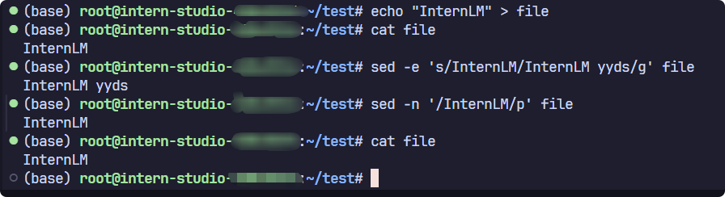


在示例中使用了`echo`命令，这和python中的`print`一样，用来打印内容，这里使用管道符`>`将InternLM打印到file文件中，常用的管道符还有`<`和`|`，比如我们可以使用`grep`命令来查看python中安装的包含`os`字段的包：

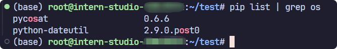


`grep`是一个强大的文本搜索工具。常用参数如下：

- `-i`：忽略大小写进行搜索。
- `-v`：反转匹配，即显示不匹配的行。
- `-n`：显示行号。
- `-c`：统计匹配的行数。

## 进程管理

**进程管理**命令是进行系统监控和进程管理时的重要工具，常用的进程管理命令有以下几种：

- **ps**：查看正在运行的进程
- **top**：动态显示正在运行的进程
- **pstree**：树状查看正在运行的进程
- **pgrep**：用于查找进程
- **nice**：更改进程的优先级
- **jobs**：显示进程的相关信息
- **bg 和 fg**：将进程调入后台
- **kill**：杀死进程

在开发机中还有一条特殊的命令`nvidia-smi`，它是 NVIDIA 系统管理接口（NVIDIA System Management Interface）的命令行工具，用于监控和管理 NVIDIA GPU 设备。它提供了一种快速查看 GPU 状态、使用情况、温度、内存使用情况、电源使用情况以及运行在 GPU 上的进程等信息的方法。

下面是关于各个命令使用示例：

- `ps`：列出当前系统中的进程。使用不同的选项可以显示不同的进程信息，例如：

  - ```Bash
    ps aux  # 显示系统所有进程的详细信息
    ```

- `top`：动态显示系统中进程的状态。它会实时更新进程列表，显示CPU和内存使用率最高的进程。

  - ```Bash
    top  # 启动top命令，动态显示进程信息
    ```

- `pstree`：以树状图的形式显示当前运行的进程及其父子关系。

  - ```Bash
    pstree  # 显示进程树
    ```

- `pgrep`：查找匹配条件的进程。可以根据进程名、用户等条件查找进程。

  - ```Bash
    pgrep -u username  # 查找特定用户的所有进程
    ```

- `nice`：更改进程的优先级。`nice` 值越低，进程优先级越高。

  - ```Bash
    nice -n 10 long-running-command  # 以较低优先级运行一个长时间运行的命令
    ```

- `jobs`：显示当前终端会话中的作业列表，包括后台运行的进程。

  - ```Bash
    jobs  # 列出当前会话的后台作业
    ```

- `bg` 和 `fg`：`bg` 将挂起的进程放到后台运行，`fg` 将后台进程调回前台运行。

  - ```Bash
    bg  # 将最近一个挂起的作业放到后台运行
    fg  # 将后台作业调到前台运行
    ```

- `kill`：发送信号到指定的进程，通常用于杀死进程。

  - ```Bash
    kill PID  # 杀死指定的进程ID
    ```

  - 注意，`kill` 命令默认发送 `SIGTERM` 信号，如果进程没有响应，可以使用`-9`使用`SIGKILL` 信号强制杀死进程：

  - ```Bash
    kill -9 PID  # 强制杀死进程    
    ```

> `SIGTERM`（Signal Termination）信号是Unix和类Unix操作系统中用于请求进程终止的标准信号。当系统或用户想要优雅地关闭一个进程时，通常会发送这个信号。与`SIGKILL`信号不同，`SIGTERM`信号可以被进程捕获并处理，从而允许进程在退出前进行清理工作。（来源于网络）

以下是 `nvidia-smi` 命令的一些基本命令用法：

- 显示 GPU 状态的摘要信息：

  - ```Bash
    nvidia-smi
    ```

- 显示详细的 GPU 状态信息：

  - ```Bash
    nvidia-smi -l 1
    ```

  - 这个命令会每1秒更新一次状态信息。

- 显示 GPU 的帮助信息：

  - ```Bash
    nvidia-smi -h
    ```

- 列出所有 GPU 并显示它们的 PID 和进程名称：

  - ```Bash
    nvidia-smi pmon
    ```

- 强制结束指定的 GPU 进程：

  - ```Bash
    nvidia-smi --id=0 --ex_pid=12345
    ```

  - 这会强制结束 GPU ID 为 0 上的 PID 为 12345 的进程。

- 设置 GPU 性能模式：

  - ```Bash
    nvidia-smi -pm 1
    nvidia-smi -i 0 -pm 1
    ```

  - 第一个命令会为所有 GPU 设置为性能模式，第二个命令只针对 ID 为 0 的 GPU。

- 重启 GPU：

  - ```Bash
    nvidia-smi --id=0 -r
    ```

  - 这会重启 ID 为 0 的 GPU。

下面通过一张图片对GPU信息进行介绍：

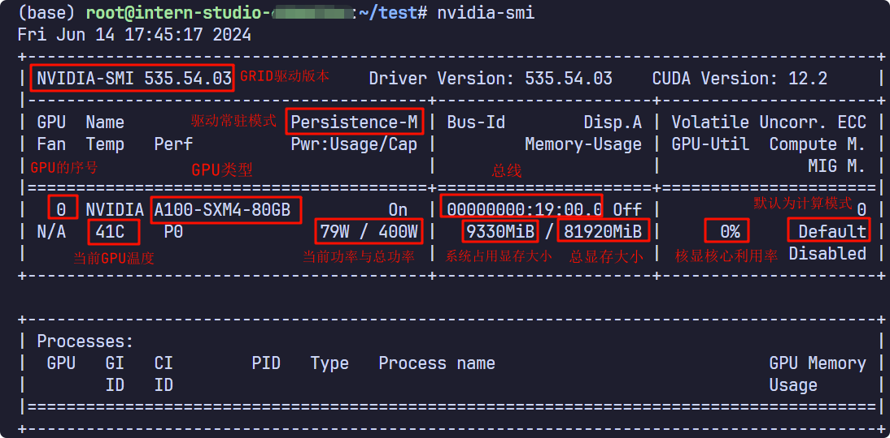

# web demo（作业）

```python
import socket
import re
import gradio as gr
 
# 获取主机名
def get_hostname():
    hostname = socket.gethostname()
    match = re.search(r'-(\d+)$', hostname)
    name = match.group(1)
    
    return name
 
# 创建 Gradio 界面
with gr.Blocks(gr.themes.Soft()) as demo:
    html_code = f"""
            <p align="center">
            <a href="https://intern-ai.org.cn/home">
                
            </a>
            </p>
            <h1 style="text-align: center;">☁️ Welcome {get_hostname()} user, welcome to the ShuSheng LLM Practical Camp Course!</h1>
            <h2 style="text-align: center;">😀 Let’s go on a journey through ShuSheng Island together.</h2>
            <p align="center">
                <a href="https://github.com/InternLM/Tutorial/blob/camp3">
                    
                </a>
            </p>

            """
    gr.Markdown(html_code)

demo.launch()
```

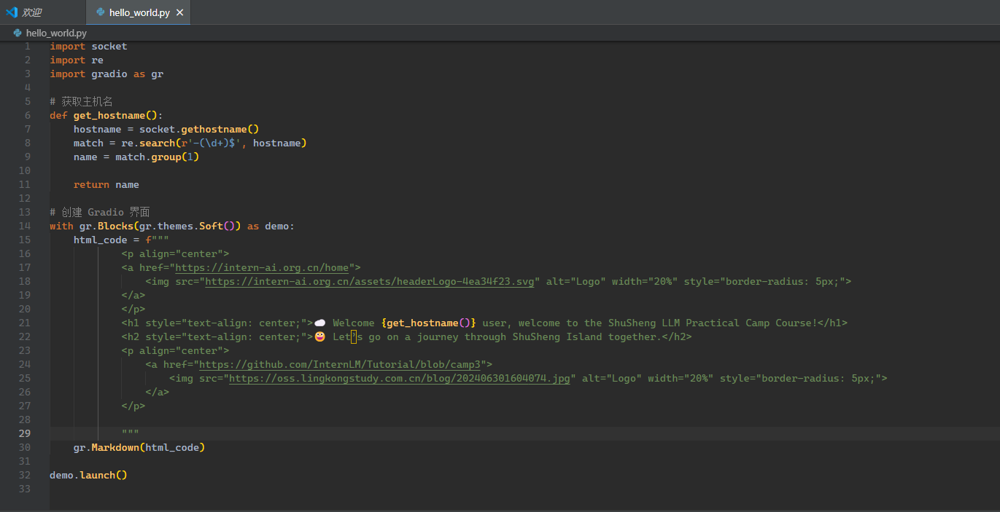

启动 demo

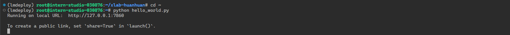

启动端口映射

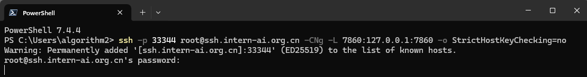

成功访问

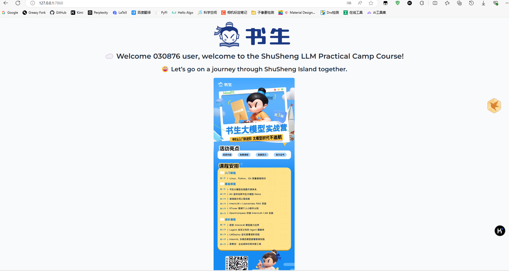
