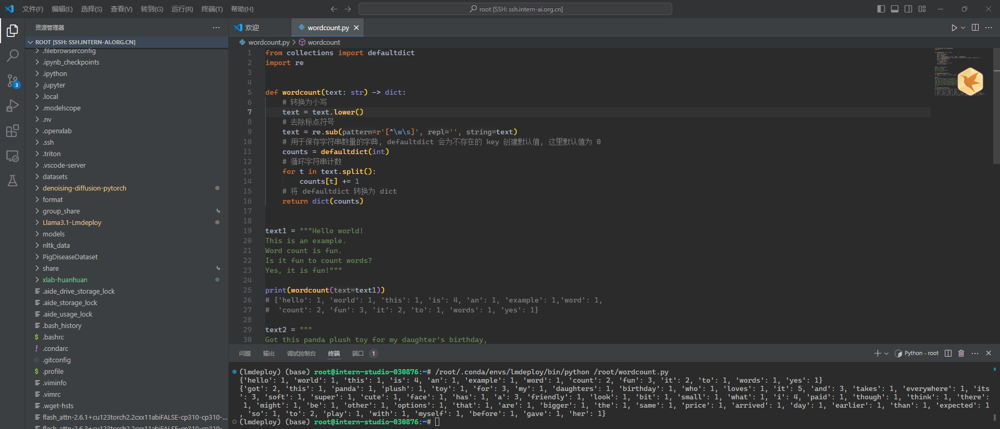
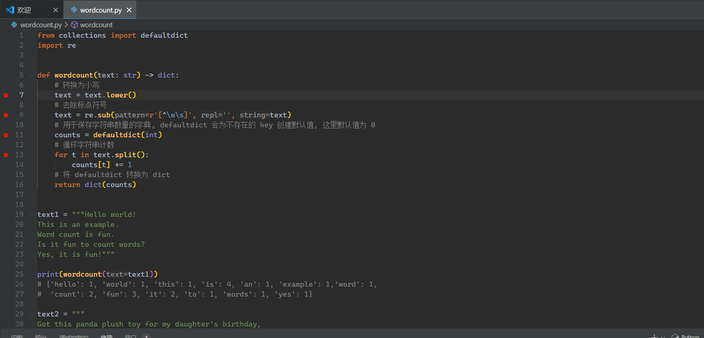
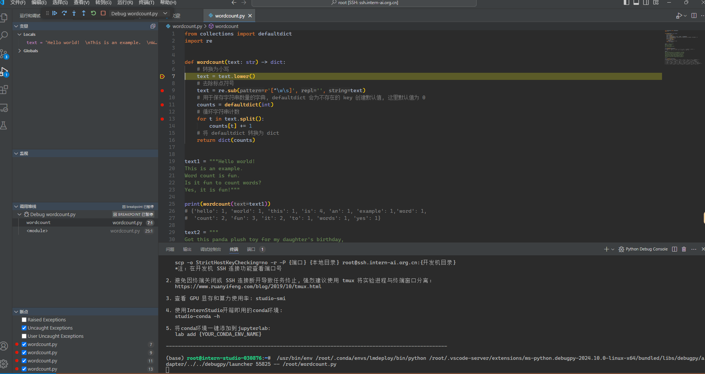
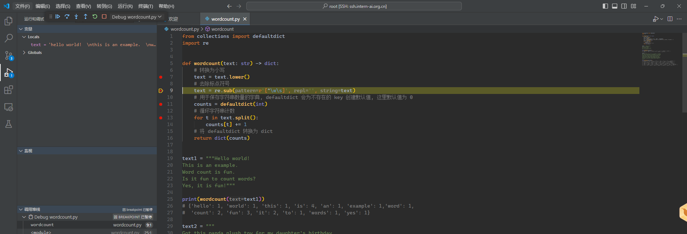
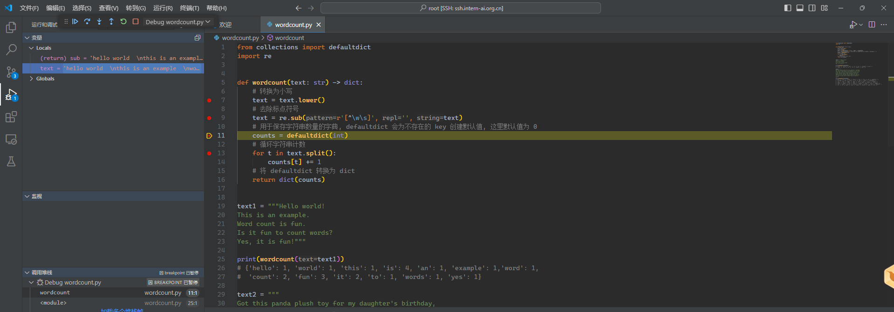
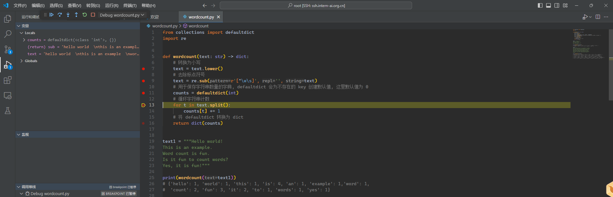
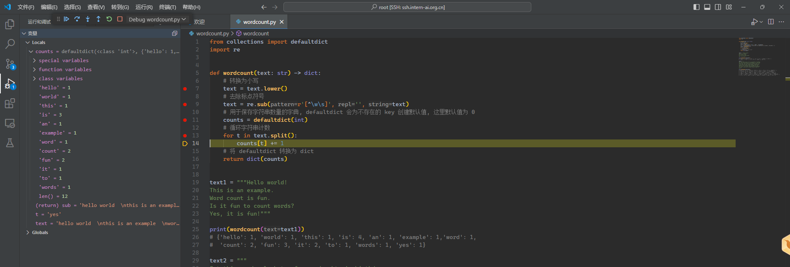

# 任务一

实现一个wordcount函数，统计英文字符串中每个单词出现的次数。返回一个字典，key为单词，value为对应单词出现的次数。

## 代码

步骤如下：

1. 将 text 转换为小写
2. 使用正则表达式去除标点符号
3. 使用 `str.split()` 函数拆分单词并统计词频

```python
from collections import defaultdict
import re


def wordcount(text: str) -> dict:
    # 转换为小写
    text = text.lower()
    # 去除标点符号
    text = re.sub(r'[^\w\s]', '', text)
    # 用于保存字符串数量的字典, defaultdict 会为不存在的 key 创建默认值, 这里默认值为 0
    counts = defaultdict(int)
    # 循环字符串计数
    for t in text.split():
        counts[t] += 1
    # 将 defaultdict 转换为 dict
    return dict(counts)


text1 = """Hello world!  
This is an example.  
Word count is fun.  
Is it fun to count words?  
Yes, it is fun!"""

print(wordcount(text1))
# {'hello': 1, 'world': 1, 'this': 1, 'is': 4, 'an': 1, 'example': 1,'word': 1,
#  'count': 2, 'fun': 3, 'it': 2, 'to': 1, 'words': 1, 'yes': 1}

text2 = """
Got this panda plush toy for my daughter's birthday,
who loves it and takes it everywhere. It's soft and
super cute, and its face has a friendly look. It's
a bit small for what I paid though. I think there
might be other options that are bigger for the
same price. It arrived a day earlier than expected,
so I got to play with it myself before I gave it
to her.
"""
print(wordcount(text2))
# {'got': 2, 'this': 1, 'panda': 1, 'plush': 1, 'toy': 1, 'for': 3, 'my': 1, 'daughters': 1,
#  'birthday': 1, 'who': 1, 'loves': 1, 'it': 5, 'and': 3, 'takes': 1, 'everywhere': 1,
#  'its': 3, 'soft': 1, 'super': 1, 'cute': 1, 'face': 1, 'has': 1, 'a': 3, 'friendly': 1,
#  'look': 1, 'bit': 1, 'small': 1, 'what': 1, 'i': 4, 'paid': 1, 'though': 1, 'think': 1,
#  'there': 1, 'might': 1, 'be': 1, 'other': 1, 'options': 1, 'that': 1, 'are': 1, 'bigger': 1,
#  'the': 1, 'same': 1, 'price': 1, 'arrived': 1, 'day': 1, 'earlier': 1, 'than': 1, 'expected': 1,
#  'so': 1, 'to': 2, 'play': 1, 'with': 1, 'myself': 1, 'before': 1, 'gave': 1, 'her': 1}
```

## 运行截图



# 任务二

请使用本地vscode连接远程开发机，将上面你写的wordcount函数在开发机上进行debug，体验debug的全流程。

## 截图

首先为代码打上断点



点击右上角的 debug



点击单步调试，左侧变量窗口可以看到字母全部变为小写的了



再次单步调试，可以看到左侧变量的标点符号消失了



再次调试，生成变量 counts



经过多次 for 循环，可以再右侧看到 counts 中记录的单词数量

