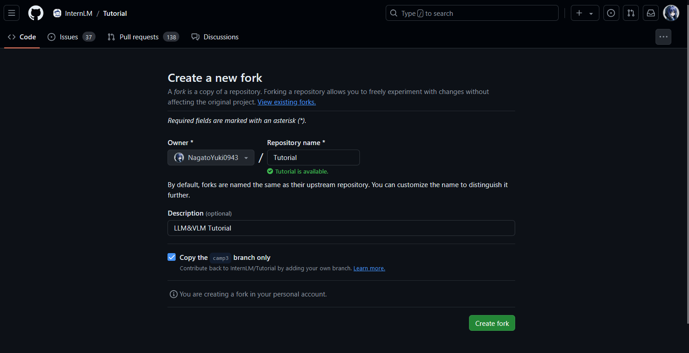
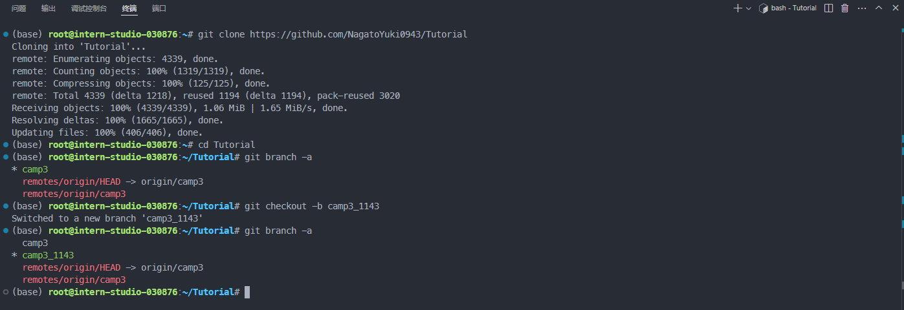
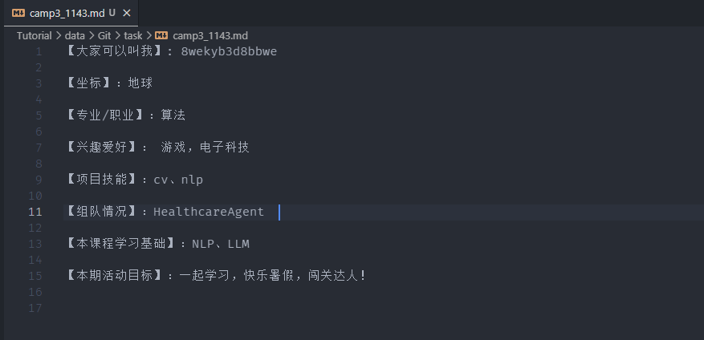
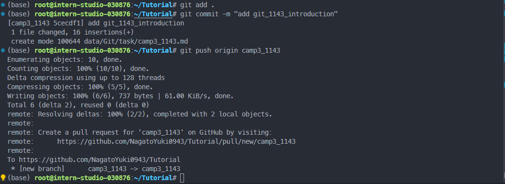
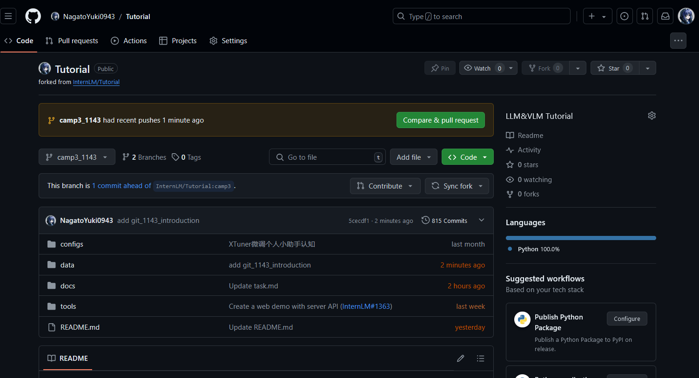
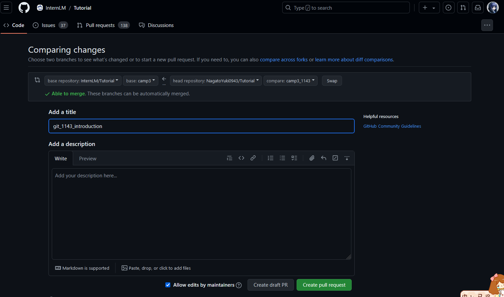
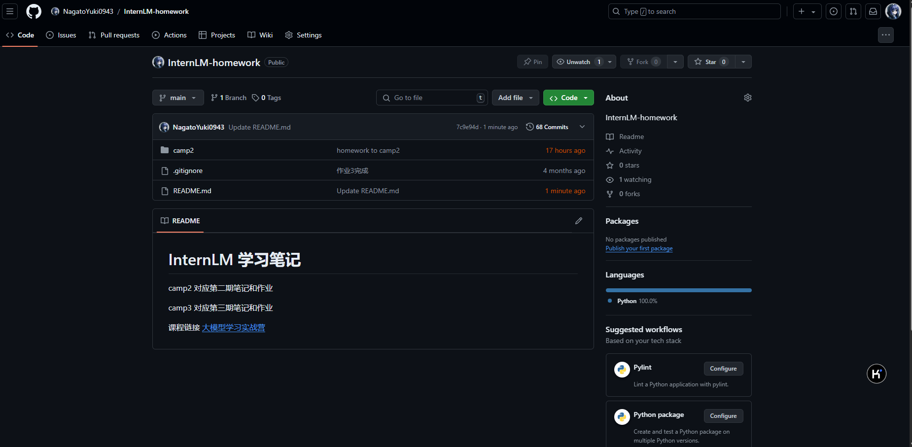
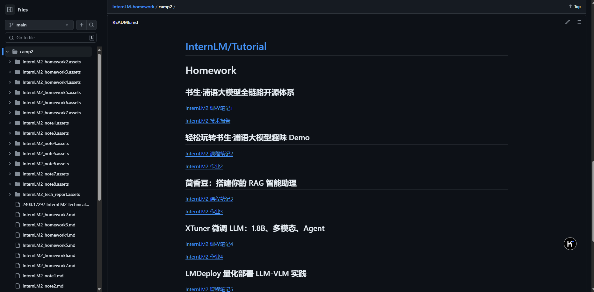

# **Git 中的一些基本概念**

**工作区、暂存区和 Git 仓库区**

* 工作区（Working Directory）：
  当我们在本地创建一个 Git 项目，或者从 GitHub 上 clone 代码到本地后，项目所在的这个目录就是“工作区”。这里是我们对项目文件进行编辑和使用的地方。

* 暂存区（Staging Area）：
  暂存区是 Git 中独有的一个概念，位于 .git 目录中的一个索引文件，记录了下一次提交时将要存入仓库区的文件列表信息。使用 git add 指令可以将工作区的改动放入暂存区。

* 仓库区 / 本地仓库（Repository）：
  在项目目录中，.git 隐藏目录不属于工作区，而是 Git 的版本仓库。这个仓库区包含了所有历史版本的完整信息，是 Git 项目的“本体”。

**文件状态**
文件在 Git 工作区中的状态可以是：

* 已跟踪：文件已被纳入版本控制，根据其是否被修改，可以进一步分为未修改（Unmodified）、已修改（Modified）或已暂存（Staged）。
* 未跟踪：文件存在于工作目录中，但还没被纳入版本控制，也未处于暂存状态。

**分支**
分支是 Git 的一大特性，支持轻量级的分支创建和切换。Git 鼓励频繁使用分支和合并，使得并行开发和错误修正更为高效。


**主要功能**

- **代码历史记录跟踪**

  Git 记录每一次代码提交，允许用户查看项目的历史版本和变更记录，从而理解每个阶段的开发细节。

- **团队协作**

  支持多人同时对同一项目工作，提供了合并、分支和版本控制的功能，以确保多人协作的效率和代码的整合性。

- **变更审查**

  允许开发者查看代码变更的具体内容，了解谁在何时做了哪些修改，这对于代码审查和质量控制至关重要。

- **实现机制**

| 特性       | 描述                                                         |
| ---------- | ------------------------------------------------------------ |
| 分布式架构 | 与集中式版本控制系统不同，Git 在每个开发者的机器上都存有完整的代码库副本，包括完整的历史记录。这种分布式的特性增强了数据的安全性和获取效率。 |
| 分支管理   | Git 的分支管理功能非常灵活，支持无缝切换到不同的开发线路（分支），并允许独立开发、测试新功能，最终通过合并操作将这些功能稳定地集成到主项目中。 |
| 快照系统   | Git 通过快照而非差异比较来管理数据。每次提交更新时，Git 实际上是在存储一个项目所有文件的快照。如果文件没有变化，Git 只是简单地链接到之前存储的文件快照。 |

## 常用 Git 操作

**基础指令**

| 指令           | 描述                                       |
| -------------- | ------------------------------------------ |
| `git config`   | 配置用户信息和偏好设置                     |
| `git init`     | 初始化一个新的 Git 仓库                    |
| `git clone`    | 克隆一个远程仓库到本地                     |
| `git status`   | 查看仓库当前的状态，显示有变更的文件       |
| `git add`      | 将文件更改添加到暂存区                     |
| `git commit`   | 提交暂存区到仓库区                         |
| `git branch`   | 列出、创建或删除分支                       |
| `git checkout` | 切换分支或恢复工作树文件                   |
| `git merge`    | 合并两个或更多的开发历史                   |
| `git pull`     | 从另一仓库获取并合并本地的版本             |
| `git push`     | 更新远程引用和相关的对象                   |
| `git remote`   | 管理跟踪远程仓库的命令                     |
| `git fetch`    | 从远程仓库获取数据到本地仓库，但不自动合并 |

**进阶指令**

| 指令              | 描述                                                 |
| ----------------- | ---------------------------------------------------- |
| `git stash`       | 暂存当前工作目录的修改，以便可以切换分支             |
| `git cherry-pick` | 选择一个提交，将其作为新的提交引入                   |
| `git rebase`      | 将提交从一个分支移动到另一个分支                     |
| `git reset`       | 重设当前 HEAD 到指定状态，可选修改工作区和暂存区     |
| `git revert`      | 通过创建一个新的提交来撤销之前的提交                 |
| `git mv`          | 移动或重命名一个文件、目录或符号链接，并自动更新索引 |
| `git rm`          | 从工作区和索引中删除文件                             |

每个指令都有其特定的用途和场景，详细的使用方法和参数可以通过命令行的帮助文档（`git command -h`,例如 `git pull -h`）来获取更多信息。

## tips

### 全局设置 vs. 本地设置

- **全局设置**：这些设置影响你在该系统上所有没有明确指定其他用户名和电子邮件的 Git 仓库。这是设置默认用户名和电子邮件的好方法。
- **本地设置**：这些设置仅适用于特定的 Git 仓库。这对于你需要在不同项目中使用不同身份时很有用，例如区分个人和工作项目。

### 如何配置

1. **全局设置用户信息**
   打开终端或命令提示符，并输入以下命令来设置全局用户名和电子邮件地址：

   ```bash
   git config --global user.name "Your Name"
   git config --global user.email "your.email@example.com"
   ```

   这里的 `"Your Name"` 和 `"your.email@example.com"` 应替换为你自己的姓名和电子邮件。

2. **本地设置用户信息**
   首先，确保你当前处于你想要配置的 Git 仓库的目录中。然后，输入以下命令来仅为该仓库设置用户名和电子邮件地址：

   ```bash
   git config --local user.name "Your Name"
   git config --local user.email "your.email@example.com"
   ```

   同样，替换 `"Your Name"` 和 `"your.email@example.com"` 为该特定项目中使用的姓名和电子邮件。

### 验证设置

在设置完用户信息后，你可能想要验证这些设置以确保它们被正确应用。

- **查看全局配置**：

  ```bash
  git config --global --list
  ```

- **查看仓库配置**：

  ```bash
  git config --local --list
  ```

- **查看特定配置项**：

  ```bash
  git config user.name
  git config user.email
  ```

### Git 四步曲

在Git的日常使用中，下面四步曲是常用的流程，尤其是在团队协作环境中。

**添（Add）**

- **命令**：`git add <文件名>` 或 `git add .`
- **作用**：将修改过的文件添加到本地暂存区（Staging Area）。这一步是准备阶段，你可以选择性地添加文件，决定哪些修改应该被包括在即将进行的提交中。

**提（Commit）**

- **命令**：`git commit -m '描述信息'`
- **作用**：将暂存区中的更改提交到本地仓库。这一步是将你的更改正式记录下来，每次提交都应附带一个清晰的描述信息，说明这次提交的目的或所解决的问题。

**拉（Pull）**

- **命令**：`git pull`
- **作用**：从远程仓库拉取最新的内容到本地仓库，并自动尝试合并到当前分支。这一步是同步的重要环节，确保你的工作基于最新的项目状态进行。在多人协作中，定期拉取可以避免将来的合并冲突。

**推（Push）**

- **命令**：`git push`
- **作用**：将本地仓库的更改推送到远程仓库。这一步是共享你的工作成果，让团队成员看到你的贡献。

帮助团队成员有效地管理和同步代码，避免工作冲突，确保项目的顺利进行。正确地使用这些命令可以极大地提高开发效率和协作质量。

## 常用插件

- **[GitLens](https://marketplace.visualstudio.com/items?itemName=eamodio.gitlens)**: 在代码行上显示 Git 提交信息。
- **[Git Graph](https://marketplace.visualstudio.com/items?itemName=mhutchie.git-graph)**: 类似于 SourceTree 的可视化版本控制插件。
- **[Git History](https://marketplace.visualstudio.com/items?itemName=donjayamanne.githistory)**: Git 日志查看器。

# 作业

## 任务1: 破冰活动：自我介绍


1. fork 仓库



2. clone 仓库并创建新分支

```sh
git clone https://github.com/NagatoYuki0943/Tutorial
cd Tutorial
git branch -a # 查看分支
git checkout -b camp3_1143 # 创建新的分支
```



3. 创建自己的破冰文件

```sh
touch ./data/Git/task/camp3_1143.md
```



4. 提交分支

```sh
git add .
git commit -m "add git_1143_introduction"
git push origin camp3_1143
```




5. 查看提交




6. 在 github 页面将修改的内容 PR 到 Tutorial

title

```
git_1143_introduction
```




pull request 链接: https://github.com/InternLM/Tutorial/pull/1552

## 任务2: 实践项目：构建个人项目

[InternLM-homework](https://github.com/NagatoYuki0943/InternLM-homework) 本仓库用来存储第二期和第三期笔记和作业



