# 书生·浦语开源一周年

书生·浦语从去年开源免费商用的 InternLM-7B，模型,并发布全链路开源工具体系，再到后来的 InternLM-20B 以及 InternLM2、InternLM2.5。不断刷新开源模型的性能上限。

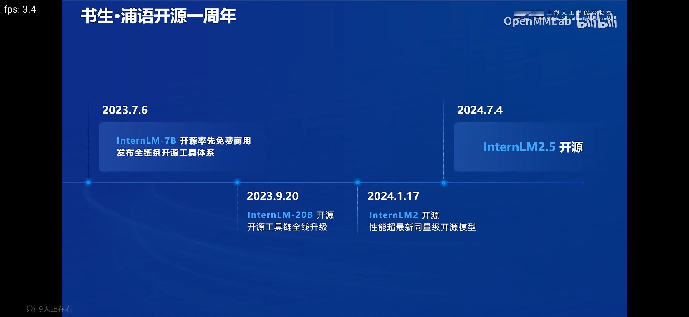

InternLM 系列的模型性能不仅比同等大小的其他开源模型更强，并且在一些能力方面肩比闭源模型。

# 书生·浦语2.5

InternLM2.5 模型的推理能力相比 InternLM2 提升 20%，并且支持了100万字的上下文，相比之下 GPT4O 也仅仅 128K 的上下文长度。并且还具备了自主规划能力，能够完成复杂任务。

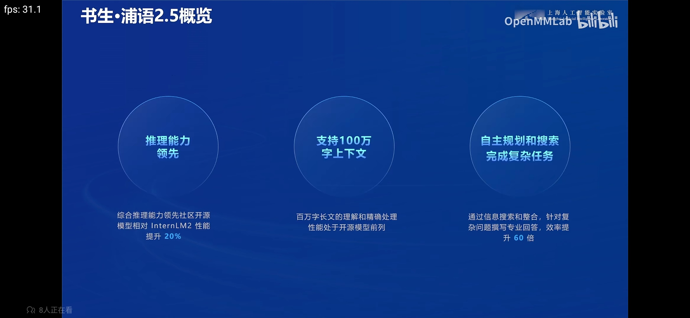

## 核心技术思路

核心方式时使用模型参与自身迭代，提升自己的能力。通过当前的模型进行数据过滤和评估预训练数据，并通过指令生成对齐数据，生成更好的训练数据，来训练出更好的模型。

核心是创造出更好的数据。

合成高质量的数据包含以下方式：

- 基于规则的数据构造，通过添加代码、公式、函数和数学题解等数据，提高数据质量
- 基于模型的数据扩充，使用模型生成新的数据
- 基于反馈的数据生成，使用模型生成多条数据，并根据模型的响应选择高质量的数据

## 模型性能

### 推理能力强

推理能力相比上一代大幅提升，并领先同量级的开源模型

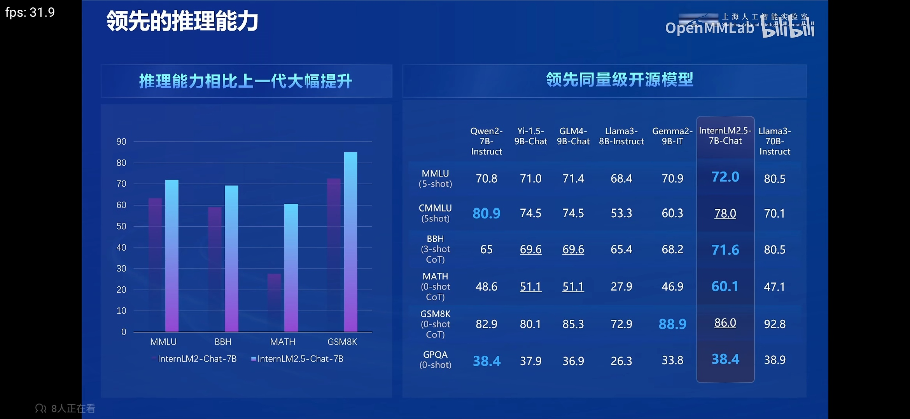

### 支持100万 Token 上下文

支持100万 Token 上下文，在大海捞针测试中展现出强大的性能。

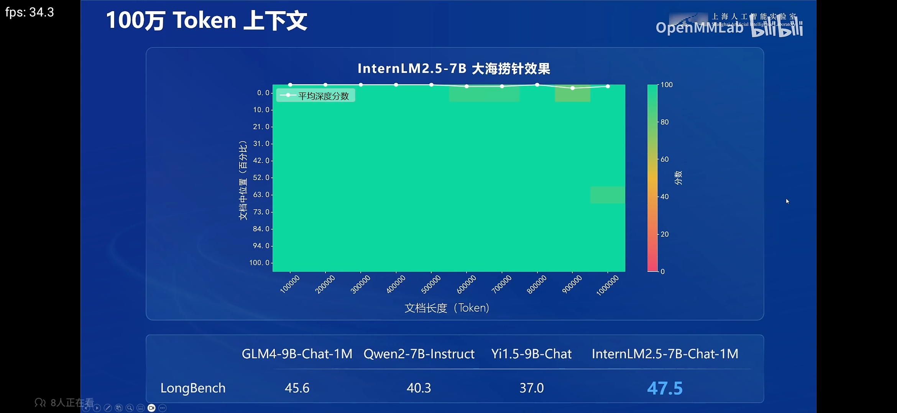

### 能够规划和搜索解决复杂问题

InternLM2.5 能够理解用户的需求，分析用户的问题，将问题进行拆解，使用搜索引擎得到各部分的结果，筛选精读进行内容整合，得到准确的结果。

# 书生·浦语开源模型体系

书生·浦语系列模型包含语言模型、多模态模型，垂直领域模型等。

语言模型有 1.8B 大小的模型，适合开发者学习上手。7B 大小的模型可以提供轻量级的研究和应用。20B 大小的模型可以支持复杂的应用场景。102B 大小的模型可以匹配 GPT4。

InternLM-XComposer 模型可以实现图文理解。InternLM-Math、InternLM-WQX 等模型在垂直领域也有很好的表现。

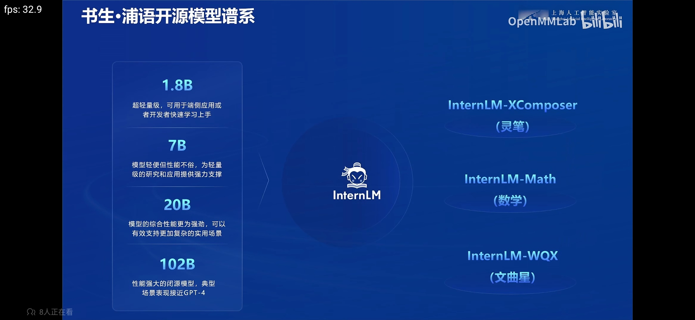

# 全链路开源

从书生·万卷预训练多模态语料库，到 InternEvo、XTuner 的预训练和微调框架，再到 LMDeploy 部署和 OpenCompass 开源评测体系等。书生·浦语开源项目实现了大模型全链路开发体系。

并且能够和现有社区完美融合，如 HuggingFace、vLLM、LLaMA.cpp 等。

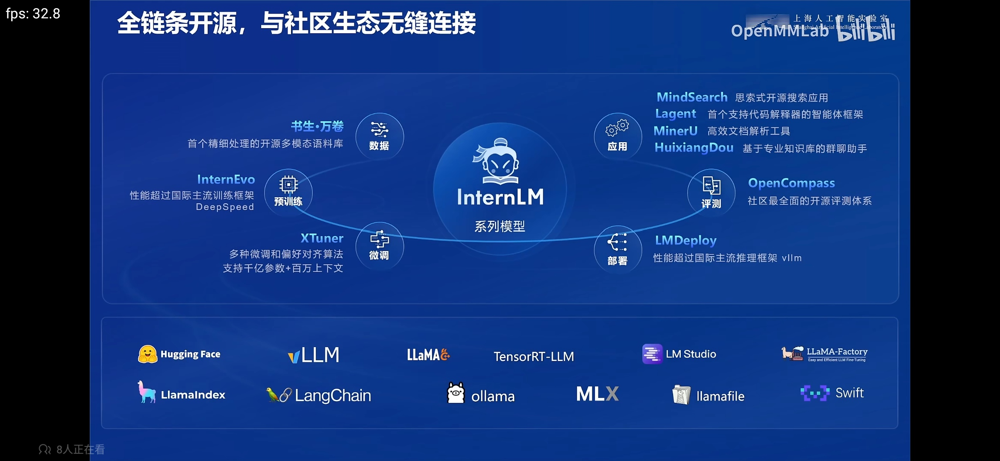

## 开源数据

openxlab 上拥有30多种模态的数据，7700多个数据集，总数据大小达到180TB，包含了数十亿张图片，万亿Token等数据集。

openxlab 还支持灵活的数据检索，帮助开发者更容易找到需要的数据。并且提供高速下载。

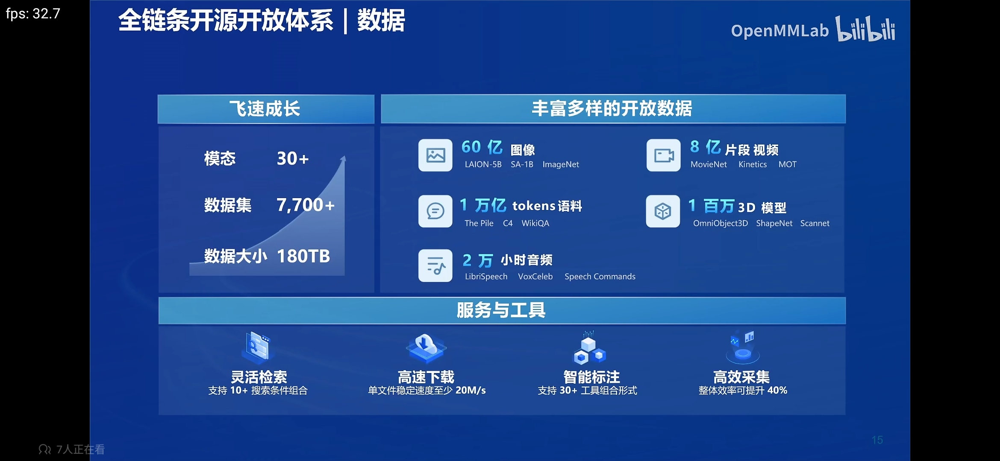

## 开源数据处理工具箱

书生·浦语开源了多种数据标注工具。比如能够高质量提取pdf数据的 Miner U，可以智能标注对话数据的 Label LLM，以及标注图片数据的 Label U。

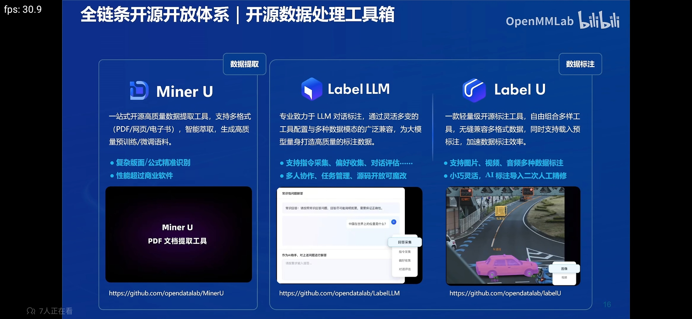

## InternEvo

InternEvo 是一个大模型预训练框架。可以支持千卡规模的训练，支持 4D并行，可以提供极致的性能优化，提高硬件的利用率。软件生态兼容  HuggingFace，方便训练其他模型。硬件方面支持 Nvidia 和 910B 等集群。支持预训练、微调和RLHF模型训练。

InternEvo 结构如下：

- 基础设施
  - 支持多种硬件，如 CPU、GPU、NPU等
  - 支持分布式存储
  - 网络
- 训练支撑系统
  - 支持训练异常恢复
  - 训练可视化
  - 支持 k8s/slurm 跨集群调度
  - 完善的日志、监控和告警系统
- 分布式训练系统
  - 支持数据并行、流水线并行、张量并行、序列并行、权重并行、自动并行
  - 提供仿真器求解最优并行配置
  - 通过优化
  - 显存优化
  - 支持高性能加速库
- 模型训练
  - 支持多种开源模型
  - 支持多种数据格式

## XTuner

XTuner 是一个高效的微调框架。

支持多种模型，如 InternLM、Llama、Gemma等。

支持多种微调方式，如增量预训练、指令微调、多模态微调等。

数据格式支持 Alpaca、Moss、OpenAI等，可以使用丰富的开源数据集。

支持 Flash Attention、Deepspeed 等加速库，加快模型微调，自动优化，无需开发者适配。

支持 LoRA、QLoRA 等微调方法。

训练方案覆盖 Nvidia 20 系以上所有显卡。

最低只需要 8GB 显存即可微调 7B 模型。

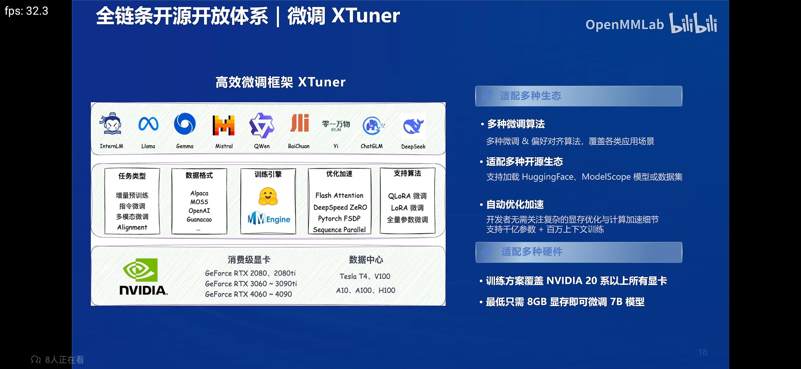

经过大量优化之后，XTuner可以使用更少的硬件微调大模型。对 Dense 和 MoE 模型都有大量优化，支持超大模型和超长序列的数据微调。并且对 MoE 模型的训练进行通信优化。

支持零显存浪费的偏好对齐训练方案，可以减少显存良妃，加速模型训练。

## OpenCompass

OpenCompass 评测广泛应用于头部大模型企业和科研机构。是大模型评测国标的主要参与单位。还是唯一获得 Meta 官方推荐的国产大模型评测体系。

还是开源社区最完善的评测体系之一 ，超过100+ 评测集和 50万+ 题目。

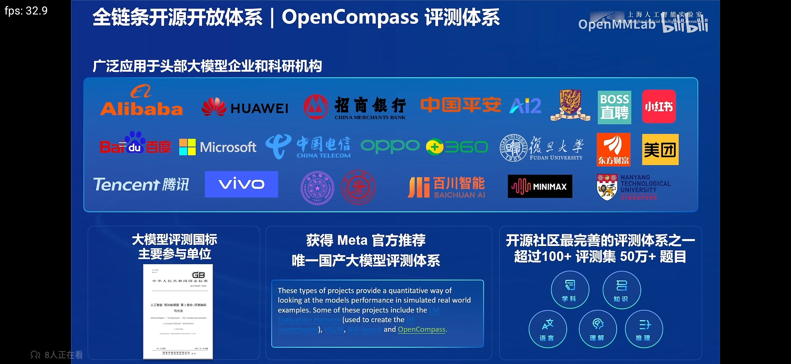

OpenCompass 汇聚了社区力量，将工具、基准、榜单三位一体结合起来。及时根据社区的需求提供高时效的高质量评测数据集，每个月还会发挥权威性能榜单，并对 CompassKit 工具箱继续优化，支撑高效评测。

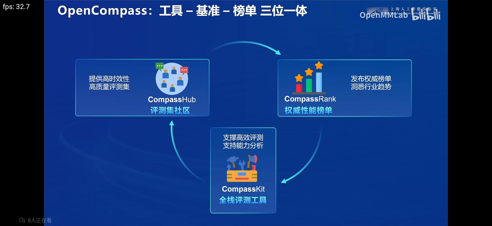

OpenCompass 致力于构建科学、领先、公平的大模型评测体系，携手行业助力通用人工智能发展。

支持开源评测榜单和闭源评测榜单，还支持社区评测和垂直领域评测。

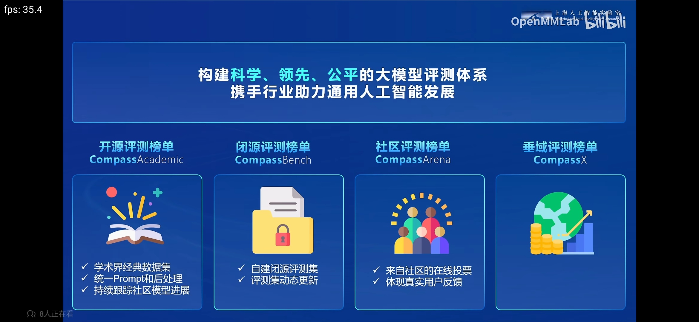

## LMDeploy

LMDeploy 是一个大模型推理加速引擎。

可以提供高效的推理和可靠的量化。支持多种 LLMs 和 VLMs。

支持 Python 推理接口、RESTful接口和 gRPC 接口。

量化方面支持 权重量化和 K/V Cache 量化。

推理引擎支持 TurboMind 和 Pytorch 。

提供了类似 OpenAI、Gradio 和 Triton 推理服务。

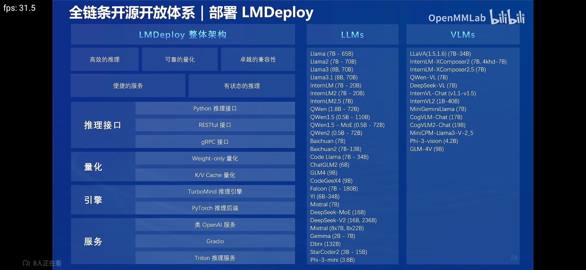

LMDeploy 推理性能领先于 vLLM。

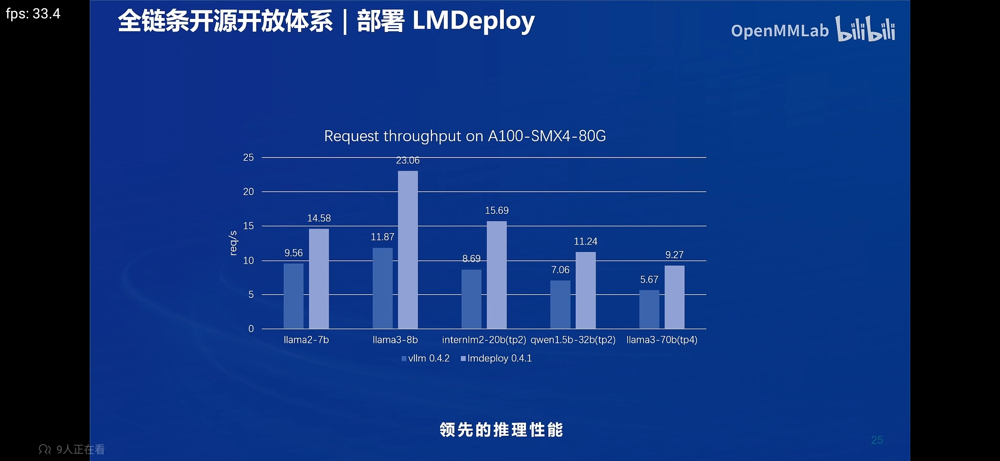

## Lagent

大模型本身有以下局限性，比如无法获取最新的信息和知识、回复不可靠、无法使用工具等。因此需要使用工具增强模型的性能。

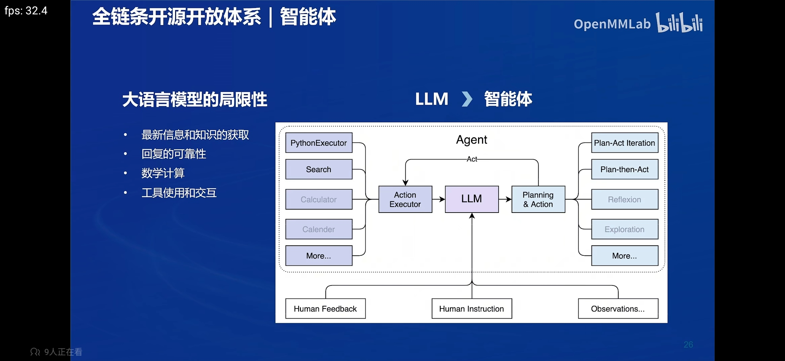

Lagent 是一个轻量级的智能体框架，支持 ReAct、ReWoo、AutoGPT 等 Agent 框架。支持多种大模型。具备杜仲能力，如文生图、搜索，计算器等。

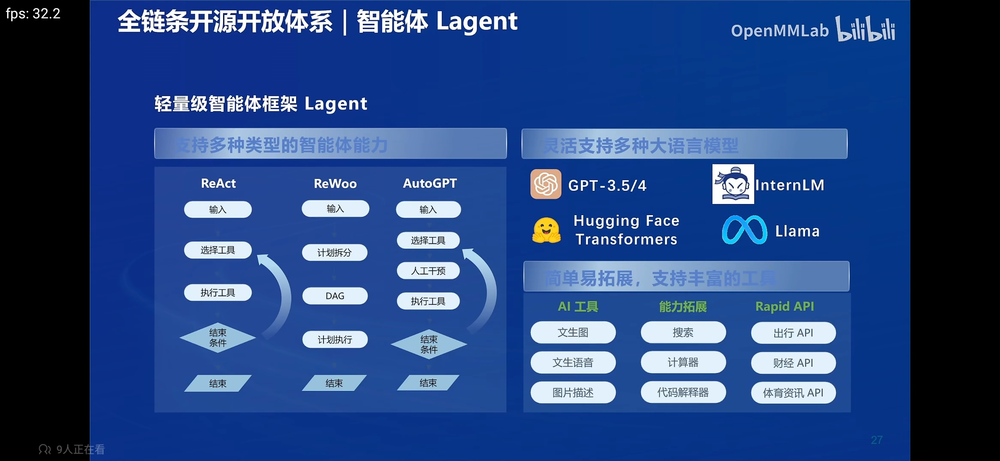

Lagent 可以使用代码解数学题，并且可以理解图片并生成语音。

## MindSearch

MindSearch 依靠其独特的路径建模方式在 agent 层面上进行并发，可以宽四相关网页，给出最终的答案。而且，与其他 AI 搜索引擎不同的是，MindSearch 完全对外展示了问题解决过程中的 AI 的思考过程和搜索中间结果，用户可以根据自己的需要查看每一次的搜索过程和模型阅读的网页，增加了对整个内容的可解释性和可信度。

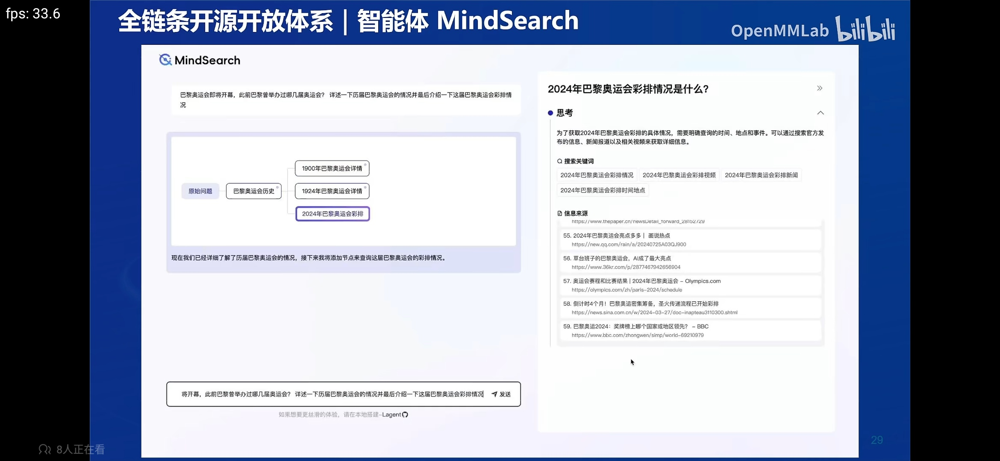

## HuixiangDou

HuixiangDou 是一个基于 RAG 的群聊 LLM 知识助手，可以应用于即时通讯群聊场景。

使用 RAG 检索获取准确的回应。

它可以实现无关问题不回复，回答时直接明确，不违背核心价值观。

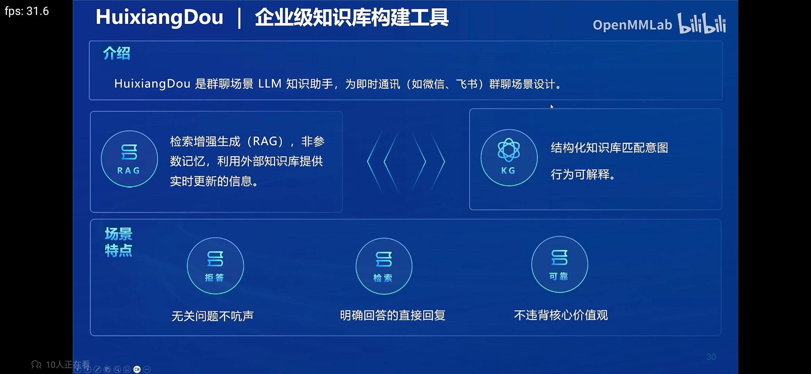

HuixiangDou 有如下特性：

- 开源免费商用
- 能力经过验证
- 支持多种文档格式
- 隐私安全，支持私有化部署，数据不上传
- 简单便宜，最低只需要 2GB 显存
- 扩展性强，支持多种通讯软件和多种 LLM

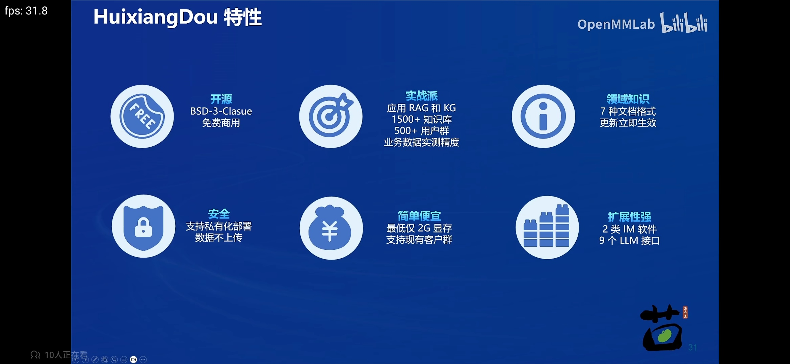

