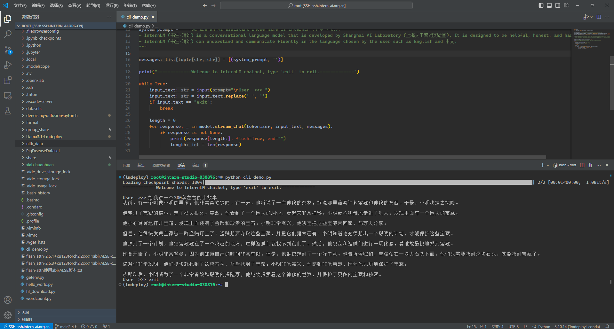
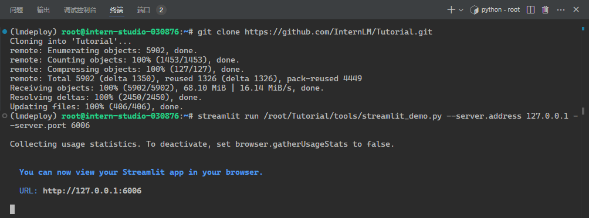
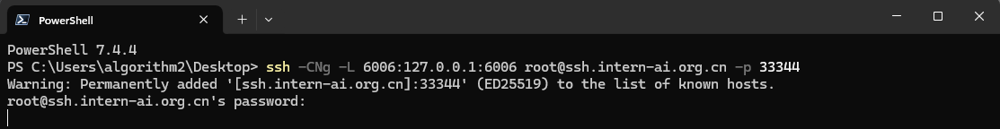
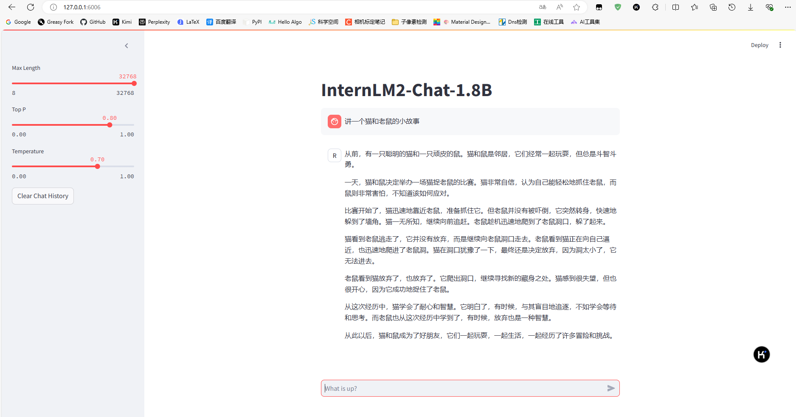
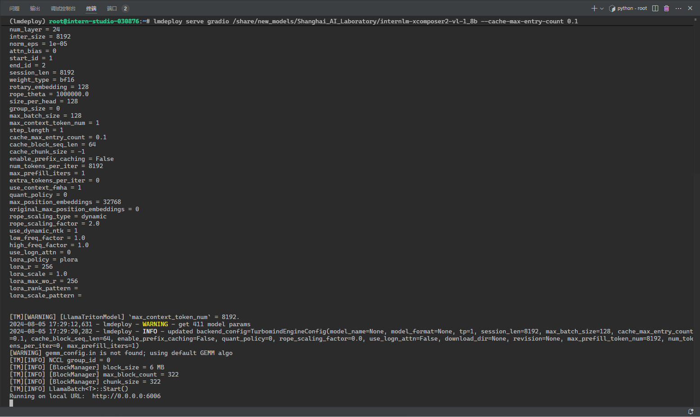
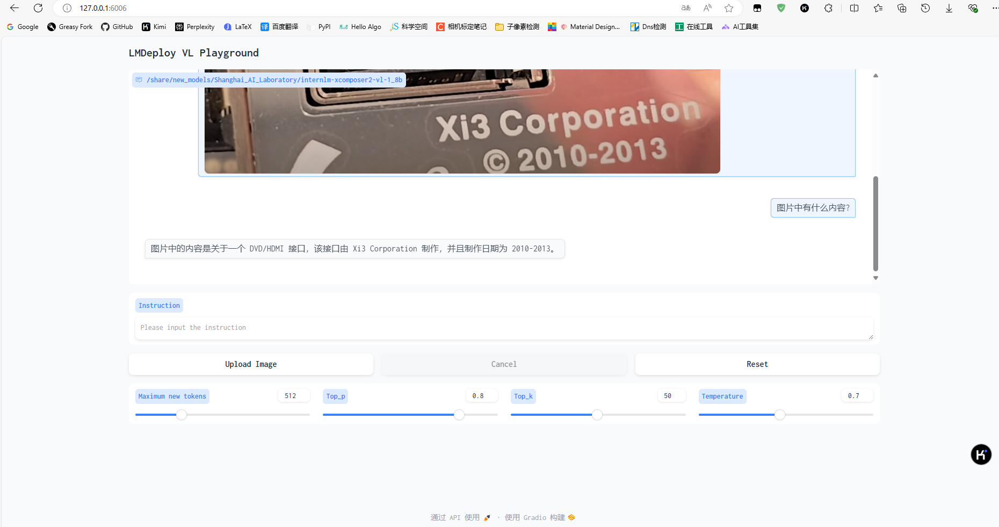
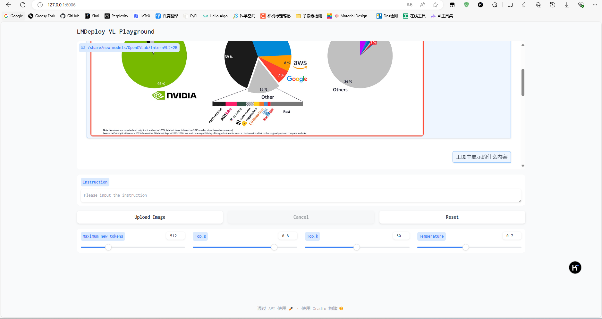
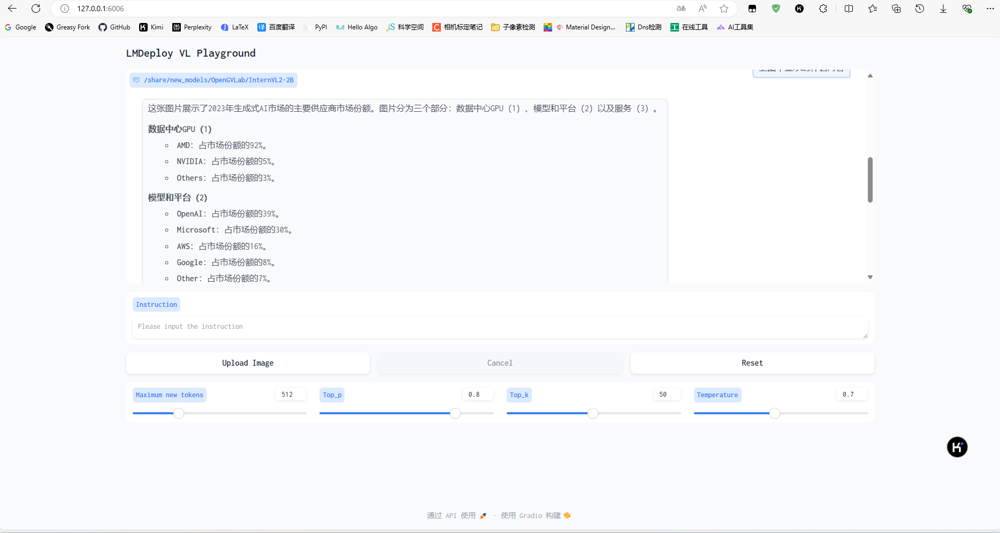

# Cli Demo 部署 InternLM2-Chat-1.8B 模型

使用 Cli Demo 完成 InternLM2-Chat-1.8B 模型的部署，并生成 300 字小故事，记录复现过程并截图。

1. 创建 `cli_demo.py`

```python
import torch
from transformers import AutoTokenizer, AutoModelForCausalLM


model_name_or_path = "/root/share/new_models/Shanghai_AI_Laboratory/internlm2-chat-1_8b"

tokenizer = AutoTokenizer.from_pretrained(model_name_or_path, trust_remote_code=True, device_map='cuda:0')
model = AutoModelForCausalLM.from_pretrained(model_name_or_path, trust_remote_code=True, torch_dtype=torch.bfloat16, device_map='cuda:0')
model = model.eval()

system_prompt = """You are an AI assistant whose name is InternLM (书生·浦语).
- InternLM (书生·浦语) is a conversational language model that is developed by Shanghai AI Laboratory (上海人工智能实验室). It is designed to be helpful, honest, and harmless.
- InternLM (书生·浦语) can understand and communicate fluently in the language chosen by the user such as English and 中文.
"""

messages = [(system_prompt, '')]

print("=============Welcome to InternLM chatbot, type 'exit' to exit.=============")

while True:
    input_text = input("\nUser  >>> ")
    input_text = input_text.replace(' ', '')
    if input_text == "exit":
        break

    length = 0
    for response, _ in model.stream_chat(tokenizer, input_text, messages):
        if response is not None:
            print(response[length:], flush=True, end="")
            length = len(response)
```

2. 终端运行命令

```sh
(lmdeploy) root@intern-studio-030876:~# python cli_demo.py 
Loading checkpoint shards: 100%|████████████████████████████████████████████████████████████████████████████████████████████████████████████████████████████████| 2/2 [00:01<00:00,  1.08it/s]
=============Welcome to InternLM chatbot, type 'exit' to exit.=============

User  >>> 给我讲一个300字左右的小故事
从前，有一个叫做小明的男孩，他非常喜欢探险。有一天，他听说了一座神秘的森林，据说那里藏着许多宝藏和神秘的东西。于是，小明决定去探险。

他穿过了茂密的森林，走了很久很久。突然，他看到了一个巨大的洞穴，看起来非常神秘。小明毫不犹豫地走进了洞穴，发现里面有一个巨大的宝藏。

他小心翼翼地打开宝箱，发现里面装满了金币和珍贵的宝石。小明非常高兴，他决定把这些宝藏带回家，与家人分享。

但是，他很快发现宝藏被一群盗贼盯上了。盗贼想要夺取这些宝藏，并把它们据为己有。小明知道他必须想出一个聪明的计划，才能保护这些宝藏。

他想到了一个计划，他把宝藏藏在了一个秘密的地方，这样盗贼们就找不到它们了。然后，他决定和盗贼们进行一场比赛，看谁能最快地找到宝藏。

比赛开始了，小明非常紧张，因为他知道自己的时间非常有限。但是，他很快想到了一个好主意。他告诉盗贼们，宝藏藏在一块大石头下面，他们只需要找到这块石头，就能找到宝藏了。

盗贼们非常聪明，他们很快就找到了这块石头，然后找到了宝藏。小明非常高兴，他感到非常自豪，因为他成功地保护了宝藏。

从那以后，小明成为了一个非常勇敢和聪明的探险家，他继续探索着这个神秘的世界，并保护了更多的宝藏和秘密。
User  >>> exit
(lmdeploy) root@intern-studio-030876:~# 
```



# Streamlit Web Demo 部署 InternLM2-Chat-1.8B 模型

1. clone 仓库

```sh
git clone https://github.com/InternLM/Tutorial.git
```

2. 启动一个 Streamlit 服务

```sh
streamlit run /root/Tutorial/tools/streamlit_demo.py --server.address 127.0.0.1 --server.port 6006
```



3. 端口映射到本地

```
ssh -CNg -L 6006:127.0.0.1:6006 root@ssh.intern-ai.org.cn -p 33344
```



4. 通过浏览器访问 `http://localhost:6006` 来启动 Demo



#  LMDeploy 部署 InternLM-XComposer2-VL-1.8B 模型

1. 使用命令部署模型

```sh
lmdeploy serve gradio /share/new_models/Shanghai_AI_Laboratory/internlm-xcomposer2-vl-1_8b --cache-max-entry-count 0.1
```



2. 端口映射到本地

```sh
ssh -CNg -L 6006:127.0.0.1:6006 root@ssh.intern-ai.org.cn -p 33344
```


3. 通过浏览器访问 `http://localhost:6006` 来启动 Demo



# LMDeploy 部署 InternVL2-2B 模型

1. 使用命令部署模型

```sh
lmdeploy serve gradio /share/new_models/OpenGVLab/InternVL2-2B --cache-max-entry-count 0.1
```


2. 端口映射到本地

```sh
ssh -CNg -L 6006:127.0.0.1:6006 root@ssh.intern-ai.org.cn -p 33344
```


3. 通过浏览器访问 `http://localhost:6006` 来启动 Demo




