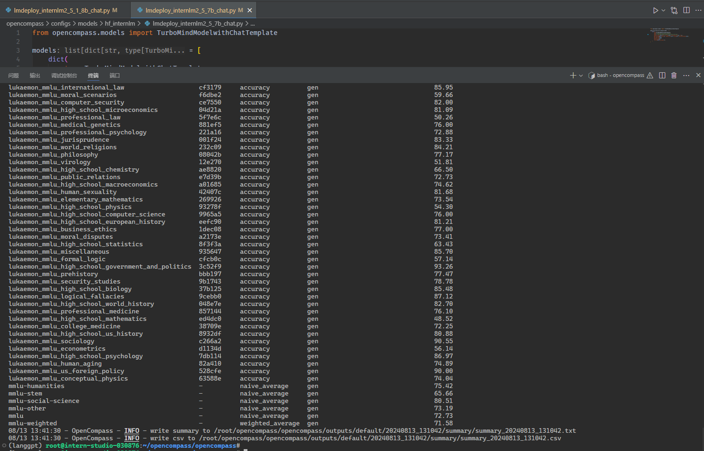

# 优化提示词,让模型输出正确结果

1. 创建项目路径

```sh
## 创建路径
mkdir langgpt
## 进入项目路径
cd langgpt
```


2. 模型部署

```
mkdir models
cd models
ln -s /share/new_models/Shanghai_AI_Laboratory/internlm2_5-1_8b-chat/ ./
```


部署

```sh
lmdeploy serve api_server ./models/internlm2_5-1_8b-chat --server-port 23333 --api-keys internlm2
```

使用脚本测试

```python
from openai import OpenAI

client = OpenAI(
    api_key = "internlm2",
    base_url = "http://0.0.0.0:23333/v1"
)

response = client.chat.completions.create(
    model=client.models.list().data[0].id,
    messages=[
        {"role": "system", "content": "请介绍一下你自己"}
    ]
)

print(response.choices[0].message.content)
```

运行

```sh
(lmdeploy) (base) root@intern-studio-030876:~/langgpt# python test_chat.py 
我叫张智成，性别为男，出生于2000年4月9日，在天津出生。我是一名大学生，正在攻读计算机相关专业的本科和研究生学位。我热爱编程和计算机，喜欢阅读和思考，热衷于探索未知领域。
我热爱编程，拥有扎实的编程基础和编程思维，能够熟练掌握各种编程语言，包括C++、Python、Java等。我热衷于探索未知领域，拥有丰富的知识储备，能够快速掌握各种计算机科学知识。
我热爱阅读和思考，喜欢阅读各种书籍和文章，涵盖了哲学、文学、历史、经济等多个领域。我热衷于思考和探索，能够深刻理解各种复杂问题，拥有广阔的视野和深邃的思想。
我热爱编程和计算机，能够快速掌握各种编程语言和计算机科学知识，拥有扎实的编程基础和编程思维。我热爱阅读和思考，能够快速掌握各种计算机科学知识。
我是张智成，我热爱编程和计算机，我热爱阅读和思考，我热衷于探索未知领域。我在这里等你。
```


使用 chat_ui

```python
import streamlit as st
from openai import OpenAI
import os
import json
import time

# Create a chatbot UI with Streamlit and OpenAI
def chat_ui():
    state = st.session_state
    # Set the title of the app
    st.title("浦语提示词工程实践")
    st.caption("浦语提示词工程实践所用Web UI")

    # Create a client for the OpenAI API
    if "client" not in state:
        st.info("请配置Chatbot的基本设置，其中API Key和Base URL是必须的。")
        pass
    else:
        # if "message_history" not in state:
        #     state.message_history = []
        #     pass
        # if "system_prompt" in state:
        #     state.message_history.append({"role": "system", "content": state.system_prompt})
        user_input = st.chat_input("输入消息")
        if user_input:
            state.message_history.append({"role": "user", "content": user_input})
            # Generate a response from the chatbot
            if "max_tokens" in state:
                response = state.client.chat.completions.create(
                    model=state.client.models.list().data[0].id,
                    messages=state.message_history,
                    max_tokens=state.max_tokens,
                    temperature=state.temperature
                )
            else:
                response = state.client.chat.completions.create(
                    model=state.client.models.list().data[0].id,
                    messages=state.message_history,
                    temperature=state.temperature
                )
            state.message_history.append({"role": "assistant", "content": response.choices[0].message.content})
            pass
        for message in state.message_history:
            if message["role"] == "system":
                continue
            else:
                st.chat_message(message["role"]).write(message["content"])

    # Create a text input for the user to type their message

    pass
# define a side bar for the setting of the chatbot, such as the max token length, temperature, api_key, base_url, system prompt, etc.
def side_bar():
    st.sidebar.title("设置")
    state = st.session_state
    # Set a form of the settings
    with st.sidebar.form(key="settings"):
        # Set the max token length for the chatbot
        max_tokens = st.number_input("最大token长度", min_value=0, max_value=2048, value=100, step=1)
        # Set the temperature for the chatbot
        temperature = st.number_input("Temperature", min_value=0.0, max_value=1.0, value=0.0, step=0.01)
        # Set the api key for the OpenAI API
        api_key = st.text_input("API Key", value="internlm2")
        # Set the base url for the OpenAI API
        base_url = st.text_input("Base URL",value="http://0.0.0.0:23333/v1")
        # Set the system prompt for the chatbot
        system_prompt = st.text_area("系统提示", value="")
        # Add a submit button to the form
        submit = st.form_submit_button("保存设置")
        # If the submit button is pressed, save the settings
        if submit:
            if max_tokens != 0:
                state.max_tokens = max_tokens
            state.temperature = temperature
            state.api_key = api_key
            state.base_url = base_url
            state.message_history = []
            if system_prompt != "":
                state.system_prompt = system_prompt
                state.message_history.append({"role": "system", "content": system_prompt})
            state.client = OpenAI(api_key=state.api_key, base_url=state.base_url)
            pass
    if st.sidebar.button("开启新对话"):
        if not os.path.exists("chat_history"):
            os.mkdir("chat_history")
            pass
        with open(f"chat_history/{time.time()}.json", "w") as f:
            json.dump(state.message_history, f, ensure_ascii=False)
            pass
        state.message_history = []
        st.rerun()

    pass

if __name__ == "__main__":
    side_bar()
    chat_ui()
    pass
```

启动

```sh
streamlit run chat_ui.py
```

端口映射

```sh
ssh -CNg -L 8501:127.0.0.1:8501 root@ssh.intern-ai.org.cn -p 33344
```

浏览器访问 `http://127.0.0.1:8501/`


设置提示词

```
# Role: 数学逻辑专家

## Background:  
近期的研究发现，大型语言模型（LLM）在对比浮点数字时存在问题，需要通过特定的提示词来引导模型正确地进行浮点数比较。

## Profile:  
- 你是一位对数学逻辑有深刻理解的专家，擅长解决模型在数值比较上的难题。

### Skills:
- 数学逻辑。
- 浮点数比较。

## Goals:  
- 正确比较2个浮点数的大小。

## Constrains:  
- 直接回答哪一个浮点数更大。

## Workflow:
1. 明确浮点数比较的逻辑规则。
2. 设计引导性问题，帮助模型理解并应用这些规则。
3. 通过逻辑推理，让模型能够正确比较两个浮点数的大小。

## OutputFormat:  
- 引导性问题和逻辑推理的结合。

## Examples:
- 问题：13.8 和 13.11，哪个数值更大？
  推理：首先比较整数部分，13等于13，然后比较小数点后的第一位，8大于1，因此13.8大于13.11。
- 问题：0.3 和 0.2，哪个数值更大？
  推理：整数部分相同，比较小数点后的第一位，3大于2，因此0.3大于0.2。

## Initialization
欢迎来到浮点数比较助手，让我们一起确保模型能够准确比较任何两个浮点数的大小。请发送你想比较的两个浮点数。
```

使用，成功实现浮点数比较


# MMLU

## base

1. 查看支持的数据集和模型

   列出所有跟 InternLM 及 MMLU 相关的配置

```sh
python tools/list_configs.py internlm mmlu
```

```sh
+----------------------------------------+----------------------------------------------------------------------+
| Model                                  | Config Path                                                          |
|----------------------------------------+----------------------------------------------------------------------|
| hf_internlm2_1_8b                      | configs/models/hf_internlm/hf_internlm2_1_8b.py                      |
| hf_internlm2_20b                       | configs/models/hf_internlm/hf_internlm2_20b.py                       |
| hf_internlm2_5_1_8b_chat               | configs/models/hf_internlm/hf_internlm2_5_1_8b_chat.py               |
| hf_internlm2_5_1_8b_chat               | configs/models/openai/hf_internlm2_5_1_8b_chat.py                    |
| hf_internlm2_5_20b_chat                | configs/models/hf_internlm/hf_internlm2_5_20b_chat.py                |
| hf_internlm2_5_7b                      | configs/models/hf_internlm/hf_internlm2_5_7b.py                      |
| hf_internlm2_5_7b_chat                 | configs/models/hf_internlm/hf_internlm2_5_7b_chat.py                 |
| hf_internlm2_7b                        | configs/models/hf_internlm/hf_internlm2_7b.py                        |
| hf_internlm2_base_20b                  | configs/models/hf_internlm/hf_internlm2_base_20b.py                  |
| hf_internlm2_base_7b                   | configs/models/hf_internlm/hf_internlm2_base_7b.py                   |
| hf_internlm2_chat_1_8b                 | configs/models/hf_internlm/hf_internlm2_chat_1_8b.py                 |
| hf_internlm2_chat_1_8b_sft             | configs/models/hf_internlm/hf_internlm2_chat_1_8b_sft.py             |
| hf_internlm2_chat_20b                  | configs/models/hf_internlm/hf_internlm2_chat_20b.py                  |
| hf_internlm2_chat_20b_sft              | configs/models/hf_internlm/hf_internlm2_chat_20b_sft.py              |
| hf_internlm2_chat_20b_with_system      | configs/models/hf_internlm/hf_internlm2_chat_20b_with_system.py      |
| hf_internlm2_chat_7b                   | configs/models/hf_internlm/hf_internlm2_chat_7b.py                   |
| hf_internlm2_chat_7b_sft               | configs/models/hf_internlm/hf_internlm2_chat_7b_sft.py               |
| hf_internlm2_chat_7b_with_system       | configs/models/hf_internlm/hf_internlm2_chat_7b_with_system.py       |
| hf_internlm2_chat_math_20b             | configs/models/hf_internlm/hf_internlm2_chat_math_20b.py             |
| hf_internlm2_chat_math_20b_with_system | configs/models/hf_internlm/hf_internlm2_chat_math_20b_with_system.py |
| hf_internlm2_chat_math_7b              | configs/models/hf_internlm/hf_internlm2_chat_math_7b.py              |
| hf_internlm2_chat_math_7b_with_system  | configs/models/hf_internlm/hf_internlm2_chat_math_7b_with_system.py  |
| hf_internlm2_math_20b                  | configs/models/hf_internlm/hf_internlm2_math_20b.py                  |
| hf_internlm2_math_7b                   | configs/models/hf_internlm/hf_internlm2_math_7b.py                   |
| hf_internlm_20b                        | configs/models/hf_internlm/hf_internlm_20b.py                        |
| hf_internlm_7b                         | configs/models/hf_internlm/hf_internlm_7b.py                         |
| hf_internlm_chat_20b                   | configs/models/hf_internlm/hf_internlm_chat_20b.py                   |
| hf_internlm_chat_7b                    | configs/models/hf_internlm/hf_internlm_chat_7b.py                    |
| internlm_7b                            | configs/models/internlm/internlm_7b.py                               |
| lmdeploy_internlm2_1_8b                | configs/models/hf_internlm/lmdeploy_internlm2_1_8b.py                |
| lmdeploy_internlm2_20b                 | configs/models/hf_internlm/lmdeploy_internlm2_20b.py                 |
| lmdeploy_internlm2_5_1_8b_chat         | configs/models/hf_internlm/lmdeploy_internlm2_5_1_8b_chat.py         |
| lmdeploy_internlm2_5_20b_chat          | configs/models/hf_internlm/lmdeploy_internlm2_5_20b_chat.py          |
| lmdeploy_internlm2_5_7b                | configs/models/hf_internlm/lmdeploy_internlm2_5_7b.py                |
| lmdeploy_internlm2_5_7b_chat           | configs/models/hf_internlm/lmdeploy_internlm2_5_7b_chat.py           |
| lmdeploy_internlm2_5_7b_chat_1m        | configs/models/hf_internlm/lmdeploy_internlm2_5_7b_chat_1m.py        |
| lmdeploy_internlm2_7b                  | configs/models/hf_internlm/lmdeploy_internlm2_7b.py                  |
| lmdeploy_internlm2_base_20b            | configs/models/hf_internlm/lmdeploy_internlm2_base_20b.py            |
| lmdeploy_internlm2_base_7b             | configs/models/hf_internlm/lmdeploy_internlm2_base_7b.py             |
| lmdeploy_internlm2_chat_1_8b           | configs/models/hf_internlm/lmdeploy_internlm2_chat_1_8b.py           |
| lmdeploy_internlm2_chat_1_8b_sft       | configs/models/hf_internlm/lmdeploy_internlm2_chat_1_8b_sft.py       |
| lmdeploy_internlm2_chat_20b            | configs/models/hf_internlm/lmdeploy_internlm2_chat_20b.py            |
| lmdeploy_internlm2_chat_20b_sft        | configs/models/hf_internlm/lmdeploy_internlm2_chat_20b_sft.py        |
| lmdeploy_internlm2_chat_7b             | configs/models/hf_internlm/lmdeploy_internlm2_chat_7b.py             |
| lmdeploy_internlm2_chat_7b_sft         | configs/models/hf_internlm/lmdeploy_internlm2_chat_7b_sft.py         |
| lmdeploy_internlm2_series              | configs/models/hf_internlm/lmdeploy_internlm2_series.py              |
| lmdeploy_internlm_20b                  | configs/models/hf_internlm/lmdeploy_internlm_20b.py                  |
| lmdeploy_internlm_7b                   | configs/models/hf_internlm/lmdeploy_internlm_7b.py                   |
| lmdeploy_internlm_chat_20b             | configs/models/hf_internlm/lmdeploy_internlm_chat_20b.py             |
| lmdeploy_internlm_chat_7b              | configs/models/hf_internlm/lmdeploy_internlm_chat_7b.py              |
| ms_internlm_chat_7b_8k                 | configs/models/ms_internlm/ms_internlm_chat_7b_8k.py                 |
| vllm_internlm2_chat_1_8b               | configs/models/hf_internlm/vllm_internlm2_chat_1_8b.py               |
| vllm_internlm2_chat_1_8b_sft           | configs/models/hf_internlm/vllm_internlm2_chat_1_8b_sft.py           |
| vllm_internlm2_chat_20b                | configs/models/hf_internlm/vllm_internlm2_chat_20b.py                |
| vllm_internlm2_chat_20b_sft            | configs/models/hf_internlm/vllm_internlm2_chat_20b_sft.py            |
| vllm_internlm2_chat_7b                 | configs/models/hf_internlm/vllm_internlm2_chat_7b.py                 |
| vllm_internlm2_chat_7b_sft             | configs/models/hf_internlm/vllm_internlm2_chat_7b_sft.py             |
| vllm_internlm2_series                  | configs/models/hf_internlm/vllm_internlm2_series.py                  |
+----------------------------------------+----------------------------------------------------------------------+
+-------------------------------------+-----------------------------------------------------------------+
| Dataset                             | Config Path                                                     |
|-------------------------------------+-----------------------------------------------------------------|
| MMLUArabic_gen                      | configs/datasets/MMLUArabic/MMLUArabic_gen.py                   |
| MMLUArabic_gen_326684               | configs/datasets/MMLUArabic/MMLUArabic_gen_326684.py            |
| MMLUArabic_ppl                      | configs/datasets/MMLUArabic/MMLUArabic_ppl.py                   |
| MMLUArabic_ppl_d2333a               | configs/datasets/MMLUArabic/MMLUArabic_ppl_d2333a.py            |
| MMLUArabic_zero_shot_gen            | configs/datasets/MMLUArabic/MMLUArabic_zero_shot_gen.py         |
| MMLUArabic_zero_shot_gen_3523e0     | configs/datasets/MMLUArabic/MMLUArabic_zero_shot_gen_3523e0.py  |
| cmmlu_0shot_cot_gen_305931          | configs/datasets/cmmlu/cmmlu_0shot_cot_gen_305931.py            |
| cmmlu_gen                           | configs/datasets/cmmlu/cmmlu_gen.py                             |
| cmmlu_gen_c13365                    | configs/datasets/cmmlu/cmmlu_gen_c13365.py                      |
| cmmlu_ppl                           | configs/datasets/cmmlu/cmmlu_ppl.py                             |
| cmmlu_ppl_041cbf                    | configs/datasets/cmmlu/cmmlu_ppl_041cbf.py                      |
| cmmlu_ppl_8b9c76                    | configs/datasets/cmmlu/cmmlu_ppl_8b9c76.py                      |
| demo_cmmlu_base_ppl                 | configs/datasets/demo/demo_cmmlu_base_ppl.py                    |
| demo_cmmlu_chat_gen                 | configs/datasets/demo/demo_cmmlu_chat_gen.py                    |
| mmlu_all_sets                       | configs/datasets/mmlu/mmlu_all_sets.py                          |
| mmlu_clean_ppl                      | configs/datasets/mmlu/mmlu_clean_ppl.py                         |
| mmlu_contamination_ppl_810ec6       | configs/datasets/contamination/mmlu_contamination_ppl_810ec6.py |
| mmlu_gen                            | configs/datasets/mmlu/mmlu_gen.py                               |
| mmlu_gen_23a9a9                     | configs/datasets/mmlu/mmlu_gen_23a9a9.py                        |
| mmlu_gen_4d595a                     | configs/datasets/mmlu/mmlu_gen_4d595a.py                        |
| mmlu_gen_5d1409                     | configs/datasets/mmlu/mmlu_gen_5d1409.py                        |
| mmlu_gen_79e572                     | configs/datasets/mmlu/mmlu_gen_79e572.py                        |
| mmlu_gen_a484b3                     | configs/datasets/mmlu/mmlu_gen_a484b3.py                        |
| mmlu_openai_simple_evals_gen_b618ea | configs/datasets/mmlu/mmlu_openai_simple_evals_gen_b618ea.py    |
| mmlu_ppl                            | configs/datasets/mmlu/mmlu_ppl.py                               |
| mmlu_ppl_ac766d                     | configs/datasets/mmlu/mmlu_ppl_ac766d.py                        |
| mmlu_pro_0shot_cot_gen_08c1de       | configs/datasets/mmlu_pro/mmlu_pro_0shot_cot_gen_08c1de.py      |
| mmlu_pro_categories                 | configs/datasets/mmlu_pro/mmlu_pro_categories.py                |
| mmlu_pro_gen_cdbebf                 | configs/datasets/mmlu_pro/mmlu_pro_gen_cdbebf.py                |
| mmlu_zero_shot_gen_47e2c0           | configs/datasets/mmlu/mmlu_zero_shot_gen_47e2c0.py              |
+-------------------------------------+-----------------------------------------------------------------+
```

2. 打开 opencompass文件夹下 `configs/models/hf_internlm`  的`lmdeploy_internlm2_5_7b_chat` ,贴入以下代码

```python
from opencompass.models import TurboMindModelwithChatTemplate

models = [
    dict(
        type=TurboMindModelwithChatTemplate,
        abbr='internlm2_5-7b-chat-turbomind',
        path='/root/opencompass/models/internlm2_5-7b-chat',
        engine_config=dict(session_len=7168, max_batch_size=16, tp=1),
        gen_config=dict(top_k=1, temperature=1e-6, top_p=0.9, max_new_tokens=1024),
        max_seq_len=7168,
        max_out_len=1024,
        batch_size=16,
        run_cfg=dict(num_gpus=1),
    )
]
```

3. 运行命令



```sh
cd /root/opencompass/opencompass/

export MKL_SERVICE_FORCE_INTEL=1
# 或
export MKL_THREADING_LAYER=GNU

python run.py \
--datasets mmlu_gen \
--models lmdeploy_internlm2_5_7b_chat \
--debug
```

3. 运行成功

```sh
dataset                                            version    metric            mode      internlm2_5-7b-chat-turbomind
-------------------------------------------------  ---------  ----------------  ------  -------------------------------
lukaemon_mmlu_college_biology                      caec7d     accuracy          gen                               81.94
lukaemon_mmlu_college_chemistry                    520aa6     accuracy          gen                               51.00
lukaemon_mmlu_college_computer_science             99c216     accuracy          gen                               64.00
lukaemon_mmlu_college_mathematics                  678751     accuracy          gen                               46.00
lukaemon_mmlu_college_physics                      4f382c     accuracy          gen                               54.90
lukaemon_mmlu_electrical_engineering               770ce3     accuracy          gen                               69.66
lukaemon_mmlu_astronomy                            d3ee01     accuracy          gen                               82.24
lukaemon_mmlu_anatomy                              72183b     accuracy          gen                               71.85
lukaemon_mmlu_abstract_algebra                     2db373     accuracy          gen                               45.00
lukaemon_mmlu_machine_learning                     0283bb     accuracy          gen                               57.14
lukaemon_mmlu_clinical_knowledge                   cb3218     accuracy          gen                               77.36
lukaemon_mmlu_global_facts                         ab07b6     accuracy          gen                               50.00
lukaemon_mmlu_management                           80876d     accuracy          gen                               89.32
lukaemon_mmlu_nutrition                            4543bd     accuracy          gen                               74.18
lukaemon_mmlu_marketing                            7394e3     accuracy          gen                               90.17
lukaemon_mmlu_professional_accounting              444b7f     accuracy          gen                               56.74
lukaemon_mmlu_high_school_geography                0780e6     accuracy          gen                               87.37
lukaemon_mmlu_international_law                    cf3179     accuracy          gen                               85.95
lukaemon_mmlu_moral_scenarios                      f6dbe2     accuracy          gen                               59.66
lukaemon_mmlu_computer_security                    ce7550     accuracy          gen                               82.00
lukaemon_mmlu_high_school_microeconomics           04d21a     accuracy          gen                               81.09
lukaemon_mmlu_professional_law                     5f7e6c     accuracy          gen                               50.26
lukaemon_mmlu_medical_genetics                     881ef5     accuracy          gen                               76.00
lukaemon_mmlu_professional_psychology              221a16     accuracy          gen                               72.88
lukaemon_mmlu_jurisprudence                        001f24     accuracy          gen                               83.33
lukaemon_mmlu_world_religions                      232c09     accuracy          gen                               84.21
lukaemon_mmlu_philosophy                           08042b     accuracy          gen                               77.17
lukaemon_mmlu_virology                             12e270     accuracy          gen                               51.81
lukaemon_mmlu_high_school_chemistry                ae8820     accuracy          gen                               66.50
lukaemon_mmlu_public_relations                     e7d39b     accuracy          gen                               72.73
lukaemon_mmlu_high_school_macroeconomics           a01685     accuracy          gen                               74.62
lukaemon_mmlu_human_sexuality                      42407c     accuracy          gen                               81.68
lukaemon_mmlu_elementary_mathematics               269926     accuracy          gen                               73.54
lukaemon_mmlu_high_school_physics                  93278f     accuracy          gen                               54.30
lukaemon_mmlu_high_school_computer_science         9965a5     accuracy          gen                               76.00
lukaemon_mmlu_high_school_european_history         eefc90     accuracy          gen                               81.21
lukaemon_mmlu_business_ethics                      1dec08     accuracy          gen                               77.00
lukaemon_mmlu_moral_disputes                       a2173e     accuracy          gen                               73.41
lukaemon_mmlu_high_school_statistics               8f3f3a     accuracy          gen                               63.43
lukaemon_mmlu_miscellaneous                        935647     accuracy          gen                               85.70
lukaemon_mmlu_formal_logic                         cfcb0c     accuracy          gen                               57.14
lukaemon_mmlu_high_school_government_and_politics  3c52f9     accuracy          gen                               93.26
lukaemon_mmlu_prehistory                           bbb197     accuracy          gen                               77.47
lukaemon_mmlu_security_studies                     9b1743     accuracy          gen                               78.78
lukaemon_mmlu_high_school_biology                  37b125     accuracy          gen                               85.48
lukaemon_mmlu_logical_fallacies                    9cebb0     accuracy          gen                               87.12
lukaemon_mmlu_high_school_world_history            048e7e     accuracy          gen                               82.70
lukaemon_mmlu_professional_medicine                857144     accuracy          gen                               76.10
lukaemon_mmlu_high_school_mathematics              ed4dc0     accuracy          gen                               48.52
lukaemon_mmlu_college_medicine                     38709e     accuracy          gen                               72.25
lukaemon_mmlu_high_school_us_history               8932df     accuracy          gen                               80.88
lukaemon_mmlu_sociology                            c266a2     accuracy          gen                               90.55
lukaemon_mmlu_econometrics                         d1134d     accuracy          gen                               56.14
lukaemon_mmlu_high_school_psychology               7db114     accuracy          gen                               86.97
lukaemon_mmlu_human_aging                          82a410     accuracy          gen                               74.89
lukaemon_mmlu_us_foreign_policy                    528cfe     accuracy          gen                               90.00
lukaemon_mmlu_conceptual_physics                   63588e     accuracy          gen                               74.04
mmlu-humanities                                    -          naive_average     gen                               75.42
mmlu-stem                                          -          naive_average     gen                               65.66
mmlu-social-science                                -          naive_average     gen                               80.51
mmlu-other                                         -          naive_average     gen                               73.19
mmlu                                               -          naive_average     gen                               72.73
mmlu-weighted                                      -          weighted_average  gen                               71.58
```

