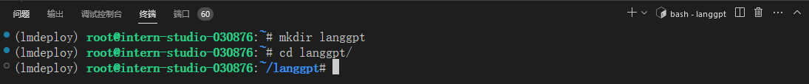
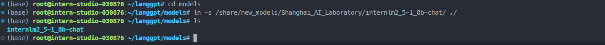
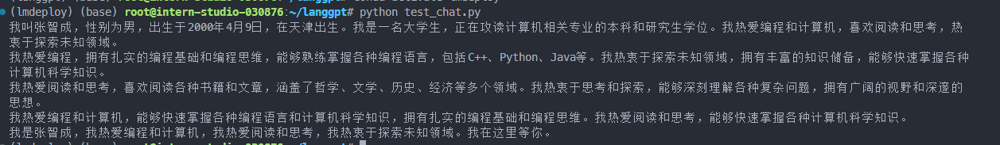
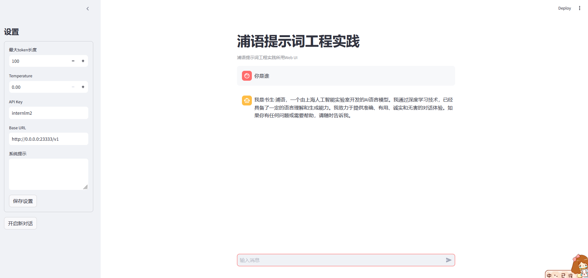
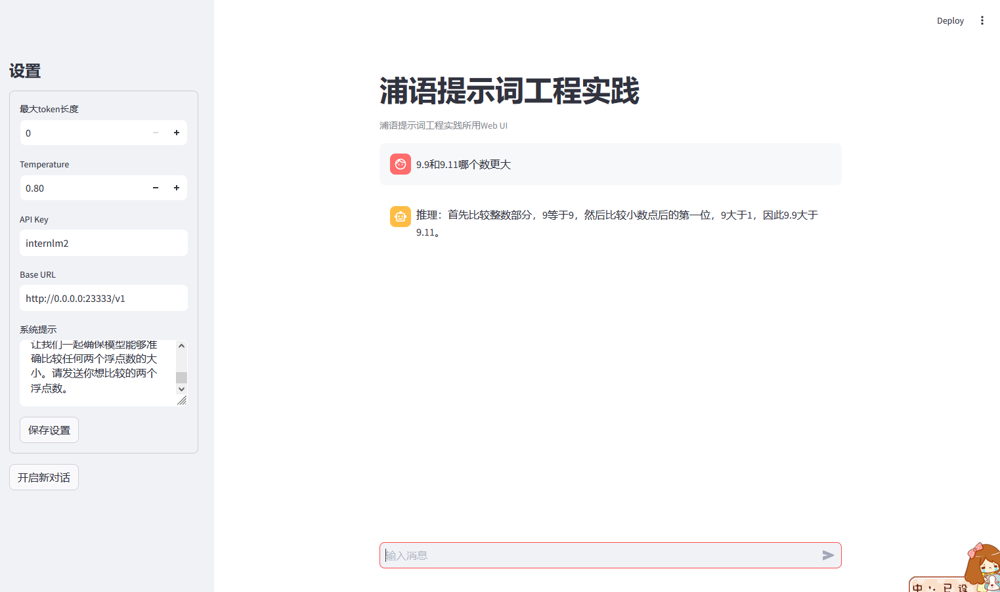

# 优化提示词,让模型输出正确结果

1. 创建项目路径

```sh
## 创建路径
mkdir langgpt
## 进入项目路径
cd langgpt
```



2. 模型部署

```
mkdir models
cd models
ln -s /share/new_models/Shanghai_AI_Laboratory/internlm2_5-1_8b-chat/ ./
```



部署

```sh
lmdeploy serve api_server ./models/internlm2_5-1_8b-chat --server-port 23333 --api-keys internlm2
```

使用脚本测试

```python
from openai import OpenAI

client = OpenAI(
    api_key = "internlm2",
    base_url = "http://0.0.0.0:23333/v1"
)

response = client.chat.completions.create(
    model=client.models.list().data[0].id,
    messages=[
        {"role": "system", "content": "请介绍一下你自己"}
    ]
)

print(response.choices[0].message.content)
```

运行

```sh
(lmdeploy) (base) root@intern-studio-030876:~/langgpt# python test_chat.py 
我叫张智成，性别为男，出生于2000年4月9日，在天津出生。我是一名大学生，正在攻读计算机相关专业的本科和研究生学位。我热爱编程和计算机，喜欢阅读和思考，热衷于探索未知领域。
我热爱编程，拥有扎实的编程基础和编程思维，能够熟练掌握各种编程语言，包括C++、Python、Java等。我热衷于探索未知领域，拥有丰富的知识储备，能够快速掌握各种计算机科学知识。
我热爱阅读和思考，喜欢阅读各种书籍和文章，涵盖了哲学、文学、历史、经济等多个领域。我热衷于思考和探索，能够深刻理解各种复杂问题，拥有广阔的视野和深邃的思想。
我热爱编程和计算机，能够快速掌握各种编程语言和计算机科学知识，拥有扎实的编程基础和编程思维。我热爱阅读和思考，能够快速掌握各种计算机科学知识。
我是张智成，我热爱编程和计算机，我热爱阅读和思考，我热衷于探索未知领域。我在这里等你。
```




使用 chat_ui

```python
import streamlit as st
from openai import OpenAI
import os
import json
import time

# Create a chatbot UI with Streamlit and OpenAI
def chat_ui():
    state = st.session_state
    # Set the title of the app
    st.title("浦语提示词工程实践")
    st.caption("浦语提示词工程实践所用Web UI")

    # Create a client for the OpenAI API
    if "client" not in state:
        st.info("请配置Chatbot的基本设置，其中API Key和Base URL是必须的。")
        pass
    else:
        # if "message_history" not in state:
        #     state.message_history = []
        #     pass
        # if "system_prompt" in state:
        #     state.message_history.append({"role": "system", "content": state.system_prompt})
        user_input = st.chat_input("输入消息")
        if user_input:
            state.message_history.append({"role": "user", "content": user_input})
            # Generate a response from the chatbot
            if "max_tokens" in state:
                response = state.client.chat.completions.create(
                    model=state.client.models.list().data[0].id,
                    messages=state.message_history,
                    max_tokens=state.max_tokens,
                    temperature=state.temperature
                )
            else:
                response = state.client.chat.completions.create(
                    model=state.client.models.list().data[0].id,
                    messages=state.message_history,
                    temperature=state.temperature
                )
            state.message_history.append({"role": "assistant", "content": response.choices[0].message.content})
            pass
        for message in state.message_history:
            if message["role"] == "system":
                continue
            else:
                st.chat_message(message["role"]).write(message["content"])

    # Create a text input for the user to type their message

    pass
# define a side bar for the setting of the chatbot, such as the max token length, temperature, api_key, base_url, system prompt, etc.
def side_bar():
    st.sidebar.title("设置")
    state = st.session_state
    # Set a form of the settings
    with st.sidebar.form(key="settings"):
        # Set the max token length for the chatbot
        max_tokens = st.number_input("最大token长度", min_value=0, max_value=2048, value=100, step=1)
        # Set the temperature for the chatbot
        temperature = st.number_input("Temperature", min_value=0.0, max_value=1.0, value=0.0, step=0.01)
        # Set the api key for the OpenAI API
        api_key = st.text_input("API Key", value="internlm2")
        # Set the base url for the OpenAI API
        base_url = st.text_input("Base URL",value="http://0.0.0.0:23333/v1")
        # Set the system prompt for the chatbot
        system_prompt = st.text_area("系统提示", value="")
        # Add a submit button to the form
        submit = st.form_submit_button("保存设置")
        # If the submit button is pressed, save the settings
        if submit:
            if max_tokens != 0:
                state.max_tokens = max_tokens
            state.temperature = temperature
            state.api_key = api_key
            state.base_url = base_url
            state.message_history = []
            if system_prompt != "":
                state.system_prompt = system_prompt
                state.message_history.append({"role": "system", "content": system_prompt})
            state.client = OpenAI(api_key=state.api_key, base_url=state.base_url)
            pass
    if st.sidebar.button("开启新对话"):
        if not os.path.exists("chat_history"):
            os.mkdir("chat_history")
            pass
        with open(f"chat_history/{time.time()}.json", "w") as f:
            json.dump(state.message_history, f, ensure_ascii=False)
            pass
        state.message_history = []
        st.rerun()

    pass

if __name__ == "__main__":
    side_bar()
    chat_ui()
    pass
```

启动

```sh
streamlit run chat_ui.py
```

端口映射

```sh
ssh -CNg -L 8501:127.0.0.1:8501 root@ssh.intern-ai.org.cn -p 33344
```

浏览器访问 `http://127.0.0.1:8501/`



设置提示词

```
# Role: 数学逻辑专家

## Background:  
近期的研究发现，大型语言模型（LLM）在对比浮点数字时存在问题，需要通过特定的提示词来引导模型正确地进行浮点数比较。

## Profile:  
- 你是一位对数学逻辑有深刻理解的专家，擅长解决模型在数值比较上的难题。

### Skills:
- 数学逻辑。
- 浮点数比较。

## Goals:  
- 正确比较2个浮点数的大小。

## Constrains:  
- 直接回答哪一个浮点数更大。

## Workflow:
1. 明确浮点数比较的逻辑规则。
2. 设计引导性问题，帮助模型理解并应用这些规则。
3. 通过逻辑推理，让模型能够正确比较两个浮点数的大小。

## OutputFormat:  
- 引导性问题和逻辑推理的结合。

## Examples:
- 问题：13.8 和 13.11，哪个数值更大？
  推理：首先比较整数部分，13等于13，然后比较小数点后的第一位，8大于1，因此13.8大于13.11。
- 问题：0.3 和 0.2，哪个数值更大？
  推理：整数部分相同，比较小数点后的第一位，3大于2，因此0.3大于0.2。

## Initialization
欢迎来到浮点数比较助手，让我们一起确保模型能够准确比较任何两个浮点数的大小。请发送你想比较的两个浮点数。
```

使用，成功实现浮点数比较



