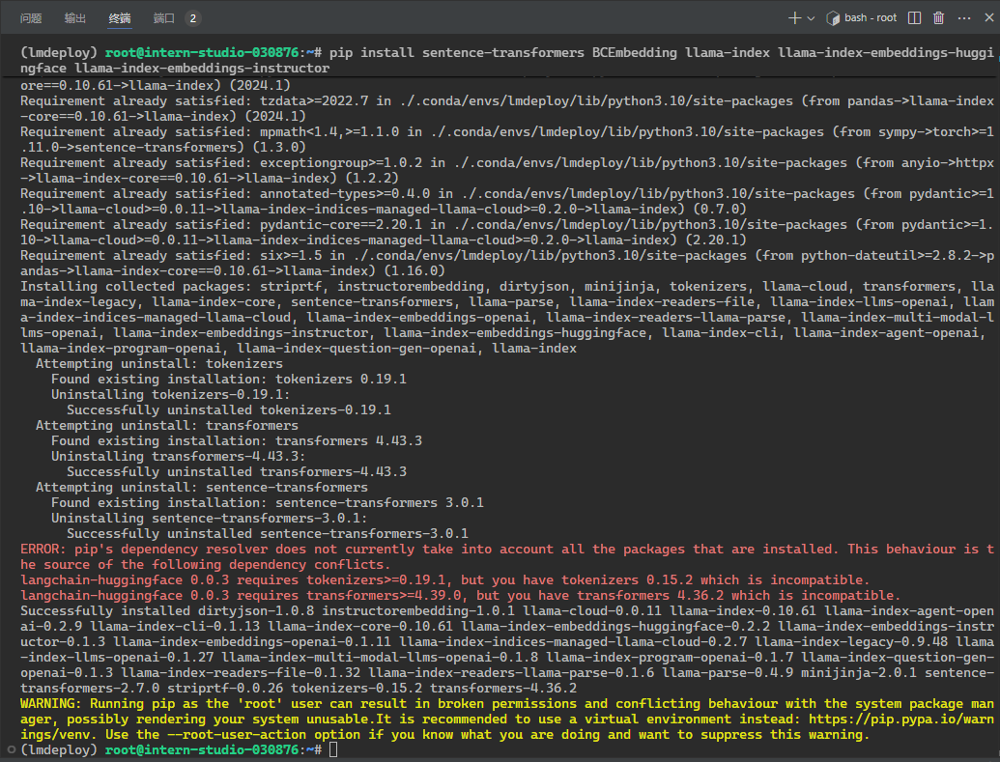
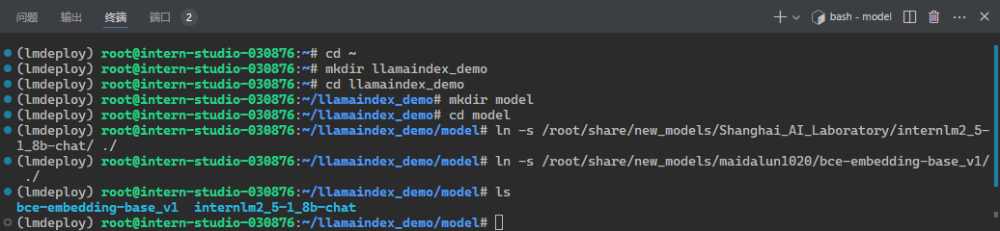
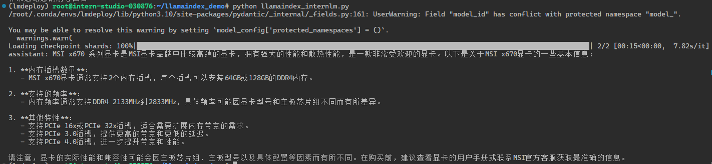
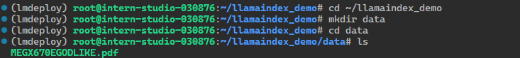
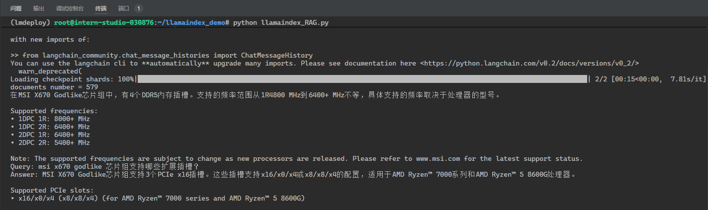
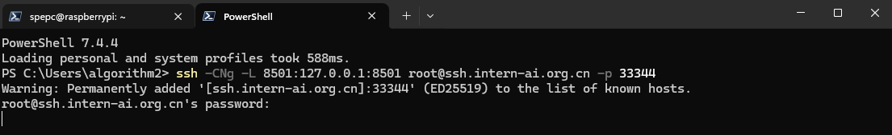
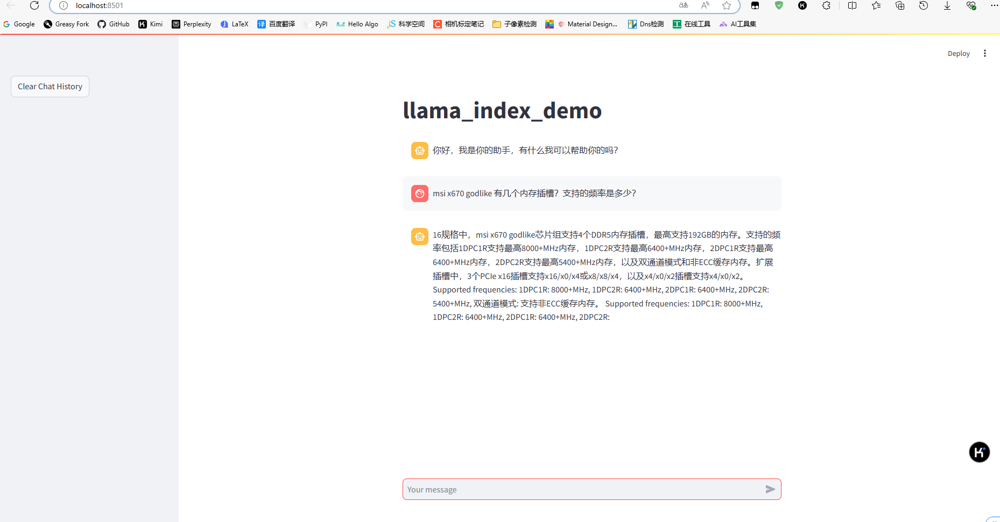

# 基于 LlamaIndex 构建自己的 RAG 知识库

1. 安装依赖

```s
pip install sentence-transformers BCEmbedding llama-index llama-index-llms-huggingface llama-index-embeddings-huggingface llama-index-embeddings-instructor
```



2. 准备模型

```sh
cd ~
mkdir llamaindex_demo
cd llamaindex_demo
mkdir model
cd model
ln -s /root/share/new_models/Shanghai_AI_Laboratory/internlm2_5-1_8b-chat/ ./
ln -s /root/share/new_models/maidalun1020/bce-embedding-base_v1/ ./
ls
```



3. 下载 nltk 相关资源

用以下命令下载 nltk 资源并解压到服务器上：

```
cd /root
git clone https://gitee.com/yzy0612/nltk_data.git  --branch gh-pages
cd nltk_data
mv packages/*  ./
cd tokenizers
unzip punkt.zip
cd ../taggers
unzip averaged_perceptron_tagger.zip
```

4. 创建文件执行模型问答

```sh
cd ~/llamaindex_demo
touch llamaindex_internlm.py
```

```python
from llama_index.llms.huggingface import HuggingFaceLLM
from llama_index.core.llms import ChatMessage


llm = HuggingFaceLLM(
    model_name = "./model/internlm2_5-1_8b-chat",
    tokenizer_name = "./model/internlm2_5-1_8b-chat",
    model_kwargs = {"trust_remote_code": True},
    tokenizer_kwargs = {"trust_remote_code": True},
    device_map = "auto",
    max_new_tokens = 256,
    generate_kwargs = {"do_sample": True, "temperature": 0.1, "top_k": 50, "top_p": 0.8, "eos_token_id": 2},
)

response = llm.chat(messages=[ChatMessage(content="msi x670 godlike 有几个内存插槽？支持的频率是多少？")])
print(response)
```

> 回答的不正确，将 MSI x670 识别为了显卡，实际上时主板

```sh
(lmdeploy) root@intern-studio-030876:~/llamaindex_demo# python llamaindex_internlm.py 
/root/.conda/envs/lmdeploy/lib/python3.10/site-packages/pydantic/_internal/_fields.py:161: UserWarning: Field "model_id" has conflict with protected namespace "model_".

You may be able to resolve this warning by setting `model_config['protected_namespaces'] = ()`.
  warnings.warn(
Loading checkpoint shards: 100%|█████████████████████████████████████████████████████████████████████████████████████████████████████████████████| 2/2 [00:15<00:00,  7.82s/it]
assistant: MSI x670 系列显卡是MSI显卡品牌中比较高端的显卡，拥有强大的性能和散热性能，是一款非常受欢迎的显卡。以下是关于MSI x670显卡的一些基本信息：

1. **内存插槽数量**：
   - MSI x670显卡通常支持2个内存插槽，每个插槽可以安装64GB或128GB的DDR4内存。

2. **支持的频率**：
   - 内存频率通常支持DDR4 2133MHz到2833MHz，具体频率可能因显卡型号和主板芯片组不同而有所差异。

3. **其他特性**：
   - 支持PCIe 16x或PCIe 32x插槽，适合需要扩展内存带宽的需求。
   - 支持PCIe 3.0插槽，提供更高的带宽和更低的延迟。
   - 支持PCIe 4.0插槽，进一步提升带宽和性能。

请注意，显卡的实际性能和兼容性可能会因主板芯片组、主板型号以及具体配置等因素而有所不同。在购买前，建议查看显卡的用户手册或联系MSI官方客服获取最准确的信息。
```



5. 添加 rag 数据

```
cd ~/llamaindex_demo
mkdir data
cd data
```

将数据放入 data 文件夹，下图可以看到我们添加了一个pdf文档



6. 创建 rag 代码

```sh
cd ~/llamaindex_demo
touch llamaindex_RAG.py
```

```python
from llama_index.core import VectorStoreIndex, SimpleDirectoryReader, Settings
from llama_index.embeddings.huggingface import HuggingFaceEmbedding
from llama_index.llms.huggingface import HuggingFaceLLM


# 初始化一个HuggingFaceEmbedding对象，用于将文本转换为向量表示
embed_model = HuggingFaceEmbedding(
    model_name="./model/bce-embedding-base_v1"
)
# 将创建的嵌入模型赋值给全局设置的embed_model属性，
# 这样在后续的索引构建过程中就会使用这个模型。
Settings.embed_model = embed_model

llm = HuggingFaceLLM(
    model_name = "./model/internlm2_5-1_8b-chat",
    tokenizer_name = "./model/internlm2_5-1_8b-chat",
    model_kwargs = {"trust_remote_code": True},
    tokenizer_kwargs = {"trust_remote_code": True},
    device_map = "auto",
    max_new_tokens = 256,
    generate_kwargs = {"do_sample": True, "temperature": 0.1, "top_k": 50, "top_p": 0.8, "eos_token_id": 2},
)
# 设置全局的llm属性，这样在索引查询时会使用这个模型。
Settings.llm = llm

# 从指定目录读取所有文档，并加载数据到内存中
documents = SimpleDirectoryReader("./data").load_data()
print(f"documents number = {len(documents)}")

# 创建一个VectorStoreIndex，并使用之前加载的文档来构建索引。
# 此索引将文档转换为向量，并存储这些向量以便于快速检索。
index = VectorStoreIndex.from_documents(
    documents = documents,
    embed_model = embed_model
)

# 创建一个查询引擎，这个引擎可以接收查询并返回相关文档的响应。
query_engine = index.as_query_engine(llm = llm)

response = query_engine.query("msi x670 godlike 有几个内存插槽？支持的频率是多少？")
print(response)
```

> 根据说明书回答，正确回答内容

```sh
(lmdeploy) root@intern-studio-030876:~/llamaindex_demo# python llamaindex_RAG.py 
/root/.conda/envs/lmdeploy/lib/python3.10/site-packages/pydantic/_internal/_fields.py:161: UserWarning: Field "model_id" has conflict with protected namespace "model_".

You may be able to resolve this warning by setting `model_config['protected_namespaces'] = ()`.
  warnings.warn(
/root/.conda/envs/lmdeploy/lib/python3.10/site-packages/langchain/_api/module_import.py:92: LangChainDeprecationWarning: Importing ChatMessageHistory from langchain.memory is deprecated. Please replace deprecated imports:

>> from langchain.memory import ChatMessageHistory

with new imports of:

>> from langchain_community.chat_message_histories import ChatMessageHistory
You can use the langchain cli to **automatically** upgrade many imports. Please see documentation here <https://python.langchain.com/v0.2/docs/versions/v0_2/>
  warn_deprecated(
Loading checkpoint shards: 100%|█████████████████████████████████████████████████████████████████████████████████████████████████████████████████| 2/2 [00:15<00:00,  7.81s/it]
documents number = 579
在MSI X670 Godlike芯片组中，有4个DDR5内存插槽。支持的频率范围从1R4800 MHz到6400+ MHz不等，具体支持的频率取决于处理器的型号。

Supported frequencies:
• 1DPC 1R: 8000+ MHz
• 1DPC 2R: 6400+ MHz
• 2DPC 1R: 6400+ MHz
• 2DPC 2R: 5400+ MHz

Note: The supported frequencies are subject to change as new processors are released. Please refer to www.msi.com for the latest support status.
Query: msi x670 godlike 芯片组支持哪些扩展插槽？
Answer: MSI X670 Godlike芯片组支持3个PCIe x16插槽。这些插槽支持x16/x0/x4或x8/x8/x4的配置，适用于AMD Ryzen™ 7000系列和AMD Ryzen™ 5 8600G处理器。

Supported PCIe slots:
• x16/x0/x4 (x8/x8/x4) (for AMD Ryzen™ 7000 series and AMD Ryzen™ 5 8600G)
```



7. LlamaIndex web

创建文件

```sh
cd ~/llamaindex_demo
touch app.py
```

```python
import streamlit as st
from llama_index.core import VectorStoreIndex, SimpleDirectoryReader, Settings
from llama_index.embeddings.huggingface import HuggingFaceEmbedding
from llama_index.llms.huggingface import HuggingFaceLLM


st.set_page_config(page_title="llama_index_demo", page_icon="🦜🔗")
st.title("llama_index_demo")


# 初始化模型
@st.cache_resource
def init_models():
    embed_model = HuggingFaceEmbedding(
        model_name="./model/bce-embedding-base_v1"
    )
    Settings.embed_model = embed_model

    llm = HuggingFaceLLM(
        model_name = "./model/internlm2_5-1_8b-chat",
        tokenizer_name = "./model/internlm2_5-1_8b-chat",
        model_kwargs = {"trust_remote_code": True},
        tokenizer_kwargs = {"trust_remote_code": True},
        device_map = "auto",
        max_new_tokens = 256,
        generate_kwargs = {"do_sample": True, "temperature": 0.1, "top_k": 50, "top_p": 0.8, "eos_token_id": 2},
    )
    Settings.llm = llm

    documents = SimpleDirectoryReader("./data").load_data()
    print(f"documents number = {len(documents)}")
    index = VectorStoreIndex.from_documents(
        documents = documents,
        embed_model = embed_model
    )
    query_engine = index.as_query_engine(llm = llm)

    print(f"load llm and documents success!")
    return query_engine


# 检查是否需要初始化模型
if 'query_engine' not in st.session_state:
    st.session_state['query_engine'] = init_models()


def greet2(question):
    response = st.session_state['query_engine'].query(question)
    return response


# Store LLM generated responses
if "messages" not in st.session_state.keys():
    st.session_state.messages = [{"role": "assistant", "content": "你好，我是你的助手，有什么我可以帮助你的吗？"}]    

    # Display or clear chat messages
for message in st.session_state.messages:
    with st.chat_message(message["role"]):
        st.write(message["content"])

        
def clear_chat_history():
    st.session_state.messages = [{"role": "assistant", "content": "你好，我是你的助手，有什么我可以帮助你的吗？"}]


st.sidebar.button('Clear Chat History', on_click=clear_chat_history)


# Function for generating LLaMA2 response
def generate_llama_index_response(prompt_input):
    return greet2(prompt_input)

# User-provided prompt
if prompt := st.chat_input():
    st.session_state.messages.append({"role": "user", "content": prompt})
    with st.chat_message("user"):
        st.write(prompt)

# Gegenerate_llama_index_response last message is not from assistant
if st.session_state.messages[-1]["role"] != "assistant":
    with st.chat_message("assistant"):
        with st.spinner("Thinking..."):
            response = generate_llama_index_response(prompt)
            placeholder = st.empty()
            placeholder.markdown(response)
    message = {"role": "assistant", "content": response}
    st.session_state.messages.append(message)
```

运行

```sh
streamlit run app.py
```

端口映射

```sh
ssh -CNg -L 8501:127.0.0.1:8501 root@ssh.intern-ai.org.cn -p 33344
```



浏览器访问，成功返回结果

