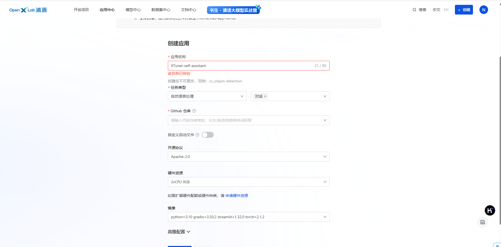

# 使用 XTuner 微调 InternLM2-Chat-1.8B 实现自己的小助手认知

1. 准备文件

```
cd ~
mkdir xtuner_demo
cd xtuner_demo
mkdir model
cd model
ln -s /root/share/new_models/Shanghai_AI_Laboratory/internlm2_5-1_8b-chat/ ./
ls
```


2. 尝试微调之前的模型

```python
import copy
import warnings
from dataclasses import asdict, dataclass
from typing import Callable, List, Optional

import streamlit as st
import torch
from torch import nn
from transformers.generation.utils import (LogitsProcessorList,
                                           StoppingCriteriaList)
from transformers.utils import logging

from transformers import AutoTokenizer, AutoModelForCausalLM  # isort: skip

logger = logging.get_logger(__name__)


model_name_or_path = "./model/internlm2_5-1_8b-chat"

@dataclass
class GenerationConfig:
    # this config is used for chat to provide more diversity
    max_length: int = 2048
    top_p: float = 0.75
    temperature: float = 0.1
    do_sample: bool = True
    repetition_penalty: float = 1.000


@torch.inference_mode()
def generate_interactive(
    model,
    tokenizer,
    prompt,
    generation_config: Optional[GenerationConfig] = None,
    logits_processor: Optional[LogitsProcessorList] = None,
    stopping_criteria: Optional[StoppingCriteriaList] = None,
    prefix_allowed_tokens_fn: Optional[Callable[[int, torch.Tensor],
                                                List[int]]] = None,
    additional_eos_token_id: Optional[int] = None,
    **kwargs,
):
    inputs = tokenizer([prompt], padding=True, return_tensors='pt')
    input_length = len(inputs['input_ids'][0])
    for k, v in inputs.items():
        inputs[k] = v.cuda()
    input_ids = inputs['input_ids']
    _, input_ids_seq_length = input_ids.shape[0], input_ids.shape[-1]
    if generation_config is None:
        generation_config = model.generation_config
    generation_config = copy.deepcopy(generation_config)
    model_kwargs = generation_config.update(**kwargs)
    bos_token_id, eos_token_id = (  # noqa: F841  # pylint: disable=W0612
        generation_config.bos_token_id,
        generation_config.eos_token_id,
    )
    if isinstance(eos_token_id, int):
        eos_token_id = [eos_token_id]
    if additional_eos_token_id is not None:
        eos_token_id.append(additional_eos_token_id)
    has_default_max_length = kwargs.get(
        'max_length') is None and generation_config.max_length is not None
    if has_default_max_length and generation_config.max_new_tokens is None:
        warnings.warn(
            f"Using 'max_length''s default ({repr(generation_config.max_length)}) \
                to control the generation length. "
            'This behaviour is deprecated and will be removed from the \
                config in v5 of Transformers -- we'
            ' recommend using `max_new_tokens` to control the maximum \
                length of the generation.',
            UserWarning,
        )
    elif generation_config.max_new_tokens is not None:
        generation_config.max_length = generation_config.max_new_tokens + \
            input_ids_seq_length
        if not has_default_max_length:
            logger.warn(  # pylint: disable=W4902
                f"Both 'max_new_tokens' (={generation_config.max_new_tokens}) "
                f"and 'max_length'(={generation_config.max_length}) seem to "
                "have been set. 'max_new_tokens' will take precedence. "
                'Please refer to the documentation for more information. '
                '(https://huggingface.co/docs/transformers/main/'
                'en/main_classes/text_generation)',
                UserWarning,
            )

    if input_ids_seq_length >= generation_config.max_length:
        input_ids_string = 'input_ids'
        logger.warning(
            f"Input length of {input_ids_string} is {input_ids_seq_length}, "
            f"but 'max_length' is set to {generation_config.max_length}. "
            'This can lead to unexpected behavior. You should consider'
            " increasing 'max_new_tokens'.")

    # 2. Set generation parameters if not already defined
    logits_processor = logits_processor if logits_processor is not None \
        else LogitsProcessorList()
    stopping_criteria = stopping_criteria if stopping_criteria is not None \
        else StoppingCriteriaList()

    logits_processor = model._get_logits_processor(
        generation_config=generation_config,
        input_ids_seq_length=input_ids_seq_length,
        encoder_input_ids=input_ids,
        prefix_allowed_tokens_fn=prefix_allowed_tokens_fn,
        logits_processor=logits_processor,
    )

    stopping_criteria = model._get_stopping_criteria(
        generation_config=generation_config,
        stopping_criteria=stopping_criteria)
    logits_warper = model._get_logits_warper(generation_config)

    unfinished_sequences = input_ids.new(input_ids.shape[0]).fill_(1)
    scores = None
    while True:
        model_inputs = model.prepare_inputs_for_generation(
            input_ids, **model_kwargs)
        # forward pass to get next token
        outputs = model(
            **model_inputs,
            return_dict=True,
            output_attentions=False,
            output_hidden_states=False,
        )

        next_token_logits = outputs.logits[:, -1, :]

        # pre-process distribution
        next_token_scores = logits_processor(input_ids, next_token_logits)
        next_token_scores = logits_warper(input_ids, next_token_scores)

        # sample
        probs = nn.functional.softmax(next_token_scores, dim=-1)
        if generation_config.do_sample:
            next_tokens = torch.multinomial(probs, num_samples=1).squeeze(1)
        else:
            next_tokens = torch.argmax(probs, dim=-1)

        # update generated ids, model inputs, and length for next step
        input_ids = torch.cat([input_ids, next_tokens[:, None]], dim=-1)
        model_kwargs = model._update_model_kwargs_for_generation(
            outputs, model_kwargs, is_encoder_decoder=False)
        unfinished_sequences = unfinished_sequences.mul(
            (min(next_tokens != i for i in eos_token_id)).long())

        output_token_ids = input_ids[0].cpu().tolist()
        output_token_ids = output_token_ids[input_length:]
        for each_eos_token_id in eos_token_id:
            if output_token_ids[-1] == each_eos_token_id:
                output_token_ids = output_token_ids[:-1]
        response = tokenizer.decode(output_token_ids)

        yield response
        # stop when each sentence is finished
        # or if we exceed the maximum length
        if unfinished_sequences.max() == 0 or stopping_criteria(
                input_ids, scores):
            break


def on_btn_click():
    del st.session_state.messages


@st.cache_resource
def load_model():
    model = (AutoModelForCausalLM.from_pretrained(model_name_or_path,
                                                  trust_remote_code=True).to(
                                                      torch.bfloat16).cuda())
    tokenizer = AutoTokenizer.from_pretrained(model_name_or_path,
                                              trust_remote_code=True)
    return model, tokenizer


def prepare_generation_config():
    with st.sidebar:
        max_length = st.slider('Max Length',
                               min_value=8,
                               max_value=32768,
                               value=2048)
        top_p = st.slider('Top P', 0.0, 1.0, 0.75, step=0.01)
        temperature = st.slider('Temperature', 0.0, 1.0, 0.1, step=0.01)
        st.button('Clear Chat History', on_click=on_btn_click)

    generation_config = GenerationConfig(max_length=max_length,
                                         top_p=top_p,
                                         temperature=temperature)

    return generation_config


user_prompt = '<|im_start|>user\n{user}<|im_end|>\n'
robot_prompt = '<|im_start|>assistant\n{robot}<|im_end|>\n'
cur_query_prompt = '<|im_start|>user\n{user}<|im_end|>\n\
    <|im_start|>assistant\n'


def combine_history(prompt):
    messages = st.session_state.messages
    meta_instruction = ('')
    total_prompt = f"<s><|im_start|>system\n{meta_instruction}<|im_end|>\n"
    for message in messages:
        cur_content = message['content']
        if message['role'] == 'user':
            cur_prompt = user_prompt.format(user=cur_content)
        elif message['role'] == 'robot':
            cur_prompt = robot_prompt.format(robot=cur_content)
        else:
            raise RuntimeError
        total_prompt += cur_prompt
    total_prompt = total_prompt + cur_query_prompt.format(user=prompt)
    return total_prompt


def main():
    # torch.cuda.empty_cache()
    print('load model begin.')
    model, tokenizer = load_model()
    print('load model end.')


    st.title('InternLM2-Chat-1.8B')

    generation_config = prepare_generation_config()

    # Initialize chat history
    if 'messages' not in st.session_state:
        st.session_state.messages = []

    # Display chat messages from history on app rerun
    for message in st.session_state.messages:
        with st.chat_message(message['role'], avatar=message.get('avatar')):
            st.markdown(message['content'])

    # Accept user input
    if prompt := st.chat_input('What is up?'):
        # Display user message in chat message container
        with st.chat_message('user'):
            st.markdown(prompt)
        real_prompt = combine_history(prompt)
        # Add user message to chat history
        st.session_state.messages.append({
            'role': 'user',
            'content': prompt,
        })

        with st.chat_message('robot'):
            message_placeholder = st.empty()
            for cur_response in generate_interactive(
                    model=model,
                    tokenizer=tokenizer,
                    prompt=real_prompt,
                    additional_eos_token_id=92542,
                    **asdict(generation_config),
            ):
                # Display robot response in chat message container
                message_placeholder.markdown(cur_response + '▌')
            message_placeholder.markdown(cur_response)
        # Add robot response to chat history
        st.session_state.messages.append({
            'role': 'robot',
            'content': cur_response,  # pylint: disable=undefined-loop-variable
        })
        torch.cuda.empty_cache()


if __name__ == '__main__':
    main()
```

运行

```sh
streamlit run xtuner_streamlit_demo.py
```

映射端口

```sh
ssh -CNg -L 8501:127.0.0.1:8501 root@ssh.intern-ai.org.cn -p 33344
```


网页测试，效果并不好


准备微调数据

```sh
cd ~/xtuner_demo
mkdir -p datas
touch datas/assistant.json
```

准备生成代码的文件 `xtuner_generate_assistant.py`

```python
import json

# 设置用户的名字
name = 'UbUb'
# 设置需要重复添加的数据次数
n =  3750

# 初始化数据
data = [
    {"conversation": [{"input": "请介绍一下你自己", "output": "我是{}的小助手，内在是上海AI实验室书生·浦语的1.8B大模型哦".format(name)}]},
    {"conversation": [{"input": "你在实战营做什么", "output": "我在这里帮助{}完成XTuner微调个人小助手的任务".format(name)}]}
]

# 通过循环，将初始化的对话数据重复添加到data列表中
for i in range(n):
    data.append(data[0])
    data.append(data[1])

# 将data列表中的数据写入到'datas/assistant.json'文件中
with open('datas/assistant.json', 'w', encoding='utf-8') as f:
    # 使用json.dump方法将数据以JSON格式写入文件
    # ensure_ascii=False 确保中文字符正常显示
    # indent=4 使得文件内容格式化，便于阅读
    json.dump(data, f, ensure_ascii=False, indent=4)
```

生成的数据格式如下


复制一个预设的配置文件


```sh
xtuner copy-cfg internlm2_chat_1_8b_qlora_alpaca_e3 .
mv internlm2_chat_1_8b_qlora_alpaca_e3_copy.py internlm2_5-1_8b-chat_qlora_custom_e3.py
```

对配置文件进行修改

```python
"""
train:
    xtuner train $CONFIG [other_config]
    ex:
        xtuner train internlm2_5-1_8b-chat_qlora_custom_e3.py --deepspeed deepspeed_zero2

convert:
    xtuner convert pth_to_hf $CONFIG $PATH_TO_PTH_MODEL $SAVE_PATH_TO_HF_MODEL --max-shard-size 2GB

    ex:
        xtuner convert pth_to_hf \
            internlm2_5-1_8b-chat_qlora_custom_e3.py \
            work_dirs/internlm2_5-1_8b-chat_qlora_custom_e3/iter_291.pth \
            work_dirs/internlm2_5-1_8b-chat_qlora_custom_e3/iter_291.hf \
            --max-shard-size 2GB

merge adapter:
    xtuner convert merge $LLM $ADAPTER $SAVE_PATH --max-shard-size 2GB

    ex:
        xtuner convert merge \
            model/internlm2_5-1_8b-chat \
            work_dirs/internlm2_5-1_8b-chat_qlora_custom_e3/iter_291.hf \
            work_dirs/internlm2_5-1_8b-chat_qlora_custom_e3/iter_291_merged \
            --max-shard-size 2GB

chat:
    xtuner chat $LLM --adapter $ADAPTER --bits $BITS --temperature $TEMPERATURE --top-k $TOP_K --top-p $TOP_P --system $SYSTEM_TEXT

    ex:
        xtuner chat \
            model/internlm2_5-1_8b-chat \
            --adapter work_dirs/internlm2_5-1_8b-chat_qlora_custom_e3/iter_291.hf \
            --bits 8 --temperature 0.7 --top-k 50 --top-p 0.9

验证数据集是否正确构建:
    xtuner check-custom-dataset $CONFIG

    ex:
        xtuner check-custom-dataset train/internlm2_5-1_8b-chat_qlora_custom_e3.py
"""

# Copyright (c) OpenMMLab. All rights reserved.
import torch
from datasets import load_dataset
from mmengine.dataset import DefaultSampler
from mmengine.hooks import (CheckpointHook, DistSamplerSeedHook, IterTimerHook,
                            LoggerHook, ParamSchedulerHook)
from mmengine.visualization import Visualizer, LocalVisBackend, TensorboardVisBackend
from mmengine.optim import AmpOptimWrapper, CosineAnnealingLR, LinearLR
from peft import LoraConfig
from torch.optim import AdamW
from transformers import (AutoModelForCausalLM, AutoTokenizer,
                          BitsAndBytesConfig)

from xtuner.dataset import process_hf_dataset
from xtuner.dataset.collate_fns import default_collate_fn
from xtuner.dataset.map_fns import alpaca_map_fn, template_map_fn_factory
from xtuner.engine.hooks import (DatasetInfoHook, EvaluateChatHook,
                                 VarlenAttnArgsToMessageHubHook)
from xtuner.engine.runner import TrainLoop
from xtuner.model import SupervisedFinetune
from xtuner.parallel.sequence import SequenceParallelSampler
from xtuner.utils import PROMPT_TEMPLATE, SYSTEM_TEMPLATE

#######################################################################
#                          PART 1  Settings                           #
#######################################################################
# Model
pretrained_model_name_or_path = 'model/internlm2_5-1_8b-chat'
use_varlen_attn = False

# Data
alpaca_en_path = 'datas/assistant.json'
prompt_template = PROMPT_TEMPLATE.internlm2_chat
max_length = 2048
pack_to_max_length = True

# parallel
sequence_parallel_size = 1

# Scheduler & Optimizer
batch_size = 1  # per_device
accumulative_counts = 16
accumulative_counts *= sequence_parallel_size
dataloader_num_workers = 0
max_epochs = 3
optim_type = AdamW
lr = 2e-4
betas = (0.9, 0.999)
weight_decay = 0
max_norm = 1  # grad clip
warmup_ratio = 0.03

# Save
save_steps = 500
save_total_limit = 2  # Maximum checkpoints to keep (-1 means unlimited)

# Evaluate the generation performance during the training
evaluation_freq = 500
SYSTEM = SYSTEM_TEMPLATE.alpaca
evaluation_inputs = [
    '请介绍一下你自己', 'Please introduce yourself'
]

#######################################################################
#                      PART 2  Model & Tokenizer                      #
#######################################################################
tokenizer = dict(
    type=AutoTokenizer.from_pretrained,
    pretrained_model_name_or_path=pretrained_model_name_or_path,
    trust_remote_code=True,
    padding_side='right')

model = dict(
    type=SupervisedFinetune,
    use_varlen_attn=use_varlen_attn,
    llm=dict(
        type=AutoModelForCausalLM.from_pretrained,
        pretrained_model_name_or_path=pretrained_model_name_or_path,
        trust_remote_code=True,
        torch_dtype=torch.float16,
        quantization_config=dict(
            type=BitsAndBytesConfig,
            load_in_4bit=True,
            load_in_8bit=False,
            llm_int8_threshold=6.0,
            llm_int8_has_fp16_weight=False,
            bnb_4bit_compute_dtype=torch.float16,
            bnb_4bit_use_double_quant=True,
            bnb_4bit_quant_type='nf4')),
    lora=dict(
        type=LoraConfig,
        r=64,
        lora_alpha=16,
        lora_dropout=0.1,
        bias='none',
        task_type='CAUSAL_LM'))

#######################################################################
#                      PART 3  Dataset & Dataloader                   #
#######################################################################
alpaca_en = dict(
    type=process_hf_dataset,
    dataset=dict(type=load_dataset, path='json', data_files=dict(train=alpaca_en_path)),
    tokenizer=tokenizer,
    max_length=max_length,
    dataset_map_fn=None,
    template_map_fn=dict(
        type=template_map_fn_factory, template=prompt_template),
    remove_unused_columns=True,
    shuffle_before_pack=True,
    pack_to_max_length=pack_to_max_length,
    use_varlen_attn=use_varlen_attn)

sampler = SequenceParallelSampler \
    if sequence_parallel_size > 1 else DefaultSampler
train_dataloader = dict(
    batch_size=batch_size,
    num_workers=dataloader_num_workers,
    dataset=alpaca_en,
    sampler=dict(type=sampler, shuffle=True),
    collate_fn=dict(type=default_collate_fn, use_varlen_attn=use_varlen_attn))

#######################################################################
#                    PART 4  Scheduler & Optimizer                    #
#######################################################################
# optimizer
optim_wrapper = dict(
    type=AmpOptimWrapper,
    optimizer=dict(
        type=optim_type, lr=lr, betas=betas, weight_decay=weight_decay),
    clip_grad=dict(max_norm=max_norm, error_if_nonfinite=False),
    accumulative_counts=accumulative_counts,
    loss_scale='dynamic',
    dtype='float16')

# learning policy
# More information: https://github.com/open-mmlab/mmengine/blob/main/docs/en/tutorials/param_scheduler.md  # noqa: E501
param_scheduler = [
    dict(
        type=LinearLR,
        start_factor=1e-5,
        by_epoch=True,
        begin=0,
        end=warmup_ratio * max_epochs,
        convert_to_iter_based=True),
    dict(
        type=CosineAnnealingLR,
        eta_min=0.0,
        by_epoch=True,
        begin=warmup_ratio * max_epochs,
        end=max_epochs,
        convert_to_iter_based=True)
]

# train, val, test setting
train_cfg = dict(type=TrainLoop, max_epochs=max_epochs)

#######################################################################
#                           PART 5  Runtime                           #
#######################################################################
# Log the dialogue periodically during the training process, optional
custom_hooks = [
    dict(type=DatasetInfoHook, tokenizer=tokenizer),
    dict(
        type=EvaluateChatHook,
        tokenizer=tokenizer,
        every_n_iters=evaluation_freq,
        evaluation_inputs=evaluation_inputs,
        system=SYSTEM,
        prompt_template=prompt_template)
]

if use_varlen_attn:
    custom_hooks += [dict(type=VarlenAttnArgsToMessageHubHook)]

# configure default hooks
default_hooks = dict(
    # record the time of every iteration.
    timer=dict(type=IterTimerHook),
    # print log every 10 iterations.
    logger=dict(type=LoggerHook, log_metric_by_epoch=False, interval=10),
    # enable the parameter scheduler.
    param_scheduler=dict(type=ParamSchedulerHook),
    # save checkpoint per `save_steps`.
    checkpoint=dict(
        type=CheckpointHook,
        by_epoch=False,
        interval=save_steps,
        max_keep_ckpts=save_total_limit),
    # set sampler seed in distributed evrionment.
    sampler_seed=dict(type=DistSamplerSeedHook),
)

# configure environment
env_cfg = dict(
    # whether to enable cudnn benchmark
    cudnn_benchmark=False,
    # set multi process parameters
    mp_cfg=dict(mp_start_method='fork', opencv_num_threads=0),
    # set distributed parameters
    dist_cfg=dict(backend='nccl'),
)

# set visualizer
visualizer = dict(
    type=Visualizer,
    vis_backends=[dict(type=LocalVisBackend), dict(type=TensorboardVisBackend)]
)

# set log level
log_level = 'INFO'

# load from which checkpoint
load_from = None

# whether to resume training from the loaded checkpoint
resume = False

# Defaults to use random seed and disable `deterministic`
randomness = dict(seed=None, deterministic=False)

# set log processor
log_processor = dict(by_epoch=False)
```

启动训练

```sh
xtuner train ./internlm2_5-1_8b-chat_qlora_custom_e3.py
```


训练后查看保存的文件

```sh
(lmdeploy) root@intern-studio-030876:~/xtuner_demo# tree work_dirs/
work_dirs/
└── internlm2_5-1_8b-chat_qlora_custom_e3
    ├── 20240806_195624
    │   ├── 20240806_195624.log
    │   └── vis_data
    │       ├── 20240806_195624.json
    │       ├── config.py
    │       ├── eval_outputs_iter_290.txt
    │       ├── events.out.tfevents.1722945385.intern-studio-030876.43871.0
    │       └── scalars.json
    ├── internlm2_5-1_8b-chat_qlora_custom_e3.py
    ├── iter_291.pth
    └── last_checkpoint

3 directories, 9 files
```

转换格式

```sh
(lmdeploy) root@intern-studio-030876:~/xtuner_demo# xtuner convert pth_to_hf \
>             internlm2_5-1_8b-chat_qlora_custom_e3.py \
>             work_dirs/internlm2_5-1_8b-chat_qlora_custom_e3/iter_291.pth \
>             work_dirs/internlm2_5-1_8b-chat_qlora_custom_e3/iter_291.hf \
>             --max-shard-size 2GB
[2024-08-06 20:07:04,158] [INFO] [real_accelerator.py:203:get_accelerator] Setting ds_accelerator to cuda (auto detect)
Warning: The default cache directory for DeepSpeed Triton autotune, /root/.triton/autotune, appears to be on an NFS system. While this is generally acceptable, if you experience slowdowns or hanging when DeepSpeed exits, it is recommended to set the TRITON_CACHE_DIR environment variable to a non-NFS path.
 [WARNING]  async_io requires the dev libaio .so object and headers but these were not found.
 [WARNING]  async_io: please install the libaio-dev package with apt
 [WARNING]  If libaio is already installed (perhaps from source), try setting the CFLAGS and LDFLAGS environment variables to where it can be found.
 [WARNING]  Please specify the CUTLASS repo directory as environment variable $CUTLASS_PATH
 [WARNING]  sparse_attn requires a torch version >= 1.5 and < 2.0 but detected 2.2
 [WARNING]  using untested triton version (2.2.0), only 1.0.0 is known to be compatible
[2024-08-06 20:07:21,218] [INFO] [real_accelerator.py:203:get_accelerator] Setting ds_accelerator to cuda (auto detect)
Warning: The default cache directory for DeepSpeed Triton autotune, /root/.triton/autotune, appears to be on an NFS system. While this is generally acceptable, if you experience slowdowns or hanging when DeepSpeed exits, it is recommended to set the TRITON_CACHE_DIR environment variable to a non-NFS path.
 [WARNING]  async_io requires the dev libaio .so object and headers but these were not found.
 [WARNING]  async_io: please install the libaio-dev package with apt
 [WARNING]  If libaio is already installed (perhaps from source), try setting the CFLAGS and LDFLAGS environment variables to where it can be found.
 [WARNING]  Please specify the CUTLASS repo directory as environment variable $CUTLASS_PATH
 [WARNING]  sparse_attn requires a torch version >= 1.5 and < 2.0 but detected 2.2
 [WARNING]  using untested triton version (2.2.0), only 1.0.0 is known to be compatible
`low_cpu_mem_usage` was None, now set to True since model is quantized.
Loading checkpoint shards: 100%|████████████████████████████████████████████████████████████████████████████████████████████████████████████████████████| 2/2 [00:01<00:00,  1.19it/s]
08/06 20:07:25 - mmengine - INFO - Dispatch InternLM2FlashAttention2 forward. Due to the implementation of the PyTorch version of flash attention, even when the `output_attentions` flag is set to True, it is not possible to return the `attn_weights`.
`low_cpu_mem_usage` was None, now set to True since model is quantized.
Loading checkpoint shards: 100%|████████████████████████████████████████████████████████████████████████████████████████████████████████████████████████| 2/2 [00:01<00:00,  1.47it/s]
08/06 20:07:28 - mmengine - INFO - Dispatch InternLM2FlashAttention2 forward. Due to the implementation of the PyTorch version of flash attention, even when the `output_attentions` flag is set to True, it is not possible to return the `attn_weights`.
Load State Dict: 100%|███████████████████████████████████████████████████████████████████████████████████████████████████████████████████████████| 242/242 [00:00<00:00, 35855.08it/s]
08/06 20:07:47 - mmengine - INFO - Load PTH model from work_dirs/internlm2_5-1_8b-chat_qlora_custom_e3/iter_291.pth
08/06 20:07:47 - mmengine - INFO - Convert LLM to float16
08/06 20:07:49 - mmengine - INFO - Saving adapter to work_dirs/internlm2_5-1_8b-chat_qlora_custom_e3/iter_291.hf
08/06 20:07:51 - mmengine - INFO - All done!
```

模型合并

```sh
(lmdeploy) root@intern-studio-030876:~/xtuner_demo# xtuner convert merge \
>             model/internlm2_5-1_8b-chat \
>             work_dirs/internlm2_5-1_8b-chat_qlora_custom_e3/iter_291.hf \
>             work_dirs/internlm2_5-1_8b-chat_qlora_custom_e3/iter_291.merged \
>             --max-shard-size 2GB
[2024-08-06 20:12:45,747] [INFO] [real_accelerator.py:203:get_accelerator] Setting ds_accelerator to cuda (auto detect)
Warning: The default cache directory for DeepSpeed Triton autotune, /root/.triton/autotune, appears to be on an NFS system. While this is generally acceptable, if you experience slowdowns or hanging when DeepSpeed exits, it is recommended to set the TRITON_CACHE_DIR environment variable to a non-NFS path.
 [WARNING]  async_io requires the dev libaio .so object and headers but these were not found.
 [WARNING]  async_io: please install the libaio-dev package with apt
 [WARNING]  If libaio is already installed (perhaps from source), try setting the CFLAGS and LDFLAGS environment variables to where it can be found.
 [WARNING]  Please specify the CUTLASS repo directory as environment variable $CUTLASS_PATH
 [WARNING]  sparse_attn requires a torch version >= 1.5 and < 2.0 but detected 2.2
 [WARNING]  using untested triton version (2.2.0), only 1.0.0 is known to be compatible
[2024-08-06 20:12:58,474] [INFO] [real_accelerator.py:203:get_accelerator] Setting ds_accelerator to cuda (auto detect)
Warning: The default cache directory for DeepSpeed Triton autotune, /root/.triton/autotune, appears to be on an NFS system. While this is generally acceptable, if you experience slowdowns or hanging when DeepSpeed exits, it is recommended to set the TRITON_CACHE_DIR environment variable to a non-NFS path.
 [WARNING]  async_io requires the dev libaio .so object and headers but these were not found.
 [WARNING]  async_io: please install the libaio-dev package with apt
 [WARNING]  If libaio is already installed (perhaps from source), try setting the CFLAGS and LDFLAGS environment variables to where it can be found.
 [WARNING]  Please specify the CUTLASS repo directory as environment variable $CUTLASS_PATH
 [WARNING]  sparse_attn requires a torch version >= 1.5 and < 2.0 but detected 2.2
 [WARNING]  using untested triton version (2.2.0), only 1.0.0 is known to be compatible
Loading checkpoint shards: 100%|█████████████████████████████████████████████████████████████████████████████████████████████████████████████████| 2/2 [00:12<00:00,  6.19s/it]
Saving to work_dirs/internlm2_5-1_8b-chat_qlora_custom_e3/iter_291.merged...
All done!
```

使用微调过的模型

```sh
# 直接修改脚本文件第18行
- model_name_or_path = "./model/internlm2_5-1_8b-chat"
+ model_name_or_path = "work_dirs/internlm2_5-1_8b-chat_qlora_custom_e3/iter_291_merged"
```

```sh
streamlit run xtuner_streamlit_demo.py
```

成功运行


# 增量预训练微调

1. 微调前效果

```
问：最近中国一些地区的燃气费上涨，这是为什么？
答： 城乡二元结构是指一个国家或地区在经济发展过程中，在城乡之间形成的显著差异，这种差异主要体现在经济、社会、文化和政策等多个方面。其形成原因可以追溯到历史的、经济的社会变迁以及政治因素等多重因素。

1. **历史因素**：
   - **殖民扩张与奴隶贸易**：在许多国家和地区，尤其是西方国家，殖民扩张和奴隶贸易对社会结构产生了深远影响，导致了长期的城市化进程和工业化，同时形成了城乡分离的社会结构。
   - **经济发展阶段**：不同国家或地区在工业化、城市化进程中的不同阶段，不同程度地存在着城乡经济差距。

2. **经济因素**：
   - **资源分配不均**：城市作为经济中心，拥有更多的资源和机会，而农村地区由于地理、交通等因素的限制，往往缺乏这些资源。
   - **工业化与城市化**：随着工业化进程的推进，城市化率提高，而农村地区由于基础设施、教育、医疗等条件不足，发展相对滞后。

3. **社会因素**：
   - **文化差异**：城乡之间在文化、语言、生活习惯等方面存在差异，这些差异使得农村居民与城市居民在社会融入和观念认同上存在差异。
   - **政策导向**：不同国家和地区的政府政策在城乡发展中扮演着重要角色，如农业支持政策、城市规划等，这些政策在一定程度上影响了城乡差距的形成。

4. **政治因素**：
   - **政治制度与决策**：不同政治制度下的政府在城市和农村发展政策上的差异，以及决策者的偏好和利益导向，都会影响城乡二元结构的形成。
   - **治理与监督**：城乡二元结构中的不平等往往伴随着制度性的不完善和治理结构的差异，监督和问责机制的不足也会加剧这种差距。

城乡二元结构是一个复杂而动态的过程，随着全球化、信息技术的进步以及各国政府政策的调整，这一结构正在经历一些变化。近年来，许多国家和地区都在寻求通过综合政策、经济转型、社会包容等多种手段来缩小城乡差距，促进城乡一体化。
```


2. 使用 [我们的钱](https://mp.weixin.qq.com/mp/appmsgalbum?__biz=MzA5ODY2NDIyNQ==&action=getalbum&album_id=3419866556862545923&scene=173&subscene=&sessionid=738667631&enterid=0&from_msgid=2652043236&from_itemidx=1&count=3&nolastread=1) 系列文章作为增量预训练文本

下载文本并转换为 json


3. 创建训练脚本

```python
"""
train:
    xtuner train $CONFIG [other_config]
    ex:
        xtuner train train/internlm2_5-1_8b-chat_qlora_pretrain_e1.py --deepspeed deepspeed_zero2

convert:
    xtuner convert pth_to_hf $CONFIG $PATH_TO_PTH_MODEL $SAVE_PATH_TO_HF_MODEL --max-shard-size 2GB

    ex:
        xtuner convert pth_to_hf \
            train/internlm2_5-1_8b-chat_qlora_pretrain_e1.py \
            work_dirs/internlm2_5-1_8b-chat_qlora_pretrain_e1/epoch_1.pth \
            work_dirs/internlm2_5-1_8b-chat_qlora_pretrain_e1/epoch_1.hf \
            --max-shard-size 2GB

merge adapter:
    xtuner convert merge $LLM $ADAPTER $SAVE_PATH --max-shard-size 2GB

    ex:
        xtuner convert merge \
            models/internlm2_5-1_8b-chat \
            work_dirs/internlm2_5-1_8b-chat_qlora_pretrain_e1/epoch_1.hf \
            work_dirs/internlm2_5-1_8b-chat_qlora_pretrain_e1/epoch_1_merged \
            --max-shard-size 2GB

chat:
    xtuner chat $LLM --adapter $ADAPTER --bits $BITS --temperature $TEMPERATURE --top-k $TOP_K --top-p $TOP_P --system $SYSTEM_TEXT

    ex:
        xtuner chat \
            models/internlm2_5-1_8b-chat \
            --adapter work_dirs/internlm2_5-1_8b-chat_qlora_pretrain_e1/epoch_1.hf \
            --bits 8 --temperature 0.7 --top-k 50 --top-p 0.9 \

验证数据集是否正确构建:
    xtuner check-custom-dataset $CONFIG

    ex:
        xtuner check-custom-dataset train/internlm2_5-1_8b-chat_qlora_pretrain_e1.py


Data format:
[
  {
      "text": "xxx"
  },
  {
      "text": "xxx"
  },
  ...
]
"""  # noqa: E501

import torch
from datasets import load_dataset
from mmengine.dataset import DefaultSampler
from mmengine.hooks import (CheckpointHook, DistSamplerSeedHook, IterTimerHook,
                            LoggerHook, ParamSchedulerHook)
from mmengine.visualization import Visualizer, LocalVisBackend, TensorboardVisBackend
from mmengine.optim import AmpOptimWrapper, CosineAnnealingLR, LinearLR
from torch.optim import AdamW
from transformers import AutoModelForCausalLM, AutoTokenizer, BitsAndBytesConfig
from peft import LoraConfig, TaskType

from xtuner.dataset import process_hf_dataset
from xtuner.dataset.collate_fns import default_collate_fn
from xtuner.dataset.map_fns import pretrain_map_fn
from xtuner.engine.hooks import (DatasetInfoHook, EvaluateChatHook,
                                 VarlenAttnArgsToMessageHubHook, ThroughputHook)
from xtuner.engine.runner import TrainLoop
from xtuner.model import SupervisedFinetune
from xtuner.parallel.sequence import SequenceParallelSampler


#######################################################################
#                          PART 1  Settings                           #
#######################################################################
# Model
pretrained_model_name_or_path = './models/internlm2_5-1_8b-chat'
use_varlen_attn = False

# Data
data_files = ['./our_money/our_money.json']
max_length = 2048
pack_to_max_length = True

# parallel
# https://xtuner.readthedocs.io/zh-cn/latest/acceleration/hyper_parameters.html#sequence-parallel-size-accumulative-counts
# https://xtuner.readthedocs.io/zh-cn/latest/acceleration/train_extreme_long_sequence.html
sequence_parallel_size = 1

# Scheduler & Optimizer
# batch size per device, set to 1 if `use_varlen_attn` = True
# To clarify, enlarging the batch size essentially enlarges the `max_length`.
# For example, doubling the max length is tantamount to doubling the batch size
batch_size = 1  # per_device
accumulative_counts = 16
accumulative_counts *= sequence_parallel_size
dataloader_num_workers = 0
max_epochs = 1
optim_type = AdamW
lr = 2e-5
betas = (0.9, 0.999)
weight_decay = 0
max_norm = 1  # grad clip
warmup_ratio = 0.03

# Save
by_epoch = True    # save and log by epoch or by iteration
save_steps = 1
save_total_limit = 3  # Maximum checkpoints to keep (-1 means unlimited)

# Evaluate the generation performance during the training
evaluation_freq = 500
SYSTEM = ''
evaluation_inputs = [
    '社保，为何越缴越多？',
    'A股为什么不随经济增长而增长？'
]

#######################################################################
#                      PART 2  Model & Tokenizer                      #
#######################################################################
tokenizer = dict(
    type=AutoTokenizer.from_pretrained,
    pretrained_model_name_or_path=pretrained_model_name_or_path,
    trust_remote_code=True,
    padding_side='right')

model = dict(
    type=SupervisedFinetune,
    use_varlen_attn=use_varlen_attn,
    llm=dict(
        type=AutoModelForCausalLM.from_pretrained,
        pretrained_model_name_or_path=pretrained_model_name_or_path,
        trust_remote_code=True,
        torch_dtype=torch.bfloat16,
        # device_map='auto',
        # low_cpu_mem_usage=True,                   # 是否使用低CPU内存，使用 device_map 参数必须为 True
        quantization_config=dict(
            type=BitsAndBytesConfig,
            load_in_4bit=True,                      # 是否在4位精度下加载模型。如果设置为True，则在4位精度下加载模型。
            load_in_8bit=False,
            llm_int8_threshold=6.0,
            llm_int8_has_fp16_weight=False,
            bnb_4bit_compute_dtype=torch.bfloat16,  # 4位精度计算的数据类型。这里设置为torch.bfloat16，表示使用半精度浮点数。
            bnb_4bit_use_double_quant=True,         # 是否使用双精度量化。如果设置为True，则使用双精度量化。
            bnb_4bit_quant_type='nf4')),            # 4位精度量化的类型。这里设置为"nf4"，表示使用nf4量化类型。 nf4: 4bit-NormalFloat
    lora=dict(
        type=LoraConfig,
        task_type=TaskType.CAUSAL_LM,
        inference_mode=False,   # 训练模式
        r=64,                   # Lora 秩
        target_modules=['wqkv', 'wo', 'w1', 'w2', 'w3'],
        lora_alpha=16,          # Lora alaph，具体作用参见 Lora 原理
        lora_dropout=0.1,       # Dropout 比例
        bias='none'))

#######################################################################
#                      PART 3  Dataset & Dataloader                   #
#######################################################################
train_dataset = dict(
    type=process_hf_dataset,
    dataset=dict(type=load_dataset, path='json', data_files=data_files),
    tokenizer=tokenizer,
    max_length=max_length,
    dataset_map_fn=pretrain_map_fn,
    template_map_fn=None,
    remove_unused_columns=True,
    shuffle_before_pack=False,
    pack_to_max_length=pack_to_max_length,
    use_varlen_attn=use_varlen_attn)

sampler = SequenceParallelSampler \
    if sequence_parallel_size > 1 else DefaultSampler
train_dataloader = dict(
    batch_size=batch_size,
    num_workers=dataloader_num_workers,
    dataset=train_dataset,
    sampler=dict(type=sampler, shuffle=True),
    collate_fn=dict(type=default_collate_fn, use_varlen_attn=use_varlen_attn))

#######################################################################
#                    PART 4  Scheduler & Optimizer                    #
#######################################################################
# optimizer
optim_wrapper = dict(
    type=AmpOptimWrapper,
    optimizer=dict(
        type=optim_type, lr=lr, betas=betas, weight_decay=weight_decay),
    clip_grad=dict(max_norm=max_norm, error_if_nonfinite=False),
    accumulative_counts=accumulative_counts,
    loss_scale='dynamic',
    dtype='float16')

# learning policy
# More information: https://github.com/open-mmlab/mmengine/blob/main/docs/en/tutorials/param_scheduler.md  # noqa: E501
param_scheduler = [
    dict(
        type=LinearLR,
        start_factor=1e-5,
        by_epoch=True,
        begin=0,
        end=warmup_ratio * max_epochs,
        convert_to_iter_based=True),
    dict(
        type=CosineAnnealingLR,
        eta_min=0.0,
        by_epoch=True,
        begin=warmup_ratio * max_epochs,
        end=max_epochs,
        convert_to_iter_based=True)
]

# train, val, test setting
# 在 EpochBased 模式下，val_interval 的默认值为 1，表示训练一个 Epoch，验证一次
# 在 IterBased 模式下，val_interval 的默认值为 1000，表示训练迭代 1000 次，验证一次
# train_cfg = dict(type=TrainLoop, max_epochs=max_epochs)
train_cfg = dict(by_epoch=True, max_epochs=max_epochs, val_interval=1)

#######################################################################
#                           PART 5  Runtime                           #
#######################################################################
# Log the dialogue periodically during the training process, optional
custom_hooks = [
    dict(type=DatasetInfoHook, tokenizer=tokenizer),
    dict(
        type=EvaluateChatHook,
        tokenizer=tokenizer,
        every_n_iters=evaluation_freq,
        evaluation_inputs=evaluation_inputs,
        system=SYSTEM),
    dict(type=ThroughputHook)
]

if use_varlen_attn:
    custom_hooks += [dict(type=VarlenAttnArgsToMessageHubHook)]

# configure default hooks
default_hooks = dict(
    # record the time of every iteration.
    timer=dict(type=IterTimerHook),
    # print log every 10 iterations.
    logger=dict(type=LoggerHook, log_metric_by_epoch=False, interval=10),
    # enable the parameter scheduler.
    param_scheduler=dict(type=ParamSchedulerHook),
    # save checkpoint per `save_steps`.
    checkpoint=dict(
        type=CheckpointHook,
        by_epoch=by_epoch,
        interval=save_steps,
        max_keep_ckpts=save_total_limit),
    # set sampler seed in distributed evrionment.
    sampler_seed=dict(type=DistSamplerSeedHook)
)

# configure environment
env_cfg = dict(
    # whether to enable cudnn benchmark
    cudnn_benchmark=False,
    # set multi process parameters
    mp_cfg=dict(mp_start_method='fork', opencv_num_threads=0),
    # set distributed parameters
    dist_cfg=dict(backend='nccl')
)

# set visualizer
visualizer = dict(
    type=Visualizer,
    vis_backends=[dict(type=LocalVisBackend), dict(type=TensorboardVisBackend)]
)

# set log level
log_level = 'INFO'

# load from which checkpoint
load_from = None

# whether to resume training from the loaded checkpoint
resume = False

# Defaults to use random seed and disable `deterministic`
randomness = dict(seed=None, deterministic=False)

# set log processor
# log_processor = dict(by_epoch=False)
# log_processor = dict(by_epoch=by_epoch)
log_processor = dict(
    by_epoch=by_epoch,
    window_size=1,
    mean_pattern=r'.*(loss|time|data_time|grad_norm|tflops).*')
```

4. 训练

```sh
xtuner train train/internlm2_5-1_8b-chat_qlora_pretrain_e1.py
```


5. 查看训练效果

```
问：城乡二元结构是怎么来的？
答：城乡二元结构是指中国在20世纪50年代至70年代末，由于经济、社会、政治等方面的原因，形成的一种特殊的社会经济结构。这种结构主要体现在以下几个方面：

1. **户籍制度**：中国实行严格的户籍制度，将城市和农村划分为不同的社会经济体系。城市居民享有较高的社会福利和就业机会，而农村居民则受到较低的社会福利和就业限制。这种制度导致了城乡居民在教育、医疗、养老等方面存在显著差异。

2. **经济差异**：城乡二元结构还体现在经济上的巨大差异。城市经济发达，拥有更多的资源和机会，而农村则相对落后，经济结构单一，产业结构单一，农业生产方式落后。

3. **社会福利和公共服务**：城乡二元结构也体现在社会福利和公共服务上。城市居民享有较高的医疗、教育、养老等公共服务，而农村居民则在这些方面受到限制。

4. **政治权力**：在政治权力方面，城市居民享有更多的政治参与机会，而农村居民则相对边缘化。

城乡二元结构的形成是一个复杂的历史过程，涉及经济、社会、政治等多方面的因素。尽管改革开放以来，中国政府采取了一系列措施，试图缩小城乡差距，促进城乡一体化发展，但城乡二元结构的问题依然存在，需要长期努力才能逐步解决。
```


# 将自我认知的模型上传到 OpenXLab

1. 创建模型仓库

https://openxlab.org.cn/models/detail/NagatoYuki0943/internlm2_5-1_8b-chat-self-assistant


2. clone 仓库到本地

```sh
(lmdeploy) root@intern-studio-030876:~/xtuner_demo/work_dirs# git clone https://code.openxlab.org.cn/NagatoYuki0943/internlm2_5-1_8b-chat-self-assistant.git
Cloning into 'internlm2_5-1_8b-chat-self-assistant'...
remote: Enumerating objects: 6, done.
remote: Counting objects: 100% (6/6), done.
remote: Compressing objects: 100% (5/5), done.
remote: Total 6 (delta 0), reused 0 (delta 0), pack-reused 0
Unpacking objects: 100% (6/6), 719 bytes | 3.00 KiB/s, done.
```

3. 移动模型文件到仓库

```sh
(lmdeploy) root@intern-studio-030876:~/xtuner_demo/work_dirs# mv internlm2_5-1_8b-chat_qlora_custom_e3/iter_291_merged/* internlm2_5-1_8b-chat-self-assistant/
(lmdeploy) root@intern-studio-030876:~/xtuner_demo/work_dirs# tree internlm2_5-1_8b-chat-self-assistant
internlm2_5-1_8b-chat-self-assistant
|-- README.md
|-- config.json
|-- configuration_internlm2.py
|-- generation_config.json
|-- modeling_internlm2.py
|-- pytorch_model-00001-of-00002.bin
|-- pytorch_model-00002-of-00002.bin
|-- pytorch_model.bin.index.json
|-- special_tokens_map.json
|-- tokenization_internlm2.py
|-- tokenization_internlm2_fast.py
|-- tokenizer.json
|-- tokenizer.model
`-- tokenizer_config.json

0 directories, 14 files
```

4. 上传模型

```sh
(lmdeploy) root@intern-studio-030876:~/xtuner_demo/work_dirs/internlm2_5-1_8b-chat-self-assistant# git add .
(lmdeploy) root@intern-studio-030876:~/xtuner_demo/work_dirs/internlm2_5-1_8b-chat-self-assistant# git commit -m'add model'
[main 3f7b476] add model
 13 files changed, 260637 insertions(+)
 create mode 100644 config.json
 create mode 100644 configuration_internlm2.py
 create mode 100644 generation_config.json
 create mode 100644 modeling_internlm2.py
 create mode 100644 pytorch_model-00001-of-00002.bin
 create mode 100644 pytorch_model-00002-of-00002.bin
 create mode 100644 pytorch_model.bin.index.json
 create mode 100644 special_tokens_map.json
 create mode 100644 tokenization_internlm2.py
 create mode 100644 tokenization_internlm2_fast.py
 create mode 100644 tokenizer.json
 create mode 100644 tokenizer.model
 create mode 100644 tokenizer_config.json
(lmdeploy) root@intern-studio-030876:~/xtuner_demo/work_dirs/internlm2_5-1_8b-chat-self-assistant# git push
Enumerating objects: 16, done.
Counting objects: 100% (16/16), done.
Delta compression using up to 128 threads
Compressing objects: 100% (13/13), done.
Writing objects: 100% (15/15), 3.18 GiB | 42.02 MiB/s, done.
Total 15 (delta 0), reused 2 (delta 0)
remote: . Processing 1 references
remote: Processed 1 references in total
To https://code.openxlab.org.cn/NagatoYuki0943/internlm2_5-1_8b-chat-self-assistant.git
   ef4adad..3f7b476  main -> main
```


5. 在浏览器查看


# 部署到 OpenXLab

1. 新建一个仓库，我这里已经有一个旧的仓库了，更新代码即可使用了

https://github.com/NagatoYuki0943/XTuner-Web-Demo


使用的 lmdeploy 进行部署

```python
import os
import gradio as gr
from infer_engine import InferEngine, LmdeployConfig
from typing import Generator, Sequence
import threading
from loguru import logger


logger.info(f"gradio version: {gr.__version__}")


# clone 模型
MODEL_PATH = 'internlm2_5-1_8b-chat-self-assistant'
os.system(f'git clone https://code.openxlab.org.cn/NagatoYuki0943/internlm2_5-1_8b-chat-self-assistant.git {MODEL_PATH}')
os.system(f'cd {MODEL_PATH} && git lfs pull')

SYSTEM_PROMPT = """"""

LMDEPLOY_CONFIG = LmdeployConfig(
    model_path = MODEL_PATH,
    backend = 'turbomind',
    model_name = 'internlm2',
    model_format = 'hf',
    tp = 1,                         # Tensor Parallelism.
    max_batch_size = 128,
    cache_max_entry_count = 0.5,    # 调整 KV Cache 的占用比例
    quant_policy = 0,               # KV Cache 量化, 0 代表禁用, 4 代表 4bit 量化, 8 代表 8bit 量化
    system_prompt = SYSTEM_PROMPT,
    deploy_method = 'local',
)

# 载入模型
infer_engine = InferEngine(
    backend = 'lmdeploy', # transformers, lmdeploy
    lmdeploy_config = LMDEPLOY_CONFIG
)


class InterFace:
    global_session_id: int = 0
    lock = threading.Lock()


def chat_stream(
    query: str,
    history: Sequence | None = None,  # [['What is the capital of France?', 'The capital of France is Paris.'], ['Thanks', 'You are Welcome']]
    max_new_tokens: int = 1024,
    temperature: float = 0.8,
    top_p: float = 0.8,
    top_k: int = 40,
    state_session_id: int | None = None,
) -> Generator[Sequence, None, None]:
    history = [] if history is None else list(history)

    logger.info(f"{state_session_id = }")
    logger.info({
            "max_new_tokens":  max_new_tokens,
            "temperature": temperature,
            "top_p": top_p,
            "top_k": top_k,
    })

    query = query.strip()
    if query == None or len(query) < 1:
        logger.warning(f"query is None, return history")
        yield history
        return
    logger.info(f"query: {query}")

    yield history + [[query, None]]
    for response, history in infer_engine.chat_stream(
        query = query,
        history = history,
        max_new_tokens = max_new_tokens,
        temperature = temperature,
        top_p = top_p,
        top_k = top_k,
        session_id = state_session_id,
    ):
        yield history
        logger.info(f"response: {response}")
    logger.info(f"history: {history}")


def regenerate(
    history: Sequence | None = None,  # [['What is the capital of France?', 'The capital of France is Paris.'], ['Thanks', 'You are Welcome']]
    max_new_tokens: int = 1024,
    temperature: float = 0.8,
    top_p: float = 0.8,
    top_k: int = 40,
    state_session_id: int | None = None,
) -> Generator[Sequence, None, None]:
    history = [] if history is None else list(history)

    # 重新生成时要把最后的query和response弹出,重用query
    if len(history) > 0:
        query, _ = history.pop(-1)
        yield from chat_stream(
            query = query,
            history = history,
            max_new_tokens = max_new_tokens,
            temperature = temperature,
            top_p = top_p,
            top_k = top_k,
            state_session_id = state_session_id,
        )
    else:
        logger.warning(f"no history, can't regenerate")
        yield history


def revocery(history: Sequence | None = None) -> tuple[str, Sequence]:
    """恢复到上一轮对话"""
    history = [] if history is None else list(history)
    query = ""
    if len(history) > 0:
        query, _ = history.pop(-1)
    return query, history


def main():
    block = gr.Blocks()
    with block as demo:
        state_session_id = gr.State(0)

        with gr.Row(equal_height=True):
            with gr.Column(scale=15):
                gr.Markdown("""<h1><center>InternLM</center></h1>
                    <center>InternLM2.5</center>
                    """)
            # gr.Image(value=LOGO_PATH, scale=1, min_width=10,show_label=False, show_download_button=False)

        with gr.Row():
            with gr.Column(scale=4):
                # 创建聊天框
                chatbot = gr.Chatbot(height=500, show_copy_button=True)

                # 组内的组件没有间距
                with gr.Group():
                    with gr.Row():
                        # 创建一个文本框组件，用于输入 prompt。
                        query = gr.Textbox(
                            lines=1,
                            label="Prompt / 问题",
                            placeholder="Enter 发送; Shift + Enter 换行 / Enter to send; Shift + Enter to wrap"
                        )
                        # 创建提交按钮。
                        # variant https://www.gradio.app/docs/button
                        # scale https://www.gradio.app/guides/controlling-layout
                        submit = gr.Button("💬 Chat", variant="primary", scale=0)

                gr.Examples(
                    examples=[
                        ["你是谁？"],
                        ["你可以做什么？"],
                    ],
                    inputs=[query],
                    label="示例问题 / Example questions"
                )

                with gr.Row():
                    # 创建一个重新生成按钮，用于重新生成当前对话内容。
                    regen = gr.Button("🔄 Retry", variant="secondary")
                    undo = gr.Button("↩️ Undo", variant="secondary")
                    # 创建一个清除按钮，用于清除聊天机器人组件的内容。
                    clear = gr.ClearButton(components=[chatbot], value="🗑️ Clear", variant="stop")

                # 折叠
                with gr.Accordion("Advanced Options", open=False):
                    with gr.Row():
                        max_new_tokens = gr.Slider(
                            minimum=1,
                            maximum=2048,
                            value=1024,
                            step=1,
                            label='Max new tokens'
                        )
                        temperature = gr.Slider(
                            minimum=0.01,
                            maximum=2,
                            value=0.8,
                            step=0.01,
                            label='Temperature'
                        )
                        top_p = gr.Slider(
                            minimum=0.01,
                            maximum=1,
                            value=0.8,
                            step=0.01,
                            label='Top_p'
                        )
                        top_k = gr.Slider(
                            minimum=1,
                            maximum=100,
                            value=40,
                            step=1,
                            label='Top_k'
                        )

            # 回车提交
            query.submit(
                chat_stream,
                inputs=[query, chatbot, max_new_tokens, temperature, top_p, top_k, state_session_id],
                outputs=[chatbot]
            )

            # 清空query
            query.submit(
                lambda: gr.Textbox(value=""),
                inputs=[],
                outputs=[query],
            )

            # 按钮提交
            submit.click(
                chat_stream,
                inputs=[query, chatbot, max_new_tokens, temperature, top_p, top_k, state_session_id],
                outputs=[chatbot]
            )

            # 清空query
            submit.click(
                lambda: gr.Textbox(value=""),
                inputs=[],
                outputs=[query],
            )

            # 重新生成
            regen.click(
                regenerate,
                inputs=[chatbot, max_new_tokens, temperature, top_p, top_k, state_session_id],
                outputs=[chatbot]
            )

            # 撤销
            undo.click(
                revocery,
                inputs=[chatbot],
                outputs=[query, chatbot]
            )

        gr.Markdown("""提醒：<br>
        1. 内容由 AI 大模型生成，请仔细甄别。<br>
        """)

        # 初始化session_id
        def init():
            with InterFace.lock:
                InterFace.global_session_id += 1
            new_session_id = InterFace.global_session_id
            return new_session_id

        demo.load(init, inputs=None, outputs=[state_session_id])

    # threads to consume the request
    gr.close_all()

    # 设置队列启动
    demo.queue(
        max_size = None,                # If None, the queue size will be unlimited.
        default_concurrency_limit = 100 # 最大并发限制
    )

    # demo.launch(server_name = "127.0.0.1", server_port = 7860, share = True, max_threads = 100)
    demo.launch(max_threads = 100)


if __name__ == "__main__":
    main()
```

2. 创建 openxlab app

https://openxlab.org.cn/apps/detail/NagatoYuki0943/XTuner-self-assistant




3. 启动成功


