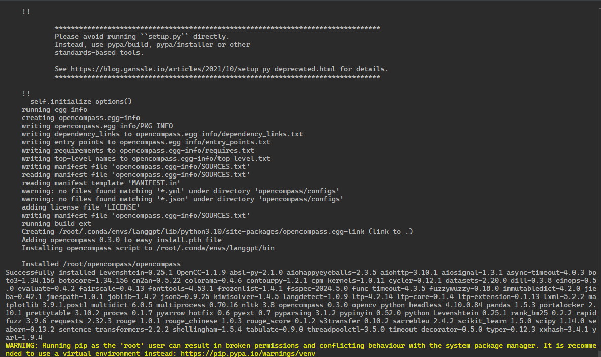
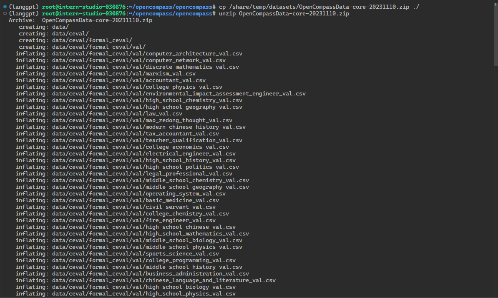
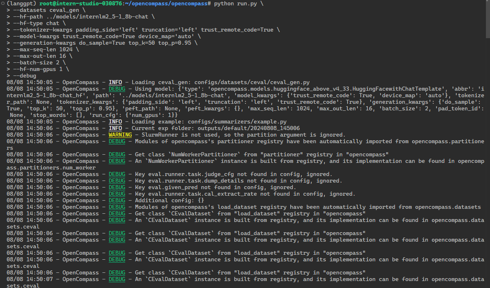
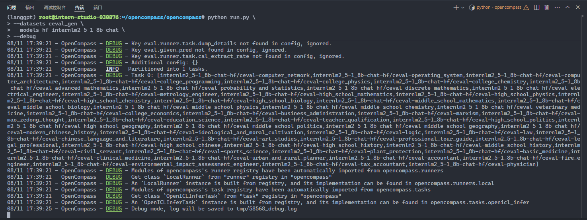
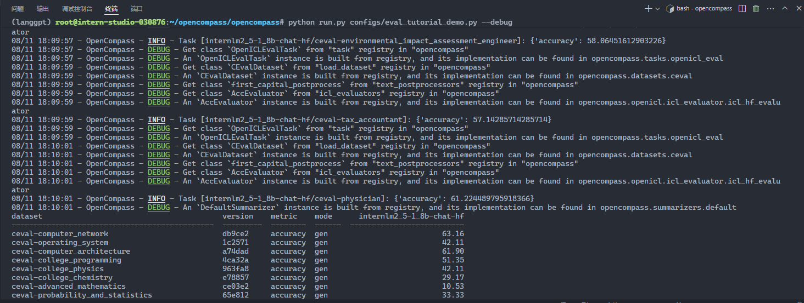
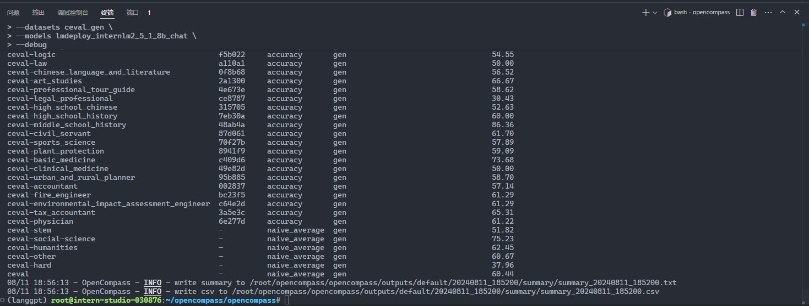
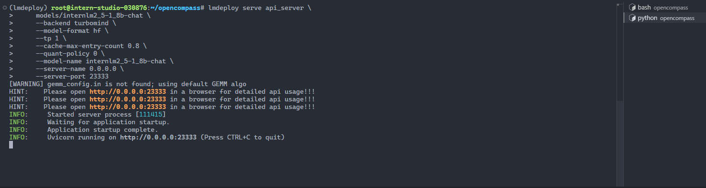

# OpenCompass 评测 InternLM-1.8B 实践

## 命令行评测

1. 安装 opencompass

```sh
mkdir opencompass
cd opencompass
git clone https://github.com/open-compass/opencompass.git
cd opencompass
pip install -v -e .
```



2. link 模型

```sh
(langgpt) root@intern-studio-030876:~/opencompass# mkdir models
(langgpt) root@intern-studio-030876:~/opencompass# cd models
(langgpt) root@intern-studio-030876:~/opencompass/models# ln -s /share/new_models/Shanghai_AI_Laboratory/internlm2_5-1_8b-chat/ ./
(langgpt) root@intern-studio-030876:~/opencompass/models# ls
internlm2_5-1_8b-chat
```

3. 数据准备

解压评测数据集到 data/ 处

```
cd /root/opencompass/opencompass
cp /share/temp/datasets/OpenCompassData-core-20231110.zip ./
unzip OpenCompassData-core-20231110.zip
```



4.查看支持的数据集和模型

列出所有跟 InternLM 及 C-Eval 相关的配置

```sh
python tools/list_configs.py internlm ceval
```

```
(langgpt) root@intern-studio-030876:~/opencompass/opencompass# python tools/list_configs.py internlm ceval
+----------------------------------------+----------------------------------------------------------------------+
| Model                                  | Config Path                                                          |
|----------------------------------------+----------------------------------------------------------------------|
| hf_internlm2_1_8b                      | configs/models/hf_internlm/hf_internlm2_1_8b.py                      |
| hf_internlm2_20b                       | configs/models/hf_internlm/hf_internlm2_20b.py                       |
| hf_internlm2_5_1_8b_chat               | configs/models/hf_internlm/hf_internlm2_5_1_8b_chat.py               |
| hf_internlm2_5_20b_chat                | configs/models/hf_internlm/hf_internlm2_5_20b_chat.py                |
| hf_internlm2_5_7b                      | configs/models/hf_internlm/hf_internlm2_5_7b.py                      |
| hf_internlm2_5_7b_chat                 | configs/models/hf_internlm/hf_internlm2_5_7b_chat.py                 |
| hf_internlm2_7b                        | configs/models/hf_internlm/hf_internlm2_7b.py                        |
| hf_internlm2_base_20b                  | configs/models/hf_internlm/hf_internlm2_base_20b.py                  |
| hf_internlm2_base_7b                   | configs/models/hf_internlm/hf_internlm2_base_7b.py                   |
| hf_internlm2_chat_1_8b                 | configs/models/hf_internlm/hf_internlm2_chat_1_8b.py                 |
| hf_internlm2_chat_1_8b_sft             | configs/models/hf_internlm/hf_internlm2_chat_1_8b_sft.py             |
| hf_internlm2_chat_20b                  | configs/models/hf_internlm/hf_internlm2_chat_20b.py                  |
| hf_internlm2_chat_20b_sft              | configs/models/hf_internlm/hf_internlm2_chat_20b_sft.py              |
| hf_internlm2_chat_20b_with_system      | configs/models/hf_internlm/hf_internlm2_chat_20b_with_system.py      |
| hf_internlm2_chat_7b                   | configs/models/hf_internlm/hf_internlm2_chat_7b.py                   |
| hf_internlm2_chat_7b_sft               | configs/models/hf_internlm/hf_internlm2_chat_7b_sft.py               |
| hf_internlm2_chat_7b_with_system       | configs/models/hf_internlm/hf_internlm2_chat_7b_with_system.py       |
| hf_internlm2_chat_math_20b             | configs/models/hf_internlm/hf_internlm2_chat_math_20b.py             |
| hf_internlm2_chat_math_20b_with_system | configs/models/hf_internlm/hf_internlm2_chat_math_20b_with_system.py |
| hf_internlm2_chat_math_7b              | configs/models/hf_internlm/hf_internlm2_chat_math_7b.py              |
| hf_internlm2_chat_math_7b_with_system  | configs/models/hf_internlm/hf_internlm2_chat_math_7b_with_system.py  |
| hf_internlm2_math_20b                  | configs/models/hf_internlm/hf_internlm2_math_20b.py                  |
| hf_internlm2_math_7b                   | configs/models/hf_internlm/hf_internlm2_math_7b.py                   |
| hf_internlm_20b                        | configs/models/hf_internlm/hf_internlm_20b.py                        |
| hf_internlm_7b                         | configs/models/hf_internlm/hf_internlm_7b.py                         |
| hf_internlm_chat_20b                   | configs/models/hf_internlm/hf_internlm_chat_20b.py                   |
| hf_internlm_chat_7b                    | configs/models/hf_internlm/hf_internlm_chat_7b.py                    |
| internlm_7b                            | configs/models/internlm/internlm_7b.py                               |
| lmdeploy_internlm2_1_8b                | configs/models/hf_internlm/lmdeploy_internlm2_1_8b.py                |
| lmdeploy_internlm2_20b                 | configs/models/hf_internlm/lmdeploy_internlm2_20b.py                 |
| lmdeploy_internlm2_5_1_8b_chat         | configs/models/hf_internlm/lmdeploy_internlm2_5_1_8b_chat.py         |
| lmdeploy_internlm2_5_20b_chat          | configs/models/hf_internlm/lmdeploy_internlm2_5_20b_chat.py          |
| lmdeploy_internlm2_5_7b                | configs/models/hf_internlm/lmdeploy_internlm2_5_7b.py                |
| lmdeploy_internlm2_5_7b_chat           | configs/models/hf_internlm/lmdeploy_internlm2_5_7b_chat.py           |
| lmdeploy_internlm2_5_7b_chat_1m        | configs/models/hf_internlm/lmdeploy_internlm2_5_7b_chat_1m.py        |
| lmdeploy_internlm2_7b                  | configs/models/hf_internlm/lmdeploy_internlm2_7b.py                  |
| lmdeploy_internlm2_base_20b            | configs/models/hf_internlm/lmdeploy_internlm2_base_20b.py            |
| lmdeploy_internlm2_base_7b             | configs/models/hf_internlm/lmdeploy_internlm2_base_7b.py             |
| lmdeploy_internlm2_chat_1_8b           | configs/models/hf_internlm/lmdeploy_internlm2_chat_1_8b.py           |
| lmdeploy_internlm2_chat_1_8b_sft       | configs/models/hf_internlm/lmdeploy_internlm2_chat_1_8b_sft.py       |
| lmdeploy_internlm2_chat_20b            | configs/models/hf_internlm/lmdeploy_internlm2_chat_20b.py            |
| lmdeploy_internlm2_chat_20b_sft        | configs/models/hf_internlm/lmdeploy_internlm2_chat_20b_sft.py        |
| lmdeploy_internlm2_chat_7b             | configs/models/hf_internlm/lmdeploy_internlm2_chat_7b.py             |
| lmdeploy_internlm2_chat_7b_sft         | configs/models/hf_internlm/lmdeploy_internlm2_chat_7b_sft.py         |
| lmdeploy_internlm2_series              | configs/models/hf_internlm/lmdeploy_internlm2_series.py              |
| lmdeploy_internlm_20b                  | configs/models/hf_internlm/lmdeploy_internlm_20b.py                  |
| lmdeploy_internlm_7b                   | configs/models/hf_internlm/lmdeploy_internlm_7b.py                   |
| lmdeploy_internlm_chat_20b             | configs/models/hf_internlm/lmdeploy_internlm_chat_20b.py             |
| lmdeploy_internlm_chat_7b              | configs/models/hf_internlm/lmdeploy_internlm_chat_7b.py              |
| ms_internlm_chat_7b_8k                 | configs/models/ms_internlm/ms_internlm_chat_7b_8k.py                 |
| vllm_internlm2_chat_1_8b               | configs/models/hf_internlm/vllm_internlm2_chat_1_8b.py               |
| vllm_internlm2_chat_1_8b_sft           | configs/models/hf_internlm/vllm_internlm2_chat_1_8b_sft.py           |
| vllm_internlm2_chat_20b                | configs/models/hf_internlm/vllm_internlm2_chat_20b.py                |
| vllm_internlm2_chat_20b_sft            | configs/models/hf_internlm/vllm_internlm2_chat_20b_sft.py            |
| vllm_internlm2_chat_7b                 | configs/models/hf_internlm/vllm_internlm2_chat_7b.py                 |
| vllm_internlm2_chat_7b_sft             | configs/models/hf_internlm/vllm_internlm2_chat_7b_sft.py             |
| vllm_internlm2_series                  | configs/models/hf_internlm/vllm_internlm2_series.py                  |
+----------------------------------------+----------------------------------------------------------------------+
+--------------------------------+------------------------------------------------------------------+
| Dataset                        | Config Path                                                      |
|--------------------------------+------------------------------------------------------------------|
| ceval_clean_ppl                | configs/datasets/ceval/ceval_clean_ppl.py                        |
| ceval_contamination_ppl_810ec6 | configs/datasets/contamination/ceval_contamination_ppl_810ec6.py |
| ceval_gen                      | configs/datasets/ceval/ceval_gen.py                              |
| ceval_gen_2daf24               | configs/datasets/ceval/ceval_gen_2daf24.py                       |
| ceval_gen_5f30c7               | configs/datasets/ceval/ceval_gen_5f30c7.py                       |
| ceval_internal_ppl_1cd8bf      | configs/datasets/ceval/ceval_internal_ppl_1cd8bf.py              |
| ceval_internal_ppl_93e5ce      | configs/datasets/ceval/ceval_internal_ppl_93e5ce.py              |
| ceval_ppl                      | configs/datasets/ceval/ceval_ppl.py                              |
| ceval_ppl_1cd8bf               | configs/datasets/ceval/ceval_ppl_1cd8bf.py                       |
| ceval_ppl_578f8d               | configs/datasets/ceval/ceval_ppl_578f8d.py                       |
| ceval_ppl_93e5ce               | configs/datasets/ceval/ceval_ppl_93e5ce.py                       |
| ceval_zero_shot_gen_bd40ef     | configs/datasets/ceval/ceval_zero_shot_gen_bd40ef.py             |
+--------------------------------+------------------------------------------------------------------+
```

5. 启动评测

```sh
cd /root/opencompass/opencompass/

export MKL_SERVICE_FORCE_INTEL=1
# 或
export MKL_THREADING_LAYER=GNU

python run.py \
--datasets ceval_gen \
--hf-path ../models/internlm2_5-1_8b-chat \
--hf-type chat \
--tokenizer-kwargs padding_side='left' truncation='left' trust_remote_code=True \
--model-kwargs trust_remote_code=True device_map='auto' \
--generation-kwargs do_sample=True top_k=50 top_p=0.95 \
--max-seq-len 1024 \
--max-out-len 16 \
--batch-size 2 \
--hf-num-gpus 1 \
--debug
```



评测结果如下

```sh
dataset                                         version    metric         mode      internlm2_5-1_8b-chat_hf
----------------------------------------------  ---------  -------------  ------  --------------------------
ceval-computer_network                          db9ce2     accuracy       gen                          47.37
ceval-operating_system                          1c2571     accuracy       gen                          36.84
ceval-computer_architecture                     a74dad     accuracy       gen                          47.62
ceval-college_programming                       4ca32a     accuracy       gen                          54.05
ceval-college_physics                           963fa8     accuracy       gen                          36.84
ceval-college_chemistry                         e78857     accuracy       gen                          45.83
ceval-advanced_mathematics                      ce03e2     accuracy       gen                          31.58
ceval-probability_and_statistics                65e812     accuracy       gen                          38.89
ceval-discrete_mathematics                      e894ae     accuracy       gen                          31.25
ceval-electrical_engineer                       ae42b9     accuracy       gen                          29.73
ceval-metrology_engineer                        ee34ea     accuracy       gen                          75.00
ceval-high_school_mathematics                   1dc5bf     accuracy       gen                          11.11
ceval-high_school_physics                       adf25f     accuracy       gen                          47.37
ceval-high_school_chemistry                     2ed27f     accuracy       gen                          47.37
ceval-high_school_biology                       8e2b9a     accuracy       gen                          57.89
ceval-middle_school_mathematics                 bee8d5     accuracy       gen                          47.37
ceval-middle_school_biology                     86817c     accuracy       gen                          76.19
ceval-middle_school_physics                     8accf6     accuracy       gen                          84.21
ceval-middle_school_chemistry                   167a15     accuracy       gen                          80.00
ceval-veterinary_medicine                       b4e08d     accuracy       gen                          65.22
ceval-college_economics                         f3f4e6     accuracy       gen                          54.55
ceval-business_administration                   c1614e     accuracy       gen                          72.73
ceval-marxism                                   cf874c     accuracy       gen                          68.42
ceval-mao_zedong_thought                        51c7a4     accuracy       gen                          79.17
ceval-education_science                         591fee     accuracy       gen                          75.86
ceval-teacher_qualification                     4e4ced     accuracy       gen                          72.73
ceval-high_school_politics                      5c0de2     accuracy       gen                          78.95
ceval-high_school_geography                     865461     accuracy       gen                          73.68
ceval-middle_school_politics                    5be3e7     accuracy       gen                          76.19
ceval-middle_school_geography                   8a63be     accuracy       gen                          83.33
ceval-modern_chinese_history                    fc01af     accuracy       gen                          73.91
ceval-ideological_and_moral_cultivation         a2aa4a     accuracy       gen                          89.47
ceval-logic                                     f5b022     accuracy       gen                          40.91
ceval-law                                       a110a1     accuracy       gen                          37.50
ceval-chinese_language_and_literature           0f8b68     accuracy       gen                          52.17
ceval-art_studies                               2a1300     accuracy       gen                          60.61
ceval-professional_tour_guide                   4e673e     accuracy       gen                          55.17
ceval-legal_professional                        ce8787     accuracy       gen                          43.48
ceval-high_school_chinese                       315705     accuracy       gen                          42.11
ceval-high_school_history                       7eb30a     accuracy       gen                          65.00
ceval-middle_school_history                     48ab4a     accuracy       gen                          86.36
ceval-civil_servant                             87d061     accuracy       gen                          51.06
ceval-sports_science                            70f27b     accuracy       gen                          52.63
ceval-plant_protection                          8941f9     accuracy       gen                          45.45
ceval-basic_medicine                            c409d6     accuracy       gen                          73.68
ceval-clinical_medicine                         49e82d     accuracy       gen                          50.00
ceval-urban_and_rural_planner                   95b885     accuracy       gen                          45.65
ceval-accountant                                002837     accuracy       gen                          61.22
ceval-fire_engineer                             bc23f5     accuracy       gen                          38.71
ceval-environmental_impact_assessment_engineer  c64e2d     accuracy       gen                          54.84
ceval-tax_accountant                            3a5e3c     accuracy       gen                          61.22
ceval-physician                                 6e277d     accuracy       gen                          55.10
ceval-stem                                      -          naive_average  gen                          49.59
ceval-social-science                            -          naive_average  gen                          73.56
ceval-humanities                                -          naive_average  gen                          58.79
ceval-other                                     -          naive_average  gen                          53.60
ceval-hard                                      -          naive_average  gen                          36.28
ceval                                           -          naive_average  gen                          56.99
```

## 修改配置文件进行测试

1. 打开 opencompass文件夹下 `configs/models/hf_internlm`  的`hf_internlm2_5_1_8b_chat.py` ,贴入以下代码

```python
from opencompass.models import HuggingFacewithChatTemplate

models = [
    dict(
        type=HuggingFacewithChatTemplate,
        abbr='internlm2_5-1_8b-chat-hf',
        path='/root/opencompass/models/internlm2_5-1_8b-chat',
        tokenizer_path='/root/opencompass/models/internlm2_5-1_8b-chat',

        model_kwargs=dict(
            trust_remote_code=True,
            device_map='auto',
        ),
        tokenizer_kwargs=dict(
            padding_side='left',
            truncation_side='left',
            use_fast=False,
            trust_remote_code=True,
        ),
        generation_kwargs=dict(
        	do_sample=True,
            top_k=50,
            top_p=0.95,
        ),
        max_out_len=100,
        min_out_len=1,
        max_seq_len=2048,
        batch_size=8,
        run_cfg=dict(num_gpus=1, num_procs=1),
    )
]
```

2. 运行命令

```sh
cd /root/opencompass/opencompass/

export MKL_SERVICE_FORCE_INTEL=1
# 或
export MKL_THREADING_LAYER=GNU

python run.py \
--datasets ceval_gen \
--models hf_internlm2_5_1_8b_chat \
--debug
```

3. 运行成功



运行结果

```sh
dataset                                         version    metric         mode      internlm2_5-1_8b-chat-hf
----------------------------------------------  ---------  -------------  ------  --------------------------
ceval-computer_network                          db9ce2     accuracy       gen                          52.63
ceval-operating_system                          1c2571     accuracy       gen                          36.84
ceval-computer_architecture                     a74dad     accuracy       gen                          52.38
ceval-college_programming                       4ca32a     accuracy       gen                          48.65
ceval-college_physics                           963fa8     accuracy       gen                          31.58
ceval-college_chemistry                         e78857     accuracy       gen                          50.00
ceval-advanced_mathematics                      ce03e2     accuracy       gen                          26.32
ceval-probability_and_statistics                65e812     accuracy       gen                          33.33
ceval-discrete_mathematics                      e894ae     accuracy       gen                          25.00
ceval-electrical_engineer                       ae42b9     accuracy       gen                          37.84
ceval-metrology_engineer                        ee34ea     accuracy       gen                          62.50
ceval-high_school_mathematics                   1dc5bf     accuracy       gen                          16.67
ceval-high_school_physics                       adf25f     accuracy       gen                          47.37
ceval-high_school_chemistry                     2ed27f     accuracy       gen                          52.63
ceval-high_school_biology                       8e2b9a     accuracy       gen                          57.89
ceval-middle_school_mathematics                 bee8d5     accuracy       gen                          57.89
ceval-middle_school_biology                     86817c     accuracy       gen                          76.19
ceval-middle_school_physics                     8accf6     accuracy       gen                          63.16
ceval-middle_school_chemistry                   167a15     accuracy       gen                          80.00
ceval-veterinary_medicine                       b4e08d     accuracy       gen                          65.22
ceval-college_economics                         f3f4e6     accuracy       gen                          50.91
ceval-business_administration                   c1614e     accuracy       gen                          66.67
ceval-marxism                                   cf874c     accuracy       gen                          73.68
ceval-mao_zedong_thought                        51c7a4     accuracy       gen                          79.17
ceval-education_science                         591fee     accuracy       gen                          72.41
ceval-teacher_qualification                     4e4ced     accuracy       gen                          77.27
ceval-high_school_politics                      5c0de2     accuracy       gen                          63.16
ceval-high_school_geography                     865461     accuracy       gen                          63.16
ceval-middle_school_politics                    5be3e7     accuracy       gen                          80.95
ceval-middle_school_geography                   8a63be     accuracy       gen                          75.00
ceval-modern_chinese_history                    fc01af     accuracy       gen                          86.96
ceval-ideological_and_moral_cultivation         a2aa4a     accuracy       gen                          84.21
ceval-logic                                     f5b022     accuracy       gen                          27.27
ceval-law                                       a110a1     accuracy       gen                          50.00
ceval-chinese_language_and_literature           0f8b68     accuracy       gen                          56.52
ceval-art_studies                               2a1300     accuracy       gen                          60.61
ceval-professional_tour_guide                   4e673e     accuracy       gen                          65.52
ceval-legal_professional                        ce8787     accuracy       gen                          34.78
ceval-high_school_chinese                       315705     accuracy       gen                          47.37
ceval-high_school_history                       7eb30a     accuracy       gen                          65.00
ceval-middle_school_history                     48ab4a     accuracy       gen                          86.36
ceval-civil_servant                             87d061     accuracy       gen                          55.32
ceval-sports_science                            70f27b     accuracy       gen                          57.89
ceval-plant_protection                          8941f9     accuracy       gen                          59.09
ceval-basic_medicine                            c409d6     accuracy       gen                          63.16
ceval-clinical_medicine                         49e82d     accuracy       gen                          50.00
ceval-urban_and_rural_planner                   95b885     accuracy       gen                          50.00
ceval-accountant                                002837     accuracy       gen                          53.06
ceval-fire_engineer                             bc23f5     accuracy       gen                          32.26
ceval-environmental_impact_assessment_engineer  c64e2d     accuracy       gen                          61.29
ceval-tax_accountant                            3a5e3c     accuracy       gen                          67.35
ceval-physician                                 6e277d     accuracy       gen                          59.18
ceval-stem                                      -          naive_average  gen                          48.70
ceval-social-science                            -          naive_average  gen                          70.24
ceval-humanities                                -          naive_average  gen                          60.42
ceval-other                                     -          naive_average  gen                          55.33
ceval-hard                                      -          naive_average  gen                          35.36
ceval                                           -          naive_average  gen                          56.72
08/11 17:56:12 - OpenCompass - INFO - write summary to /root/opencompass/opencompass/outputs/default/20240811_175140/summary/summary_20240811_175140.txt
08/11 17:56:12 - OpenCompass - INFO - write csv to /root/opencompass/opencompass/outputs/default/20240811_175140/summary/summary_20240811_175140.csv
```

## 使用配置文件修改参数法进行评测

除了通过命令行配置实验外，OpenCompass 还允许用户在配置文件中编写实验的完整配置，并通过 run.py 直接运行它。配置文件是以 Python 格式组织的，并且必须包括 datasets 和 models 字段。本次测试配置在 `configs`文件夹 中。此配置通过 继承机制 引入所需的数据集和模型配置，并以所需格式组合 datasets 和 models 字段。 运行以下代码，在configs文件夹下创建`eval_tutorial_demo.py`

```sh
cd /root/opencompass/opencompass/configs
touch eval_tutorial_demo.py
```

1.打开`eval_tutorial_demo.py` 贴入以下代码

```python
from mmengine.config import read_base

with read_base():
    from .datasets.ceval.ceval_gen import ceval_datasets
    from .models.hf_internlm.hf_internlm2_5_1_8b_chat import models as hf_internlm2_5_1_8b_chat

datasets = ceval_datasets
models = hf_internlm2_5_1_8b_chat
```

2. 运行任务时，我们只需将配置文件的路径传递给 `run.py`：

```sh
cd /root/opencompass/opencompass/

export MKL_SERVICE_FORCE_INTEL=1
# 或
export MKL_THREADING_LAYER=GNU

python run.py configs/eval_tutorial_demo.py --debug
```

3. 运行成功



运行结果

```sh
dataset                                         version    metric    mode      internlm2_5-1_8b-chat-hf
----------------------------------------------  ---------  --------  ------  --------------------------
ceval-computer_network                          db9ce2     accuracy  gen                          63.16
ceval-operating_system                          1c2571     accuracy  gen                          42.11
ceval-computer_architecture                     a74dad     accuracy  gen                          61.90
ceval-college_programming                       4ca32a     accuracy  gen                          51.35
ceval-college_physics                           963fa8     accuracy  gen                          42.11
ceval-college_chemistry                         e78857     accuracy  gen                          29.17
ceval-advanced_mathematics                      ce03e2     accuracy  gen                          10.53
ceval-probability_and_statistics                65e812     accuracy  gen                          33.33
ceval-discrete_mathematics                      e894ae     accuracy  gen                          25.00
ceval-electrical_engineer                       ae42b9     accuracy  gen                          27.03
ceval-metrology_engineer                        ee34ea     accuracy  gen                          75.00
ceval-high_school_mathematics                   1dc5bf     accuracy  gen                          33.33
ceval-high_school_physics                       adf25f     accuracy  gen                          47.37
ceval-high_school_chemistry                     2ed27f     accuracy  gen                          36.84
ceval-high_school_biology                       8e2b9a     accuracy  gen                          52.63
ceval-middle_school_mathematics                 bee8d5     accuracy  gen                          42.11
ceval-middle_school_biology                     86817c     accuracy  gen                          76.19
ceval-middle_school_physics                     8accf6     accuracy  gen                          78.95
ceval-middle_school_chemistry                   167a15     accuracy  gen                          75.00
ceval-veterinary_medicine                       b4e08d     accuracy  gen                          56.52
ceval-college_economics                         f3f4e6     accuracy  gen                          45.45
ceval-business_administration                   c1614e     accuracy  gen                          78.79
ceval-marxism                                   cf874c     accuracy  gen                          78.95
ceval-mao_zedong_thought                        51c7a4     accuracy  gen                          75.00
ceval-education_science                         591fee     accuracy  gen                          86.21
ceval-teacher_qualification                     4e4ced     accuracy  gen                          75.00
ceval-high_school_politics                      5c0de2     accuracy  gen                          78.95
ceval-high_school_geography                     865461     accuracy  gen                          63.16
ceval-middle_school_politics                    5be3e7     accuracy  gen                          61.90
ceval-middle_school_geography                   8a63be     accuracy  gen                          66.67
ceval-modern_chinese_history                    fc01af     accuracy  gen                          78.26
ceval-ideological_and_moral_cultivation         a2aa4a     accuracy  gen                          89.47
ceval-logic                                     f5b022     accuracy  gen                          59.09
ceval-law                                       a110a1     accuracy  gen                          45.83
ceval-chinese_language_and_literature           0f8b68     accuracy  gen                          52.17
ceval-art_studies                               2a1300     accuracy  gen                          54.55
ceval-professional_tour_guide                   4e673e     accuracy  gen                          65.52
ceval-legal_professional                        ce8787     accuracy  gen                          26.09
ceval-high_school_chinese                       315705     accuracy  gen                          42.11
ceval-high_school_history                       7eb30a     accuracy  gen                          70.00
ceval-middle_school_history                     48ab4a     accuracy  gen                          90.91
ceval-civil_servant                             87d061     accuracy  gen                          57.45
ceval-sports_science                            70f27b     accuracy  gen                          57.89
ceval-plant_protection                          8941f9     accuracy  gen                          59.09
ceval-basic_medicine                            c409d6     accuracy  gen                          63.16
ceval-clinical_medicine                         49e82d     accuracy  gen                          40.91
ceval-urban_and_rural_planner                   95b885     accuracy  gen                          58.70
ceval-accountant                                002837     accuracy  gen                          63.27
ceval-fire_engineer                             bc23f5     accuracy  gen                          51.61
ceval-environmental_impact_assessment_engineer  c64e2d     accuracy  gen                          58.06
ceval-tax_accountant                            3a5e3c     accuracy  gen                          57.14
ceval-physician                                 6e277d     accuracy  gen                          61.22
08/11 18:10:02 - OpenCompass - INFO - write summary to /root/opencompass/opencompass/outputs/default/20240811_180452/summary/summary_20240811_180452.txt
08/11 18:10:02 - OpenCompass - INFO - write csv to /root/opencompass/opencompass/outputs/default/20240811_180452/summary/summary_20240811_180452.csv
```

# 使用 OpenCompass 评测 internlm2_5-1_8b-chat 模型使用 LMDeploy部署后在 ceval 数据集上的性能

1. 打开 opencompass文件夹下 `configs/models/hf_internlm`  的`lmdeploy_internlm2_5_1_8b_chat` ,贴入以下代码

```python
from opencompass.models import TurboMindModelwithChatTemplate

models = [
    dict(
        type=TurboMindModelwithChatTemplate,
        abbr='internlm2_5-1_8b-chat-turbomind',
        path='/root/opencompass/models/internlm2_5-1_8b-chat',
        engine_config=dict(session_len=8192, max_batch_size=16, tp=1),
        gen_config=dict(top_k=1, temperature=1e-6, top_p=0.9, max_new_tokens=2048),
        max_seq_len=8192,
        max_out_len=2048,
        batch_size=16,
        run_cfg=dict(num_gpus=1),
    )
]
```

2. 运行命令

```sh
cd /root/opencompass/opencompass/

export MKL_SERVICE_FORCE_INTEL=1
# 或
export MKL_THREADING_LAYER=GNU

python run.py \
--datasets ceval_gen \
--models lmdeploy_internlm2_5_1_8b_chat \
--debug
```

3. 运行成功



运行结果

```sh
dataset                                         version    metric         mode      internlm2_5-1_8b-chat-turbomind
----------------------------------------------  ---------  -------------  ------  ---------------------------------
ceval-computer_network                          db9ce2     accuracy       gen                                 42.11
ceval-operating_system                          1c2571     accuracy       gen                                 42.11
ceval-computer_architecture                     a74dad     accuracy       gen                                 57.14
ceval-college_programming                       4ca32a     accuracy       gen                                 54.05
ceval-college_physics                           963fa8     accuracy       gen                                 26.32
ceval-college_chemistry                         e78857     accuracy       gen                                 33.33
ceval-advanced_mathematics                      ce03e2     accuracy       gen                                 52.63
ceval-probability_and_statistics                65e812     accuracy       gen                                 50.00
ceval-discrete_mathematics                      e894ae     accuracy       gen                                 25.00
ceval-electrical_engineer                       ae42b9     accuracy       gen                                 43.24
ceval-metrology_engineer                        ee34ea     accuracy       gen                                 79.17
ceval-high_school_mathematics                   1dc5bf     accuracy       gen                                 11.11
ceval-high_school_physics                       adf25f     accuracy       gen                                 68.42
ceval-high_school_chemistry                     2ed27f     accuracy       gen                                 36.84
ceval-high_school_biology                       8e2b9a     accuracy       gen                                 57.89
ceval-middle_school_mathematics                 bee8d5     accuracy       gen                                 52.63
ceval-middle_school_biology                     86817c     accuracy       gen                                 80.95
ceval-middle_school_physics                     8accf6     accuracy       gen                                 78.95
ceval-middle_school_chemistry                   167a15     accuracy       gen                                 75.00
ceval-veterinary_medicine                       b4e08d     accuracy       gen                                 69.57
ceval-college_economics                         f3f4e6     accuracy       gen                                 60.00
ceval-business_administration                   c1614e     accuracy       gen                                 66.67
ceval-marxism                                   cf874c     accuracy       gen                                 78.95
ceval-mao_zedong_thought                        51c7a4     accuracy       gen                                 87.50
ceval-education_science                         591fee     accuracy       gen                                 79.31
ceval-teacher_qualification                     4e4ced     accuracy       gen                                 81.82
ceval-high_school_politics                      5c0de2     accuracy       gen                                 78.95
ceval-high_school_geography                     865461     accuracy       gen                                 63.16
ceval-middle_school_politics                    5be3e7     accuracy       gen                                 80.95
ceval-middle_school_geography                   8a63be     accuracy       gen                                 75.00
ceval-modern_chinese_history                    fc01af     accuracy       gen                                 86.96
ceval-ideological_and_moral_cultivation         a2aa4a     accuracy       gen                                 84.21
ceval-logic                                     f5b022     accuracy       gen                                 54.55
ceval-law                                       a110a1     accuracy       gen                                 50.00
ceval-chinese_language_and_literature           0f8b68     accuracy       gen                                 56.52
ceval-art_studies                               2a1300     accuracy       gen                                 66.67
ceval-professional_tour_guide                   4e673e     accuracy       gen                                 58.62
ceval-legal_professional                        ce8787     accuracy       gen                                 30.43
ceval-high_school_chinese                       315705     accuracy       gen                                 52.63
ceval-high_school_history                       7eb30a     accuracy       gen                                 60.00
ceval-middle_school_history                     48ab4a     accuracy       gen                                 86.36
ceval-civil_servant                             87d061     accuracy       gen                                 61.70
ceval-sports_science                            70f27b     accuracy       gen                                 57.89
ceval-plant_protection                          8941f9     accuracy       gen                                 59.09
ceval-basic_medicine                            c409d6     accuracy       gen                                 73.68
ceval-clinical_medicine                         49e82d     accuracy       gen                                 50.00
ceval-urban_and_rural_planner                   95b885     accuracy       gen                                 58.70
ceval-accountant                                002837     accuracy       gen                                 57.14
ceval-fire_engineer                             bc23f5     accuracy       gen                                 61.29
ceval-environmental_impact_assessment_engineer  c64e2d     accuracy       gen                                 61.29
ceval-tax_accountant                            3a5e3c     accuracy       gen                                 65.31
ceval-physician                                 6e277d     accuracy       gen                                 61.22
ceval-stem                                      -          naive_average  gen                                 51.82
ceval-social-science                            -          naive_average  gen                                 75.23
ceval-humanities                                -          naive_average  gen                                 62.45
ceval-other                                     -          naive_average  gen                                 60.67
ceval-hard                                      -          naive_average  gen                                 37.96
ceval                                           -          naive_average  gen                                 60.44
08/11 18:56:13 - OpenCompass - INFO - write summary to /root/opencompass/opencompass/outputs/default/20240811_185200/summary/summary_20240811_185200.txt
08/11 18:56:13 - OpenCompass - INFO - write csv to /root/opencompass/opencompass/outputs/default/20240811_185200/summary/summary_20240811_185200.csv
```

# 使用 OpenCompass 进行调用API评测

1. 使用 lmdeploy 启动 openai 兼容 api

```sh
lmdeploy serve api_server \
     models/internlm2_5-1_8b-chat \
     --backend turbomind \
     --model-format hf \
     --tp 1 \
     --cache-max-entry-count 0.8 \
     --quant-policy 0 \
     --model-name internlm2_5-1_8b-chat \
     --server-name 0.0.0.0 \
     --server-port 23333
```




2. 新建 api_model config

在 `opencompass/configs/models/openai` 目录新建 `hf_internlm2_5_1_8b_chat.py` 文件,然后添加如下代码。

```python
from opencompass.models import OpenAI


api_meta_template = dict(
    round=[
            dict(role='HUMAN', api_role='HUMAN'),
            dict(role='BOT', api_role='BOT', generate=True),
    ],
)

models = [
    dict(
        type=OpenAI,
        openai_api_base='http://0.0.0.0:23333',
        abbr='internlm2_5-1_8b-chat',
        path='internlm2_5-1_8b-chat',
        tokenizer_path='/root/opencompass/models/internlm2_5-1_8b-chat',
        key='',  # The key will be obtained from $OPENAI_API_KEY, but you can write down your key here as well
        meta_template=api_meta_template,
        query_per_second=1,
        max_out_len=2048,
        max_seq_len=4096,
        temperature=0.1,
    ),
]
```

3. 打开`/root/opencompass/opencompass/configs/eval_tutorial_demo.py` 贴入以下代码

```python
from mmengine.config import read_base

with read_base():
    from .datasets.ceval.ceval_gen import ceval_datasets
    from .models.openai.hf_internlm2_5_1_8b_chat import models as hf_internlm2_5_1_8b_chat

datasets = ceval_datasets
models = hf_internlm2_5_1_8b_chat
```

因此，运行任务时，我们只需将配置文件的路径传递给 `run.py`：

```sh
cd /root/opencompass/opencompass/
python run.py configs/eval_tutorial_demo.py --debug
```

