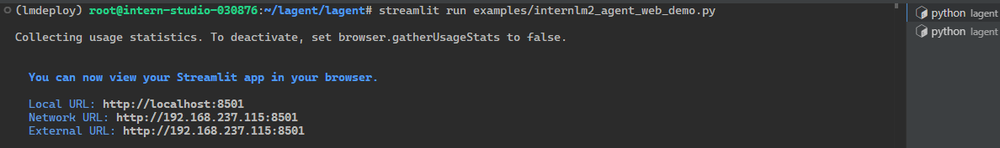

# 使用 Lagent Web Demo 部署一个智能体

1. 创建文件夹并 link 模型

```sh
(lmdeploy) root@intern-studio-030876:~# cd ~
(lmdeploy) root@intern-studio-030876:~# mkdir lagent
(lmdeploy) root@intern-studio-030876:~# cd lagent
(lmdeploy) root@intern-studio-030876:~/lagent# mkdir models
(lmdeploy) root@intern-studio-030876:~/lagent# cd models
(lmdeploy) root@intern-studio-030876:~/lagent/models# ln -s /share/new_models/Shanghai_AI_Laboratory/internlm2_5-7b-chat ./
(lmdeploy) root@intern-studio-030876:~/lagent/models# ls
internlm2_5-7b-chat
```

2. clone lagent

```
git clone https://github.com/InternLM/lagent.git
cd lagent && git checkout 81e7ace
pip install -v -e .
```

```sh
(lmdeploy) root@intern-studio-030876:~/lagent# git clone https://github.com/InternLM/lagent.git
Cloning into 'lagent'...
remote: Enumerating objects: 935, done.
remote: Counting objects: 100% (505/505), done.
remote: Compressing objects: 100% (263/263), done.
remote: Total 935 (delta 396), reused 256 (delta 242), pack-reused 430
Receiving objects: 100% (935/935), 385.58 KiB | 307.00 KiB/s, done.
Resolving deltas: 100% (564/564), done.
Updating files: 100% (105/105), done.
(lmdeploy) root@intern-studio-030876:~/lagent# cd lagent && git checkout 81e7ace
Note: switching to '81e7ace'.

You are in 'detached HEAD' state. You can look around, make experimental
changes and commit them, and you can discard any commits you make in this
state without impacting any branches by switching back to a branch.

If you want to create a new branch to retain commits you create, you may
do so (now or later) by using -c with the switch command. Example:

  git switch -c <new-branch-name>

Or undo this operation with:

  git switch -

Turn off this advice by setting config variable advice.detachedHead to false

HEAD is now at 81e7ace Feat: GPTAPI supports qwen (#218)
(lmdeploy) root@intern-studio-030876:~/lagent/lagent# pip install -v -e .
Using pip 24.2 from /root/.conda/envs/lmdeploy/lib/python3.10/site-packages/pip (python 3.10)
...

    Installed /root/lagent/lagent
Successfully installed duckduckgo_search-5.3.1b1 lagent
```

3. 使用 LMDeploy 部署 InternLM2.5-7B-Chat

```sh
lmdeploy serve api_server \
     models/internlm2_5-7b-chat \
     --backend turbomind \
     --model-format hf \
     --tp 1 \
     --cache-max-entry-count 0.8 \
     --quant-policy 0 \
     --model-name internlm2_5-7b-chat \
     --server-name 0.0.0.0 \
     --server-port 23333
```

```sh
(lmdeploy) root@intern-studio-030876:~/lagent# lmdeploy serve api_server \
>      models/internlm2_5-7b-chat \
>      --backend turbomind \
>      --model-format hf \
>      --tp 1 \
>      --cache-max-entry-count 0.8 \
>      --quant-policy 0 \
>      --model-name internlm2_5-7b-chat \
>      --server-name 0.0.0.0 \
>      --server-port 23333
[WARNING] gemm_config.in is not found; using default GEMM algo                                                                 
HINT:    Please open http://0.0.0.0:23333 in a browser for detailed api usage!!!
HINT:    Please open http://0.0.0.0:23333 in a browser for detailed api usage!!!
HINT:    Please open http://0.0.0.0:23333 in a browser for detailed api usage!!!
INFO:     Started server process [14898]
INFO:     Waiting for application startup.
INFO:     Application startup complete.
INFO:     Uvicorn running on http://0.0.0.0:23333 (Press CTRL+C to quit)
```


4. 启动 lagent webdemo

```sh
cd ~/lagent/lagent
streamlit run examples/internlm2_agent_web_demo.py
```

```sh
(lmdeploy) root@intern-studio-030876:~/lagent/lagent# streamlit run examples/internlm2_agent_web_demo.py

Collecting usage statistics. To deactivate, set browser.gatherUsageStats to false.


  You can now view your Streamlit app in your browser.

  Local URL: http://localhost:8501
  Network URL: http://192.168.237.115:8501
  External URL: http://192.168.237.115:8501
```



5. 映射端口

```sh
 ssh -CNg -L 8501:127.0.0.1:8501 root@ssh.intern-ai.org.cn -p 33344
```


6. 浏览器打开 127.0.0.1:8501

帮我搜索一下 Multi-token Prediction 论文


帮我搜索一下 An Introduction to Vision-Language Modeling 论文


# 使用 Lagent 自定义一个智能体

Lagent 中关于工具部分的介绍文档位于 https://lagent.readthedocs.io/zh-cn/latest/tutorials/action.html 。

使用 Lagent 自定义工具主要分为以下几步：

1. 继承 `BaseAction` 类
2. 实现简单工具的 `run` 方法；或者实现工具包内每个子工具的功能
3. 简单工具的 `run` 方法可选被 `tool_api` 装饰；工具包内每个子工具的功能都需要被 `tool_api` 装饰

下面我们将实现一个调用 MagicMaker API 以完成文生图的功能。

将下面的代码复制进入 `/root/lagent/lagent/lagent/actions/magicmaker.py`

```python
import json
import requests

from lagent.actions.base_action import BaseAction, tool_api
from lagent.actions.parser import BaseParser, JsonParser
from lagent.schema import ActionReturn, ActionStatusCode


class MagicMaker(BaseAction):
    styles_option = [
        'dongman',  # 动漫
        'guofeng',  # 国风
        'xieshi',   # 写实
        'youhua',   # 油画
        'manghe',   # 盲盒
    ]
    aspect_ratio_options = [
        '16:9', '4:3', '3:2', '1:1',
        '2:3', '3:4', '9:16'
    ]

    def __init__(self,
                 style='guofeng',
                 aspect_ratio='4:3'):
        super().__init__()
        if style in self.styles_option:
            self.style = style
        else:
            raise ValueError(f'The style must be one of {self.styles_option}')
        
        if aspect_ratio in self.aspect_ratio_options:
            self.aspect_ratio = aspect_ratio
        else:
            raise ValueError(f'The aspect ratio must be one of {aspect_ratio}')
    
    @tool_api
    def generate_image(self, keywords: str) -> dict:
        """Run magicmaker and get the generated image according to the keywords.

        Args:
            keywords (:class:`str`): the keywords to generate image

        Returns:
            :class:`dict`: the generated image
                * image (str): path to the generated image
        """
        try:
            response = requests.post(
                url='https://magicmaker.openxlab.org.cn/gw/edit-anything/api/v1/bff/sd/generate',
                data=json.dumps({
                    "official": True,
                    "prompt": keywords,
                    "style": self.style,
                    "poseT": False,
                    "aspectRatio": self.aspect_ratio
                }),
                headers={'content-type': 'application/json'}
            )
        except Exception as exc:
            return ActionReturn(
                errmsg=f'MagicMaker exception: {exc}',
                state=ActionStatusCode.HTTP_ERROR)
        image_url = response.json()['data']['imgUrl']
        return {'image': image_url}
```

修改 `/root/lagent/lagent/lagent/examples/internlm2_agent_web_demo.py` 来适配我们的自定义工具。

1. 在 `from lagent.actions import ActionExecutor, ArxivSearch, IPythonInterpreter` 的下一行添加 `from lagent.actions.magicmaker import MagicMaker`
2. 在第27行添加 `MagicMaker()`。

```diff
from lagent.actions import ActionExecutor, ArxivSearch, IPythonInterpreter
+ from lagent.actions.magicmaker import MagicMaker
from lagent.agents.internlm2_agent import INTERPRETER_CN, META_CN, PLUGIN_CN, Internlm2Agent, Internlm2Protocol

...
        action_list = [
            ArxivSearch(),
+           MagicMaker(),
        ]
```

再次启动 webdemo

请帮我生成一副动漫画，生成的返回了一个url，自己手动打开


同时使用论文搜索功能

