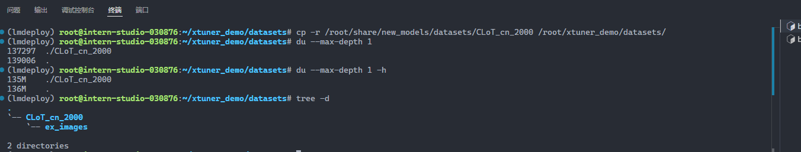

# QLoRA进行微调模型

1. 准备环境

```sh
cd ~/xtuner_demo
apt install libaio-dev
pip install xtuner[deepspeed] lmdeploy transformers streamlit timm matplotlib Pillow
```

我这里已经提前安装好了，检查安装

```sh
pip list | grep xtuner
pip list | grep lmdeploy
pip list | grep timm
xtuner version
xtuner help
```

```sh
(lmdeploy) root@intern-studio-030876:~/xtuner_demo# pip list | grep xtuner
xtuner                                   0.1.23
(lmdeploy) root@intern-studio-030876:~/xtuner_demo# pip list | grep lmdeploy
lmdeploy                                 0.5.3
(lmdeploy) root@intern-studio-030876:~/xtuner_demo# pip list | grep timm
timm                                     1.0.8
(lmdeploy) root@intern-studio-030876:~/xtuner_demo# xtuner version
08/18 16:23:28 - mmengine - INFO - 0.1.23
(lmdeploy) root@intern-studio-030876:~/xtuner_demo# xtuner help
08/18 16:23:56 - mmengine - INFO - 
    Arguments received: ['xtuner', 'help']. xtuner commands use the following syntax:

        xtuner MODE MODE_ARGS ARGS

        Where   MODE (required) is one of ('list-cfg', 'copy-cfg', 'log-dataset', 'check-custom-dataset', 'train', 'test', 'chat', 'convert', 'preprocess', 'mmbench', 'eval_refcoco')
                MODE_ARG (optional) is the argument for specific mode
                ARGS (optional) are the arguments for specific command

    Some usages for xtuner commands: (See more by using -h for specific command!)

        1. List all predefined configs:
            xtuner list-cfg
        2. Copy a predefined config to a given path:
            xtuner copy-cfg $CONFIG $SAVE_FILE
        3-1. Fine-tune LLMs by a single GPU:
            xtuner train $CONFIG
        3-2. Fine-tune LLMs by multiple GPUs:
            NPROC_PER_NODE=$NGPUS NNODES=$NNODES NODE_RANK=$NODE_RANK PORT=$PORT ADDR=$ADDR xtuner dist_train $CONFIG $GPUS
        4-1. Convert the pth model to HuggingFace's model:
            xtuner convert pth_to_hf $CONFIG $PATH_TO_PTH_MODEL $SAVE_PATH_TO_HF_MODEL
        4-2. Merge the HuggingFace's adapter to the pretrained base model:
            xtuner convert merge $LLM $ADAPTER $SAVE_PATH
            xtuner convert merge $CLIP $ADAPTER $SAVE_PATH --is-clip
        4-3. Split HuggingFace's LLM to the smallest sharded one:
            xtuner convert split $LLM $SAVE_PATH
        5-1. Chat with LLMs with HuggingFace's model and adapter:
            xtuner chat $LLM --adapter $ADAPTER --prompt-template $PROMPT_TEMPLATE --system-template $SYSTEM_TEMPLATE
        5-2. Chat with VLMs with HuggingFace's model and LLaVA:
            xtuner chat $LLM --llava $LLAVA --visual-encoder $VISUAL_ENCODER --image $IMAGE --prompt-template $PROMPT_TEMPLATE --system-template $SYSTEM_TEMPLATE
        6-1. Preprocess arxiv dataset:
            xtuner preprocess arxiv $SRC_FILE $DST_FILE --start-date $START_DATE --categories $CATEGORIES
        6-2. Preprocess refcoco dataset:
            xtuner preprocess refcoco --ann-path $RefCOCO_ANN_PATH --image-path $COCO_IMAGE_PATH --save-path $SAVE_PATH
        7-1. Log processed dataset:
            xtuner log-dataset $CONFIG
        7-2. Verify the correctness of the config file for the custom dataset:
            xtuner check-custom-dataset $CONFIG
        8. MMBench evaluation:
            xtuner mmbench $LLM --llava $LLAVA --visual-encoder $VISUAL_ENCODER --prompt-template $PROMPT_TEMPLATE --data-path $MMBENCH_DATA_PATH
        9. Refcoco evaluation:
            xtuner eval_refcoco $LLM --llava $LLAVA --visual-encoder $VISUAL_ENCODER --prompt-template $PROMPT_TEMPLATE --data-path $REFCOCO_DATA_PATH
        10. List all dataset formats which are supported in XTuner

    Run special commands:

        xtuner help
        xtuner version

    GitHub: https://github.com/InternLM/xtuner
```


2. 准备数据集

让我们把数据集挪出来

```sh
cp -r /share/new_models/datasets/CLoT_cn_2000 ~/xtuner_demo/datasets/
```



3. 复制一张图片

```sh
cd ~/xtuner_demo
cp datasets/CLoT_cn_2000/ex_images/007aPnLRgy1hb39z0im50j30ci0el0wm.jpg .
```

```sh
(lmdeploy) root@intern-studio-030876:~/xtuner_demo# cd ~/xtuner_demo
(lmdeploy) root@intern-studio-030876:~/xtuner_demo# cp datasets/CLoT_cn_2000/ex_images/007aPnLRgy1hb39z0im50j30ci0el0wm.jpg .
(lmdeploy) root@intern-studio-030876:~/xtuner_demo# ls
007aPnLRgy1hb39z0im50j30ci0el0wm.jpg  internlm2_5-1_8b-chat_qlora_custom_e3.py  work_dirs                     xtuner_streamlit_demo.py
datasets                              model                                     xtuner_generate_assistant.py
```


4. link 模型

```sh
cd ~/xtuner_demo/models/
ln -s /share/new_models/OpenGVLab/InternVL2-2B .
```

```sh
(lmdeploy) root@intern-studio-030876:~/xtuner_demo/models# ln -s /share/new_models/OpenGVLab/InternVL2-2B .
(lmdeploy) root@intern-studio-030876:~/xtuner_demo/models# ls
InternVL2-2B  internlm2_5-1_8b-chat
```


4. 尝试对话，创建一个py文件

```python
from lmdeploy import pipeline
from lmdeploy.vl import load_image

pipe = pipeline('models/InternVL2-2B')

image = load_image('007aPnLRgy1hb39z0im50j30ci0el0wm.jpg')
response = pipe(('请你根据这张图片，讲一个脑洞大开的梗', image))
print(response.text)
```

```sh
(lmdeploy) root@intern-studio-030876:~/xtuner_demo# python test_internvl.py 
[WARNING] gemm_config.in is not found; using default GEMM algo                                                                                                                        
这张图片中的猫咪看起来非常搞笑，它的嘴巴张得很大，好像在说“啊”或者“喵”，这使得它看起来像是在表达惊讶或兴奋。不过，这个表情和它所处的环境形成了强烈的反差，让人不禁会心一笑。

这个图片可以引申出很多有趣的梗，比如：

1. **“惊讶”梗**：猫咪张大嘴巴的表情让人联想到一些突然的、意想不到的事情，比如在突然看到某个令人惊讶的东西时，猫咪的表情可以很好地传达出这种情绪。

2. **“搞笑”梗**：猫咪的表情和姿势非常夸张，可以让人联想到一些搞笑的场景，比如在看到一些出乎意料的搞笑事情时，猫咪的表情会让人忍俊不禁。

3. **“撒娇”梗**：猫咪张大嘴巴的表情也可以被理解为是在撒娇，特别是当它对主人做出某种行为时，这种表情会让人觉得它非常可爱和依赖。

4. **“表情夸张”梗**：猫咪的表情过于夸张，以至于它看起来像是在说一些非常不正经的话，这种表情常常被用来调侃一些非常严肃或认真的事情。

总之，这张图片中的猫咪表情和它所处的环境形成了强烈的反差，通过这种反差，我们可以发挥出很多有趣的梗，让人会心一笑。
```


5. 准备微调文件

```sh
cd ~/xtuner_demo
xtuner list-cfg | grep internvl
xtuner copy-cfg internvl_v2_internlm2_2b_qlora_finetune .
```

```sh
(lmdeploy) root@intern-studio-030876:~/xtuner_demo# xtuner list-cfg | grep internvl
internvl_v1_5_internlm2_26b_finetune
internvl_v1_5_internlm2_26b_lora_finetune
internvl_v1_5_internlm2_26b_qlora_finetune
internvl_v1_5_internlm2_2b_finetune
internvl_v1_5_internlm2_2b_lora_finetune
internvl_v1_5_internlm2_2b_qlora_finetune
internvl_v1_5_phi3_4b_finetune
internvl_v1_5_phi3_4b_lora_finetune
internvl_v1_5_phi3_4b_qlora_finetune
internvl_v2_internlm2_26b_finetune
internvl_v2_internlm2_26b_lora_finetune
internvl_v2_internlm2_26b_qlora_finetune
internvl_v2_internlm2_2b_finetune
internvl_v2_internlm2_2b_lora_finetune
internvl_v2_internlm2_2b_qlora_finetune
internvl_v2_internlm2_5_8b_finetune
internvl_v2_internlm2_5_8b_lora_finetune
internvl_v2_internlm2_5_8b_qlora_finetune
internvl_v2_phi3_4b_finetune
internvl_v2_phi3_4b_lora_finetune
internvl_v2_phi3_4b_qlora_finetune
llava_llama3_8b_instruct_full_clip_vit_large_p14_336_lora_e1_gpu8_internvl_finetune
llava_phi3_mini_4k_instruct_full_clip_vit_large_p14_336_full_e2_gpu8_internvl_finetune
(lmdeploy) root@intern-studio-030876:~/xtuner_demo# xtuner copy-cfg internvl_v2_internlm2_2b_qlora_finetune ./
Copy to ./internvl_v2_internlm2_2b_qlora_finetune_copy.py
```


6. 修改配置文件

`internvl_v2_internlm2_2b_qlora_finetune_e1_r128.py`

```python
# Copyright (c) OpenMMLab. All rights reserved.
from mmengine.hooks import (CheckpointHook, DistSamplerSeedHook, IterTimerHook,
                            LoggerHook, ParamSchedulerHook)
from mmengine.visualization import Visualizer, LocalVisBackend, TensorboardVisBackend
from mmengine.optim import AmpOptimWrapper, CosineAnnealingLR, LinearLR
from torch.optim import AdamW
from transformers import AutoTokenizer
from peft import LoraConfig, TaskType

from xtuner.dataset import InternVL_V1_5_Dataset
from xtuner.dataset.collate_fns import default_collate_fn
from xtuner.dataset.samplers import LengthGroupedSampler
from xtuner.engine.hooks import (DatasetInfoHook, EvaluateChatHook,
                                 ThroughputHook)
from xtuner.engine.runner import TrainLoop
from xtuner.model import InternVL_V1_5
from xtuner.utils import PROMPT_TEMPLATE

#######################################################################
#                          PART 1  Settings                           #
#######################################################################
# Model
model_path = './models/InternVL2-2B'

# Data
data_root = './datasets/CLoT_cn_2000/'
data_path = data_root + 'ex_cn.json'
image_folder = data_root # ex_cn.json 中的图片路径
prompt_template = PROMPT_TEMPLATE.internlm2_chat
max_length = 6656

# Scheduler & Optimizer
batch_size = 4  # per_device
accumulative_counts = 4
dataloader_num_workers = 4
max_epochs = 1
optim_type = AdamW
# official 1024 -> 4e-5
lr = 1e-6
betas = (0.9, 0.999)
weight_decay = 0.05
max_norm = 1  # grad clip
warmup_ratio = 0.03

# Save
by_epoch = False    # save and log by epoch or by iteration
save_steps = 1000
save_total_limit = 1  # Maximum checkpoints to keep (-1 means unlimited)

#######################################################################
#            PART 2  Model & Tokenizer & Image Processor              #
#######################################################################
model = dict(
    type=InternVL_V1_5,
    model_path=model_path,
    freeze_llm=True,
    freeze_visual_encoder=True,
    quantization_llm=True,  # or False
    quantization_vit=False,  # or True and uncomment visual_encoder_lora
    # comment the following lines if you don't want to use Lora in llm
    llm_lora=dict(
        type=LoraConfig,
        task_type=TaskType.CAUSAL_LM,
        r=128,
        lora_alpha=256,
        lora_dropout=0.05,
        target_modules=None),
    # uncomment the following lines if you don't want to use Lora in visual encoder # noqa
    # visual_encoder_lora=dict(
    #     type=LoraConfig, r=64, lora_alpha=16, lora_dropout=0.05,
    #     target_modules=['attn.qkv', 'attn.proj', 'mlp.fc1', 'mlp.fc2'])
)

#######################################################################
#                      PART 3  Dataset & Dataloader                   #
#######################################################################
llava_dataset = dict(
    type=InternVL_V1_5_Dataset,
    model_path=model_path,
    data_paths=data_path,
    image_folders=image_folder,
    template=prompt_template,
    max_length=max_length)

train_dataloader = dict(
    batch_size=batch_size,
    num_workers=dataloader_num_workers,
    dataset=llava_dataset,
    sampler=dict(
        type=LengthGroupedSampler,
        length_property='modality_length',
        per_device_batch_size=batch_size * accumulative_counts),
    collate_fn=dict(type=default_collate_fn))

#######################################################################
#                    PART 4  Scheduler & Optimizer                    #
#######################################################################
# optimizer
optim_wrapper = dict(
    type=AmpOptimWrapper,
    optimizer=dict(
        type=optim_type, lr=lr, betas=betas, weight_decay=weight_decay),
    clip_grad=dict(max_norm=max_norm, error_if_nonfinite=False),
    accumulative_counts=accumulative_counts,
    loss_scale='dynamic',
    dtype='float16')

# learning policy
# More information: https://github.com/open-mmlab/mmengine/blob/main/docs/en/tutorials/param_scheduler.md  # noqa: E501
param_scheduler = [
    dict(
        type=LinearLR,
        start_factor=1e-5,
        by_epoch=True,
        begin=0,
        end=warmup_ratio * max_epochs,
        convert_to_iter_based=True),
    dict(
        type=CosineAnnealingLR,
        eta_min=0.0,
        by_epoch=True,
        begin=warmup_ratio * max_epochs,
        end=max_epochs,
        convert_to_iter_based=True)
]

# train, val, test setting
# 在 EpochBased 模式下，val_interval 的默认值为 1，表示训练一个 Epoch，验证一次
# 在 IterBased 模式下，val_interval 的默认值为 1000，表示训练迭代 1000 次，验证一次
# train_cfg = dict(type=TrainLoop, max_epochs=max_epochs)
train_cfg = dict(by_epoch=True, max_epochs=max_epochs, val_interval=1)

#######################################################################
#                           PART 5  Runtime                           #
#######################################################################
# Log the dialogue periodically during the training process, optional
tokenizer = dict(
    type=AutoTokenizer.from_pretrained,
    pretrained_model_name_or_path=model_path,
    trust_remote_code=True)

custom_hooks = [
    dict(type=DatasetInfoHook, tokenizer=tokenizer),
    # dict(type=ThroughputHook)
]

# configure default hooks
default_hooks = dict(
    # record the time of every iteration.
    timer=dict(type=IterTimerHook),
    # print log every 10 iterations.
    logger=dict(type=LoggerHook, log_metric_by_epoch=False, interval=10),
    # enable the parameter scheduler.
    param_scheduler=dict(type=ParamSchedulerHook),
    # save checkpoint per `save_steps`.
    checkpoint=dict(
        type=CheckpointHook,
        save_optimizer=False,
        by_epoch=by_epoch,
        interval=save_steps,
        max_keep_ckpts=save_total_limit),
    # set sampler seed in distributed evrionment.
    sampler_seed=dict(type=DistSamplerSeedHook),
)

# configure environment
env_cfg = dict(
    # whether to enable cudnn benchmark
    cudnn_benchmark=False,
    # set multi process parameters
    mp_cfg=dict(mp_start_method='fork', opencv_num_threads=0),
    # set distributed parameters
    dist_cfg=dict(backend='nccl'),
)

# set visualizer
visualizer = dict(
    type=Visualizer,
    vis_backends=[dict(type=LocalVisBackend), dict(type=TensorboardVisBackend)]
)

# set log level
log_level = 'INFO'

# load from which checkpoint
load_from = None

# whether to resume training from the loaded checkpoint
resume = False

# Defaults to use random seed and disable `deterministic`
randomness = dict(seed=None, deterministic=False)

# set log processor
log_processor = dict(by_epoch=by_epoch)
```

7. 训练

```sh
cd ~/xtuner_demo
xtuner train internvl_v2_internlm2_2b_qlora_finetune_e1_r128.py --deepspeed deepspeed_zero2
```


8. 合并权重&&模型转换

用官方脚本进行权重合并

```sh
cd ~/xtuner_demo
python xtuner/configs/internvl/v1_5/convert_to_official.py \
    internvl_v2_internlm2_2b_qlora_finetune_e1_r128.py \
    work_dirs/internvl_v2_internlm2_2b_qlora_finetune_e1_r128/iter_500.pth \
    work_dirs/internvl_v2_internlm2_2b_qlora_finetune_e1_r128/iter_500_hf
```


9. 测试效果

修改运行文件模型路径

```python
from lmdeploy import pipeline, ChatTemplateConfig
from lmdeploy.vl import load_image

pipe = pipeline(
    'work_dirs/internvl_v2_internlm2_2b_qlora_finetune_e1_r128/iter_500_hf',
    chat_template_config=ChatTemplateConfig(model_name="internvl2-internlm2")
)

image = load_image('007aPnLRgy1hb39z0im50j30ci0el0wm.jpg')
response = pipe(('请你根据这张图片，讲一个脑洞大开的梗', image))
print(response.text)
```

效果很好

```python
(lmdeploy) root@intern-studio-030876:~/xtuner_demo# python test_internvl.py 
[WARNING] gemm_config.in is not found; using default GEMM algo                                                                                                                        
梗：猫也能学唱歌？！
```


# 降低 LoRA rank 进行微调模型

1. 准备配置文件

LoRA rank 从 128 改为 64

`r=128` -> `r=64`

`internvl_v2_internlm2_2b_qlora_finetune_e1_r64.py`

```python
# Copyright (c) OpenMMLab. All rights reserved.
from mmengine.hooks import (CheckpointHook, DistSamplerSeedHook, IterTimerHook,
                            LoggerHook, ParamSchedulerHook)
from mmengine.visualization import Visualizer, LocalVisBackend, TensorboardVisBackend
from mmengine.optim import AmpOptimWrapper, CosineAnnealingLR, LinearLR
from torch.optim import AdamW
from transformers import AutoTokenizer
from peft import LoraConfig, TaskType

from xtuner.dataset import InternVL_V1_5_Dataset
from xtuner.dataset.collate_fns import default_collate_fn
from xtuner.dataset.samplers import LengthGroupedSampler
from xtuner.engine.hooks import (DatasetInfoHook, EvaluateChatHook,
                                 ThroughputHook)
from xtuner.engine.runner import TrainLoop
from xtuner.model import InternVL_V1_5
from xtuner.utils import PROMPT_TEMPLATE

#######################################################################
#                          PART 1  Settings                           #
#######################################################################
# Model
model_path = './models/InternVL2-2B'

# Data
data_root = './datasets/CLoT_cn_2000/'
data_path = data_root + 'ex_cn.json'
image_folder = data_root # ex_cn.json 中的图片路径
prompt_template = PROMPT_TEMPLATE.internlm2_chat
max_length = 6656

# Scheduler & Optimizer
batch_size = 4  # per_device
accumulative_counts = 4
dataloader_num_workers = 4
max_epochs = 1
optim_type = AdamW
# official 1024 -> 4e-5
lr = 1e-6
betas = (0.9, 0.999)
weight_decay = 0.05
max_norm = 1  # grad clip
warmup_ratio = 0.03

# Save
by_epoch = False    # save and log by epoch or by iteration
save_steps = 1000
save_total_limit = 1  # Maximum checkpoints to keep (-1 means unlimited)

#######################################################################
#            PART 2  Model & Tokenizer & Image Processor              #
#######################################################################
model = dict(
    type=InternVL_V1_5,
    model_path=model_path,
    freeze_llm=True,
    freeze_visual_encoder=True,
    quantization_llm=True,  # or False
    quantization_vit=False,  # or True and uncomment visual_encoder_lora
    # comment the following lines if you don't want to use Lora in llm
    llm_lora=dict(
        type=LoraConfig,
        task_type=TaskType.CAUSAL_LM,
        r=64,
        lora_alpha=256,
        lora_dropout=0.05,
        target_modules=None),
    # uncomment the following lines if you don't want to use Lora in visual encoder # noqa
    # visual_encoder_lora=dict(
    #     type=LoraConfig, r=64, lora_alpha=16, lora_dropout=0.05,
    #     target_modules=['attn.qkv', 'attn.proj', 'mlp.fc1', 'mlp.fc2'])
)

#######################################################################
#                      PART 3  Dataset & Dataloader                   #
#######################################################################
llava_dataset = dict(
    type=InternVL_V1_5_Dataset,
    model_path=model_path,
    data_paths=data_path,
    image_folders=image_folder,
    template=prompt_template,
    max_length=max_length)

train_dataloader = dict(
    batch_size=batch_size,
    num_workers=dataloader_num_workers,
    dataset=llava_dataset,
    sampler=dict(
        type=LengthGroupedSampler,
        length_property='modality_length',
        per_device_batch_size=batch_size * accumulative_counts),
    collate_fn=dict(type=default_collate_fn))

#######################################################################
#                    PART 4  Scheduler & Optimizer                    #
#######################################################################
# optimizer
optim_wrapper = dict(
    type=AmpOptimWrapper,
    optimizer=dict(
        type=optim_type, lr=lr, betas=betas, weight_decay=weight_decay),
    clip_grad=dict(max_norm=max_norm, error_if_nonfinite=False),
    accumulative_counts=accumulative_counts,
    loss_scale='dynamic',
    dtype='float16')

# learning policy
# More information: https://github.com/open-mmlab/mmengine/blob/main/docs/en/tutorials/param_scheduler.md  # noqa: E501
param_scheduler = [
    dict(
        type=LinearLR,
        start_factor=1e-5,
        by_epoch=True,
        begin=0,
        end=warmup_ratio * max_epochs,
        convert_to_iter_based=True),
    dict(
        type=CosineAnnealingLR,
        eta_min=0.0,
        by_epoch=True,
        begin=warmup_ratio * max_epochs,
        end=max_epochs,
        convert_to_iter_based=True)
]

# train, val, test setting
# 在 EpochBased 模式下，val_interval 的默认值为 1，表示训练一个 Epoch，验证一次
# 在 IterBased 模式下，val_interval 的默认值为 1000，表示训练迭代 1000 次，验证一次
# train_cfg = dict(type=TrainLoop, max_epochs=max_epochs)
train_cfg = dict(by_epoch=True, max_epochs=max_epochs, val_interval=1)

#######################################################################
#                           PART 5  Runtime                           #
#######################################################################
# Log the dialogue periodically during the training process, optional
tokenizer = dict(
    type=AutoTokenizer.from_pretrained,
    pretrained_model_name_or_path=model_path,
    trust_remote_code=True)

custom_hooks = [
    dict(type=DatasetInfoHook, tokenizer=tokenizer),
    # dict(type=ThroughputHook)
]

# configure default hooks
default_hooks = dict(
    # record the time of every iteration.
    timer=dict(type=IterTimerHook),
    # print log every 10 iterations.
    logger=dict(type=LoggerHook, log_metric_by_epoch=False, interval=10),
    # enable the parameter scheduler.
    param_scheduler=dict(type=ParamSchedulerHook),
    # save checkpoint per `save_steps`.
    checkpoint=dict(
        type=CheckpointHook,
        save_optimizer=False,
        by_epoch=by_epoch,
        interval=save_steps,
        max_keep_ckpts=save_total_limit),
    # set sampler seed in distributed evrionment.
    sampler_seed=dict(type=DistSamplerSeedHook),
)

# configure environment
env_cfg = dict(
    # whether to enable cudnn benchmark
    cudnn_benchmark=False,
    # set multi process parameters
    mp_cfg=dict(mp_start_method='fork', opencv_num_threads=0),
    # set distributed parameters
    dist_cfg=dict(backend='nccl'),
)

# set visualizer
visualizer = dict(
    type=Visualizer,
    vis_backends=[dict(type=LocalVisBackend), dict(type=TensorboardVisBackend)]
)

# set log level
log_level = 'INFO'

# load from which checkpoint
load_from = None

# whether to resume training from the loaded checkpoint
resume = False

# Defaults to use random seed and disable `deterministic`
randomness = dict(seed=None, deterministic=False)

# set log processor
log_processor = dict(by_epoch=by_epoch)
```

2. 训练

```sh
cd ~/xtuner_demo
xtuner train internvl_v2_internlm2_2b_qlora_finetune_e1_r64.py --deepspeed deepspeed_zero2
```

可以看到训练时间减少了，因为 lora rank 减小，训练参数也减少，因此训练加快了


3. 合并权重&&模型转换

用官方脚本进行权重合并

```sh
cd ~/xtuner_demo
python xtuner/configs/internvl/v1_5/convert_to_official.py \
    internvl_v2_internlm2_2b_qlora_finetune_e1_r64.py \
    work_dirs/internvl_v2_internlm2_2b_qlora_finetune_e1_r64/iter_500.pth \
    work_dirs/internvl_v2_internlm2_2b_qlora_finetune_e1_r64/iter_500_hf
```


4. 测试效果

修改运行文件模型路径

```python
from lmdeploy import pipeline, ChatTemplateConfig
from lmdeploy.vl import load_image

pipe = pipeline(
    'work_dirs/internvl_v2_internlm2_2b_qlora_finetune_e1_r64/iter_500_hf',
    chat_template_config=ChatTemplateConfig(model_name="internvl2-internlm2")
)

image = load_image('007aPnLRgy1hb39z0im50j30ci0el0wm.jpg')
response = pipe(('请你根据这张图片，讲一个脑洞大开的梗', image))
print(response.text)
```

效果很好

```sh
(lmdeploy) root@intern-studio-030876:~/xtuner_demo# python test_internvl.py 
[WARNING] gemm_config.in is not found; using default GEMM algo                                                                                                                    
“猫式俯卧撑”！
```


5. 对比 loss

之前配置文件中使用了 Tensorboard 记录 log

```python
from mmengine.visualization import Visualizer, LocalVisBackend, TensorboardVisBackend

# set visualizer
visualizer = dict(
    type=Visualizer,
    vis_backends=[dict(type=LocalVisBackend), dict(type=TensorboardVisBackend)]
)
```

因此可以使用多个 tensorboard log 进行对比

将多个 tensorboard log 放入一个文件夹

```sh
(lmdeploy) root@intern-studio-030876:~/xtuner_demo/work_dirs# tree tensorboard_logs
tensorboard_logs
├── internvl_v2_internlm2_2b_qlora_finetune_e1_r128
│   └── events.out.tfevents.1723973520.intern-studio-030876.72282.0
└── internvl_v2_internlm2_2b_qlora_finetune_e1_r64
    └── events.out.tfevents.1723976344.intern-studio-030876.116457.0

2 directories, 2 files
```

启动 tensorboard

```sh
tensorboard --port 6006 --logdir tensorboard_logs
```

浏览器访问 http://localhost:6006

可以看到虽然 lora rank 减半，但是没有对训练 loss 造成明显影响


