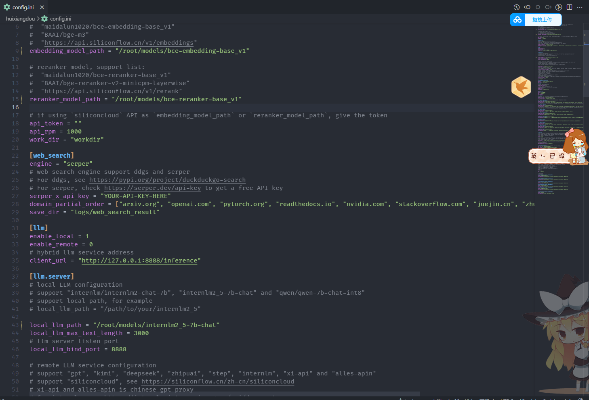

# 搭建标准版茴香豆知识助手

1. clone 仓库

```sh
cd /root
# 克隆代码仓库
git clone https://github.com/internlm/huixiangdou && cd huixiangdou
git checkout 79fa810
```


2. 使用现有环境安装依赖,减少时间

```sh
conda activate langgpt
cd ~/huixiangdou
# parsing `word` format requirements
apt update
apt install python-dev libxml2-dev libxslt1-dev antiword unrtf poppler-utils pstotext tesseract-ocr flac ffmpeg lame libmad0 libsox-fmt-mp3 sox libjpeg-dev swig libpulse-dev
# python requirements
pip install BCEmbedding==0.1.5 cmake==3.30.2 lit==18.1.8 sentencepiece==0.2.0 protobuf==5.27.3 accelerate==0.33.0
pip install -r requirements.txt
# python3.8 安装 faiss-gpu 而不是 faiss
```


3. 链接模型

```sh
# 创建模型文件夹
cd /root && mkdir models

# 复制BCE模型
ln -s /root/share/new_models/maidalun1020/bce-embedding-base_v1 /root/models/bce-embedding-base_v1
ln -s /root/share/new_models/maidalun1020/bce-reranker-base_v1 /root/models/bce-reranker-base_v1

# 复制大模型参数（下面的模型，根据作业进度和任务进行**选择一个**就行）
ln -s /root/share/new_models/Shanghai_AI_Laboratory/internlm2-chat-7b /root/models/internlm2-chat-7b
ln -s /root/share/new_models/Shanghai_AI_Laboratory/internlm2_5-7b-chat /root/models/internlm2_5-7b-chat
```


4. 更改配置文件

茴香豆的所有功能开启和模型切换都可以通过 `config.ini` 文件进行修改，默认参数如下：

修改

```ini
embedding_model_path = "/root/models/bce-embedding-base_v1"
reranker_model_path = "/root/models/bce-reranker-base_v1"
local_llm_path = "/root/models/internlm2_5-7b-chat"
```



5. 构建知识库

```sh
cd /root/huixiangdou && mkdir repodir

# 将自己的文档放到 repodir 中

# Save the features of repodir to workdir, and update the positive and negative example thresholds into `config.ini`
mkdir workdir
python3 -m huixiangdou.service.feature_store
```

和 Web 版一样，本地版也可以通过编辑正反例来调整茴香豆的拒答和响应，正例位于 `/root/huixiangdou/resource/good_questions.json` 文件夹中，反例位于`/root/huixiangdou/resource/bad_questions.json`。

需要注意的是，每次更新原始知识文档和正反例，都需要重新运行 `python3 -m huixiangdou.service.feature_store` 命令进行向量知识库的重新创建和应答阈值的更新。


6. 命令行测试

```sh
cd /root/huixiangdou
python3 -m huixiangdou.main --standalone
```

```sh
请使用python实现一个万花筒应用程序
```


7. gradio测试

启动 gradio

```sh
python3 -m huixiangdou.gradio
```


映射端口

```sh
ssh -CNg -L 7860:127.0.0.1:7860 root@ssh.intern-ai.org.cn -p 43681
```


8. 浏览器访问 http://127.0.0.1:7860

问题1: 请使用python实现一个万花筒应用程序

回答的非常详细


问题2: 使用python封装一个爬取网页的类,给出代码


