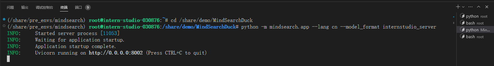
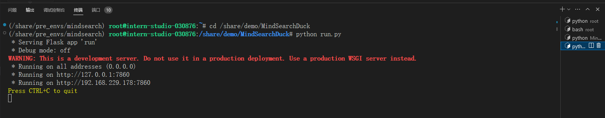
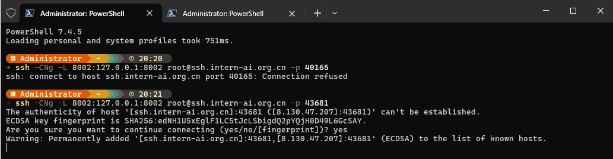

# 使用免费的搜索接口

1. 激活环境

```sh
conda activate /share/pre_envs/mindsearch
```


2. 启动后端

```sh
conda activate /share/pre_envs/mindsearch
cd /share/demo/MindSearchDuck

python -m mindsearch.app --lang cn --model_format internstudio_server
```



3. 启动前端

```sh
conda activate /share/pre_envs/mindsearch
cd /share/demo/MindSearchDuck

python run.py
```



4. 映射端口

```
ssh -CNg -L 8002:127.0.0.1:8002 root@ssh.intern-ai.org.cn -p 43681
ssh -CNg -L 7860:127.0.0.1:7860 root@ssh.intern-ai.org.cn -p 43681
```



5. 浏览器访问

问题

````sh
在我使用 streamlit 实现一个对话窗口时,脚本中会打印 streamlit 的版本,代码如下
```python
import streamlit as st
import numpy as np
import time

print("streamlit version: ", st.__version__)

...
```
很奇怪的是这一行打印信息在每次模型对话时都会打印,正常情况下一行命令只会打印一次,为什么 streamlit 启动的服务每次都会打印呢?
````

