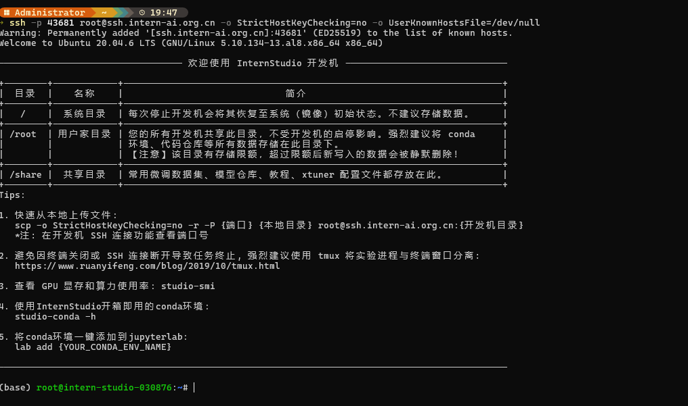
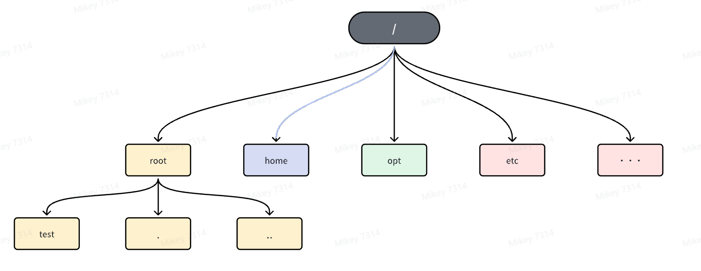
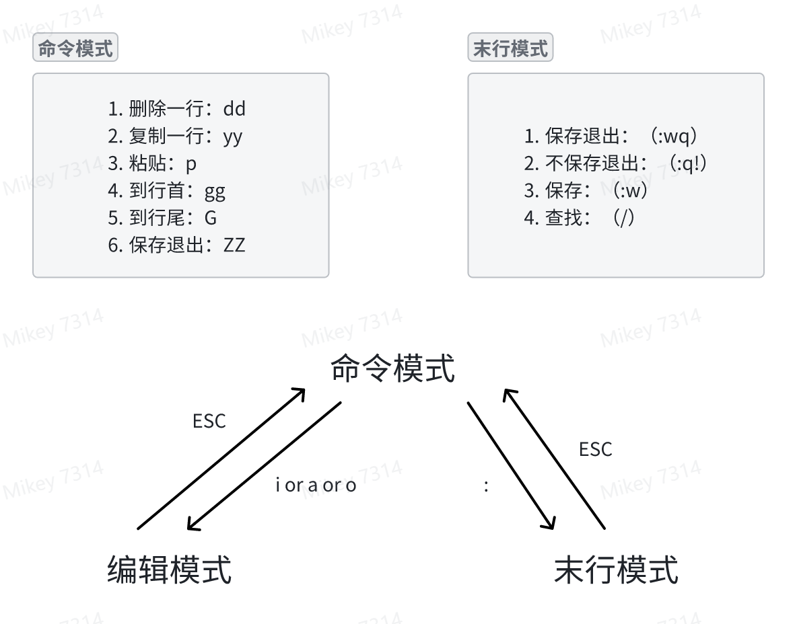
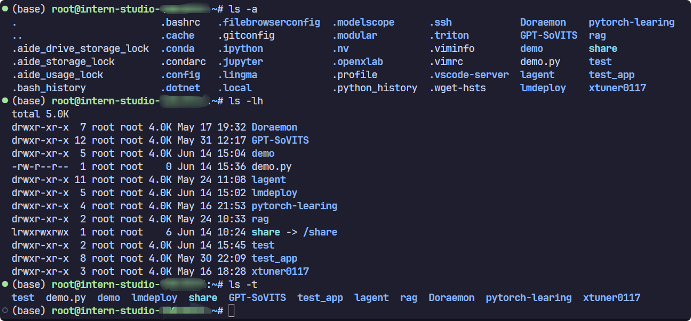
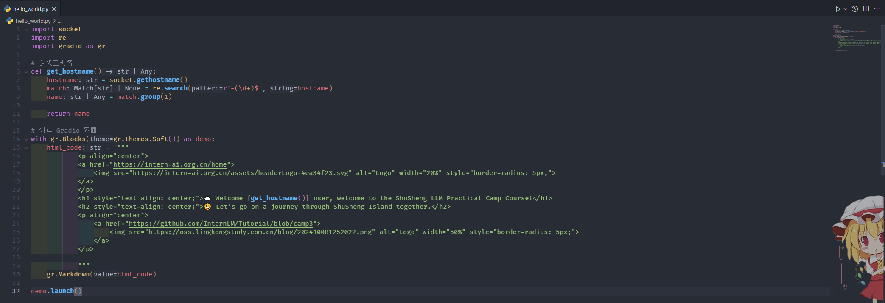
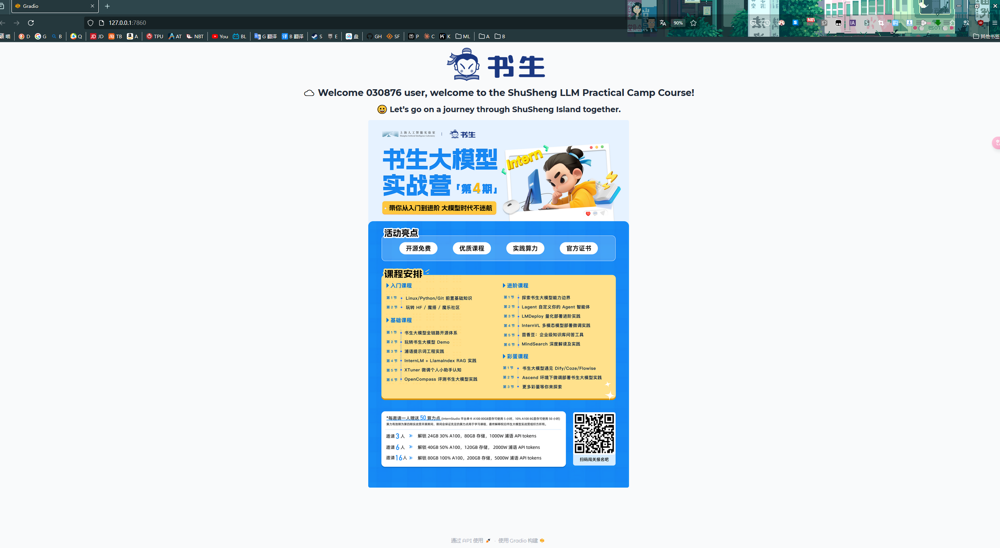
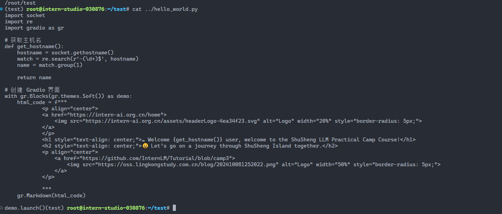
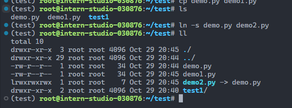
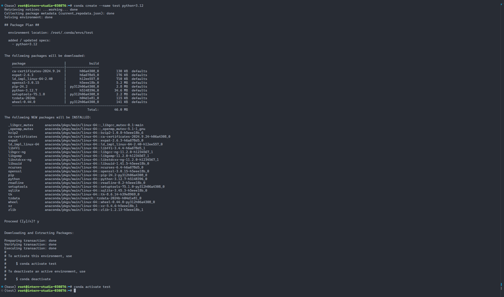
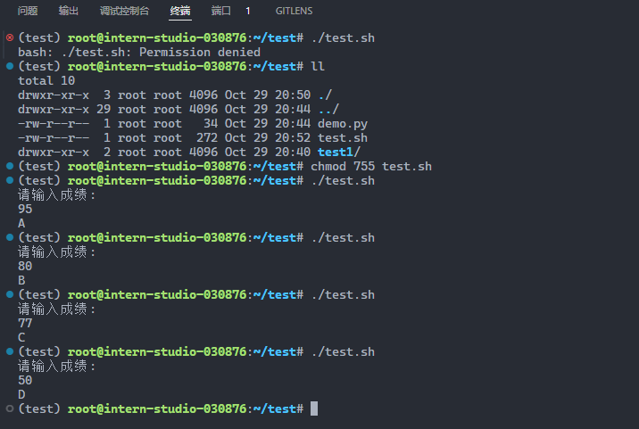

(作业在后面)

# SSH

**SSH**全称Secure Shell，中文翻译为安全外壳，它是一种**网络安全协议**，通过加密和认证机制实现安全的访问和文件传输等业务。SSH 协议通过对网络数据进行加密和验证，在不安全的网络环境中提供了安全的网络服务。

SSH 是（C/S架构）由**服务器**和**客户端**组成，为建立安全的 SSH 通道，双方需要先建立 TCP 连接，然后协商使用的版本号和各类算法，并生成相同的**会话密钥**用于后续的对称加密。在完成用户认证后，双方即可建立会话进行数据交互。

那在后面的实践中我们会**配置SSH密钥**，配置密钥是为了当我们远程连接开发机时不用重复的输入密码，那**为什么要进行远程连接呢**？

远程连接的好处就是，如果你使用的是远程办公，你可以通过SSH远程连接开发机，这样就可以在本地进行开发。而且如果你需要跑一些本地的代码，又没有环境，那么远程连接就非常有必要了。

## ssh 基本连接

> 连接命令

```
ssh user@hostname
```

> SSH的默认端口是22，也就是说，你的登录请求会送进远程主机的22端口。使用p参数，可以修改这个端口

```
ssh user@hostname -p 2222
```

## 端口转发

将本地端口映射到远端主机端口

```
ssh -C -f -N -g -L 本地端口:目标IP:目标端口 用户名@目标IP

ssh -CNg -L 8888:127.0.0.1:8888 user@hostname
ssh -CNg -L 7860:127.0.0.1:7860 root@ssh.intern-ai.org.cn -p 43681
```

将远端主机端口映射到本地端口

```
ssh -C -f -N -g –R 本地端口:目标IP:目标端口 用户名@目标IP
```

其中

-C：是进行数据压缩。

-f：是后台认证用户/密码，通常和-N连用，不用登录到远程主机。只有当提示用户名密码的时候才转向前台。

-N：是不执行远端命令，在只是端口转发时这条命令很有用处。

-g ：在-L/-R/-D参数中，是允许远端主机连接本地转发端口，如果不加这个参数，只允许本地主机建立连接。

-L：将本地端口映射到远端主机端口。`本地端口:目标IP:目标端口`。

　　将本地机(客户机)的某个端口转发到远端指定机器的指定端口。

-R，将远端主机端口映射到本地端口。`本地端口:目标IP:目标端口`。

　　将远程主机(服务器)的某个端口转发到本地端指定机器的指定端口。

-p ：被登录的ssd服务器的sshd服务端口。

-D：port 指定一个本地机器 “动态的'’ 应用程序端口转发。

## 配置SSH密钥进行SSH远程连接

> SSH密钥是一种安全便捷的登录认证方式，用于在SSH协议中进行身份验证和加密通信。

**ssh-keygen**支持RSA和DSA两种认证密钥。

常用参数包括：

- -t：指定密钥类型，如dsa、ecdsa、ed25519、rsa。
- -b：指定密钥长度。
- -C：添加注释。
- -f：指定保存密钥的文件名。
- -i：读取未加密的ssh-v2兼容的私钥/公钥文件。

这里我们使用RSA算法生成密钥，命令为：

```
ssh-keygen -t rsa
```

输入命令后**一路回车**就可以了，这里的密钥默认情况下是生成在`~/.ssh/`目录下的，`~`表示的是家目录，如果是windows就是`C:\Users\{your_username}\`。在powerShell中可以使用`Get-Content`命令查看生成的密钥，如果是linux操作系统可以使用`cat`命令。

## 端口映射

**端口映射**是一种网络技术，它可以将外网中的任意端口映射到内网中的相应端口，实现内网与外网之间的通信。通过端口映射，可以在外网访问内网中的服务或应用，实现跨越网络的便捷通信。

```sh
ssh root@ssh.intern-ai.org.cn -p 43681 -CNg -L 7860:127.0.0.1:7860 -o StrictHostKeyChecking=no UserKnownHostsFile=/dev/null
```

- `-p 43681`：是指定 SSH 连接的端口为 43681。

- `root@ssh.intern-ai.org.cn`：表示要以 `root` 用户身份连接到 `ssh.intern-ai.org.cn` 这个主机。

- ```
  -CNg
  ```

  - `-C` 通常用于启用压缩。
  - `-N` 表示不执行远程命令，仅建立连接用于端口转发等。
  - `-g` 允许远程主机连接到本地转发的端口。

- `-L {本地机器_PORT}:127.0.0.1:{开发机_PORT}`：这是设置本地端口转发，将本地机器的指定端口（由 `{本地机器_PORT}` 表示）转发到远程主机（这里即 `ssh.intern-ai.org.cn`）的 `127.0.0.1` （即本地回环地址）和指定的开发机端口（由 `{开发机_PORT}` 表示）。

- `-o StrictHostKeyChecking=no`：关闭严格的主机密钥检查，这样可以避免第一次连接时因为未知主机密钥而产生的提示或错误。

## 尝试连接

直接使用 powershell 连接

```sh
ssh -p 43681 root@ssh.intern-ai.org.cn -o StrictHostKeyChecking=no -o UserKnownHostsFile=/dev/null

# 之后输入密码即可连接
```




使用 vscode 连接


点击连接


配置文件

```sh
Host openxlab-self # 主机名称
  HostName ssh.intern-ai.org.cn # 主机名
  Port 43681 # 主机的SSH端口
  User root # 登录SSH使用的用户
  StrictHostKeyChecking no # 表示禁用严格的主机密钥检查。这意味着当连接到一个新的 SSH 服务器时，不会严格验证服务器的主机密钥，可能会带来一定的安全风险。
  UserKnownHostsFile /dev/null # 则是将用户已知的主机密钥文件设置为 /dev/null ，这实质上是忽略了对已知主机密钥的记录和使用。
```

后面的一些配置选项，如果想要手动添加就需要按照上面的格式对相应部分进行修改。

如果将*`StrictHostKeyChecking`*` no`和*`UserKnownHostsFile`*` /dev/null`删除掉会跳出指纹验证的弹窗

之后输入密码进行连接

连接成功


# Linux 基础命令

这一部分我会带着大家了解Linux的一些**基础操作**，还有使用一些工具。让大家能够在遇到问题的时候，可以自行解决，如果大家有遇到什么问题的话，也可以在这里评论，我会及时给大家回答。

因为我们使用**开发机**时很少使用到**权限管理**，所以我们就不介绍了。（后面的操作均在VScode的终端中进行）

## 文件管理

在 Linux 中，常见的文件管理操作包括：

- **创建文件**：可以使用 `touch` 命令创建空文件。
- **创建目录**：使用 `mkdir` 命令。
- **目录切换**：使用`cd`命令。
- **显示所在目录**：使用`pwd`命令。
- **查看文件内容**：如使用 `cat` 直接显示文件全部内容，`more` 和 `less` 可以分页查看。
- **编辑文件**：如 `vi` 或 `vim` 等编辑器。
- **复制文件**：用 `cp` 命令。
- **创建文件链接**：用`ln`命令。
- **移动文件**：通过 `mv` 命令。
- **删除文件**：使用 `rm` 命令。
- **删除目录**：`rmdir`（只能删除空目录）或 `rm -r`（可删除非空目录）。
- **查找文件**：可以用 `find` 命令。
- **查看文件或目录的详细信息**：使用`ls`命令，如使用 `ls -l`查看目录下文件的详细信息。
- **处理文件**：进行复杂的文件操作，可以使用`sed`命令。

这里介绍几种我们在课程中会使用到的命令：

### **touch**

我们可以使用touch快速的创建文件，这样我们不用手动点击进行创建了。例如我们要创建一个`demo.py`文件:


### **mkdir**

同样的使用方法，如果要创建一个名为`test`的目录：


### **cd**

这个命令会是使用最多的一个命令，在使用之前需要为没有计算机基础的同学讲一下目录结构，画一张图让大家理解：



我们现在使用的是`root`目录，也是root用户的家目录`~`，linux操作系统中`/`表示根目录，根目录下有许多系统所需的目录和文件，刚才我们创建的目录就存在与`root`目录下，其中`.`表示的是当前目录，`..`表示的上级目录。如果我现在要进入到`test`目录，然后回到`root`目录，我们可以这样操作：


### **pwd**

我们可以使用`pwd`命令查看当前所在的目录：这样可以方便我们确定我们当前所在哪个目录下面。


### **cat**

`cat`命令可以查看文件里面的内容，更多的使用命令可以使用`--help`命令查看：

- -a，--show-all等价于-vET
- -b，--number-non空白数非空输出行，覆盖-n
- -e,   等价于-vE
- -E，--show-结束显示$在每一行的末尾
- -n，--number编号所有输出行
- -s，--crick-空白抑制重复的空输出行
- -t，等价于-vT
- -t，--show-tabs将制表符显示为^I
- -v，--show非打印使用^和M-表示法，LFD和TAB除外


### **vi or vim**

当我们需要编辑文件的时候可以使用`vi`或者`vim`命令，当你进入文件编辑以后，有三种模式：



进入编辑模式可以使用`i`，vim的方便之处就是可以在终端进行简单的文件修改。


### **cp 和 ln（重点）**

**`cp`****命令在后面课程中会经常用到，它是用来将一个文件或者目录复制到另一个目录下的操作，常用的使用有：**

- 复制文件：`cp 源文件 目标文件`
- 复制目录：`cp -r 源目录 目标目录`

但是如果我们是要使用模型的话，这种操作会占用大量的磁盘空间，所以我们一般使用`ln`命令，这个就和windows的快捷方式一样。linux中链接分为两种 : **硬链接**(hard link)与**软链接**(symbolic link)，硬链接的意思是一个档案可以有多个名称，而软链接的方式则是产生一个特殊的档案，该档案的内容是指向另一个档案的位置。硬链接是存在同一个文件系统中，而软链接却可以跨越不同的文件系统。

所以我们一般使用软连接，它的常用的使用方法如下：

```
ln [参数][源文件或目录][目标文件或目录]
```

参数如下：

- -s：创建软链接（符号链接）也是最常用的；
- -f：强制执行，覆盖已存在的目标文件；
- -i：交互模式，文件存在则提示用户是否覆盖；
- -n：把符号链接视为一般目录；
- -v：显示详细的处理过程。


### **mv 和 rm**

`mv`命令和`rm`命令的使用方式很相似，但是`mv`是用来移动文件或者目录的，同时还可以进行重命名。`rm`命令则是用来删除文件或者目录的。

常用的使用方法如下：

- **mv 命令**：

常用参数：

- `-i`：交互模式，覆盖前询问。
- `-f`：强制覆盖。
- `-u`：只在源文件比目标文件新时才进行移动。

使用示例：

- `mv file1.txt dir1/`：将文件 `file1.txt` 移动到目录 `dir1` 中。
- `mv file1.txt file2.txt`：将文件 `file1.txt` 重命名为 `file2.txt`。

- **rm 命令**：

常用参数：

- `-i`：交互模式，删除前询问。
- `-f`：强制删除，忽略不存在的文件，不提示确认。
- `-r`：递归删除目录及其内容。

使用示例：

- `rm file.txt`：删除文件 `file.txt`。
- `rm -r dir1/`：递归删除目录 `dir1` 及其所有内容。

删除目录的命令也可以使用`rmdir`。


### **find**

`find`命令是Linux系统中一个强大的文件搜索工具，它可以在指定的目录及其子目录中查找符合条件的文件或目录，并执行相应的操作。

以下是`find`命令的一些常见用法：

1. **按文件名查找**：使用`-name`选项按照文件名查找文件。例如，`find /path/to/directory -name "file.txt"`将在指定目录及其子目录中查找名为`file.txt`的文件。
2. **按文件类型查找**：使用`-type`选项按照文件类型查找文件。例如，`find /path/to/directory -type f`将查找指定目录及其子目录中的所有普通文件。
3. **按文件大小查找**：使用`-size`选项按照文件大小查找文件。例如，`find /path/to/directory -size +100M`将查找指定目录及其子目录中大于100MB的文件。
4. **按修改时间查找**：使用`-mtime`、`-atime`或`-ctime`选项按照文件的修改时间、访问时间或状态更改时间查找文件。例如，`find /path/to/directory -mtime -7`将查找指定目录及其子目录中在7天内修改过的文件。
5. **按文件权限查找**：使用`-perm`选项按照文件权限查找文件。例如，`find /path/to/directory -perm 755`将查找指定目录及其子目录中权限为755的文件。
6. **按用户或组查找**：使用`-user`或`-group`选项按照文件的所有者或所属组查找文件。例如，`find /path/to/directory -user username`将查找指定目录及其子目录中属于用户`username`的文件。
7. **执行操作**：使用`-exec`选项可以对找到的文件执行相应的操作。例如，`find /path/to/directory -name "*.txt" -exec rm {} \;`将删除找到的所有以`.txt`结尾的文件。

### **ls**

`ls`命令可以用来列出目录的内容以及**详细信息**。

常用参数及使用方法如下：

- `-a`：显示所有文件和目录，包括隐藏文件（以`.`开头的文件或目录）。
- `-l`：以长格式显示详细信息，包括文件权限、所有者、大小、修改时间等。
- `-h`：与`-l`结合使用，以人类可读的方式显示文件大小（如`K`、`M`、`G`等）。
- `-R`：递归列出子目录的内容。
- `-t`：按文件修改时间排序显示。、



### **sed**

`sed`命令是一种流编辑器，主要用于文本处理，在处理复杂的文件操作时经常用到，在后续的课程中会使用到，`sed`命令常用参数及使用示例如下：

- **参数说明：**
  - `-e<script>` 或 `--expression=<script>`：直接在命令行中指定脚本进行文本处理。
  - `-f<script文件>` 或 `--file=<script文件>`：从指定的脚本文件中读取脚本进行文本处理。
  - `-n` 或 `--quiet` 或 `--silent`：仅打印经过脚本处理后的输出结果，不打印未匹配的行。
- **动作说明：**
  - `a`：在当前行的下一行添加指定的文本字符串。
  - `c`：用指定的文本字符串替换指定范围内的行。
  - `d`：删除指定的行。
  - `i`：在当前行的上一行添加指定的文本字符串。
  - `p`：打印经过选择的行。通常与 `-n` 参数一起使用，只打印匹配的行。
  - `s`：使用正则表达式进行文本替换。例如，`s/old/new/g` 将所有 "InternLM" 替换为 "InternLM yyds"。
- **示例：**


在示例中使用了`echo`命令，这和python中的`print`一样，用来打印内容，这里使用管道符`>`将InternLM打印到file文件中，常用的管道符还有`<`和`|`，比如我们可以使用`grep`命令来查看python中安装的包含`os`字段的包：

### **grep**


`grep`是一个强大的文本搜索工具。常用参数如下：

- `-i`：忽略大小写进行搜索。
- `-v`：反转匹配，即显示不匹配的行。
- `-n`：显示行号。
- `-c`：统计匹配的行数。

## 进程管理

**进程管理**命令是进行系统监控和进程管理时的重要工具，常用的进程管理命令有以下几种：

- **ps**：查看正在运行的进程
- **top**：动态显示正在运行的进程
- **pstree**：树状查看正在运行的进程
- **pgrep**：用于查找进程
- **nice**：更改进程的优先级
- **jobs**：显示进程的相关信息
- **bg 和 fg**：将进程调入后台
- **kill**：杀死进程

在开发机中还有一条特殊的命令`nvidia-smi`，它是 NVIDIA 系统管理接口（NVIDIA System Management Interface）的命令行工具，用于监控和管理 NVIDIA GPU 设备。它提供了一种快速查看 GPU 状态、使用情况、温度、内存使用情况、电源使用情况以及运行在 GPU 上的进程等信息的方法。

下面是关于各个命令使用示例：

- `ps`：列出当前系统中的进程。使用不同的选项可以显示不同的进程信息，例如：

  - ```Bash
    ps aux  # 显示系统所有进程的详细信息
    ```

- `top`：动态显示系统中进程的状态。它会实时更新进程列表，显示CPU和内存使用率最高的进程。

  - ```Bash
    top  # 启动top命令，动态显示进程信息
    ```

- `pstree`：以树状图的形式显示当前运行的进程及其父子关系。

  - ```Bash
    pstree  # 显示进程树
    ```

- `pgrep`：查找匹配条件的进程。可以根据进程名、用户等条件查找进程。

  - ```Bash
    pgrep -u username  # 查找特定用户的所有进程
    ```

- `nice`：更改进程的优先级。`nice` 值越低，进程优先级越高。

  - ```Bash
    nice -n 10 long-running-command  # 以较低优先级运行一个长时间运行的命令
    ```

- `jobs`：显示当前终端会话中的作业列表，包括后台运行的进程。

  - ```Bash
    jobs  # 列出当前会话的后台作业
    ```

- `bg` 和 `fg`：`bg` 将挂起的进程放到后台运行，`fg` 将后台进程调回前台运行。

  - ```Bash
    bg  # 将最近一个挂起的作业放到后台运行
    fg  # 将后台作业调到前台运行
    ```

- `kill`：发送信号到指定的进程，通常用于杀死进程。

  - ```Bash
    kill PID  # 杀死指定的进程ID
    ```

  - 注意，`kill` 命令默认发送 `SIGTERM` 信号，如果进程没有响应，可以使用`-9`使用`SIGKILL` 信号强制杀死进程：

  - ```Bash
    kill -9 PID  # 强制杀死进程    
    ```

> `SIGTERM`（Signal Termination）信号是Unix和类Unix操作系统中用于请求进程终止的标准信号。当系统或用户想要优雅地关闭一个进程时，通常会发送这个信号。与`SIGKILL`信号不同，`SIGTERM`信号可以被进程捕获并处理，从而允许进程在退出前进行清理工作。（来源于网络）

以下是 `nvidia-smi` 命令的一些基本命令用法：

- 显示 GPU 状态的摘要信息：

  - ```Bash
    nvidia-smi
    ```

- 显示详细的 GPU 状态信息：

  - ```Bash
    nvidia-smi -l 1
    ```

  - 这个命令会每1秒更新一次状态信息。

- 显示 GPU 的帮助信息：

  - ```Bash
    nvidia-smi -h
    ```

- 列出所有 GPU 并显示它们的 PID 和进程名称：

  - ```Bash
    nvidia-smi pmon
    ```

- 强制结束指定的 GPU 进程：

  - ```Bash
    nvidia-smi --id=0 --ex_pid=12345
    ```

  - 这会强制结束 GPU ID 为 0 上的 PID 为 12345 的进程。

- 设置 GPU 性能模式：

  - ```Bash
    nvidia-smi -pm 1
    nvidia-smi -i 0 -pm 1
    ```

  - 第一个命令会为所有 GPU 设置为性能模式，第二个命令只针对 ID 为 0 的 GPU。

- 重启 GPU：

  - ```Bash
    nvidia-smi --id=0 -r
    ```

  - 这会重启 ID 为 0 的 GPU。

下面通过一张图片对GPU信息进行介绍：


# Conda

Conda 是一个开源的包管理和环境管理系统，可在 Windows、macOS 和 Linux 上运行。它快速安装、运行和更新软件包及其依赖项。使用 Conda，您可以轻松在本地计算机上创建、保存、加载和切换不同的环境。

## conda设置

我们可以使用`conda --version`来查看当前开发机中`conda`的版本信息：


当我们要使用`conda`安装包的时候会非常慢，我们可以设置国内镜像提升安装速度，示例如下：

```sh
# 设置清华镜像
conda config --add channels https://mirrors.tuna.tsinghua.edu.cn/anaconda/pkgs/main
conda config --add channels https://mirrors.tuna.tsinghua.edu.cn/anaconda/pkgs/free
conda config --add channels https://mirrors.tuna.tsinghua.edu.cn/anaconda/pkgs/r
conda config --add channels https://mirrors.tuna.tsinghua.edu.cn/anaconda/pkgs/pro
conda config --add channels https://mirrors.tuna.tsinghua.edu.cn/anaconda/pkgs/msys2
```

但是我们一般都是使用`pip`进行包的安装的，后面我们会介绍`pip`和`conda`的区别。

如果我们想要查看conda的配置信息可以使用`conda config --show`命令

```sh
(base) root@intern-studio-030876:~# conda config --show
add_anaconda_token: True
add_pip_as_python_dependency: True
aggressive_update_packages:
  - ca-certificates
  - certifi
  - openssl
allow_conda_downgrades: False
allow_cycles: True
allow_non_channel_urls: False
allow_softlinks: False
allowlist_channels: []
always_copy: False
always_softlink: False
always_yes: None
anaconda_upload: None
auto_activate_base: True
auto_stack: 0
auto_update_conda: True
bld_path: 
changeps1: True
channel_alias: https://conda.anaconda.org
channel_priority: flexible
channel_settings: []
channels:
  - defaults
client_ssl_cert: None
client_ssl_cert_key: None
clobber: False
conda_build: {}
create_default_packages: []
croot: /root/.conda/conda-bld
custom_channels:
  anaconda/pkgs/main: https://mirrors.tuna.tsinghua.edu.cn
  anaconda/pkgs/r: https://mirrors.tuna.tsinghua.edu.cn
  anaconda/pkgs/msys2: https://mirrors.tuna.tsinghua.edu.cn
  conda-forge: https://mirrors.tuna.tsinghua.edu.cn/anaconda/cloud
  msys2: https://mirrors.tuna.tsinghua.edu.cn/anaconda/cloud
  bioconda: https://mirrors.tuna.tsinghua.edu.cn/anaconda/cloud
  menpo: https://mirrors.tuna.tsinghua.edu.cn/anaconda/cloud
  pytorch: https://mirrors.tuna.tsinghua.edu.cn/anaconda/cloud
  pytorch-lts: https://mirrors.tuna.tsinghua.edu.cn/anaconda/cloud
  simpleitk: https://mirrors.tuna.tsinghua.edu.cn/anaconda/cloud
  deepmodeling: https://mirrors.tuna.tsinghua.edu.cn/anaconda/cloud
custom_multichannels:
  defaults: 
    - https://mirrors.tuna.tsinghua.edu.cn/anaconda/pkgs/main
    - https://mirrors.tuna.tsinghua.edu.cn/anaconda/pkgs/r
    - https://mirrors.tuna.tsinghua.edu.cn/anaconda/pkgs/msys2
  local: 
debug: False
default_channels:
  - https://mirrors.tuna.tsinghua.edu.cn/anaconda/pkgs/main
  - https://mirrors.tuna.tsinghua.edu.cn/anaconda/pkgs/r
  - https://mirrors.tuna.tsinghua.edu.cn/anaconda/pkgs/msys2
default_python: 3.11
default_threads: None
deps_modifier: not_set
dev: False
disallowed_packages: []
download_only: False
dry_run: False
enable_private_envs: False
env_prompt: ({default_env}) 
envs_dirs:
  - /root/.conda/envs
error_upload_url: https://conda.io/conda-post/unexpected-error
execute_threads: 1
experimental: []
extra_safety_checks: False
fetch_threads: 5
force: False
force_32bit: False
force_reinstall: False
force_remove: False
ignore_pinned: False
json: False
local_repodata_ttl: 1
migrated_channel_aliases: []
migrated_custom_channels: {}
no_lock: False
no_plugins: False
non_admin_enabled: True
notify_outdated_conda: True
number_channel_notices: 5
offline: False
override_channels_enabled: True
path_conflict: clobber
pinned_packages: []
pip_interop_enabled: False
pkgs_dirs:
  - /root/.conda/pkgs
proxy_servers: {}
quiet: False
register_envs: True
remote_backoff_factor: 1
remote_connect_timeout_secs: 9.15
remote_max_retries: 3
remote_read_timeout_secs: 60.0
repodata_fns:
  - current_repodata.json
  - repodata.json
repodata_threads: None
report_errors: None
restore_free_channel: False
rollback_enabled: True
root_prefix: /root/.conda
safety_checks: warn
sat_solver: pycosat
separate_format_cache: False
shortcuts: True
show_channel_urls: True
signing_metadata_url_base: None
solver: classic
solver_ignore_timestamps: False
ssl_verify: True
subdir: linux-64
subdirs:
  - linux-64
  - noarch
target_prefix_override: 
trace: False
track_features: []
unsatisfiable_hints: True
unsatisfiable_hints_check_depth: 2
update_modifier: update_specs
use_index_cache: False
use_local: False
use_only_tar_bz2: False
verbosity: 0
verify_threads: 1
```

## conda环境管理

### 创建环境

使用`conda create -n name python=3.10`创建虚拟环境

创建虚拟环境的常用参数如下：

- -n 或 --name：指定要创建的环境名称。
- -c 或 --channel：指定额外的软件包通道。
- --clone：从现有的环境克隆来创建新环境。
- -p 或 --prefix：指定环境的安装路径（非默认位置）。

### 查看有哪些虚拟环境

```sh
conda env list
conda info -e
conda info --envs
```


### 激活与退出虚拟环境

使用`conda activate name`命令来激活虚拟环境

如果想要退出虚拟环境的话可以使用：

```sh
conda activate
conda deactivate
```

这两条命令都会回到`base`环境，因为`base`是conda的基础环境，如果仔细观察的话，`base`环境目录比其他的虚拟环境目录层级要高。


### 删除与导出虚拟环境

如果想要删除某个虚拟环境可以使用`conda remove --name name --all`

如果只删除虚拟环境中的某个或者某些包可以使用`conda remove --name name package_name`

### 导出虚拟环境

导出虚拟环境对于特定的环境是非常有必要的，因为有些软件包的依赖关系很复杂，如果自己重新进行创建和配置的话很麻烦，如果我们将配置好的环境导出，这样下次使用还原就行了，而且也可以把配置分享给其他人。

```sh
# 获得环境中的所有配置
conda env export --name myenv > myenv.yml
# 重新还原环境
conda env create -f  myenv.yml
```

## conda和pip

1. conda可以管理非python包，pip只能管理python包。
2. conda可以用来创建虚拟环境，pip不能，需要依赖virtualenv之类的包。
3. conda安装的包是编译好的**二进制文件**，安装包文件过程中会自动安装依赖包；pip安装的包是**wheel或源码**，安装过程中不会去支持python语言之外的依赖项。
4. conda安装的包会统一下载到当前虚拟环境对应的目录下，下载一次多次安装。pip是直接下载到对应环境中。

> **Wheel** 是一种 Python 安装包的格式。
>
> 它是一种预编译的二进制分发格式，类似于 conda 中的已编译二进制文件。
>
> Wheel 格式的主要优点包括：
>
> 1. 安装速度快：因为已经进行了预编译，所以在安装时不需要像源码安装那样进行编译过程，节省了时间。
> 2. 一致性：确保在不同的系统和环境中安装的结果是一致的。
>
> 例如，如果您要安装一个大型的 Python 库，使用 Wheel 格式可以避免在不同的机器上因为编译环境的差异而导致的安装问题。而且，对于那些没有编译环境或者编译能力较弱的系统，Wheel 格式能够让安装过程更加顺畅。

# 作业

## `hello_world.py`


写入 `hello_world.py`

```python
import socket
import re
import gradio as gr
 
# 获取主机名
def get_hostname():
    hostname = socket.gethostname()
    match = re.search(r'-(\d+)$', hostname)
    name = match.group(1)
    
    return name
 
# 创建 Gradio 界面
with gr.Blocks(gr.themes.Soft()) as demo:
    html_code = f"""
            <p align="center">
            <a href="https://intern-ai.org.cn/home">
                
            </a>
            </p>
            <h1 style="text-align: center;">☁️ Welcome {get_hostname()} user, welcome to the ShuSheng LLM Practical Camp Course!</h1>
            <h2 style="text-align: center;">😀 Let’s go on a journey through ShuSheng Island together.</h2>
            <p align="center">
                <a href="https://github.com/InternLM/Tutorial/blob/camp3">
                    
                </a>
            </p>

            """
    gr.Markdown(html_code)

demo.launch()
```



启动脚本


端口映射

```sh
ssh root@ssh.intern-ai.org.cn -p 43681 -CNg -L 7860:127.0.0.1:7860 -o StrictHostKeyChecking=no UserKnownHostsFile=/dev/null
```


浏览器访问 `127.0.0.1:7860`



## 将Linux基础命令在开发机上完成一遍

touch


mkdir


cd


pwd


cat




vi/vim


cp


ln



mv


rm


ls


## 使用

##  VSCODE 远程连接开发机并创建一个conda环境

使用 vscode 连接


点击连接


配置文件

```sh
Host openxlab-self # 主机名称
  HostName ssh.intern-ai.org.cn # 主机名
  Port 43681 # 主机的SSH端口
  User root # 登录SSH使用的用户
  StrictHostKeyChecking no # 表示禁用严格的主机密钥检查。这意味着当连接到一个新的 SSH 服务器时，不会严格验证服务器的主机密钥，可能会带来一定的安全风险。
  UserKnownHostsFile /dev/null # 则是将用户已知的主机密钥文件设置为 /dev/null ，这实质上是忽略了对已知主机密钥的记录和使用。
```

后面的一些配置选项，如果想要手动添加就需要按照上面的格式对相应部分进行修改。

如果将*`StrictHostKeyChecking`*` no`和*`UserKnownHostsFile`*` /dev/null`删除掉会跳出指纹验证的弹窗

之后输入密码进行连接

连接成功


创建conda环境

```sh
conda create --name test python=3.12
```




## 创建并运行`test.sh`文件

创建 `test.sh` 文件

```sh
#!/bin/bash
echo "请输入成绩: "
read score
if [ $score -lt 0 -o $score -gt 100 ]; then
        echo error score
elif [ $score -ge 90 ]; then
        echo A
elif [ $score -ge 80 ]; then
        echo B
elif [ $score -ge 70 ]; then
        echo C
else
        echo D
fi
```

改变权限并运行

```sh
chmod 755 test.sh
./test.sh
```



