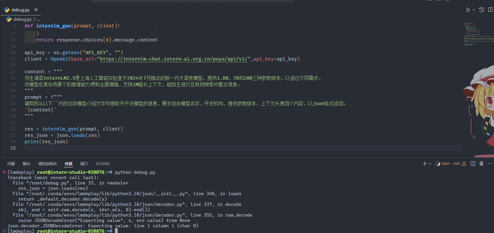
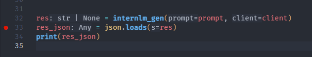
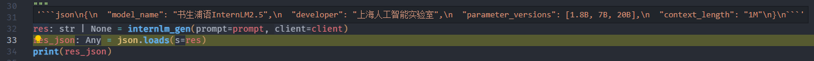
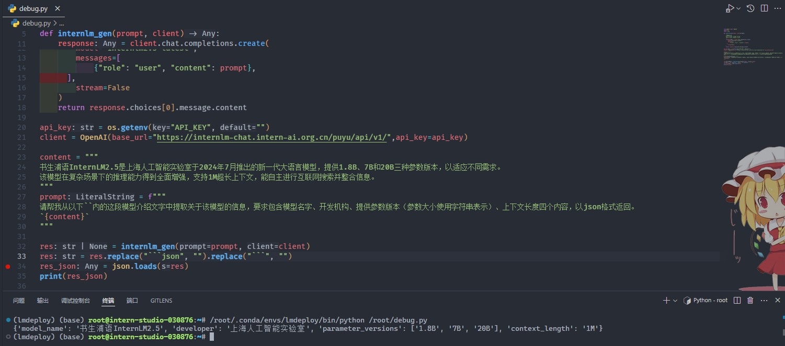
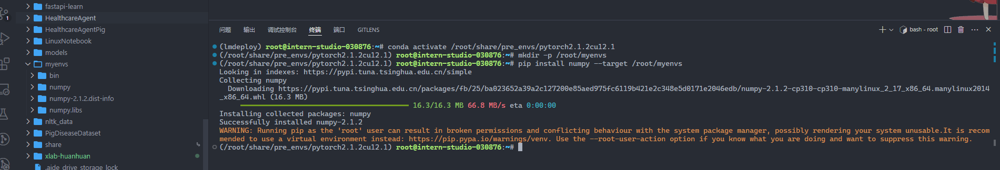
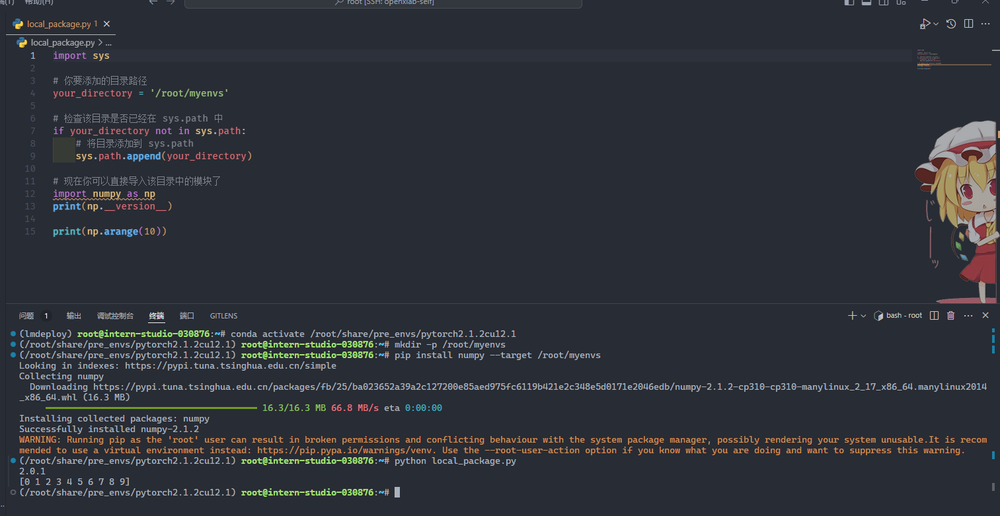

# Leetcode 383

## 代码

```python
class Solution:
    def canConstruct(self, ransomNote: str, magazine: str) -> bool:
        from collections import Counter

        # 使用 Counter 统计字符频率
        ransom_counter = Counter(ransomNote)
        magazine_counter = Counter(magazine)

        # 检查 ransomNote 中的每个字符
        for char in ransom_counter:
            # 如果 magazine 中字符数量不足，返回 False
            if ransom_counter[char] > magazine_counter.get(char, 0):
                return False
        return True
```

截图


#   Vscode连接InternStudio debug笔记

```python
from openai import OpenAI
import os
import json

def internlm_gen(prompt, client):
    '''
    LLM生成函数
    Param prompt: prompt string
    Param client: OpenAI client
    '''
    response = client.chat.completions.create(
        model="internlm2.5-latest",
        messages=[
            {"role": "user", "content": prompt},
      ],
        stream=False
    )
    return response.choices[0].message.content

api_key = os.getenv("API_KEY", "")
client = OpenAI(base_url="https://internlm-chat.intern-ai.org.cn/puyu/api/v1/",api_key=api_key)

content = """
书生浦语InternLM2.5是上海人工智能实验室于2024年7月推出的新一代大语言模型，提供1.8B、7B和20B三种参数版本，以适应不同需求。
该模型在复杂场景下的推理能力得到全面增强，支持1M超长上下文，能自主进行互联网搜索并整合信息。
"""
prompt = f"""
请帮我从以下``内的这段模型介绍文字中提取关于该模型的信息，要求包含模型名字、开发机构、提供参数版本、上下文长度四个内容，以json格式返回。
`{content}`
"""

res = internlm_gen(prompt, client)
res_json = json.loads(res)
print(res_json)
```

先要在终端中输入设置 API_KEY

```sh
export API_KEY="my key"
```

先直接运行查看错误



发现是在 json.loads 发生错误，因此在此打上断点



debug 发现文字的格式不对，返回的是 markdown 格式的文档，以及模型大小格式不对



要去除第一行和最后一行才行，还将提示词改为

```python
prompt = f"""
请帮我从以下``内的这段模型介绍文字中提取关于该模型的信息，要求包含模型名字、开发机构、提供参数版本（参数大小使用字符串表示）、上下文长度四个内容，以json格式返回。
`{content}`
"""
```

最终运行成功



# pip安装到指定目录

```
# 首先激活环境
conda activate /root/share/pre_envs/pytorch2.1.2cu12.1

# 创建一个目录/root/myenvs，并将包安装到这个目录下
mkdir -p /root/myenvs
pip install numpy --target /root/myenvs

# 注意这里也可以使用-r来安装requirements.txt
pip install -r requirements.txt --target /root/myenvs
```



要使用安装在指定目录的python包，可以在python脚本开头临时动态地将该路径加入python环境变量中去

```python
import sys  
  
# 你要添加的目录路径  
your_directory = '/root/myenvs'  
  
# 检查该目录是否已经在 sys.path 中  
if your_directory not in sys.path:  
    # 将目录添加到 sys.path  
    sys.path.append(your_directory)  

# 现在你可以直接导入该目录中的模块了  
import numpy as np
print(np.__version__)

print(np.arange(10))
```

运行成功

