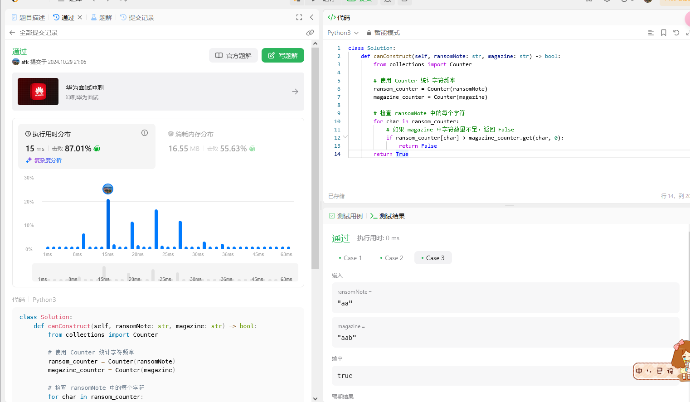

# Leetcode 383

## 代码

```python
class Solution:
    def canConstruct(self, ransomNote: str, magazine: str) -> bool:
        from collections import Counter

        # 使用 Counter 统计字符频率
        ransom_counter = Counter(ransomNote)
        magazine_counter = Counter(magazine)

        # 检查 ransomNote 中的每个字符
        for char in ransom_counter:
            # 如果 magazine 中字符数量不足，返回 False
            if ransom_counter[char] > magazine_counter.get(char, 0):
                return False
        return True
```



#   Vscode连接InternStudio debug笔记

```python
from openai import OpenAI
import json

def internlm_gen(prompt, client):
    '''
    LLM生成函数
    Param prompt: prompt string
    Param client: OpenAI client 
    '''
    response = client.chat.completions.create(
        model="internlm2.5-latest",
        messages=[
            {"role": "user", "content": prompt},
      ],
        stream=False
    )
    return response.choices[0].message.content

api_key = os.getenv("API_KEY", "")
client = OpenAI(base_url="https://internlm-chat.intern-ai.org.cn/puyu/api/v1/",api_key=api_key)

content = """
书生浦语InternLM2.5是上海人工智能实验室于2024年7月推出的新一代大语言模型，提供1.8B、7B和20B三种参数版本，以适应不同需求。
该模型在复杂场景下的推理能力得到全面增强，支持1M超长上下文，能自主进行互联网搜索并整合信息。
"""
prompt = f"""
请帮我从以下``内的这段模型介绍文字中提取关于该模型的信息，要求包含模型名字、开发机构、提供参数版本、上下文长度四个内容，以json格式返回。
`{content}`
"""

res = internlm_gen(prompt, client)
res_json = json.loads(res)
print(res_json)
```


# pip安装到指定目录