# 模型下载

## 下载internlm2_5-chat-1_8b并打印示例输出

```PYTHON
import os
from huggingface_hub import hf_hub_download

# 指定模型标识符
repo_id = "internlm/internlm2_5-7b"

# 指定要下载的文件列表
files_to_download = [
    {"filename": "config.json"},
    {"filename": "model.safetensors.index.json"}
]

# 创建一个目录来存放下载的文件
local_dir = f"{repo_id.split('/')[1]}"
os.makedirs(local_dir, exist_ok=True)

# 遍历文件列表并下载每个文件
for file_info in files_to_download:
    file_path = hf_hub_download(
        repo_id=repo_id,
        filename=file_info["filename"],
        local_dir=local_dir
    )
    print(f"{file_info['filename']} file downloaded to: {file_path}")
```

运行

```sh
python hf_download_json.py
```

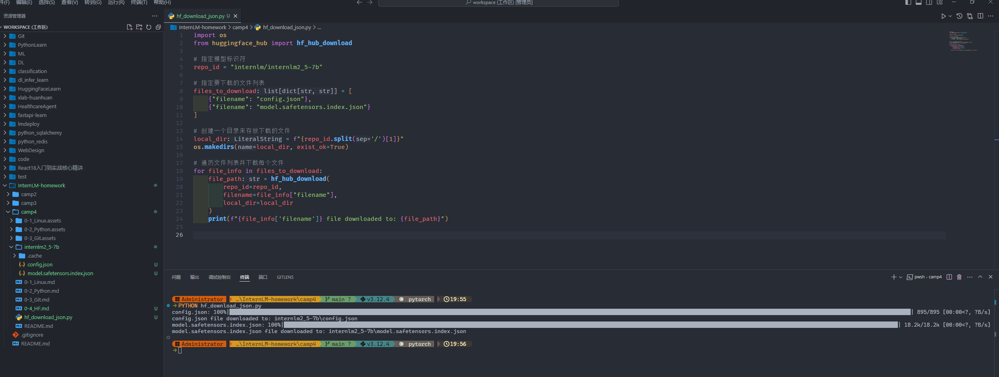

## 下载internlm2_5-chat-1_8b并打印示例输出

```python
import torch
from transformers import AutoTokenizer, AutoModelForCausalLM

tokenizer = AutoTokenizer.from_pretrained("internlm/internlm2_5-1_8b", trust_remote_code=True)
model = AutoModelForCausalLM.from_pretrained("internlm/internlm2_5-1_8b", torch_dtype=torch.float16, trust_remote_code=True)
model = model.eval().to("cuda")

inputs = tokenizer(["猫和老鼠的作者是谁？"], return_tensors="pt").to("cuda")
gen_kwargs = {
    "max_length": 128,
    "top_p": 0.8,
    "temperature": 0.8,
    "do_sample": True,
    "repetition_penalty": 1.0
}

output = model.generate(**inputs, **gen_kwargs)
output = tokenizer.decode(output[0].tolist(), skip_special_tokens=True)
print(output)
```

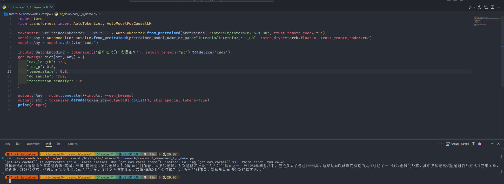

# 模型上传

登录 hf

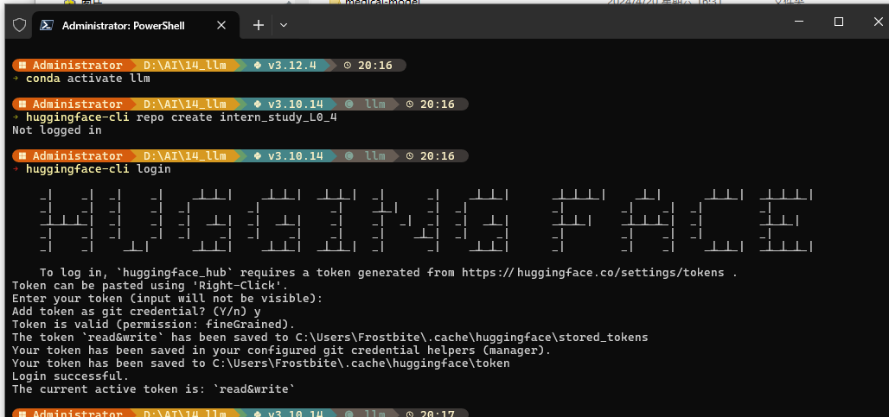

创建项目

```sh
huggingface-cli repo create intern_study_L0_4
```

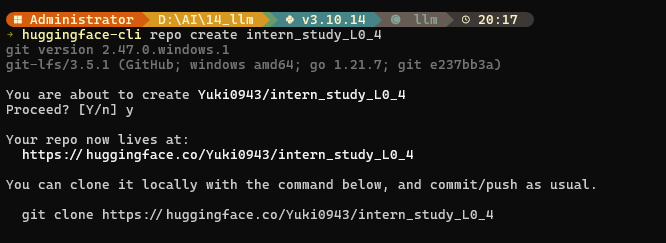


clone

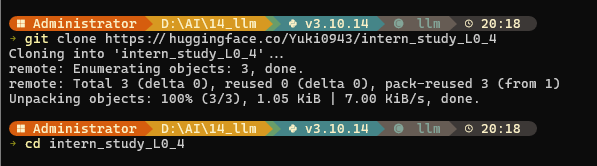


添加文件

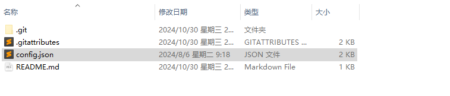


push

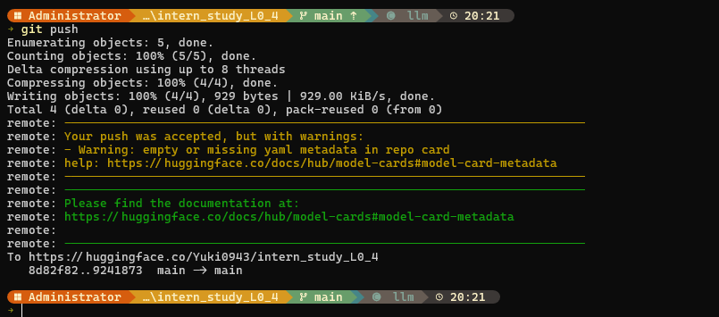

查看

https://huggingface.co/Yuki0943/intern_study_L0_4

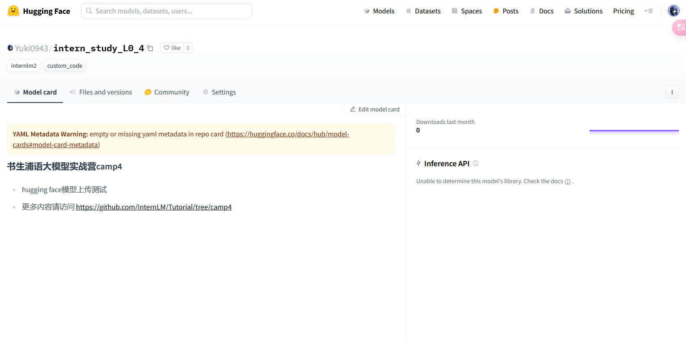

# Space上传

创建 space

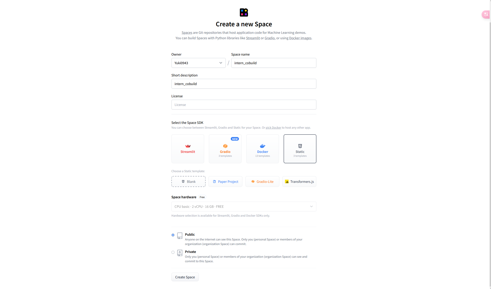

clone 仓库

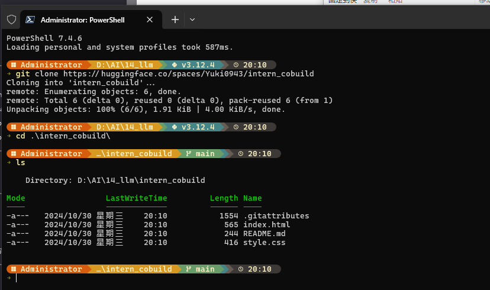

修改 index.html

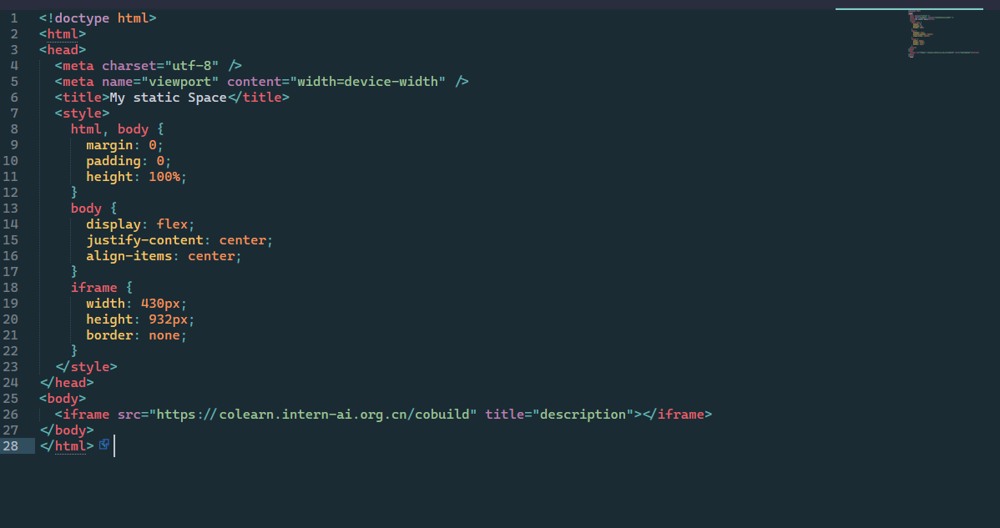

推送

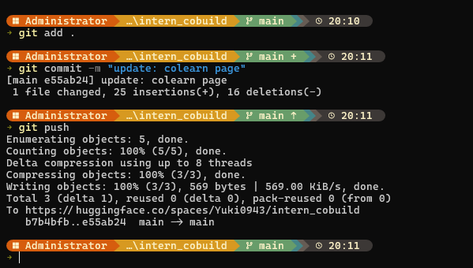

访问 https://huggingface.co/spaces/Yuki0943/intern_cobuild

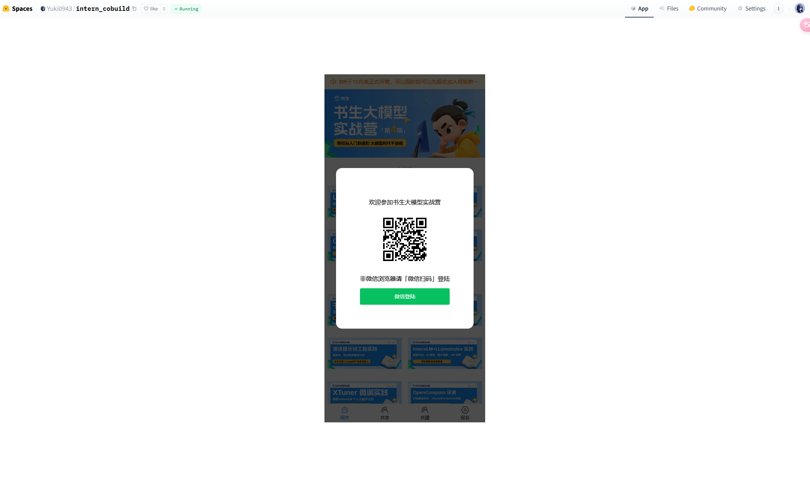