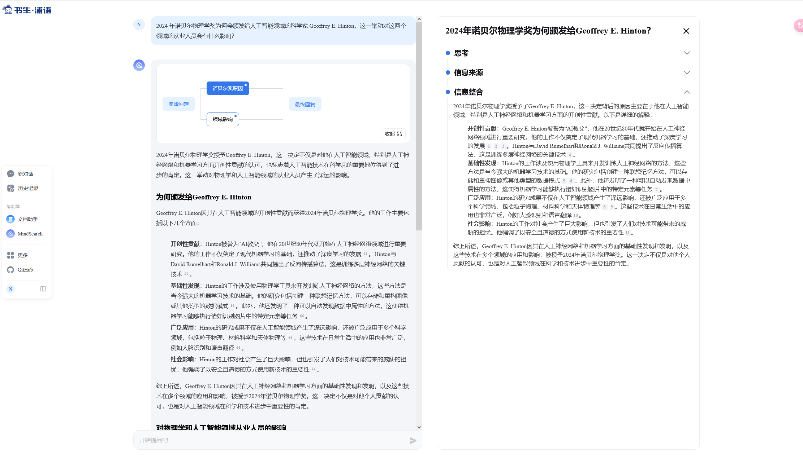
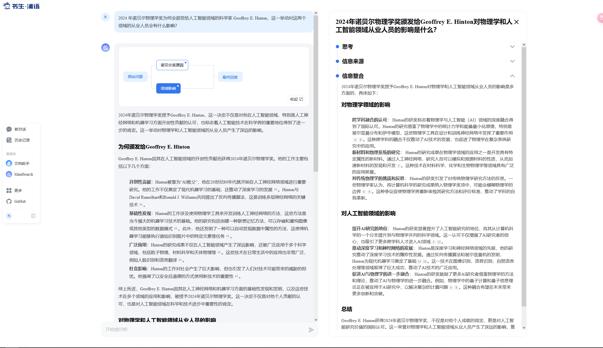
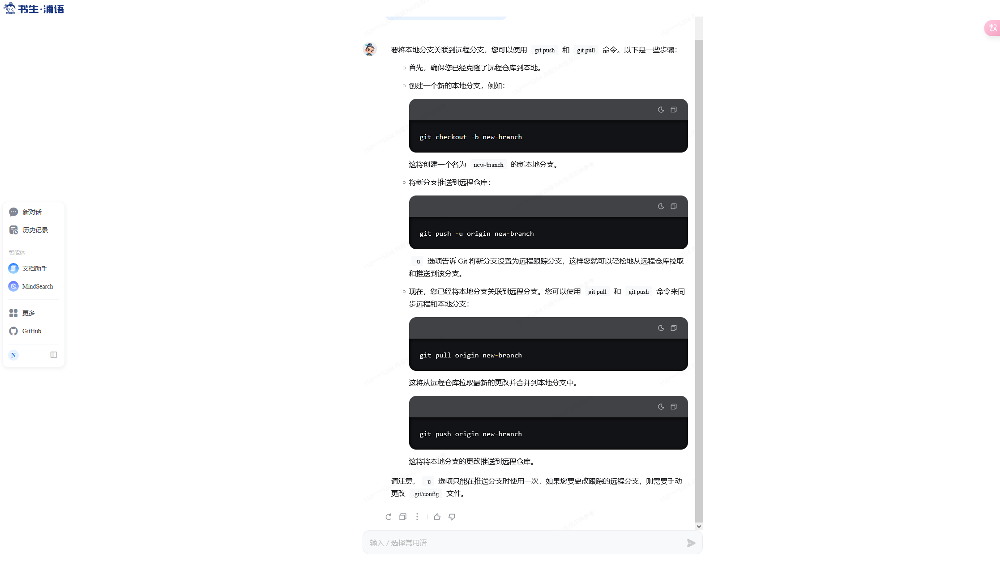
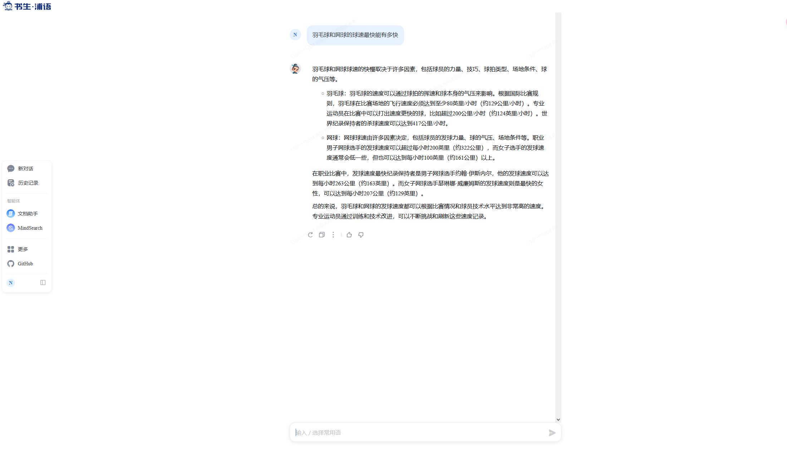
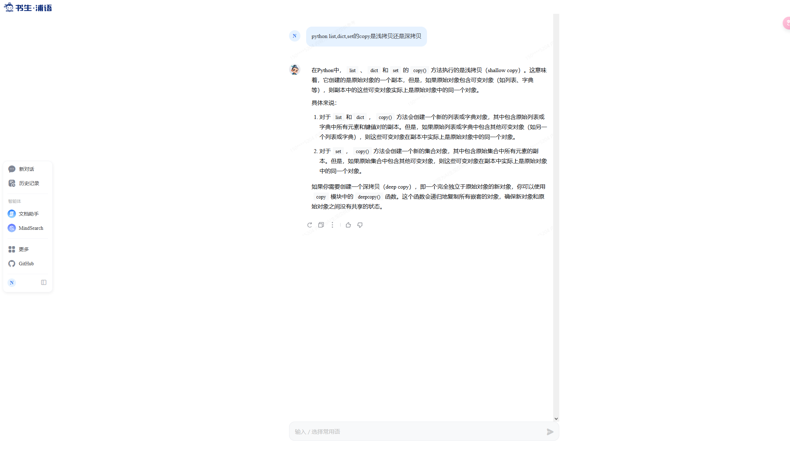
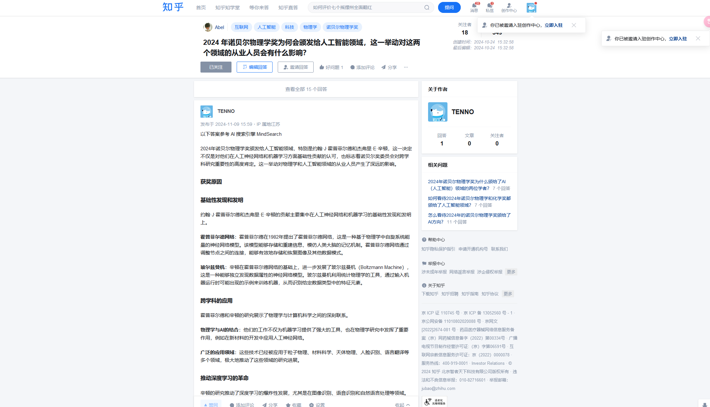

# [MindSearch](https://internlm-chat.intern-ai.org.cn/suggestion/oVmlpR34V9U6v9KBQ1TN7IpPQh1Z89ONciSGUKmgFFA=)

提问：2024 年诺贝尔物理学奖为何会颁发给人工智能领域的科学家 Geoffrey E. Hinton，这一举动对这两个领域的从业人员会有什么影响？ 

# [书生·浦语](https://internlm-chat.intern-ai.org.cn/)

问题：git 如何将本地分支关联到远程分支

问题：羽毛球和网球的球速最快能有多快

问题：python list,dict,set的copy是浅拷贝还是深拷贝

# [书生·万象](https://internvl.opengvlab.com/)

# MindSearch 话题挑战

https://www.zhihu.com/question/1915470960/answer/27012358242

