# 基于 LlamaIndex 构建自己的 RAG 知识库

## api 模型

1. 安装依赖

使用之前已有的环境

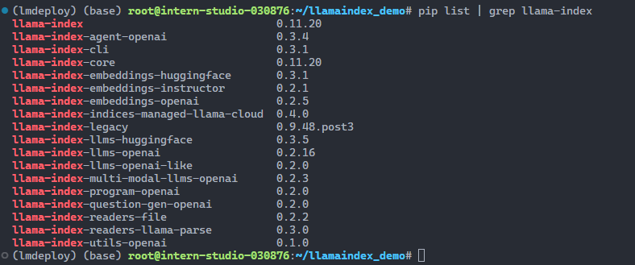

2. 准备模型

```sh
cd ~
mkdir llamaindex_demo
cd llamaindex_demo
mkdir model
cd model
ln -s /root/share/new_models/Shanghai_AI_Laboratory/internlm2_5-1_8b-chat/ ./
ln -s /root/share/new_models/maidalun1020/bce-embedding-base_v1/ ./
ls
```

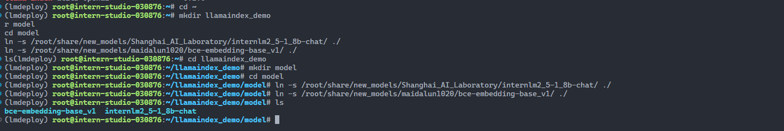

3. 下载 nltk 相关资源

用以下命令下载 nltk 资源并解压到服务器上：

```
cd /root
git clone https://gitee.com/yzy0612/nltk_data.git  --branch gh-pages
cd nltk_data
mv packages/*  ./
cd tokenizers
unzip punkt.zip
cd ../taggers
unzip averaged_perceptron_tagger.zip
```

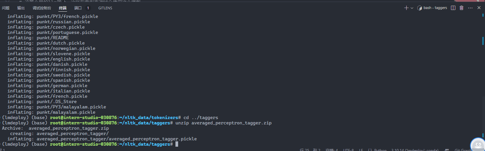

4. 仅使用 api 模型

运行以下指令，新建一个python文件

```sh
cd ~/llamaindex_demo
touch test_internlm.py
```

打开test_internlm.py 贴入以下代码

```python
import os
from openai import OpenAI

base_url = "https://api.siliconflow.cn/v1"
api_key = os.getenv("SILICON_API_KEY", "I AM AN API_KEY")
model="internlm/internlm2_5-7b-chat"

client = OpenAI(
    api_key=api_key ,
    base_url=base_url,
)

chat_rsp = client.chat.completions.create(
    model=model,
    messages=[{"role": "user", "content": "msi x670 godlike 有几个内存插槽？支持的频率是多少？"}],
)

for choice in chat_rsp.choices:
    print(choice.message.content)
```

运行代码

```sh
cd ~/llamaindex_demo/
python test_internlm.py
```

回答的是主板常规知识，不是 `msi x670 godlike` 的详细信息。

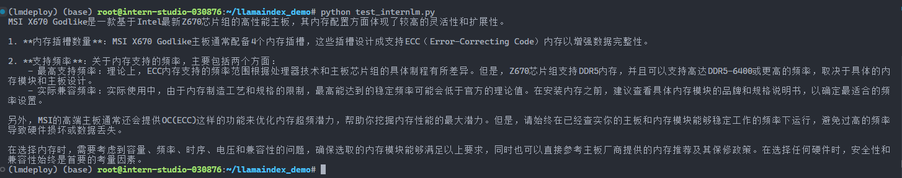

5. 使用 llama_index

准备数据

```
cd ~/llamaindex_demo
mkdir data
cd data
wget https://download.msi.com/archive/mnu_exe/mb/MEGX670EGODLIKE.pdf
```

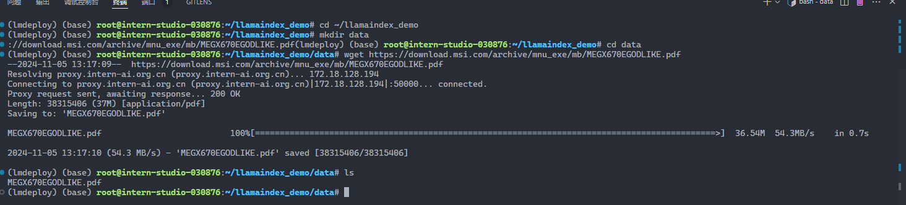

运行以下指令，新建一个python文件

```
cd ~/llamaindex_demo
touch llamaindex_RAG.py
```

打开`llamaindex_RAG.py`贴入以下代码

```python
import os

os.environ["NLTK_DATA"] = "/root/nltk_data"

from llama_index.core import VectorStoreIndex, SimpleDirectoryReader
from llama_index.core.settings import Settings
from llama_index.embeddings.huggingface import HuggingFaceEmbedding
from llama_index.legacy.callbacks import CallbackManager
from llama_index.llms.openai_like import OpenAILike


base_url = "https://api.siliconflow.cn/v1"
api_key = os.getenv("SILICON_API_KEY", "I AM AN API_KEY")
model = "internlm/internlm2_5-7b-chat"

# Create an instance of CallbackManager
callback_manager = CallbackManager()

llm = OpenAILike(
    model=model,
    api_base=base_url,
    api_key=api_key,
    is_chat_model=True,
    callback_manager=callback_manager,
)
# 设置全局的llm属性，这样在索引查询时会使用这个模型。
Settings.llm = llm

# 初始化一个HuggingFaceEmbedding对象，用于将文本转换为向量表示
embed_model = HuggingFaceEmbedding(model_name="./model/bce-embedding-base_v1")
# 将创建的嵌入模型赋值给全局设置的embed_model属性，
# 这样在后续的索引构建过程中就会使用这个模型。
Settings.embed_model = embed_model


# 从指定目录读取所有文档，并加载数据到内存中
documents = SimpleDirectoryReader("./data").load_data()
print(f"documents number = {len(documents)}")

# 创建一个VectorStoreIndex，并使用之前加载的文档来构建索引。
# 此索引将文档转换为向量，并存储这些向量以便于快速检索。
index = VectorStoreIndex.from_documents(documents=documents, embed_model=embed_model)

# 创建一个查询引擎，这个引擎可以接收查询并返回相关文档的响应。
query_engine = index.as_query_engine(llm=llm)

response = query_engine.query("msi x670 godlike 有几个内存插槽？支持的频率是多少？")
print(response)
```

运行代码

```sh
cd ~/llamaindex_demo/
python llamaindex_RAG.py
```

回答正确

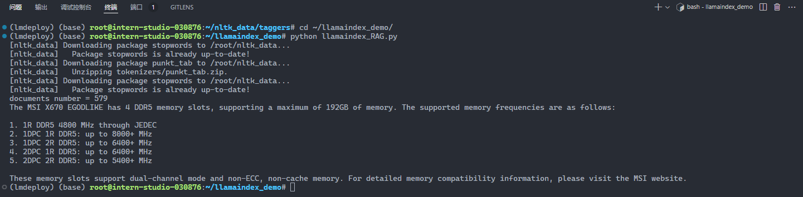

6. web

运行以下指令，新建一个python文件

```
cd ~/llamaindex_demo
touch app.py
```

打开`app.py`贴入以下代码

```python
import os
import streamlit as st
from llama_index.core import VectorStoreIndex, SimpleDirectoryReader, Settings
from llama_index.embeddings.huggingface import HuggingFaceEmbedding
from llama_index.legacy.callbacks import CallbackManager
from llama_index.llms.openai_like import OpenAILike


base_url = "https://api.siliconflow.cn/v1"
api_key = os.getenv("SILICON_API_KEY", "I AM AN API_KEY")
model = "internlm/internlm2_5-7b-chat"


st.set_page_config(page_title="llama_index_demo", page_icon="🦜🔗")
st.title("llama_index_demo")

# 初始化模型
@st.cache_resource
def init_models():
    # Create an instance of CallbackManager
    callback_manager = CallbackManager()

    llm = OpenAILike(
        model=model,
        api_base=base_url,
        api_key=api_key,
        is_chat_model=True,
        callback_manager=callback_manager,
    )
    # 设置全局的llm属性，这样在索引查询时会使用这个模型。
    Settings.llm = llm

    # 初始化一个HuggingFaceEmbedding对象，用于将文本转换为向量表示
    embed_model = HuggingFaceEmbedding(model_name="./model/bce-embedding-base_v1")
    # 将创建的嵌入模型赋值给全局设置的embed_model属性，
    # 这样在后续的索引构建过程中就会使用这个模型。
    Settings.embed_model = embed_model

    # 从指定目录读取所有文档，并加载数据到内存中
    documents = SimpleDirectoryReader("./data").load_data()
    print(f"documents number = {len(documents)}")

    # 创建一个VectorStoreIndex，并使用之前加载的文档来构建索引。
    # 此索引将文档转换为向量，并存储这些向量以便于快速检索。
    index = VectorStoreIndex.from_documents(documents=documents, embed_model=embed_model)

    # 创建一个查询引擎，这个引擎可以接收查询并返回相关文档的响应。
    query_engine = index.as_query_engine(llm=llm)

    return query_engine

# 检查是否需要初始化模型
if 'query_engine' not in st.session_state:
    st.session_state['query_engine'] = init_models()

def greet2(question):
    response = st.session_state['query_engine'].query(question)
    return response

# Store LLM generated responses
if "messages" not in st.session_state.keys():
    st.session_state.messages = [{"role": "assistant", "content": "你好，我是你的助手，有什么我可以帮助你的吗？"}]

    # Display or clear chat messages
for message in st.session_state.messages:
    with st.chat_message(message["role"]):
        st.write(message["content"])

def clear_chat_history():
    st.session_state.messages = [{"role": "assistant", "content": "你好，我是你的助手，有什么我可以帮助你的吗？"}]

st.sidebar.button('Clear Chat History', on_click=clear_chat_history)

# Function for generating LLaMA2 response
def generate_llama_index_response(prompt_input):
    return greet2(prompt_input)

# User-provided prompt
if prompt := st.chat_input():
    st.session_state.messages.append({"role": "user", "content": prompt})
    with st.chat_message("user"):
        st.write(prompt)

# Gegenerate_llama_index_response last message is not from assistant
if st.session_state.messages[-1]["role"] != "assistant":
    with st.chat_message("assistant"):
        with st.spinner("Thinking..."):
            response = generate_llama_index_response(prompt)
            placeholder = st.empty()
            placeholder.markdown(response)
    message = {"role": "assistant", "content": response}
    st.session_state.messages.append(message)
```

之后运行

```sh
streamlit run app.py
```

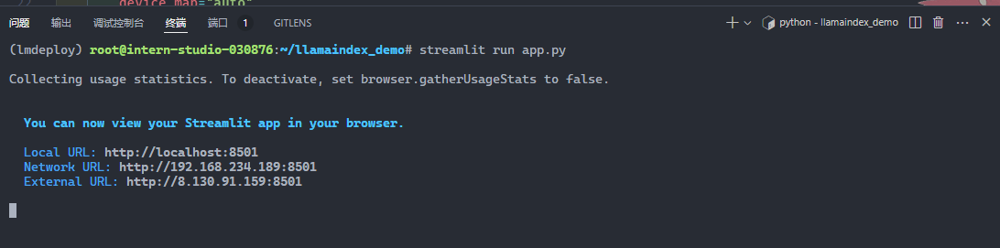

映射端口

```sh
ssh root@ssh.intern-ai.org.cn -p 43681 -CNg -L 8501:127.0.0.1:8501 -o StrictHostKeyChecking=no UserKnownHostsFile=/dev/null
```

访问 http://localhost:8501/

返回正确结果

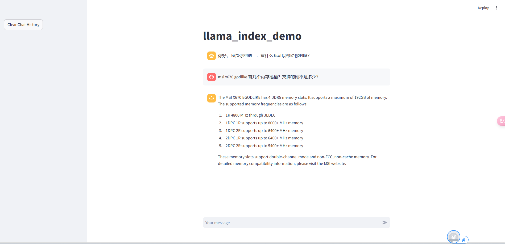

## 本地模型

1. 安装依赖

使用之前已有的环境


2. 准备模型

```sh
cd ~
mkdir llamaindex_demo
cd llamaindex_demo
mkdir model
cd model
ln -s /root/share/new_models/Shanghai_AI_Laboratory/internlm2_5-1_8b-chat/ ./
ln -s /root/share/new_models/maidalun1020/bce-embedding-base_v1/ ./
ls
```


3. 下载 nltk 相关资源

用以下命令下载 nltk 资源并解压到服务器上：

```
cd /root
git clone https://gitee.com/yzy0612/nltk_data.git  --branch gh-pages
cd nltk_data
mv packages/*  ./
cd tokenizers
unzip punkt.zip
cd ../taggers
unzip averaged_perceptron_tagger.zip
```


4. 创建文件执行模型问答

```sh
cd ~/llamaindex_demo
touch llamaindex_internlm.py
```

```python
from llama_index.llms.huggingface import HuggingFaceLLM
from llama_index.core.llms import ChatMessage


llm = HuggingFaceLLM(
    model_name="./model/internlm2_5-1_8b-chat",
    tokenizer_name="./model/internlm2_5-1_8b-chat",
    model_kwargs={"trust_remote_code": True},
    tokenizer_kwargs={"trust_remote_code": True},
    device_map="auto",
    max_new_tokens=256,
    generate_kwargs={
        "do_sample": True,
        "temperature": 0.8,
        "top_k": 50,
        "top_p": 0.8,
        "eos_token_id": 2,
    },
)

response = llm.chat(
    messages=[
        ChatMessage(content="msi x670 godlike 有几个内存插槽？支持的频率是多少？")
    ]
)
print(response)
```

回答的不正确（模型瞎编）

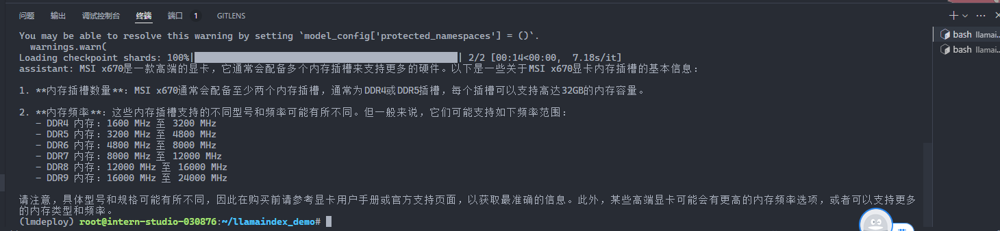

5. 添加 rag 数据

准备数据

```
cd ~/llamaindex_demo
mkdir data
cd data
wget https://download.msi.com/archive/mnu_exe/mb/MEGX670EGODLIKE.pdf
```


6. 创建 rag 代码

```sh
cd ~/llamaindex_demo
touch llamaindex_RAG1.py
```

```python
from llama_index.core import VectorStoreIndex, SimpleDirectoryReader, Settings
from llama_index.embeddings.huggingface import HuggingFaceEmbedding
from llama_index.llms.huggingface import HuggingFaceLLM


# 初始化一个HuggingFaceEmbedding对象，用于将文本转换为向量表示
embed_model = HuggingFaceEmbedding(model_name="./model/bce-embedding-base_v1")
# 将创建的嵌入模型赋值给全局设置的embed_model属性，
# 这样在后续的索引构建过程中就会使用这个模型。
Settings.embed_model = embed_model

llm = HuggingFaceLLM(
    model_name="./model/internlm2_5-1_8b-chat",
    tokenizer_name="./model/internlm2_5-1_8b-chat",
    model_kwargs={"trust_remote_code": True},
    tokenizer_kwargs={"trust_remote_code": True},
    device_map="auto",
    max_new_tokens=256,
    generate_kwargs={
        "do_sample": True,
        "temperature": 0.8,
        "top_k": 50,
        "top_p": 0.8,
        "eos_token_id": 2,
    },
)
# 设置全局的llm属性，这样在索引查询时会使用这个模型。
Settings.llm = llm

# 从指定目录读取所有文档，并加载数据到内存中
documents = SimpleDirectoryReader("./data").load_data()
print(f"documents number = {len(documents)}")

# 创建一个VectorStoreIndex，并使用之前加载的文档来构建索引。
# 此索引将文档转换为向量，并存储这些向量以便于快速检索。
index = VectorStoreIndex.from_documents(documents=documents, embed_model=embed_model)

# 创建一个查询引擎，这个引擎可以接收查询并返回相关文档的响应。
query_engine = index.as_query_engine(llm=llm)

response = query_engine.query("msi x670 godlike 有几个内存插槽？支持的频率是多少？")
print(response)
```

根据说明书回答，正确回答内容

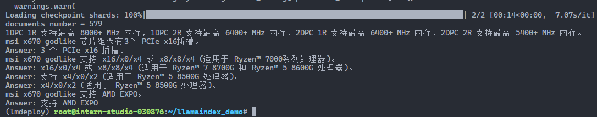

7. LlamaIndex web

创建文件

```sh
cd ~/llamaindex_demo
touch app1.py
```

```python
import streamlit as st
from llama_index.core import VectorStoreIndex, SimpleDirectoryReader, Settings
from llama_index.embeddings.huggingface import HuggingFaceEmbedding
from llama_index.llms.huggingface import HuggingFaceLLM


st.set_page_config(page_title="llama_index_demo", page_icon="🦜🔗")
st.title("llama_index_demo")


# 初始化模型
@st.cache_resource
def init_models():
    embed_model = HuggingFaceEmbedding(model_name="./model/bce-embedding-base_v1")
    Settings.embed_model = embed_model

    llm = HuggingFaceLLM(
        model_name="./model/internlm2_5-1_8b-chat",
        tokenizer_name="./model/internlm2_5-1_8b-chat",
        model_kwargs={"trust_remote_code": True},
        tokenizer_kwargs={"trust_remote_code": True},
        device_map="auto",
        max_new_tokens=256,
        generate_kwargs={
            "do_sample": True,
            "temperature": 0.8,
            "top_k": 50,
            "top_p": 0.8,
            "eos_token_id": 2,
        },
    )
    Settings.llm = llm

    documents = SimpleDirectoryReader("./data").load_data()
    print(f"documents number = {len(documents)}")
    index = VectorStoreIndex.from_documents(
        documents=documents, embed_model=embed_model
    )
    query_engine = index.as_query_engine(llm=llm)

    print("load llm and documents success!")
    return query_engine


# 检查是否需要初始化模型
if "query_engine" not in st.session_state:
    st.session_state["query_engine"] = init_models()


def greet2(question):
    response = st.session_state["query_engine"].query(question)
    return response


# Store LLM generated responses
if "messages" not in st.session_state.keys():
    st.session_state.messages = [
        {"role": "assistant", "content": "你好，我是你的助手，有什么我可以帮助你的吗？"}
    ]

    # Display or clear chat messages
for message in st.session_state.messages:
    with st.chat_message(message["role"]):
        st.write(message["content"])


def clear_chat_history():
    st.session_state.messages = [
        {"role": "assistant", "content": "你好，我是你的助手，有什么我可以帮助你的吗？"}
    ]


st.sidebar.button("Clear Chat History", on_click=clear_chat_history)


# Function for generating LLaMA2 response
def generate_llama_index_response(prompt_input):
    return greet2(prompt_input)


# User-provided prompt
if prompt := st.chat_input():
    st.session_state.messages.append({"role": "user", "content": prompt})
    with st.chat_message("user"):
        st.write(prompt)

# Gegenerate_llama_index_response last message is not from assistant
if st.session_state.messages[-1]["role"] != "assistant":
    with st.chat_message("assistant"):
        with st.spinner("Thinking..."):
            response = generate_llama_index_response(prompt)
            placeholder = st.empty()
            placeholder.markdown(response)
    message = {"role": "assistant", "content": response}
    st.session_state.messages.append(message)
```

运行

```sh
streamlit run app1.py
```

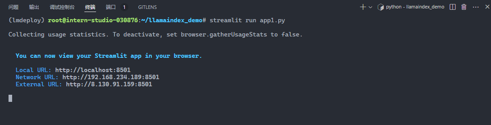

端口映射

```sh
ssh root@ssh.intern-ai.org.cn -p 43681 -CNg -L 8501:127.0.0.1:8501 -o StrictHostKeyChecking=no UserKnownHostsFile=/dev/null
```

访问 http://localhost:8501/

返回正确结果

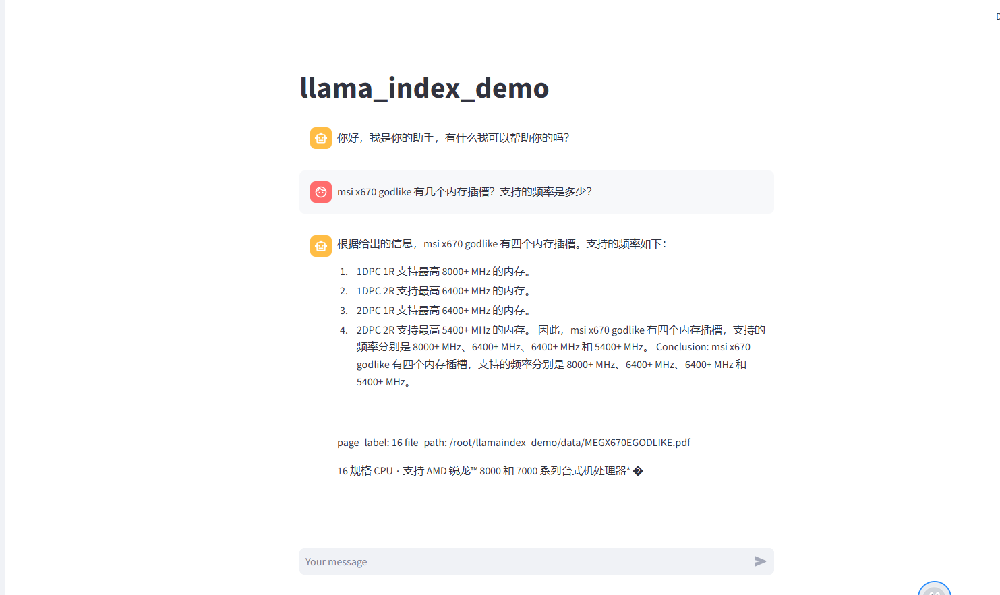