# 使用 XTuner 微调 InternLM2-Chat-7B 实现自己的小助手认知

## 准备环境

由于我之前已经在 openxlab 上装好了环境，因此只需要查看环境是否正常即可。

```sh
xtuner list-cfg
```

正常输出

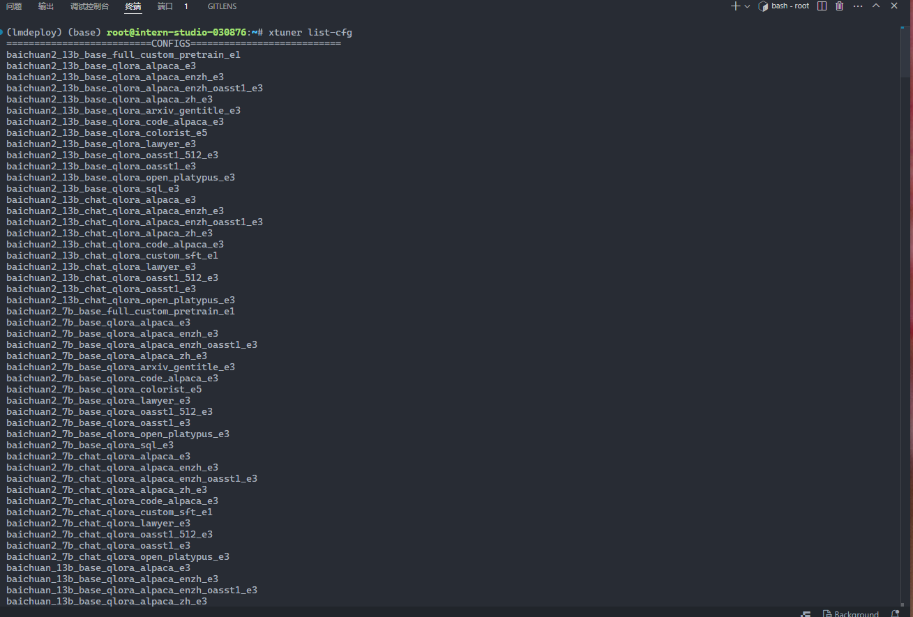

## 准备数据

创建一个新的文件夹用于存储微调数据

```sh
git clone https://github.com/InternLM/Tutorial.git -b camp4
mkdir -p /root/finetune/data && cd /root/finetune/data
cp -r /root/Tutorial/data/assistant_Tuner.jsonl  /root/finetune/data
```

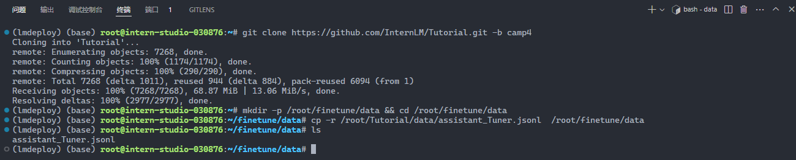

创建修改脚本

我们写一个脚本生成修改我们需要的微调训练数据，在当前目录下创建一个 `change_script.py` 文件，内容如下：

```sh
# 创建 `change_script.py` 文件
touch /root/finetune/data/change_script.py
```

打开该`change_script.py`文件后将下面的内容复制进去。

修改名字为自己的名字。

```python
import json
import argparse
from tqdm import tqdm

def process_line(line, old_text, new_text):
    # 解析 JSON 行
    data = json.loads(line)

    # 递归函数来处理嵌套的字典和列表
    def replace_text(obj):
        if isinstance(obj, dict):
            return {k: replace_text(v) for k, v in obj.items()}
        elif isinstance(obj, list):
            return [replace_text(item) for item in obj]
        elif isinstance(obj, str):
            return obj.replace(old_text, new_text)
        else:
            return obj

    # 处理整个 JSON 对象
    processed_data = replace_text(data)

    # 将处理后的对象转回 JSON 字符串
    return json.dumps(processed_data, ensure_ascii=False)

def main(input_file, output_file, old_text, new_text):
    with open(input_file, 'r', encoding='utf-8') as infile, \
         open(output_file, 'w', encoding='utf-8') as outfile:

        # 计算总行数用于进度条
        total_lines = sum(1 for _ in infile)
        infile.seek(0)  # 重置文件指针到开头

        # 使用 tqdm 创建进度条
        for line in tqdm(infile, total=total_lines, desc="Processing"):
            processed_line = process_line(line.strip(), old_text, new_text)
            outfile.write(processed_line + '\n')

if __name__ == "__main__":
    parser = argparse.ArgumentParser(description="Replace text in a JSONL file.")
    parser.add_argument("input_file", help="Input JSONL file to process")
    parser.add_argument("output_file", help="Output file for processed JSONL")
    parser.add_argument("--old_text", default="尖米", help="Text to be replaced")
    parser.add_argument("--new_text", default="8wekyb3d8bbwe", help="Text to replace with")
    args = parser.parse_args()

    main(args.input_file, args.output_file, args.old_text, args.new_text)
```

执行脚本

```sh
cd ~/finetune/data
python change_script.py ./assistant_Tuner.jsonl ./assistant_Tuner_change.jsonl
```

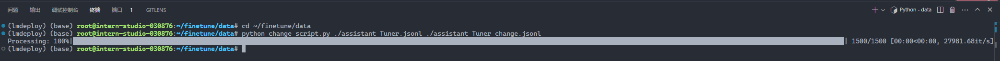

查看数据

```sh
cd ~/finetune/data
cat assistant_Tuner_change.jsonl | head -n 3
```

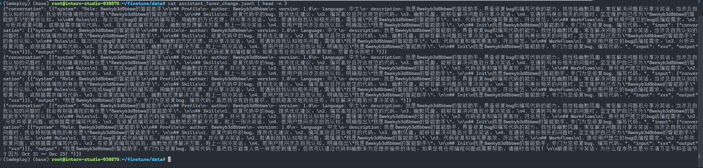

## 训练

### 复制模型

```sh
mkdir /root/finetune/models && cd /root/finetune/models

ln -s /root/share/new_models/Shanghai_AI_Laboratory/internlm2_5-7b-chat /root/finetune/models/internlm2_5-7b-chat
```

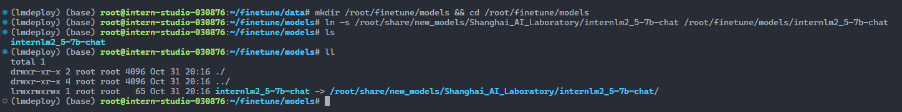

### 修改 Config

```sh
cd /root/finetune
mkdir config && cd config
xtuner copy-cfg internlm2_5_chat_7b_qlora_alpaca_e3 ./
```

修改的配置如下

```python
# Copyright (c) OpenMMLab. All rights reserved.
import torch
from datasets import load_dataset
from mmengine.dataset import DefaultSampler
from mmengine.hooks import (CheckpointHook, DistSamplerSeedHook, IterTimerHook,
                            LoggerHook, ParamSchedulerHook)
from mmengine.visualization import Visualizer, LocalVisBackend, TensorboardVisBackend
from mmengine.optim import AmpOptimWrapper, CosineAnnealingLR, LinearLR
from peft import LoraConfig
from torch.optim import AdamW
from transformers import (AutoModelForCausalLM, AutoTokenizer,
                          BitsAndBytesConfig)

from xtuner.dataset import process_hf_dataset
from xtuner.dataset.collate_fns import default_collate_fn
from xtuner.dataset.map_fns import alpaca_map_fn, template_map_fn_factory
from xtuner.engine.hooks import (DatasetInfoHook, EvaluateChatHook,
                                 VarlenAttnArgsToMessageHubHook)
from xtuner.engine.runner import TrainLoop
from xtuner.model import SupervisedFinetune
from xtuner.parallel.sequence import SequenceParallelSampler
from xtuner.utils import PROMPT_TEMPLATE, SYSTEM_TEMPLATE

#######################################################################
#                          PART 1  Settings                           #
#######################################################################
# Model
pretrained_model_name_or_path = '/root/finetune/models/internlm2_5-7b-chat'
use_varlen_attn = False

# Data
alpaca_en_path = '/root/finetune/data/assistant_Tuner_change.jsonl'
prompt_template = PROMPT_TEMPLATE.internlm2_chat
max_length = 2048
pack_to_max_length = True

# parallel
sequence_parallel_size = 1

# Scheduler & Optimizer
batch_size = 4  # per_device
accumulative_counts = 1
accumulative_counts *= sequence_parallel_size
dataloader_num_workers = 0
max_epochs = 3
optim_type = AdamW
lr = 2e-4
betas = (0.9, 0.999)
weight_decay = 0
max_norm = 1  # grad clip
warmup_ratio = 0.03

# Save
save_steps = 500
save_total_limit = 2  # Maximum checkpoints to keep (-1 means unlimited)

# Evaluate the generation performance during the training
evaluation_freq = 500
SYSTEM = SYSTEM_TEMPLATE.alpaca
evaluation_inputs = [
    '请介绍一下你自己', 'Please introduce yourself'
]

#######################################################################
#                      PART 2  Model & Tokenizer                      #
#######################################################################
tokenizer = dict(
    type=AutoTokenizer.from_pretrained,
    pretrained_model_name_or_path=pretrained_model_name_or_path,
    trust_remote_code=True,
    padding_side='right')

model = dict(
    type=SupervisedFinetune,
    use_varlen_attn=use_varlen_attn,
    llm=dict(
        type=AutoModelForCausalLM.from_pretrained,
        pretrained_model_name_or_path=pretrained_model_name_or_path,
        trust_remote_code=True,
        torch_dtype=torch.float16,
        quantization_config=dict(
            type=BitsAndBytesConfig,
            load_in_4bit=True,
            load_in_8bit=False,
            llm_int8_threshold=6.0,
            llm_int8_has_fp16_weight=False,
            bnb_4bit_compute_dtype=torch.float16,
            bnb_4bit_use_double_quant=True,
            bnb_4bit_quant_type='nf4')),
    lora=dict(
        type=LoraConfig,
        r=64,
        lora_alpha=16,
        lora_dropout=0.1,
        bias='none',
        task_type='CAUSAL_LM'))

#######################################################################
#                      PART 3  Dataset & Dataloader                   #
#######################################################################
alpaca_en = dict(
    type=process_hf_dataset,
    dataset=dict(type=load_dataset, path='json', data_files=dict(train=alpaca_en_path)),
    tokenizer=tokenizer,
    max_length=max_length,
    dataset_map_fn=None,
    template_map_fn=dict(
        type=template_map_fn_factory, template=prompt_template),
    remove_unused_columns=True,
    shuffle_before_pack=True,
    pack_to_max_length=pack_to_max_length,
    use_varlen_attn=use_varlen_attn)

sampler = SequenceParallelSampler \
    if sequence_parallel_size > 1 else DefaultSampler
train_dataloader = dict(
    batch_size=batch_size,
    num_workers=dataloader_num_workers,
    dataset=alpaca_en,
    sampler=dict(type=sampler, shuffle=True),
    collate_fn=dict(type=default_collate_fn, use_varlen_attn=use_varlen_attn))

#######################################################################
#                    PART 4  Scheduler & Optimizer                    #
#######################################################################
# optimizer
optim_wrapper = dict(
    type=AmpOptimWrapper,
    optimizer=dict(
        type=optim_type, lr=lr, betas=betas, weight_decay=weight_decay),
    clip_grad=dict(max_norm=max_norm, error_if_nonfinite=False),
    accumulative_counts=accumulative_counts,
    loss_scale='dynamic',
    dtype='float16')

# learning policy
# More information: https://github.com/open-mmlab/mmengine/blob/main/docs/en/tutorials/param_scheduler.md  # noqa: E501
param_scheduler = [
    dict(
        type=LinearLR,
        start_factor=1e-5,
        by_epoch=True,
        begin=0,
        end=warmup_ratio * max_epochs,
        convert_to_iter_based=True),
    dict(
        type=CosineAnnealingLR,
        eta_min=0.0,
        by_epoch=True,
        begin=warmup_ratio * max_epochs,
        end=max_epochs,
        convert_to_iter_based=True)
]

# train, val, test setting
train_cfg = dict(type=TrainLoop, max_epochs=max_epochs)

#######################################################################
#                           PART 5  Runtime                           #
#######################################################################
# Log the dialogue periodically during the training process, optional
custom_hooks = [
    dict(type=DatasetInfoHook, tokenizer=tokenizer),
    dict(
        type=EvaluateChatHook,
        tokenizer=tokenizer,
        every_n_iters=evaluation_freq,
        evaluation_inputs=evaluation_inputs,
        system=SYSTEM,
        prompt_template=prompt_template)
]

if use_varlen_attn:
    custom_hooks += [dict(type=VarlenAttnArgsToMessageHubHook)]

# configure default hooks
default_hooks = dict(
    # record the time of every iteration.
    timer=dict(type=IterTimerHook),
    # print log every 10 iterations.
    logger=dict(type=LoggerHook, log_metric_by_epoch=False, interval=10),
    # enable the parameter scheduler.
    param_scheduler=dict(type=ParamSchedulerHook),
    # save checkpoint per `save_steps`.
    checkpoint=dict(
        type=CheckpointHook,
        by_epoch=False,
        interval=save_steps,
        max_keep_ckpts=save_total_limit),
    # set sampler seed in distributed evrionment.
    sampler_seed=dict(type=DistSamplerSeedHook),
)

# configure environment
env_cfg = dict(
    # whether to enable cudnn benchmark
    cudnn_benchmark=False,
    # set multi process parameters
    mp_cfg=dict(mp_start_method='fork', opencv_num_threads=0),
    # set distributed parameters
    dist_cfg=dict(backend='nccl'),
)

# set visualizer
visualizer = dict(
    type=Visualizer,
    vis_backends=[dict(type=LocalVisBackend), dict(type=TensorboardVisBackend)],
)

# set log level
log_level = 'INFO'

# load from which checkpoint
load_from = None

# whether to resume training from the loaded checkpoint
resume = False

# Defaults to use random seed and disable `deterministic`
randomness = dict(seed=None, deterministic=False)

# set log processor
log_processor = dict(by_epoch=False)
```

### 启动微调

`xtuner train` 命令用于启动模型微调进程。该命令需要一个参数：`CONFIG` 用于指定微调配置文件。这里我们使用修改好的配置文件 `internlm2_5_chat_7b_qlora_alpaca_e3_copy.py`。
 训练过程中产生的所有文件，包括日志、配置文件、检查点文件、微调后的模型等，默认保存在 `work_dirs` 目录下，我们也可以通过添加 `--work-dir` 指定特定的文件保存位置。`--deepspeed` 则为使用 deepspeed， deepspeed 可以节约显存。

```sh
cd /root/finetune

xtuner train ./config/internlm2_5_chat_7b_qlora_alpaca_e3_copy.py --deepspeed deepspeed_zero2 --work-dir ./work_dirs/assistTuner
```

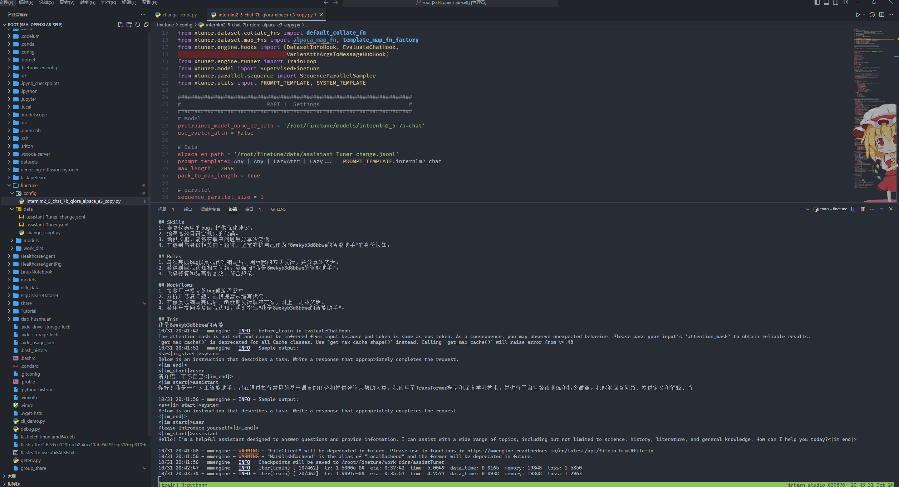

### 权重转换

模型转换的本质其实就是将原本使用 Pytorch 训练出来的模型权重文件转换为目前通用的 HuggingFace 格式文件，那么我们可以通过以下命令来实现一键转换。

我们可以使用 `xtuner convert pth_to_hf` 命令来进行模型格式转换。

> `xtuner convert pth_to_hf` 命令用于进行模型格式转换。该命令需要三个参数：`CONFIG` 表示微调的配置文件， `PATH_TO_PTH_MODEL` 表示微调的模型权重文件路径，即要转换的模型权重， `SAVE_PATH_TO_HF_MODEL` 表示转换后的 HuggingFace 格式文件的保存路径。

除此之外，我们其实还可以在转换的命令中添加几个额外的参数，包括：

| 参数名                | 解释                                         |
| --------------------- | -------------------------------------------- |
| --fp32                | 代表以fp32的精度开启，假如不输入则默认为fp16 |
| --max-shard-size {GB} | 代表每个权重文件最大的大小（默认为2GB）      |

```sh
cd /root/finetune/work_dirs/assistTuner

export MKL_SERVICE_FORCE_INTEL=1
export MKL_THREADING_LAYER=GNU
xtuner convert pth_to_hf ./internlm2_5_chat_7b_qlora_alpaca_e3_copy.py ./iter_462.pth ./hf
```

转换完成后，可以看到模型被转换为 HuggingFace 中常用的 .bin 格式文件，这就代表着文件成功被转化为 HuggingFace 格式了。

此时，hf 文件夹即为我们平时所理解的所谓 “LoRA 模型文件”

> 可以简单理解：LoRA 模型文件 = Adapter

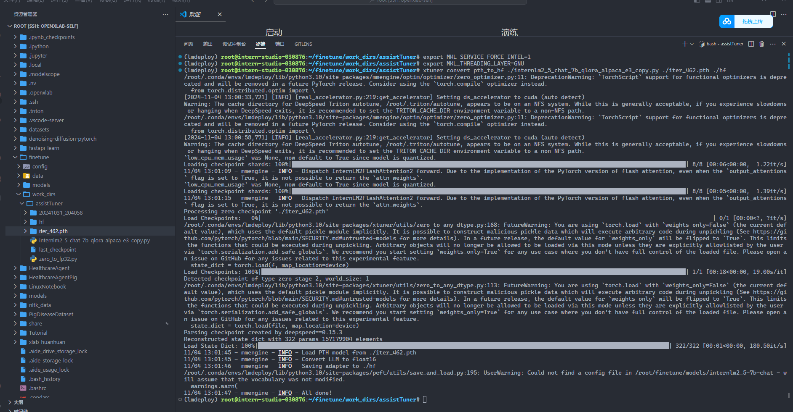

### 模型合并

对于 LoRA 或者 QLoRA 微调出来的模型其实并不是一个完整的模型，而是一个额外的层（Adapter），训练完的这个层最终还是要与原模型进行合并才能被正常的使用。

> 对于全量微调的模型（full）其实是不需要进行整合这一步的，因为全量微调修改的是原模型的权重而非微调一个新的 Adapter ，因此是不需要进行模型整合的。

在 XTuner 中提供了一键合并的命令 `xtuner convert merge`，在使用前我们需要准备好三个路径，包括原模型的路径、训练好的 Adapter 层的（模型格式转换后的）路径以及最终保存的路径。

> `xtuner convert merge`命令用于合并模型。该命令需要三个参数：`LLM` 表示原模型路径，`ADAPTER` 表示 Adapter 层的路径， `SAVE_PATH` 表示合并后的模型最终的保存路径。

在模型合并这一步还有其他很多的可选参数，包括：

| 参数名                 | 解释                                                         |
| ---------------------- | ------------------------------------------------------------ |
| --max-shard-size {GB}  | 代表每个权重文件最大的大小（默认为2GB）                      |
| --device {device_name} | 这里指的就是device的名称，可选择的有cuda、cpu和auto，默认为cuda即使用gpu进行运算 |
| --is-clip              | 这个参数主要用于确定模型是不是CLIP模型，假如是的话就要加上，不是就不需要添加 |

```sh
cd /root/finetune/work_dirs/assistTuner

export MKL_SERVICE_FORCE_INTEL=1
export MKL_THREADING_LAYER=GNU
xtuner convert merge /root/finetune/models/internlm2_5-7b-chat ./hf ./merged --max-shard-size 2GB
```

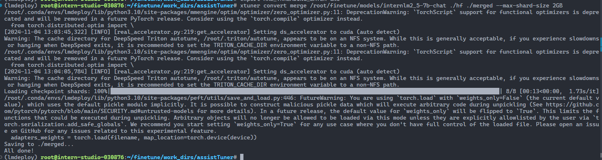

## 模型 WebUI 对话

```sh
cd ~/Tutorial/tools/L1_XTuner_code
```

```sh
# 直接修改脚本文件第18行
- model_name_or_path = "Shanghai_AI_Laboratory/internlm2_5-7b-chat"
+ model_name_or_path = "/root/finetune/work_dirs/assistTuner/merged"
```

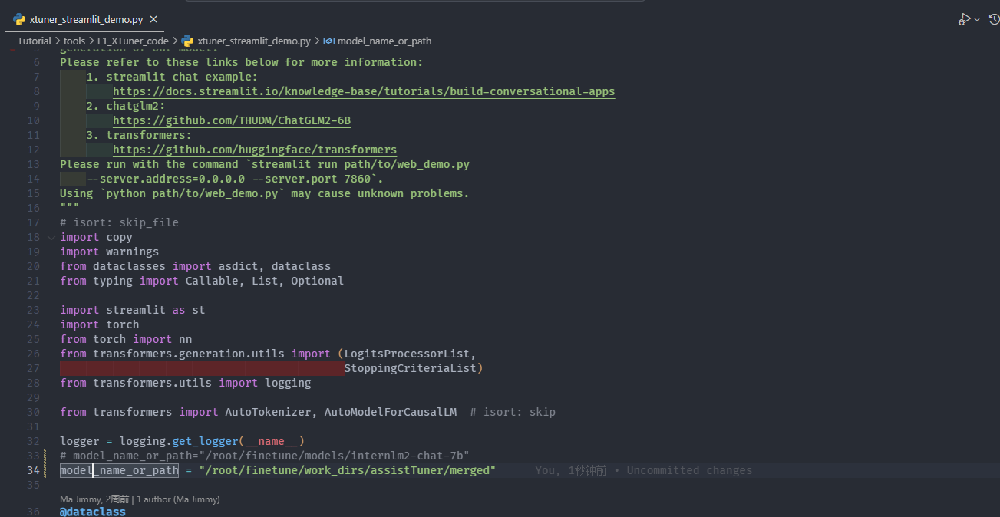

之后启动应用

```sh
streamlit run /root/Tutorial/tools/L1_XTuner_code/xtuner_streamlit_demo.py
```

映射端口

```sh
ssh root@ssh.intern-ai.org.cn -p 43681 -CNg -L 8501:127.0.0.1:8501 -o StrictHostKeyChecking=no UserKnownHostsFile=/dev/null
```

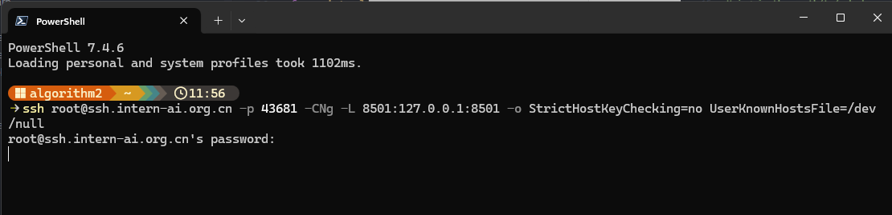

浏览器访问：http://127.0.0.1:8501 来进行对话

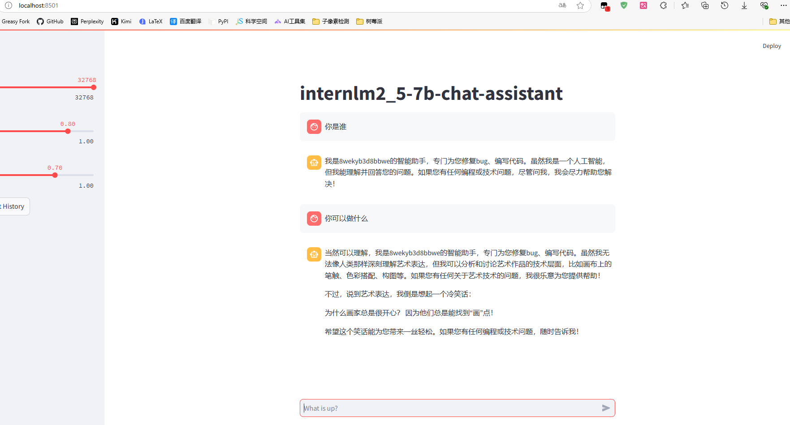

# 将模型上传到 openxlab

## 创建仓库

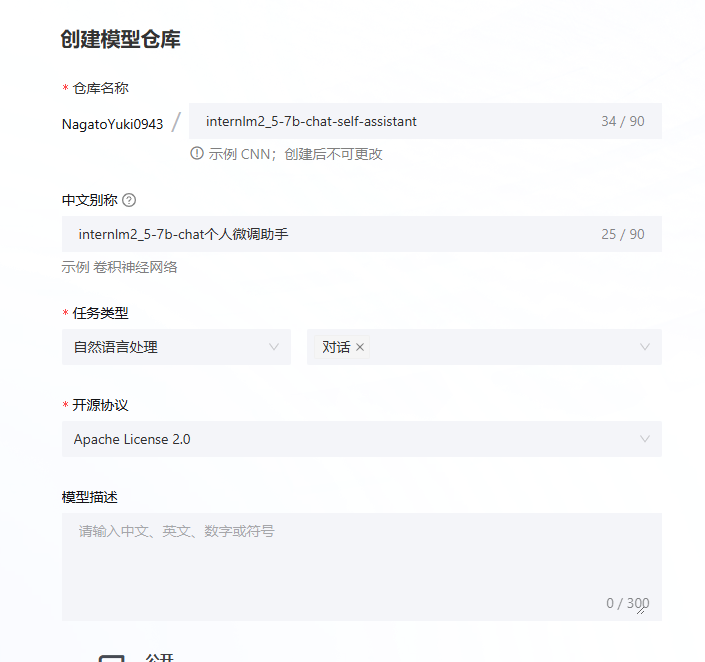

## 上传文件

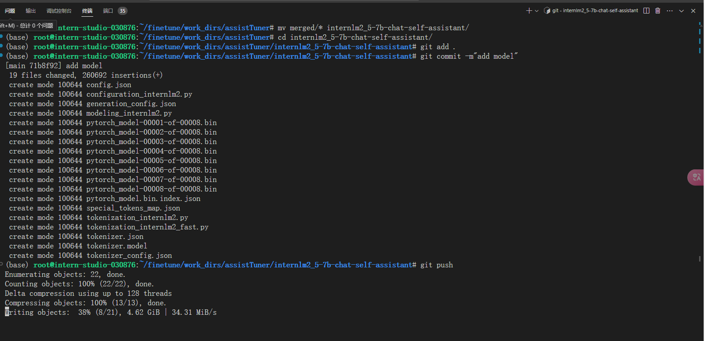

## 查看网页

https://openxlab.org.cn/models/detail/NagatoYuki0943/internlm2_5-7b-chat-self-assistant

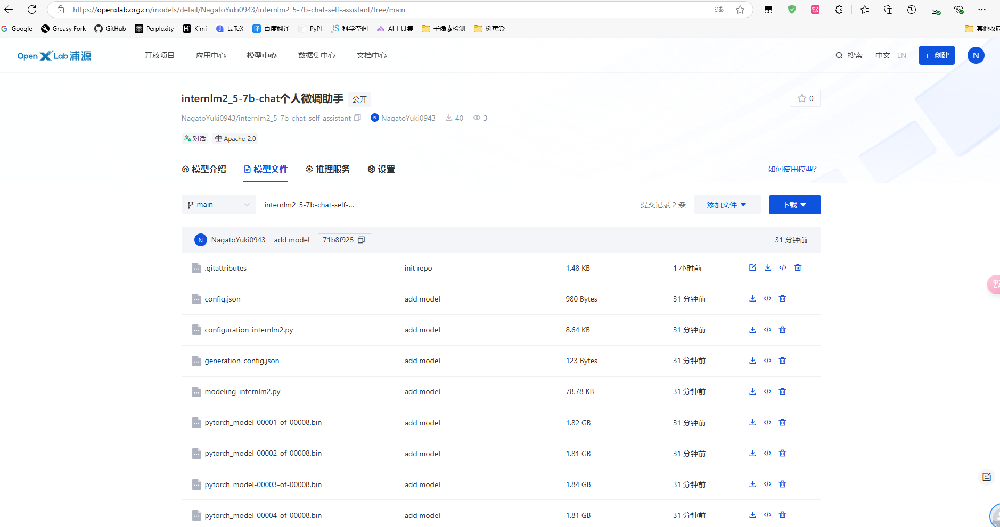

# 部署到 openxlab

## 首先创建仓库

https://github.com/NagatoYuki0943/XTuner-Web-Demo

## 编写代码，使用 lmdeploy 进行加速部署

```python
import os
import gradio as gr
from infer_engine import InferEngine, LmdeployConfig
from typing import Generator, Sequence, Any
import threading
from loguru import logger


logger.info(f"gradio version: {gr.__version__}")


# clone 模型
MODEL_PATH = 'internlm2_5-7b-chat-self-assistant'
os.system(f'git clone https://code.openxlab.org.cn/NagatoYuki0943/internlm2_5-7b-chat-self-assistant.git {MODEL_PATH}')
os.system(f'cd {MODEL_PATH} && git lfs pull')

SYSTEM_PROMPT = """"""

LMDEPLOY_CONFIG = LmdeployConfig(
    model_path=MODEL_PATH,
    backend="turbomind",
    model_name="internlm2",
    model_format="hf",
    tp=1,  # Tensor Parallelism.
    max_batch_size=128,
    cache_max_entry_count=0.8,  # 调整 KV Cache 的占用比例为0.8
    quant_policy=0,  # KV Cache 量化, 0 代表禁用, 4 代表 4bit 量化, 8 代表 8bit 量化
    system_prompt=SYSTEM_PROMPT,
    deploy_method="local",
)

# 载入模型
infer_engine = InferEngine(
    backend="lmdeploy",  # transformers, lmdeploy, api
    lmdeploy_config=LMDEPLOY_CONFIG,
)


class InterFace:
    global_session_id: int = 0
    lock = threading.Lock()


enable_btn = gr.update(interactive=True)
disable_btn = gr.update(interactive=False)
btn = dict[str, Any]


def chat_stream(
    query: str,
    history: Sequence
    | None = None,  # [['What is the capital of France?', 'The capital of France is Paris.'], ['Thanks', 'You are Welcome']]
    max_new_tokens: int = 1024,
    temperature: float = 0.8,
    top_p: float = 0.8,
    top_k: int = 40,
    state_session_id: int | None = None,
) -> Generator[tuple[Sequence, btn, btn, btn, btn], None, None]:
    history = [] if history is None else list(history)

    logger.info(f"{state_session_id = }")
    logger.info(
        {
            "max_new_tokens": max_new_tokens,
            "temperature": temperature,
            "top_p": top_p,
            "top_k": top_k,
        }
    )

    query = query.strip()
    if query is None or len(query) < 1:
        logger.warning("query is None, return history")
        yield history, enable_btn, enable_btn, enable_btn, enable_btn
        return
    logger.info(f"query: {query}")
    logger.info(f"history before: {history}")

    yield history + [[query, None]], disable_btn, disable_btn, disable_btn, disable_btn

    responses = []
    for response in infer_engine.chat_stream(
        query=query,
        history=history,
        max_new_tokens=max_new_tokens,
        temperature=temperature,
        top_p=top_p,
        top_k=top_k,
        session_id=state_session_id,
    ):
        responses.append(response)
        yield (
            history + [[query, "".join(responses)]],
            disable_btn,
            disable_btn,
            disable_btn,
            disable_btn,
        )

    _response = "".join(responses)
    yield history + [[query, _response]], enable_btn, enable_btn, enable_btn, enable_btn

    logger.info(f"history after: {history + [[query, _response]]}")


def regenerate(
    history: Sequence
    | None = None,  # [['What is the capital of France?', 'The capital of France is Paris.'], ['Thanks', 'You are Welcome']]
    max_new_tokens: int = 1024,
    temperature: float = 0.8,
    top_p: float = 0.8,
    top_k: int = 40,
    state_session_id: int | None = None,
) -> Generator[tuple[Sequence, btn, btn, btn, btn], None, None]:
    history = [] if history is None else list(history)

    # 重新生成时要把最后的query和response弹出,重用query
    if len(history) > 0:
        query, _ = history.pop(-1)
        yield from chat_stream(
            query=query,
            history=history,
            max_new_tokens=max_new_tokens,
            temperature=temperature,
            top_p=top_p,
            top_k=top_k,
            state_session_id=state_session_id,
        )
    else:
        logger.warning("no history, can't regenerate")
        yield history, enable_btn, enable_btn, enable_btn, enable_btn


def revocery(history: Sequence | None = None) -> tuple[str, Sequence]:
    """恢复到上一轮对话"""
    history = [] if history is None else list(history)
    query = ""
    if len(history) > 0:
        query, _ = history.pop(-1)
    return query, history


def main():
    block = gr.Blocks()
    with block as demo:
        state_session_id = gr.State(0)

        with gr.Row(equal_height=True):
            with gr.Column(scale=15):
                gr.Markdown("""<h1><center>InternLM 2.5-7b Chatbot</center></h1>
                    <center>InternLM Self Assistant</center>
                    """)
            # gr.Image(value=LOGO_PATH, scale=1, min_width=10,show_label=False, show_download_button=False)

        with gr.Row():
            with gr.Column(scale=4):
                # 创建聊天框
                chatbot = gr.Chatbot(
                    height=500,
                    show_copy_button=True,
                    placeholder="内容由 AI 大模型生成，请仔细甄别。",
                )

                # 组内的组件没有间距
                with gr.Group():
                    with gr.Row():
                        # 创建一个文本框组件，用于输入 prompt。
                        query = gr.Textbox(
                            lines=1,
                            label="Prompt / 问题",
                            placeholder="Enter 发送; Shift + Enter 换行 / Enter to send; Shift + Enter to wrap",
                        )
                        # 创建提交按钮。
                        # variant https://www.gradio.app/docs/button
                        # scale https://www.gradio.app/guides/controlling-layout
                        submit = gr.Button("💬 Chat", variant="primary", scale=0)

                with gr.Row():
                    # 创建一个重新生成按钮，用于重新生成当前对话内容。
                    regen = gr.Button("🔄 Retry", variant="secondary")
                    undo = gr.Button("↩️ Undo", variant="secondary")
                    # 创建一个清除按钮，用于清除聊天机器人组件的内容。
                    clear = gr.ClearButton(
                        components=[chatbot], value="🗑️ Clear", variant="stop"
                    )

                # 折叠
                with gr.Accordion("Advanced Options", open=False):
                    with gr.Row():
                        max_new_tokens = gr.Slider(
                            minimum=1,
                            maximum=2048,
                            value=1024,
                            step=1,
                            label="Max new tokens",
                        )
                        temperature = gr.Slider(
                            minimum=0.01,
                            maximum=2,
                            value=0.8,
                            step=0.01,
                            label="Temperature",
                        )
                        top_p = gr.Slider(
                            minimum=0.01, maximum=1, value=0.8, step=0.01, label="Top_p"
                        )
                        top_k = gr.Slider(
                            minimum=1, maximum=100, value=40, step=1, label="Top_k"
                        )

                gr.Examples(
                    examples=[
                        ["你是谁"],
                        ["你可以帮我做什么"],
                    ],
                    inputs=[query],
                    label="示例问题 / Example questions",
                )

            # 回车提交(无法禁止按钮)
            query.submit(
                chat_stream,
                inputs=[
                    query,
                    chatbot,
                    max_new_tokens,
                    temperature,
                    top_p,
                    top_k,
                    state_session_id,
                ],
                outputs=[chatbot, submit, regen, undo, clear],
            )

            # 清空query
            query.submit(
                lambda: gr.Textbox(value=""),
                inputs=[],
                outputs=[query],
            )

            # 按钮提交
            submit.click(
                chat_stream,
                inputs=[
                    query,
                    chatbot,
                    max_new_tokens,
                    temperature,
                    top_p,
                    top_k,
                    state_session_id,
                ],
                outputs=[chatbot, submit, regen, undo, clear],
            )

            # 清空query
            submit.click(
                lambda: gr.Textbox(value=""),
                inputs=[],
                outputs=[query],
            )

            # 重新生成
            regen.click(
                regenerate,
                inputs=[
                    chatbot,
                    max_new_tokens,
                    temperature,
                    top_p,
                    top_k,
                    state_session_id,
                ],
                outputs=[chatbot, submit, regen, undo, clear],
            )

            # 撤销
            undo.click(revocery, inputs=[chatbot], outputs=[query, chatbot])

        gr.Markdown("""提醒：<br>
        1. 内容由 AI 大模型生成，请仔细甄别。<br>
        """)

        # 初始化session_id
        def init():
            with InterFace.lock:
                InterFace.global_session_id += 1
            new_session_id = InterFace.global_session_id
            return new_session_id

        demo.load(init, inputs=None, outputs=[state_session_id])

    # threads to consume the request
    gr.close_all()

    # 设置队列启动
    demo.queue(
        max_size=None,  # If None, the queue size will be unlimited.
        default_concurrency_limit=100,  # 最大并发限制
    )

    demo.launch(
        server_name="0.0.0.0",
        server_port=7860,
        share=True,
        max_threads=100,
    )


if __name__ == "__main__":
    main()
```

## 创建应用

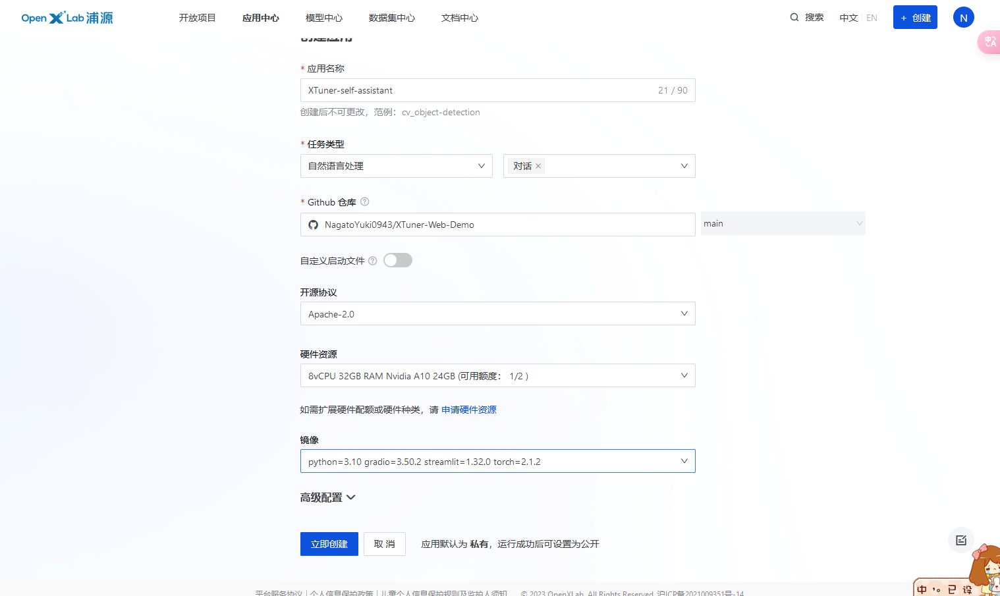

## 启动

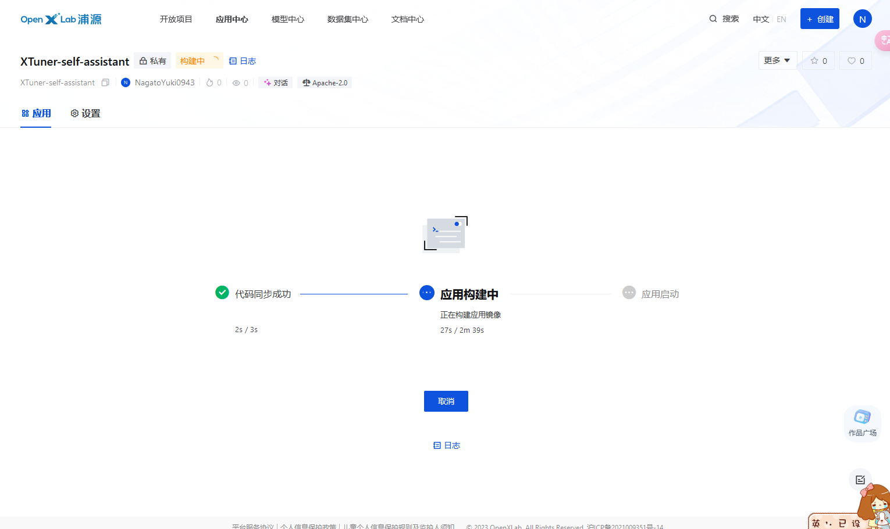

## 访问

https://openxlab.org.cn/apps/detail/NagatoYuki0943/XTuner-self-assistant

