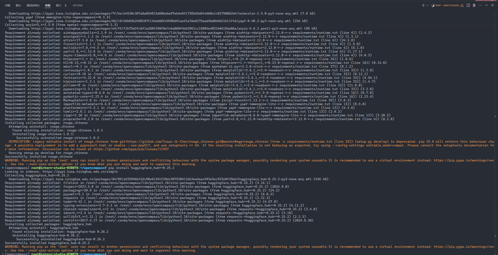
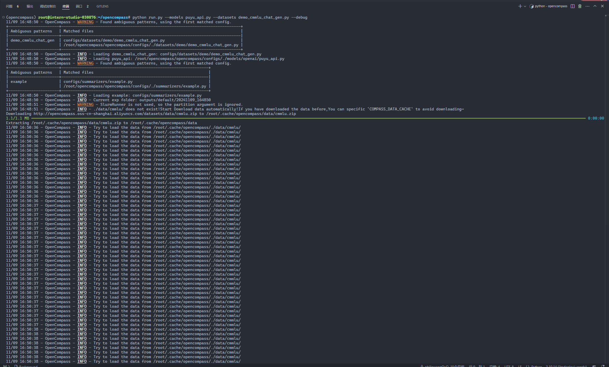
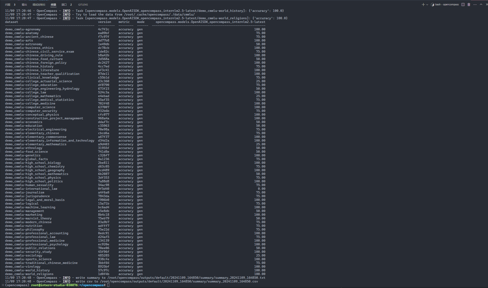
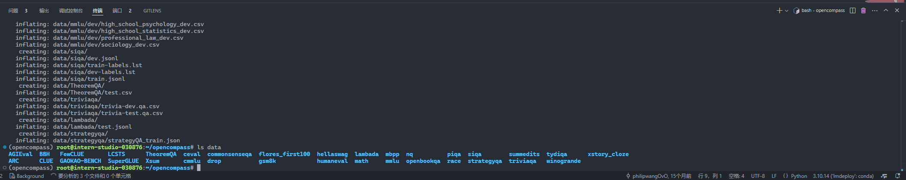
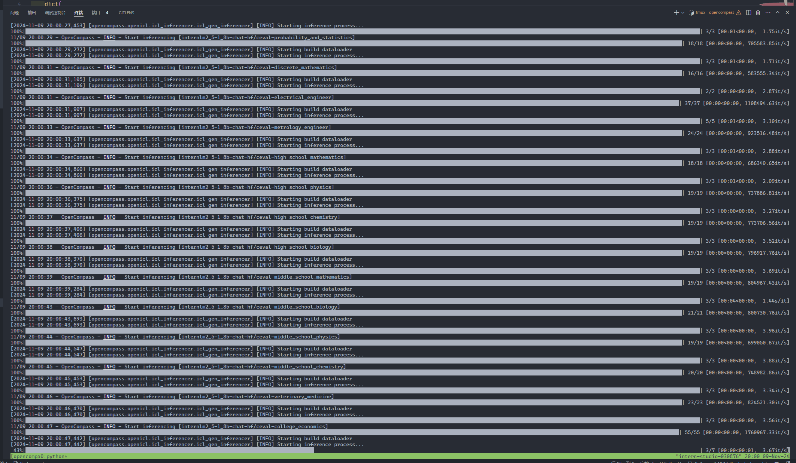
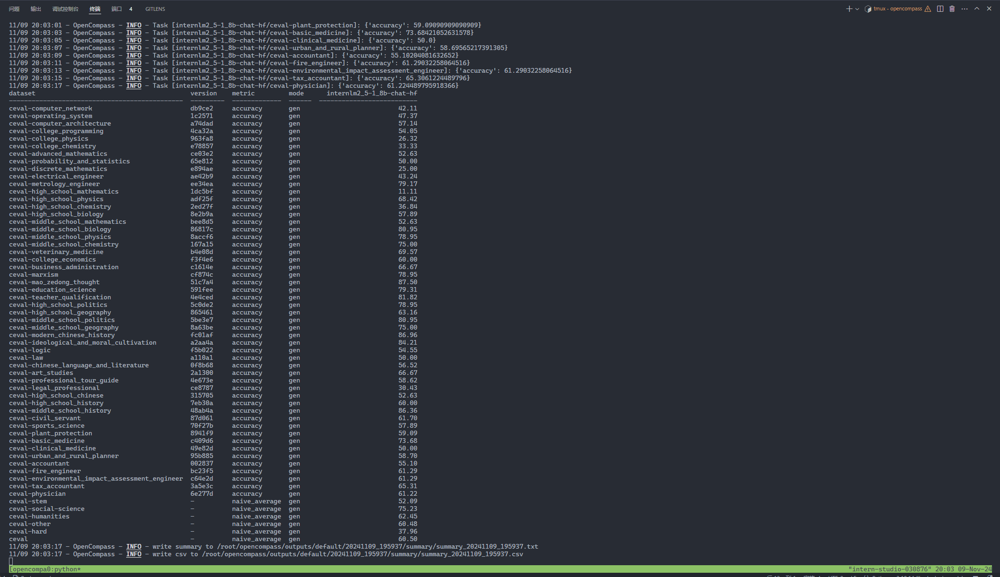
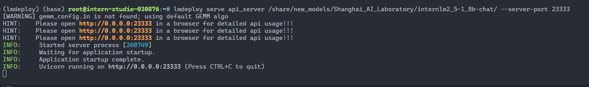
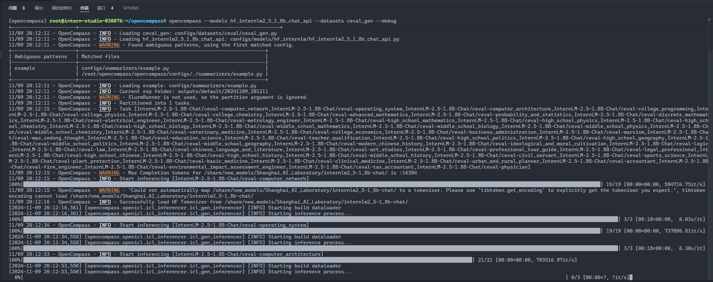
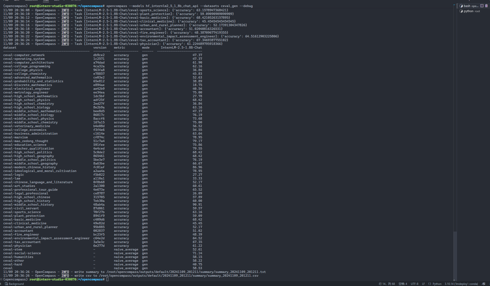

# 使用 OpenCompass 评测浦语 API

## 创建环境

```sh
conda create -n opencompass python=3.10
conda activate opencompass
```


```sh
cd /root
git clone -b 0.3.3 https://github.com/open-compass/opencompass
cd opencompass
pip install -e .
pip install -r requirements.txt
pip install huggingface_hub==0.25.2
```

 

## 获取 api

打开网站浦语官方地址 https://internlm.intern-ai.org.cn/api/document 获得 api key 和 api 服务地址 (也可以从第三方平台 [硅基流动](https://siliconflow.cn/zh-cn/siliconcloud) 获取), 在终端中运行:

```sh
export INTERNLM_API_KEY=xxxxxxxxxxxxxxxxxxxxxxx # 填入你申请的 API Key
```

## 配置模型

在终端中运行 `cd /root/opencompass/` 和 `touch opencompass/configs/models/openai/puyu_api.py`, 然后打开文件, 贴入以下代码:

```python
import os
from opencompass.models import OpenAISDK


internlm_url = 'https://internlm-chat.intern-ai.org.cn/puyu/api/v1/' # 你前面获得的 api 服务地址
internlm_api_key = os.getenv('INTERNLM_API_KEY')

models = [
    dict(
        # abbr='internlm2.5-latest',
        type=OpenAISDK,
        path='internlm2.5-latest', # 请求服务时的 model name
        # 换成自己申请的APIkey
        key=internlm_api_key, # API key
        openai_api_base=internlm_url, # 服务地址
        rpm_verbose=True, # 是否打印请求速率
        query_per_second=0.16, # 服务请求速率
        max_out_len=1024, # 最大输出长度
        max_seq_len=4096, # 最大输入长度
        temperature=0.01, # 生成温度
        batch_size=1, # 批处理大小
        retry=3, # 重试次数
    )
]
```

## 配置数据集

在终端中运行 `cd /root/opencompass/` 和 `touch opencompass/configs/datasets/demo/demo_cmmlu_chat_gen.py`, 然后打开文件, 贴入以下代码:

```python
from mmengine import read_base

with read_base():
    from ..cmmlu.cmmlu_gen_c13365 import cmmlu_datasets


# 每个数据集只取前2个样本进行评测
for d in cmmlu_datasets:
    d['abbr'] = 'demo_' + d['abbr']
    d['reader_cfg']['test_range'] = '[0:1]' # 这里每个数据集只取1个样本, 方便快速评测.
```

这样我们使用了 CMMLU Benchmark 的每个子数据集的 1 个样本进行评测.

## 运行

完成配置后, 在终端中运行: 

```sh
~/opencompass
conda activate opencompass
python run.py --models puyu_api.py --datasets demo_cmmlu_chat_gen.py --debug
```



预计运行10分钟后, 得到结果:

```sh
dataset                                           version    metric    mode      opencompass.models.OpenAISDK_opencompass_internlm2.5-latest
------------------------------------------------  ---------  --------  ------  -------------------------------------------------------------
demo_cmmlu-agronomy                               4c7f2c     accuracy  gen                                                            100.00
demo_cmmlu-anatomy                                ea09bf     accuracy  gen                                                             75.00
demo_cmmlu-ancient_chinese                        f7c97f     accuracy  gen                                                             75.00
demo_cmmlu-arts                                   dd77b8     accuracy  gen                                                            100.00
demo_cmmlu-astronomy                              1e49db     accuracy  gen                                                             50.00
demo_cmmlu-business_ethics                        dc78cb     accuracy  gen                                                            100.00
demo_cmmlu-chinese_civil_service_exam             1de82c     accuracy  gen                                                             75.00
demo_cmmlu-chinese_driving_rule                   b8a42b     accuracy  gen                                                            100.00
demo_cmmlu-chinese_food_culture                   2d568a     accuracy  gen                                                             50.00
demo_cmmlu-chinese_foreign_policy                 dc2427     accuracy  gen                                                            100.00
demo_cmmlu-chinese_history                        4cc7ed     accuracy  gen                                                             75.00
demo_cmmlu-chinese_literature                     af3c41     accuracy  gen                                                            100.00
demo_cmmlu-chinese_teacher_qualification          87de11     accuracy  gen                                                            100.00
demo_cmmlu-clinical_knowledge                     c55b1d     accuracy  gen                                                             75.00
demo_cmmlu-college_actuarial_science              d3c360     accuracy  gen                                                             25.00
demo_cmmlu-college_education                      df8790     accuracy  gen                                                             75.00
demo_cmmlu-college_engineering_hydrology          673f23     accuracy  gen                                                             50.00
demo_cmmlu-college_law                            524c3a     accuracy  gen                                                            100.00
demo_cmmlu-college_mathematics                    e4ebad     accuracy  gen                                                             25.00
demo_cmmlu-college_medical_statistics             55af35     accuracy  gen                                                             75.00
demo_cmmlu-college_medicine                       702f48     accuracy  gen                                                            100.00
demo_cmmlu-computer_science                       637007     accuracy  gen                                                            100.00
demo_cmmlu-computer_security                      932b6b     accuracy  gen                                                             75.00
demo_cmmlu-conceptual_physics                     cfc077     accuracy  gen                                                            100.00
demo_cmmlu-construction_project_management        968a4a     accuracy  gen                                                            100.00
demo_cmmlu-economics                              ddaf7c     accuracy  gen                                                             50.00
demo_cmmlu-education                              c35963     accuracy  gen                                                             50.00
demo_cmmlu-electrical_engineering                 70e98a     accuracy  gen                                                             75.00
demo_cmmlu-elementary_chinese                     cbcd6a     accuracy  gen                                                             75.00
demo_cmmlu-elementary_commonsense                 a67f37     accuracy  gen                                                            100.00
demo_cmmlu-elementary_information_and_technology  d34d2a     accuracy  gen                                                            100.00
demo_cmmlu-elementary_mathematics                 a9d403     accuracy  gen                                                             25.00
demo_cmmlu-ethnology                              31955f     accuracy  gen                                                             50.00
demo_cmmlu-food_science                           741d8e     accuracy  gen                                                             50.00
demo_cmmlu-genetics                               c326f7     accuracy  gen                                                            100.00
demo_cmmlu-global_facts                           0a1236     accuracy  gen                                                             75.00
demo_cmmlu-high_school_biology                    2be811     accuracy  gen                                                            100.00
demo_cmmlu-high_school_chemistry                  d63c05     accuracy  gen                                                             75.00
demo_cmmlu-high_school_geography                  5cd489     accuracy  gen                                                            100.00
demo_cmmlu-high_school_mathematics                6b2087     accuracy  gen                                                             50.00
demo_cmmlu-high_school_physics                    3df353     accuracy  gen                                                             75.00
demo_cmmlu-high_school_politics                   7a88d8     accuracy  gen                                                            100.00
demo_cmmlu-human_sexuality                        54ac98     accuracy  gen                                                             75.00
demo_cmmlu-international_law                      0f5d40     accuracy  gen                                                              0.00
demo_cmmlu-journalism                             a4f6a0     accuracy  gen                                                             75.00
demo_cmmlu-jurisprudence                          7843da     accuracy  gen                                                             75.00
demo_cmmlu-legal_and_moral_basis                  f906b0     accuracy  gen                                                            100.00
demo_cmmlu-logical                                15a71b     accuracy  gen                                                             75.00
demo_cmmlu-machine_learning                       bc6ad4     accuracy  gen                                                            100.00
demo_cmmlu-management                             e5e8db     accuracy  gen                                                             50.00
demo_cmmlu-marketing                              8b4c18     accuracy  gen                                                            100.00
demo_cmmlu-marxist_theory                         75eb79     accuracy  gen                                                             50.00
demo_cmmlu-modern_chinese                         83a9b7     accuracy  gen                                                             75.00
demo_cmmlu-nutrition                              adfff7     accuracy  gen                                                             75.00
demo_cmmlu-philosophy                             75e22d     accuracy  gen                                                             75.00
demo_cmmlu-professional_accounting                0edc91     accuracy  gen                                                            100.00
demo_cmmlu-professional_law                       d24af5     accuracy  gen                                                             75.00
demo_cmmlu-professional_medicine                  134139     accuracy  gen                                                            100.00
demo_cmmlu-professional_psychology                ec920e     accuracy  gen                                                            100.00
demo_cmmlu-public_relations                       70ee06     accuracy  gen                                                             50.00
demo_cmmlu-security_study                         45f96f     accuracy  gen                                                            100.00
demo_cmmlu-sociology                              485285     accuracy  gen                                                             25.00
demo_cmmlu-sports_science                         838cfe     accuracy  gen                                                            100.00
demo_cmmlu-traditional_chinese_medicine           3bbf64     accuracy  gen                                                             75.00
demo_cmmlu-virology                               8925bf     accuracy  gen                                                            100.00
demo_cmmlu-world_history                          57c97c     accuracy  gen                                                            100.00
demo_cmmlu-world_religions                        1d0f4b     accuracy  gen                                                            100.00
11/09 17:20:48 - OpenCompass - INFO - write summary to /root/opencompass/outputs/default/20241109_164850/summary/summary_20241109_164850.txt
11/09 17:20:48 - OpenCompass - INFO - write csv to /root/opencompass/outputs/default/20241109_164850/summary/summary_20241109_164850.csv
```




# 评测本地模型

首先将数据集下载到本地:

```sh
cp /share/temp/datasets/OpenCompassData-core-20231110.zip /root/opencompass/
unzip OpenCompassData-core-20231110.zip
```



将会在 OpenCompass 下看到data文件夹.

## 加载本地模型进行评测

在 OpenCompass 中，模型和数据集的配置文件都存放在 `configs` 文件夹下。我们可以通过运行 `list_configs` 命令列出所有跟 InternLM 及 C-Eval 相关的配置。

```sh
cd ~/opencompass/
python tools/list_configs.py internlm ceval
```

    ```sh
    python tools/list_configs.py internlm ceval
    +----------------------------------------+----------------------------------------------------------------------+
    | Model                                  | Config Path                                                          |
    |----------------------------------------+----------------------------------------------------------------------|
    | hf_internlm2_1_8b                      | configs/models/hf_internlm/hf_internlm2_1_8b.py                      |
    | hf_internlm2_20b                       | configs/models/hf_internlm/hf_internlm2_20b.py                       |
    | hf_internlm2_5_1_8b_chat               | configs/models/hf_internlm/hf_internlm2_5_1_8b_chat.py               |
    | hf_internlm2_5_20b_chat                | configs/models/hf_internlm/hf_internlm2_5_20b_chat.py                |
    | hf_internlm2_5_7b                      | configs/models/hf_internlm/hf_internlm2_5_7b.py                      |
    | hf_internlm2_5_7b_chat                 | configs/models/hf_internlm/hf_internlm2_5_7b_chat.py                 |
    | hf_internlm2_7b                        | configs/models/hf_internlm/hf_internlm2_7b.py                        |
    | hf_internlm2_base_20b                  | configs/models/hf_internlm/hf_internlm2_base_20b.py                  |
    | hf_internlm2_base_7b                   | configs/models/hf_internlm/hf_internlm2_base_7b.py                   |
    | hf_internlm2_chat_1_8b                 | configs/models/hf_internlm/hf_internlm2_chat_1_8b.py                 |
    | hf_internlm2_chat_1_8b_sft             | configs/models/hf_internlm/hf_internlm2_chat_1_8b_sft.py             |
    | hf_internlm2_chat_20b                  | configs/models/hf_internlm/hf_internlm2_chat_20b.py                  |
    | hf_internlm2_chat_20b_sft              | configs/models/hf_internlm/hf_internlm2_chat_20b_sft.py              |
    | hf_internlm2_chat_20b_with_system      | configs/models/hf_internlm/hf_internlm2_chat_20b_with_system.py      |
    | hf_internlm2_chat_7b                   | configs/models/hf_internlm/hf_internlm2_chat_7b.py                   |
    | hf_internlm2_chat_7b_sft               | configs/models/hf_internlm/hf_internlm2_chat_7b_sft.py               |
    | hf_internlm2_chat_7b_with_system       | configs/models/hf_internlm/hf_internlm2_chat_7b_with_system.py       |
    | hf_internlm2_chat_math_20b             | configs/models/hf_internlm/hf_internlm2_chat_math_20b.py             |
    | hf_internlm2_chat_math_20b_with_system | configs/models/hf_internlm/hf_internlm2_chat_math_20b_with_system.py |
    | hf_internlm2_chat_math_7b              | configs/models/hf_internlm/hf_internlm2_chat_math_7b.py              |
    | hf_internlm2_chat_math_7b_with_system  | configs/models/hf_internlm/hf_internlm2_chat_math_7b_with_system.py  |
    | hf_internlm2_math_20b                  | configs/models/hf_internlm/hf_internlm2_math_20b.py                  |
    | hf_internlm2_math_7b                   | configs/models/hf_internlm/hf_internlm2_math_7b.py                   |
    | hf_internlm_20b                        | configs/models/hf_internlm/hf_internlm_20b.py                        |
    | hf_internlm_7b                         | configs/models/hf_internlm/hf_internlm_7b.py                         |
    | hf_internlm_chat_20b                   | configs/models/hf_internlm/hf_internlm_chat_20b.py                   |
    | hf_internlm_chat_7b                    | configs/models/hf_internlm/hf_internlm_chat_7b.py                    |
    | internlm_7b                            | configs/models/internlm/internlm_7b.py                               |
    | lmdeploy_internlm2_1_8b                | configs/models/hf_internlm/lmdeploy_internlm2_1_8b.py                |
    | lmdeploy_internlm2_20b                 | configs/models/hf_internlm/lmdeploy_internlm2_20b.py                 |
    | lmdeploy_internlm2_5_1_8b_chat         | configs/models/hf_internlm/lmdeploy_internlm2_5_1_8b_chat.py         |
    | lmdeploy_internlm2_5_20b_chat          | configs/models/hf_internlm/lmdeploy_internlm2_5_20b_chat.py          |
    | lmdeploy_internlm2_5_7b                | configs/models/hf_internlm/lmdeploy_internlm2_5_7b.py                |
    | lmdeploy_internlm2_5_7b_chat           | configs/models/hf_internlm/lmdeploy_internlm2_5_7b_chat.py           |
    | lmdeploy_internlm2_5_7b_chat_1m        | configs/models/hf_internlm/lmdeploy_internlm2_5_7b_chat_1m.py        |
    | lmdeploy_internlm2_7b                  | configs/models/hf_internlm/lmdeploy_internlm2_7b.py                  |
    | lmdeploy_internlm2_base_20b            | configs/models/hf_internlm/lmdeploy_internlm2_base_20b.py            |
    | lmdeploy_internlm2_base_7b             | configs/models/hf_internlm/lmdeploy_internlm2_base_7b.py             |
    | lmdeploy_internlm2_chat_1_8b           | configs/models/hf_internlm/lmdeploy_internlm2_chat_1_8b.py           |
    | lmdeploy_internlm2_chat_1_8b_sft       | configs/models/hf_internlm/lmdeploy_internlm2_chat_1_8b_sft.py       |
    | lmdeploy_internlm2_chat_20b            | configs/models/hf_internlm/lmdeploy_internlm2_chat_20b.py            |
    | lmdeploy_internlm2_chat_20b_sft        | configs/models/hf_internlm/lmdeploy_internlm2_chat_20b_sft.py        |
    | lmdeploy_internlm2_chat_7b             | configs/models/hf_internlm/lmdeploy_internlm2_chat_7b.py             |
    | lmdeploy_internlm2_chat_7b_sft         | configs/models/hf_internlm/lmdeploy_internlm2_chat_7b_sft.py         |
    | lmdeploy_internlm2_series              | configs/models/hf_internlm/lmdeploy_internlm2_series.py              |
    | lmdeploy_internlm_20b                  | configs/models/hf_internlm/lmdeploy_internlm_20b.py                  |
    | lmdeploy_internlm_7b                   | configs/models/hf_internlm/lmdeploy_internlm_7b.py                   |
    | lmdeploy_internlm_chat_20b             | configs/models/hf_internlm/lmdeploy_internlm_chat_20b.py             |
    | lmdeploy_internlm_chat_7b              | configs/models/hf_internlm/lmdeploy_internlm_chat_7b.py              |
    | ms_internlm_chat_7b_8k                 | configs/models/ms_internlm/ms_internlm_chat_7b_8k.py                 |
    | vllm_internlm2_chat_1_8b               | configs/models/hf_internlm/vllm_internlm2_chat_1_8b.py               |
    | vllm_internlm2_chat_1_8b_sft           | configs/models/hf_internlm/vllm_internlm2_chat_1_8b_sft.py           |
    | vllm_internlm2_chat_20b                | configs/models/hf_internlm/vllm_internlm2_chat_20b.py                |
    | vllm_internlm2_chat_20b_sft            | configs/models/hf_internlm/vllm_internlm2_chat_20b_sft.py            |
    | vllm_internlm2_chat_7b                 | configs/models/hf_internlm/vllm_internlm2_chat_7b.py                 |
    | vllm_internlm2_chat_7b_sft             | configs/models/hf_internlm/vllm_internlm2_chat_7b_sft.py             |
    | vllm_internlm2_series                  | configs/models/hf_internlm/vllm_internlm2_series.py                  |
    +----------------------------------------+----------------------------------------------------------------------+
    +--------------------------------+------------------------------------------------------------------+
    | Dataset                        | Config Path                                                      |
    |--------------------------------+------------------------------------------------------------------|
    | ceval_clean_ppl                | configs/datasets/ceval/ceval_clean_ppl.py                        |
    | ceval_contamination_ppl_810ec6 | configs/datasets/contamination/ceval_contamination_ppl_810ec6.py |
    | ceval_gen                      | configs/datasets/ceval/ceval_gen.py                              |
    | ceval_gen_2daf24               | configs/datasets/ceval/ceval_gen_2daf24.py                       |
    | ceval_gen_5f30c7               | configs/datasets/ceval/ceval_gen_5f30c7.py                       |
    | ceval_internal_ppl_1cd8bf      | configs/datasets/ceval/ceval_internal_ppl_1cd8bf.py              |
    | ceval_internal_ppl_93e5ce      | configs/datasets/ceval/ceval_internal_ppl_93e5ce.py              |
    | ceval_ppl                      | configs/datasets/ceval/ceval_ppl.py                              |
    | ceval_ppl_1cd8bf               | configs/datasets/ceval/ceval_ppl_1cd8bf.py                       |
    | ceval_ppl_578f8d               | configs/datasets/ceval/ceval_ppl_578f8d.py                       |
    | ceval_ppl_93e5ce               | configs/datasets/ceval/ceval_ppl_93e5ce.py                       |
    | ceval_zero_shot_gen_bd40ef     | configs/datasets/ceval/ceval_zero_shot_gen_bd40ef.py             |
    +--------------------------------+------------------------------------------------------------------+
    ```

打开 opencompass 文件夹下 `configs/models/hf_internlm/` 的 `hf_internlm2_5_1_8b_chat.py` 文件, 修改如下:

```python
from opencompass.models import HuggingFacewithChatTemplate

models = [
    dict(
        type=HuggingFacewithChatTemplate,
        abbr='internlm2_5-1_8b-chat-hf',
        path='/share/new_models/Shanghai_AI_Laboratory/internlm2_5-1_8b-chat/',
        max_out_len=2048,
        batch_size=8,
        run_cfg=dict(num_gpus=1),
    )
]
```

   可以通过以下命令评测 InternLM2-Chat-1.8B 模型在 C-Eval  数据集上的性能。由于 OpenCompass 默认并行启动评估过程，我们可以在第一次运行时以 --debug  模式启动评估，并检查是否存在问题。在 --debug 模式下，任务将按顺序执行，并实时打印输出。

```sh
cd ~/opencompass/
python run.py --datasets ceval_gen --models hf_internlm2_5_1_8b_chat --debug
# 如果出现 rouge 导入报错, 请 pip uninstall rouge 之后再次安装 pip install rouge==1.0.1 可解决问题.
```



评测比较费时, 预计2~4个小时评测完成后，将会看到：

```sh
dataset                                         version    metric         mode      internlm2_5-1_8b-chat-hf
----------------------------------------------  ---------  -------------  ------  --------------------------
ceval-computer_network                          db9ce2     accuracy       gen                          42.11
ceval-operating_system                          1c2571     accuracy       gen                          47.37
ceval-computer_architecture                     a74dad     accuracy       gen                          57.14
ceval-college_programming                       4ca32a     accuracy       gen                          54.05
ceval-college_physics                           963fa8     accuracy       gen                          26.32
ceval-college_chemistry                         e78857     accuracy       gen                          33.33
ceval-advanced_mathematics                      ce03e2     accuracy       gen                          52.63
ceval-probability_and_statistics                65e812     accuracy       gen                          50.00
ceval-discrete_mathematics                      e894ae     accuracy       gen                          25.00
ceval-electrical_engineer                       ae42b9     accuracy       gen                          43.24
ceval-metrology_engineer                        ee34ea     accuracy       gen                          79.17
ceval-high_school_mathematics                   1dc5bf     accuracy       gen                          11.11
ceval-high_school_physics                       adf25f     accuracy       gen                          68.42
ceval-high_school_chemistry                     2ed27f     accuracy       gen                          36.84
ceval-high_school_biology                       8e2b9a     accuracy       gen                          57.89
ceval-middle_school_mathematics                 bee8d5     accuracy       gen                          52.63
ceval-middle_school_biology                     86817c     accuracy       gen                          80.95
ceval-middle_school_physics                     8accf6     accuracy       gen                          78.95
ceval-middle_school_chemistry                   167a15     accuracy       gen                          75.00
ceval-veterinary_medicine                       b4e08d     accuracy       gen                          69.57
ceval-college_economics                         f3f4e6     accuracy       gen                          60.00
ceval-business_administration                   c1614e     accuracy       gen                          66.67
ceval-marxism                                   cf874c     accuracy       gen                          78.95
ceval-mao_zedong_thought                        51c7a4     accuracy       gen                          87.50
ceval-education_science                         591fee     accuracy       gen                          79.31
ceval-teacher_qualification                     4e4ced     accuracy       gen                          81.82
ceval-high_school_politics                      5c0de2     accuracy       gen                          78.95
ceval-high_school_geography                     865461     accuracy       gen                          63.16
ceval-middle_school_politics                    5be3e7     accuracy       gen                          80.95
ceval-middle_school_geography                   8a63be     accuracy       gen                          75.00
ceval-modern_chinese_history                    fc01af     accuracy       gen                          86.96
ceval-ideological_and_moral_cultivation         a2aa4a     accuracy       gen                          84.21
ceval-logic                                     f5b022     accuracy       gen                          54.55
ceval-law                                       a110a1     accuracy       gen                          50.00
ceval-chinese_language_and_literature           0f8b68     accuracy       gen                          56.52
ceval-art_studies                               2a1300     accuracy       gen                          66.67
ceval-professional_tour_guide                   4e673e     accuracy       gen                          58.62
ceval-legal_professional                        ce8787     accuracy       gen                          30.43
ceval-high_school_chinese                       315705     accuracy       gen                          52.63
ceval-high_school_history                       7eb30a     accuracy       gen                          60.00
ceval-middle_school_history                     48ab4a     accuracy       gen                          86.36
ceval-civil_servant                             87d061     accuracy       gen                          61.70
ceval-sports_science                            70f27b     accuracy       gen                          57.89
ceval-plant_protection                          8941f9     accuracy       gen                          59.09
ceval-basic_medicine                            c409d6     accuracy       gen                          73.68
ceval-clinical_medicine                         49e82d     accuracy       gen                          50.00
ceval-urban_and_rural_planner                   95b885     accuracy       gen                          58.70
ceval-accountant                                002837     accuracy       gen                          55.10
ceval-fire_engineer                             bc23f5     accuracy       gen                          61.29
ceval-environmental_impact_assessment_engineer  c64e2d     accuracy       gen                          61.29
ceval-tax_accountant                            3a5e3c     accuracy       gen                          65.31
ceval-physician                                 6e277d     accuracy       gen                          61.22
ceval-stem                                      -          naive_average  gen                          52.09
ceval-social-science                            -          naive_average  gen                          75.23
ceval-humanities                                -          naive_average  gen                          62.45
ceval-other                                     -          naive_average  gen                          60.48
ceval-hard                                      -          naive_average  gen                          37.96
ceval                                           -          naive_average  gen                          60.50
11/09 20:03:17 - OpenCompass - INFO - write summary to /root/opencompass/outputs/default/20241109_195937/summary/summary_20241109_195937.txt
11/09 20:03:17 - OpenCompass - INFO - write csv to /root/opencompass/outputs/default/20241109_195937/summary/summary_20241109_195937.csv
```



## 将本地模型通过部署成API服务再评测

前面我们介绍了如何评测 API 模型和本地模型, 现在我们介绍如何将本地模型部署成 API 服务, 然后通过评测  API 服务的方式来评测本地模型. OpenCompass 通过其设计，不会真正区分开源模型和 API  模型。您可以使用相同的方式甚至在一个设置中评估这两种模型类型。

首先打开一个终端, 安装和部署模型:

```sh
pip install lmdeploy==0.6.1 openai==1.52.0

lmdeploy serve api_server /share/new_models/Shanghai_AI_Laboratory/internlm2_5-1_8b-chat/ --server-port 23333
```

成功部署以后会看到如下输出:

```
[WARNING] gemm_config.in is not found; using default GEMM algo                                                                                                                                                                                 
HINT:    Please open http://0.0.0.0:23333 in a browser for detailed api usage!!!
HINT:    Please open http://0.0.0.0:23333 in a browser for detailed api usage!!!
HINT:    Please open http://0.0.0.0:23333 in a browser for detailed api usage!!!
INFO:     Started server process [260749]
INFO:     Waiting for application startup.
INFO:     Application startup complete.
INFO:     Uvicorn running on http://0.0.0.0:23333 (Press CTRL+C to quit)
```



新开一个终端, 使用以下 Python 代码获取由 LMDeploy 注册的模型名称：

```python
from openai import OpenAI
client = OpenAI(
    api_key='sk-123456', # 可以设置成随意的字符串
    base_url="http://0.0.0.0:23333/v1"
)
model_name = client.models.list().data[0].id
model_name # 注册的模型名称需要被用于后续配置.
```

  结果显示 `/share/new_models/Shanghai_AI_Laboratory/internlm2_5-1_8b-chat/`, 接着, 创建配置脚本 `/root/opencompass/configs/models/hf_internlm/hf_internlm2_5_1_8b_chat_api.py`

```python
from opencompass.models import OpenAI

api_meta_template = dict(round=[
    dict(role='HUMAN', api_role='HUMAN'),
    dict(role='BOT', api_role='BOT', generate=True),
])

models = [
    dict(
        abbr='InternLM-2.5-1.8B-Chat',
        type=OpenAI,
        path='/share/new_models/Shanghai_AI_Laboratory/internlm2_5-1_8b-chat/', # 注册的模型名称
        key='sk-123456',
        openai_api_base='http://0.0.0.0:23333/v1/chat/completions',
        meta_template=api_meta_template,
        query_per_second=1,
        max_out_len=2048,
        max_seq_len=4096,
        batch_size=8),
]
```

然后运行

```sh
# opencompass 命令基本等价于 python run.py 命令
opencompass --models hf_internlm2_5_1_8b_chat_api --datasets ceval_gen --debug
```



结果

```sh
dataset                                         version    metric         mode      InternLM-2.5-1.8B-Chat
----------------------------------------------  ---------  -------------  ------  ------------------------
ceval-computer_network                          db9ce2     accuracy       gen                        47.37
ceval-operating_system                          1c2571     accuracy       gen                        47.37
ceval-computer_architecture                     a74dad     accuracy       gen                        61.90
ceval-college_programming                       4ca32a     accuracy       gen                        62.16
ceval-college_physics                           963fa8     accuracy       gen                        36.84
ceval-college_chemistry                         e78857     accuracy       gen                        45.83
ceval-advanced_mathematics                      ce03e2     accuracy       gen                        52.63
ceval-probability_and_statistics                65e812     accuracy       gen                        38.89
ceval-discrete_mathematics                      e894ae     accuracy       gen                        18.75
ceval-electrical_engineer                       ae42b9     accuracy       gen                        40.54
ceval-metrology_engineer                        ee34ea     accuracy       gen                        75.00
ceval-high_school_mathematics                   1dc5bf     accuracy       gen                        27.78
ceval-high_school_physics                       adf25f     accuracy       gen                        68.42
ceval-high_school_chemistry                     2ed27f     accuracy       gen                        36.84
ceval-high_school_biology                       8e2b9a     accuracy       gen                        63.16
ceval-middle_school_mathematics                 bee8d5     accuracy       gen                        47.37
ceval-middle_school_biology                     86817c     accuracy       gen                        76.19
ceval-middle_school_physics                     8accf6     accuracy       gen                        73.68
ceval-middle_school_chemistry                   167a15     accuracy       gen                        75.00
ceval-veterinary_medicine                       b4e08d     accuracy       gen                        56.52
ceval-college_economics                         f3f4e6     accuracy       gen                        54.55
ceval-business_administration                   c1614e     accuracy       gen                        63.64
ceval-marxism                                   cf874c     accuracy       gen                        78.95
ceval-mao_zedong_thought                        51c7a4     accuracy       gen                        79.17
ceval-education_science                         591fee     accuracy       gen                        75.86
ceval-teacher_qualification                     4e4ced     accuracy       gen                        79.55
ceval-high_school_politics                      5c0de2     accuracy       gen                        68.42
ceval-high_school_geography                     865461     accuracy       gen                        68.42
ceval-middle_school_politics                    5be3e7     accuracy       gen                        76.19
ceval-middle_school_geography                   8a63be     accuracy       gen                        66.67
ceval-modern_chinese_history                    fc01af     accuracy       gen                        86.96
ceval-ideological_and_moral_cultivation         a2aa4a     accuracy       gen                        78.95
ceval-logic                                     f5b022     accuracy       gen                        27.27
ceval-law                                       a110a1     accuracy       gen                        33.33
ceval-chinese_language_and_literature           0f8b68     accuracy       gen                        52.17
ceval-art_studies                               2a1300     accuracy       gen                        60.61
ceval-professional_tour_guide                   4e673e     accuracy       gen                        65.52
ceval-legal_professional                        ce8787     accuracy       gen                        26.09
ceval-high_school_chinese                       315705     accuracy       gen                        57.89
ceval-high_school_history                       7eb30a     accuracy       gen                        60.00
ceval-middle_school_history                     48ab4a     accuracy       gen                        90.91
ceval-civil_servant                             87d061     accuracy       gen                        59.57
ceval-sports_science                            70f27b     accuracy       gen                        63.16
ceval-plant_protection                          8941f9     accuracy       gen                        59.09
ceval-basic_medicine                            c409d6     accuracy       gen                        68.42
ceval-clinical_medicine                         49e82d     accuracy       gen                        45.45
ceval-urban_and_rural_planner                   95b885     accuracy       gen                        52.17
ceval-accountant                                002837     accuracy       gen                        51.02
ceval-fire_engineer                             bc23f5     accuracy       gen                        48.39
ceval-environmental_impact_assessment_engineer  c64e2d     accuracy       gen                        64.52
ceval-tax_accountant                            3a5e3c     accuracy       gen                        67.35
ceval-physician                                 6e277d     accuracy       gen                        61.22
ceval-stem                                      -          naive_average  gen                        52.61
ceval-social-science                            -          naive_average  gen                        71.14
ceval-humanities                                -          naive_average  gen                        58.15
ceval-other                                     -          naive_average  gen                        58.22
ceval-hard                                      -          naive_average  gen                        40.75
ceval                                           -          naive_average  gen                        58.53
```

