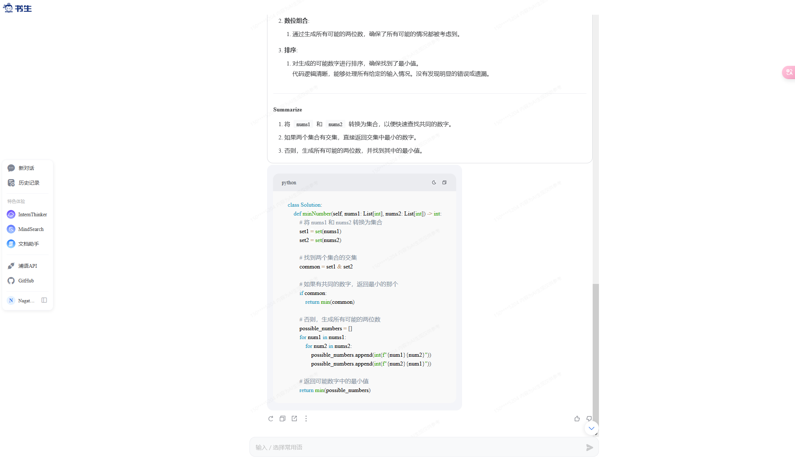

https://a5z7mxawn8.feishu.cn/docx/Lfk9dTyUuoEK3nxGSrWcXD9UnNh

# 生大模型能力边界

## 任务一，**InternThinker 挑战** **[LeetCode](https://leetcode.cn/)**

在 LeetCode 使用 InternThinker 刷 5 道算法题：使用 InternThinker 生成答案提交至 100% 通过。

- Prompt 模板 (供参考)

```JSON
(LeeCode 问题)

以上是一道在线代码测试题，请按照以下格式输出答案：

(Class 模板)
```

- Prompt 案例

```JSON
如果一个整数能够被其各个数位上的数字之和整除，则称之为 哈沙德数（Harshad number）。给你一个整数 x 。如果 x 是 哈沙德数 ，则返回 x 各个数位上的数字之和，否则，返回 -1 。
 
示例 1：
输入： x = 18
输出： 9
解释：
x 各个数位上的数字之和为 9 。18 能被 9 整除。因此 18 是哈沙德数，答案是 9 。
示例 2：
输入： x = 23
输出： -1
解释：
x 各个数位上的数字之和为 5 。23 不能被 5 整除。因此 23 不是哈沙德数，答案是 -1 。
 
提示：
1 <= x <= 100

以上是一道在线代码测试题，请按照以下格式输出答案：

class Solution:
    def sumOfTheDigitsOfHarshadNumber(self, x: int) -> int:
        
```

### [2656. K 个元素的最大和](https://leetcode.cn/problems/maximum-sum-with-exactly-k-elements/)

#### prompt

```python
给你一个下标从 0 开始的整数数组 nums 和一个整数 k 。你需要执行以下操作 恰好 k 次，最大化你的得分：

    从 nums 中选择一个元素 m 。
    将选中的元素 m 从数组中删除。
    将新元素 m + 1 添加到数组中。
    你的得分增加 m 。

请你返回执行以上操作恰好 k 次后的最大得分。

 

示例 1：

输入：nums = [1,2,3,4,5], k = 3
输出：18
解释：我们需要从 nums 中恰好选择 3 个元素并最大化得分。
第一次选择 5 。和为 5 ，nums = [1,2,3,4,6] 。
第二次选择 6 。和为 6 ，nums = [1,2,3,4,7] 。
第三次选择 7 。和为 5 + 6 + 7 = 18 ，nums = [1,2,3,4,8] 。
所以我们返回 18 。
18 是可以得到的最大答案。

示例 2：

输入：nums = [5,5,5], k = 2
输出：11
解释：我们需要从 nums 中恰好选择 2 个元素并最大化得分。
第一次选择 5 。和为 5 ，nums = [5,5,6] 。
第二次选择 6 。和为 6 ，nums = [5,5,7] 。
所以我们返回 11 。
11 是可以得到的最大答案。

 

提示：

    1 <= nums.length <= 100
    1 <= nums[i] <= 100
    1 <= k <= 100

以上是一道在线代码测试题，请按照以下格式输出答案：

class Solution:
    def maximizeSum(self, nums: List[int], k: int) -> int:
        
```

#### response

**Restate**
 问题要求我们在一个整数数组 nums 中选择并移除一个元素 m，然后将 m + 1 添加回数组中，同时增加得分 m。我们需要重复这个操作恰好 k 次，使得最终得分最大化。我们需要设计一个算法来实现这一点。

------

**Recollect**
 为了最大化得分，我们需要每次都选择当前数组中的最大值。每次选择最大值后，将其加到得分中，并将 m + 1 添加回数组中。这样可以确保每次选择的值尽可能大，从而最大化总得分。
 具体步骤如下：

1. 找到数组中的最大值。
2. 将最大值加到得分中。
3. 将 m + 1 添加回数组中。
4. 重复上述步骤 k 次。

我们可以使用一个循环来实现这些步骤。

------

**Planning**

1. 初始化得分 score 为 0。
2. 使用一个循环，重复 k 次：
   - 找到数组中的最大值 m。
   - 将 m 加到得分 score 中。
   - 将 m + 1 添加回数组中。
3. 返回最终的得分 score。

------

**Execution**

```python
pythonclass Solution:
    def maximizeSum(self, nums: List[int], k: int) -> int:
        score = 0
        for _ in range(k):
            m = max(nums)
            score += m
            nums.remove(m)
            nums.append(m + 1)
        return score
```

------

**Review**
 我们已经实现了上述算法，并且在每次循环中选择了当前数组中的最大值，将其加到得分中，并将 m + 1 添加回数组中。这个算法的时间复杂度是 O(k * n)，其中 n 是数组的长度。虽然这个复杂度在给定的约束条件下是可以接受的，但我们可以进一步优化它。
 优化思路：

1. 我们不需要每次都重新计算最大值，因为每次操作后，新的最大值总是比之前的最大值大 1。
2. 我们可以直接计算出所有操作后的最大值，并使用等差数列求和公式来计算总得分。优化后的算法：
3. 找到初始的最大值 m。
4. 计算 k 次操作后的最大值 m + k - 1。
5. 使用等差数列求和公式计算总得分。

------

**Summarize**
 我们已经实现了初始版本的算法，并且验证了其正确性。为了提高效率，我们计划使用等差数列求和公式来优化算法。

------

**Planning**

1. 找到初始的最大值 m。
2. 计算 k 次操作后的最大值 m + k - 1。
3. 使用等差数列求和公式计算总得分。

------

**Execution**

```python
pythonclass Solution:
    def maximizeSum(self, nums: List[int], k: int) -> int:
        m = max(nums)
        return (m + (m + k - 1)) * k // 2
```

------

**Review**
 我们已经实现了优化后的算法，并且使用了等差数列求和公式来计算总得分。这个算法的时间复杂度是 O(1)，因为它只需要常数时间来计算结果。我们可以通过几个示例来验证其正确性。
 示例 1：

- 输入：

  nums = [1, 2, 3, 4, 5], k = 3

- 初始最大值 

  m = 5

- 最终最大值 

  m + k - 1 = 5 + 3 - 1 = 7

- 总得分 

  (5 + 7) * 3 // 2 = 12 * 3 // 2 = 18

示例 2：

- 输入：

  nums = [5, 5, 5], k = 2

- 初始最大值 

  m = 5

- 最终最大值 

  m + k - 1 = 5 + 2 - 1 = 6

- 总得分 

  (5 + 6) * 2 // 2 = 11 * 2 // 2 = 11

  这两个示例都符合预期结果。

------

**Summarize**
 我们已经实现了优化后的算法，并且验证了其正确性和效率。该算法使用等差数列求和公式来计算总得分，时间复杂度为 O(1)。

```python
pythonclass Solution:
    def maximizeSum(self, nums: List[int], k: int) -> int:
        m = max(nums)
        return (m + (m + k - 1)) * k // 2
```

这个解决方案通过找到初始的最大值 m，并使用等差数列求和公式来计算 k 次操作后的总得分。时间复杂度为 O(1)，空间复杂度为 O(1)。


#### 运行结果


### [2644. 找出可整除性得分最大的整数](https://leetcode.cn/problems/find-the-maximum-divisibility-score/)


#### prompt

```python
给你两个整数数组 nums 和 divisors 。

divisors[i] 的 可整除性得分 等于满足 nums[j] 能被 divisors[i] 整除的下标 j 的数量。

返回 可整除性得分 最大的整数 divisors[i] 。如果有多个整数具有最大得分，则返回数值最小的一个。

 

示例 1：

输入：nums = [2,9,15,50], divisors = [5,3,7,2]

输出：2

解释：

divisors[0] 的可整除性分数为 2 因为 nums[2] 和 nums[3] 能被 5 整除。

divisors[1] 的可整除性分数为 2 因为 nums[1] 和 nums[2] 能被 3 整除。

divisors[2] 的可整除性分数为 0 因为 nums 中没有数字能被 7 整除。

divisors[3] 的可整除性分数为 2 因为 nums[0] 和 nums[3] 能够被 2 整除。

因为 divisors[0] 、divisor[1] 和 divisors[3] 有相同的可整除性分数，我们返回更小的那个 divisors[3]。

示例 2：

输入：nums = [4,7,9,3,9], divisors = [5,2,3]

输出：3

解释：

divisors[0] 的可整除性分数为 0 因为 nums 中没有数字能被 5 整除。

divisors[1] 的可整除性分数为 1 因为只有 nums[0] 能被 2 整除。

divisors[2] 的可整除性分数为 3 因为 nums[2] ，nums[3] 和 nums[4] 能被 3 整除。

示例 3：

输入：nums = [20,14,21,10], divisors = [10,16,20]

输出：10

解释：

divisors[0] 的可整除性分数为 2 因为 nums[0] 和 nums[3] 能被 10 整除。

divisors[1] 的可整除性分数为 0 因为 nums 中没有数字能被 16 整除。

divisors[2] 的可整除性分数为 1 因为 nums[0] 能被 20 整除。

因为 divisors[0] 的可整除性分数最大，我们返回 divisors[0]。

 

提示：

    1 <= nums.length, divisors.length <= 1000
    1 <= nums[i], divisors[i] <= 109


以上是一道在线代码测试题，请按照以下格式输出答案：

class Solution:
    def maxDivScore(self, nums: List[int], divisors: List[int]) -> int:
        
```

#### response

**Restate**
 问题要求我们找到一个整数数组 divisors 中，其可整除性得分最高的整数。可整除性得分定义为在另一个整数数组 nums 中能被该整数整除的元素的数量。如果有多个整数具有相同的最高得分，则返回数值最小的一个。

------

**Recollect**

1. 遍历数组: 遍历 divisors 数组中的每个元素，计算其在 nums 数组中的可整除性得分。
2. 计数操作: 对于每个 divisors[i]，遍历 nums 数组，统计能被 divisors[i] 整除的元素数量。
3. **比较和更新**: 维护一个变量来记录当前最高的可整除性得分及其对应的最小值。如果当前得分高于最高得分，或者当前得分等于最高得分但当前值更小，则更新最高得分和对应的最小值。

------

**Planning**

1. 初始化两个变量：

   max_score

    用于记录当前最高的可整除性得分，

   best_divisor

    用于记录对应的最小值。

2. 遍历 divisors 数组中的每个元素 d：

   - 初始化一个变量 score 用于记录当前 d 的可整除性得分。
   - 遍历 nums 数组中的每个元素 num，如果 num 能被 d 整除，则增加 score。
   - 如果 score 大于 max_score，或者 score 等于 max_score 但 d 小于 best_divisor，则更新 max_score 和 best_divisor。

3. 返回 best_divisor。

------

**Execution**

```python
pythonclass Solution:
    def maxDivScore(self, nums: List[int], divisors: List[int]) -> int:
        max_score = -1
        best_divisor = float('inf')
        
        for d in divisors:
            score = 0
            for num in nums:
                if num % d == 0:
                    score += 1
            if score > max_score or (score == max_score and d < best_divisor):
                max_score = score
                best_divisor = d
        
        return best_divisor
```

------

**Review**

1. 初始化检查：确保 max_score 初始化为 -1，best_divisor 初始化为正无穷大，这样可以正确处理初始状态。
2. 遍历逻辑：确保对每个 d 都正确计算了 score，并且对 nums 数组中的每个元素都进行了模运算。
3. 更新条件：确保在 score 大于 max_score 或者 score 等于 max_score 但 d 更小时，正确更新 max_score 和 best_divisor。
4. 返回值：确保最终返回的是 best_divisor，而不是 max_score。

------

**Summarize**
 通过遍历 

divisors 数组中的每个元素 d，计算其在 nums 数组中的可整除性得分，并维护一个变量来记录当前最高的可整除性得分及其对应的最小值。最终返回具有最高可整除性得分的最小值。


```python
pythonclass Solution:
    def maxDivScore(self, nums: List[int], divisors: List[int]) -> int:
        max_score = -1
        best_divisor = float('inf')
        
        for d in divisors:
            score = 0
            for num in nums:
                if num % d == 0:
                    score += 1
            if score > max_score or (score == max_score and d < best_divisor):
                max_score = score
                best_divisor = d
        
        return best_divisor
```


#### 运行结果


### [2605. 从两个数字数组里生成最小数字](https://leetcode.cn/problems/form-smallest-number-from-two-digit-arrays/)

#### prompt

```python
给你两个只包含 1 到 9 之间数字的数组 nums1 和 nums2 ，每个数组中的元素 互不相同 ，请你返回 最小 的数字，两个数组都 至少 包含这个数字的某个数位。

 

示例 1：

输入：nums1 = [4,1,3], nums2 = [5,7]
输出：15
解释：数字 15 的数位 1 在 nums1 中出现，数位 5 在 nums2 中出现。15 是我们能得到的最小数字。

示例 2：

输入：nums1 = [3,5,2,6], nums2 = [3,1,7]
输出：3
解释：数字 3 的数位 3 在两个数组中都出现了。

 

提示：

    1 <= nums1.length, nums2.length <= 9
    1 <= nums1[i], nums2[i] <= 9
    每个数组中，元素 互不相同 。


以上是一道在线代码测试题，请按照以下格式输出答案：

class Solution:
    def minNumber(self, nums1: List[int], nums2: List[int]) -> int:
        
```

#### response

**Restate**
 问题要求我们找到两个数组 nums1 和 nums2 中至少包含其某个数位的最小数字。每个数组中的元素都是 1 到 9 之间的不同数字。

------

**Recollect**

1. 集合操作:
   - 使用集合来存储每个数组中的数字，以便快速查找和比较。
2. 数位组合:
   - 将两个数组中的数字组合成可能的两位数，并找到其中的最小值。
3. 排序:
   - 对生成的可能数字进行排序，以找到最小值。

------

**Planning**

1. 将 nums1 和 nums2 转换为集合，以便快速查找共同的数字。
2. 如果两个集合有交集，直接返回交集中最小的数字。
3. 否则，生成所有可能的两位数，并找到其中的最小值。

------

**Execution**

```python
pythondef minNumber(nums1, nums2):
    # 将 nums1 和 nums2 转换为集合
    set1 = set(nums1)
    set2 = set(nums2)
    
    # 找到两个集合的交集
    common = set1 & set2
    
    # 如果有共同的数字，返回最小的那个
    if common:
        return min(common)
    
    # 否则，生成所有可能的两位数
    possible_numbers = []
    for num1 in nums1:
        for num2 in nums2:
            possible_numbers.append(int(f"{num1}{num2}"))
            possible_numbers.append(int(f"{num2}{num1}"))
    
    # 返回可能数字中的最小值
    return min(possible_numbers)
```

------

**Review**

1. 集合操作:
   - 使用集合来存储每个数组中的数字，确保了查找和比较的高效性。
2. 数位组合:
   - 通过生成所有可能的两位数，确保了所有可能的情况都被考虑到。
3. 排序:
   - 对生成的可能数字进行排序，确保找到了最小值。
      代码逻辑清晰，能够处理所有给定的输入情况。没有发现明显的错误或遗漏。

------

**Summarize**

1. 将 nums1 和 nums2 转换为集合，以便快速查找共同的数字。
2. 如果两个集合有交集，直接返回交集中最小的数字。
3. 否则，生成所有可能的两位数，并找到其中的最小值。

```python
pythonclass Solution:
    def minNumber(self, nums1: List[int], nums2: List[int]) -> int:
        # 将 nums1 和 nums2 转换为集合
        set1 = set(nums1)
        set2 = set(nums2)
        
        # 找到两个集合的交集
        common = set1 & set2
        
        # 如果有共同的数字，返回最小的那个
        if common:
            return min(common)
        
        # 否则，生成所有可能的两位数
        possible_numbers = []
        for num1 in nums1:
            for num2 in nums2:
                possible_numbers.append(int(f"{num1}{num2}"))
                possible_numbers.append(int(f"{num2}{num1}"))
        
        # 返回可能数字中的最小值
        return min(possible_numbers)
```




#### 运行结果


### [2824. 统计和小于目标的下标对数目](https://leetcode.cn/problems/count-pairs-whose-sum-is-less-than-target/)

#### prompt

```python
给你一个下标从 0 开始长度为 n 的整数数组 nums 和一个整数 target ，请你返回满足 0 <= i < j < n 且 nums[i] + nums[j] < target 的下标对 (i, j) 的数目。

 

示例 1：

输入：nums = [-1,1,2,3,1], target = 2
输出：3
解释：总共有 3 个下标对满足题目描述：
- (0, 1) ，0 < 1 且 nums[0] + nums[1] = 0 < target
- (0, 2) ，0 < 2 且 nums[0] + nums[2] = 1 < target 
- (0, 4) ，0 < 4 且 nums[0] + nums[4] = 0 < target
注意 (0, 3) 不计入答案因为 nums[0] + nums[3] 不是严格小于 target 。

示例 2：

输入：nums = [-6,2,5,-2,-7,-1,3], target = -2
输出：10
解释：总共有 10 个下标对满足题目描述：
- (0, 1) ，0 < 1 且 nums[0] + nums[1] = -4 < target
- (0, 3) ，0 < 3 且 nums[0] + nums[3] = -8 < target
- (0, 4) ，0 < 4 且 nums[0] + nums[4] = -13 < target
- (0, 5) ，0 < 5 且 nums[0] + nums[5] = -7 < target
- (0, 6) ，0 < 6 且 nums[0] + nums[6] = -3 < target
- (1, 4) ，1 < 4 且 nums[1] + nums[4] = -5 < target
- (3, 4) ，3 < 4 且 nums[3] + nums[4] = -9 < target
- (3, 5) ，3 < 5 且 nums[3] + nums[5] = -3 < target
- (4, 5) ，4 < 5 且 nums[4] + nums[5] = -8 < target
- (4, 6) ，4 < 6 且 nums[4] + nums[6] = -4 < target

 

提示：

    1 <= nums.length == n <= 50
    -50 <= nums[i], target <= 50


以上是一道在线代码测试题，请按照以下格式输出答案：

class Solution:
    def countPairs(self, nums: List[int], target: int) -> int:
        
```

#### response

**Restate**
 问题要求我们计算一个整数数组 nums 中满足条件 0 <= i < j < n 且 nums[i] + nums[j] < target 的下标对 (i, j) 的数量。我们需要遍历所有可能的下标对，并统计满足条件的对数。

------

**Recollect**
 为了实现这个功能，我们可以使用以下基本编程技能和算法：

1. **双重循环**：用于遍历所有可能的下标对 (i, j)。
2. **条件判断**：用于检查每个下标对是否满足 nums[i] + nums[j] < target。
3. **计数器**：用于记录满足条件的下标对的数量。

------

**Planning**
 我们将按照以下步骤来解决问题：

1. 初始化一个计数器 count 为 0。
2. 使用双重循环遍历所有可能的下标对 (i, j)，其中 0 <= i < j < n。
3. 在内层循环中，检查当前下标对 (i, j) 是否满足 nums[i] + nums[j] < target。
4. 如果满足条件，则将计数器 count 增加 1。
5. 最后返回计数器 count 的值。

------

**Execution**

```python
pythonclass Solution:
    def countPairs(self, nums: List[int], target: int) -> int:
        count = 0
        n = len(nums)
        
        # 遍历所有可能的下标对 (i, j)
        for i in range(n):
            for j in range(i + 1, n):
                # 检查当前下标对是否满足条件
                if nums[i] + nums[j] < target:
                    count += 1
        
        return count
```

------

**Review**
 我们已经实现了双重循环来遍历所有可能的下标对 (i, j)，并在内层循环中进行了条件判断。如果 nums[i] + nums[j] < target，则将计数器 count 增加 1。最后返回计数器 count 的值。
 我们需要验证这个实现是否正确处理了所有可能的输入情况：


1. **边界情况**：当 n = 1 时，没有满足条件的下标对，返回 0。

2. **负数和正数混合的情况**：如示例 2 所示，包含负数和正数的数组。

3. **所有元素都小于目标值的情况**：例如 nums = [-1, -2, -3]target = 0。

   通过这些验证，我们可以确认实现是正确的。

------

**Summarize**
 我们已经实现了以下解决方案：

1. 初始化计数器 count 为 0。
2. 使用双重循环遍历所有可能的下标对 (i, j)，其中 0 <= i < j < n。
3. 在内层循环中，检查当前下标对是否满足 nums[i] + nums[j] < target。
4. 如果满足条件，则将计数器 count 增加 1。
5. 最后返回计数器 count 的值。这个解决方案能够正确处理所有可能的输入情况，包括边界情况和混合正负数的情况。

```python
pythonclass Solution:
    def countPairs(self, nums: List[int], target: int) -> int:
        count = 0
        n = len(nums)
        
        # 遍历所有可能的下标对 (i, j)
        for i in range(n):
            for j in range(i + 1, n):
                # 检查当前下标对是否满足条件
                if nums[i] + nums[j] < target:
                    count += 1
        
        return count
```


#### 运行结果


### [2848. 与车相交的点](https://leetcode.cn/problems/points-that-intersect-with-cars/)

#### prompt

```python
给你一个下标从 0 开始的二维整数数组 nums 表示汽车停放在数轴上的坐标。对于任意下标 i，nums[i] = [starti, endi] ，其中 starti 是第 i 辆车的起点，endi 是第 i 辆车的终点。

返回数轴上被车 任意部分 覆盖的整数点的数目。

 

示例 1：

输入：nums = [[3,6],[1,5],[4,7]]
输出：7
解释：从 1 到 7 的所有点都至少与一辆车相交，因此答案为 7 。

示例 2：

输入：nums = [[1,3],[5,8]]
输出：7
解释：1、2、3、5、6、7、8 共计 7 个点满足至少与一辆车相交，因此答案为 7 。

 

提示：

    1 <= nums.length <= 100
    nums[i].length == 2
    1 <= starti <= endi <= 100


以上是一道在线代码测试题，请按照以下格式输出答案：

class Solution:
    def numberOfPoints(self, nums: List[List[int]]) -> int:
        
```

#### response

**Restate**
 问题要求我们计算数轴上被任意一辆车覆盖的整数点的数目。给定一个二维整数数组 nums，每个元素是一个长度为 2 的数组 [starti, endi]，表示第 i 辆车的起点和终点。我们需要返回数轴上被车任意部分覆盖的整数点的数目。

------

**Recollect**

1. **区间合并**：将所有区间的起点和终点进行排序，然后合并重叠或相邻的区间。
2. **计数**：计算合并后的区间覆盖的总点数。

------

**Planning**

1. 将所有区间的起点和终点存储在一个列表中，并标记每个点是起点还是终点。
2. 按照点的位置对列表进行排序。
3. 遍历排序后的列表，维护当前区间的起点和终点，并合并重叠或相邻的区间。
4. 计算合并后的区间覆盖的总点数。

------

**Execution**

```python
pythondef numberOfPoints(nums):
    # 存储所有点及其类型（起点或终点）
    points = []
    for start, end in nums:
        points.append((start, 1))  # 起点
        points.append((end + 1, -1))  # 终点（+1是为了处理相邻区间）
    # 按位置排序
    points.sort()
    # 初始化变量
    count = 0
    current_start = None
    active_cars = 0
    # 遍历所有点
    for point, type in points:
        if type == 1:  # 起点
            if active_cars == 0:
                current_start = point
            active_cars += 1
        else:  # 终点
            active_cars -= 1
            if active_cars == 0:
                count += point - current_start
    return count
```

------

**Review**

1. **排序**：确保所有点按位置排序，这样可以正确处理重叠和相邻的区间。
2. **合并区间**：通过维护 active_cars 变量来判断当前是否有车在覆盖某个区间，从而正确合并区间。
3. **计数**：在 active_cars 为 0 时，计算当前区间的长度并累加到 count 中。

------

**Summarize**

1. 将所有区间的起点和终点存储在一个列表中，并标记每个点是起点还是终点。
2. 按照点的位置对列表进行排序。
3. 遍历排序后的列表，维护当前区间的起点和终点，并合并重叠或相邻的区间。
4. 计算合并后的区间覆盖的总点数。

```python
class Solution:
    def numberOfPoints(self, nums: List[List[int]]) -> int:
        # 存储所有点及其类型（起点或终点）
        points = []
        for start, end in nums:
            points.append((start, 1))  # 起点
            points.append((end + 1, -1))  # 终点（+1是为了处理相邻区间）
        # 按位置排序
        points.sort()
        # 初始化变量
        count = 0
        current_start = None
        active_cars = 0
        # 遍历所有点
        for point, type in points:
            if type == 1:  # 起点
                if active_cars == 0:
                    current_start = point
                active_cars += 1
            else:  # 终点
                active_cars -= 1
                if active_cars == 0:
                    count += point - current_start
        return count
```


#### 运行结果


## 任务二，**考倒 InternThinker**

选择到 5 道**您对题目答案有把握**的且**在互联网社交媒体上尽可能没出现过**的 puzzle 推理题(您所在专业题目、面试代码题、逻辑思维题、行测找规律问题、高等数学题、奥赛题等等) 考倒 InternThinker：让 InternThinker 生成错误的回复。

### 问题1

https://www.sohu.com/a/789221641_121124318

#### prompt

```
A、B、C、D、E、F六人赛棋，采用单循环制。现在知道：A、B、C、D、E五人已经分别赛过5．4、3、2、1盘。
问：这时F已赛过几盘。
```

#### InternThinker 回答及截图

**Summarize**

- 总共的比赛次数为15盘。
- A、B、C、D、E的比赛次数分别为5、4、3、2、1盘。
- 通过详细分析每人的比赛情况，发现F已经与A、B、C、D各赛过一盘，但没有与E赛过盘。
- 因此，F已经赛过4盘。


#### 题目正确答案

单循环制说明每个人都要赛5盘，这样A就跟所有人下过了，再看E，他只下过1盘，这意味着他只和A下过，再看B下过4盘，可见他除了没跟E下过，跟其他人都下过；再看D下过2，可见肯定是跟A，B下的，再看C，下过3盘，可见他不能跟E，D下，所以只能跟A，B，F下，所以F总共下了3盘。

### 问题2

https://www.sohu.com/a/789221641_121124318

#### prompt

```
某班一次考试有52人参加，共考5个题，每道题做错的人数如下：题号12345人数46102039又知道每人至少做对一道题，做对一道题的有7人，5道题全做对的有6人，做对2道题的人数和3道题的人数一样多，那么做对4道题的有多少人?
```

#### InternThinker 回答及截图

做对4道题的人数为19人。


#### 题目正确答案

总共有52×5=260道题，这样做对的有260-（4+6+10+20+39）=181道题。

对2道,3道,4道题的人共有52-7-6=39(人)。他们共做对181-1×7-5×6=144(道)。

由于对2道和3道题的人数一样多,我们就可以把他们看作是对2.5道题的人((2+3)÷2=2.5)。

这样转化成鸡兔同笼问题：所以对4道题的有(144-2.5×39)÷(4-1.5)=31(人)。

答:做对4道题的有31人。

### 问题3

https://www.sohu.com/a/789221641_121124318

#### prompt

```
甲、乙、丙三人比赛象棋，每两人赛一盘。胜一盘得2分。平一盘得1分，输一盘得0分。比赛的全部三盘下完后，只出现一盘平局。并且甲得3分，乙得2分，丙得1分。那么，甲乙，甲丙，乙丙（填胜、平、负）。
```

#### InternThinker 回答及截图

甲胜乙、甲胜丙、乙胜丙。


#### 题目正确答案

甲得3分，而且只出现一盘平局，说明甲一胜一平；乙2分，说明乙一胜一负；丙1分，说明一平一负。

这样我们发现甲胜乙，甲平丙，乙胜丙。

### 问题4

https://www.sohu.com/a/789221641_121124318

#### prompt

```
A、B、C、D、E、F六个选手进行乒乓球单打的单循环比赛(每人都与其它选手赛一场)，每天同时在三张球台各进行一场比赛，已知第一天B对D，第二天C对E，第三天D对F，第四天B对C，问：第五天A与谁对阵?另外两张球台上是谁与谁对阵?
```

#### InternThinker 回答及截图

A---E、B---F、C---D


#### 题目正确答案

天数对阵剩余对阵第一天B---DA、C、E、F第二天C---EA、B、D、F第三天D---FA、B、C、E第四天B---CA、D、E、F第五天A---？？

从中我们可以发现D已经和B、C对阵了，这样第二天剩下的对阵只能是A---D、B---F；又C已经和E、B对阵了，这样第三天剩下的对阵只能是C---A、B---E；这样B就已经和C、D、E、F都对阵了，只差第五天和A对阵了，所以第五天A---B；再看C已经和A、B、E对阵了，第一天剩下的对阵只能是C---F、A---E；这样A只差和F对阵了，所以第四天A---F、D---E；所以第五天的对阵：A---B、C---D、E---F。

### 问题5

https://www.sohu.com/a/789221641_121124318

#### prompt

```
一个岛上有两种人：一种人总说真话的骑士，另一种是总是说假话的骗子。一天，岛上的2003个人举行一次集会，并随机地坐成一圈，他们每人都声明：“我左右的两个邻居是骗子。”

第二天，会议继续进行，但是一名居民因病未到会，参加会议的2002个人再次随机地坐成一圈，每人都声明：“我左右的两个邻居都是与我不同类的人。”问有病的居民是_________(骑士还是骗子)。
```

#### InternThinker 回答及截图

骗子


#### 题目正确答案

2003个人坐一起，每人都声明左右都是骗子，这样我们可以发现要么是骗子和骑士坐间隔的坐，要不就是两个骗子和一个骑士间隔着坐，因为三个以上的骗子肯定不能挨着坐，这样中间的骗子就是说真话了。

再来讨论第一种情况，显然骑士的人数要和骗子的人数一样多，而现在总共只有2003人，所以不符合情况，这样我们只剩下第二种情况。

这样我们假设少个骗子，则其中旁边的那个骗子左右两边留下的骑士，这样说明骗子说“我左右的两个邻居都是与我不同类的人”是真话。

所以只能是少个骑士。