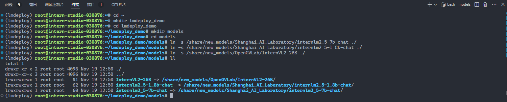
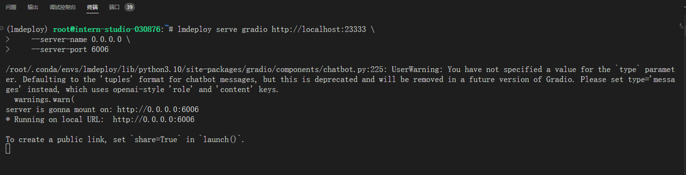
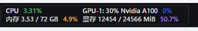

# LMDeploy验证启动模型文件

1. 创建文件夹

```sh
cd ~
mkdir lmdeploy_demo
cd lmdeploy_demo
mkdir models
cd models
ln -s /share/new_models/Shanghai_AI_Laboratory/internlm2_5-7b-chat ./
ln -s /share/new_models/Shanghai_AI_Laboratory/internlm2_5-1_8b-chat ./
ln -s /share/new_models/OpenGVLab/InternVL2-26B ./
```



2. 启动对话

```sh
cd ~/lmdeploy_demo
lmdeploy chat models/internlm2_5-7b-chat
```


对于一个7B（70亿）参数的模型，每个参数使用16位浮点数（等于 2个 Byte）表示，则模型的权重大小约为：

**70×10^9 parameters×2 Bytes/parameter=14GB**

**70亿个参数×每个参数占用2个字节=14GB**

此时对于24GB的显卡，即***30%A100***，权重占用**14GB**显存，剩余显存**24-14=10GB**，因此kv cache占用**10GB\*0.8=8GB**，加上原来的权重**14GB**，总共占用**14+8=22GB**。

而对于40GB的显卡，即***50%A100***，权重占用**14GB**，剩余显存**40-14=26GB**，因此kv cache占用**26GB\*0.8=20.8GB**，加上原来的权重**14GB**，总共占用**34.8GB**。

实际加载模型后，其他项也会占用部分显存，因此剩余显存比理论偏低，实际占用会略高于**22GB**和**34.8GB**。

# LMDeploy API部署InternLM2.5

1. 启动 server

```sh
cd ~/lmdeploy_demo
lmdeploy serve api_server \
    models/internlm2_5-7b-chat \
    --model-format hf \
    --quant-policy 0 \
    --server-name 0.0.0.0 \
    --server-port 23333 \
    --tp 1
```

命令解释：

1. `lmdeploy serve api_server`：这个命令用于启动API服务器。
2. `/root/models/internlm2_5-7b-chat`：这是模型的路径。
3. `--model-format hf`：这个参数指定了模型的格式。`hf`代表“Hugging Face”格式。
4. `--quant-policy 0`：这个参数指定了量化策略。
5. `--server-name 0.0.0.0`：这个参数指定了服务器的名称。在这里，`0.0.0.0`是一个特殊的IP地址，它表示所有网络接口。
6. `--server-port 23333`：这个参数指定了服务器的端口号。在这里，`23333`是服务器将监听的端口号。
7. `--tp 1`：这个参数表示并行数量（GPU数量）。


2. 映射端口

```sh
ssh -CNg -L 23333:127.0.0.1:23333 root@ssh.intern-ai.org.cn -p 43681
```


然后打开浏览器，访问`http://127.0.0.1:23333` 看到如下界面即代表部署成功


3. 以命令行形式连接API服务器

```sh
lmdeploy serve api_client http://localhost:23333
```


4. 以Gradio**网页形式连接API服务器**

```sh
lmdeploy serve gradio http://localhost:23333 \
    --server-name 0.0.0.0 \
    --server-port 6006
```



5. 映射端口

```sh
ssh -CNg -L 6006:127.0.0.1:6006 root@ssh.intern-ai.org.cn -p 43681
```


6. 浏览器访问 http://127.0.0.1:6006/


# LMDeploy Lite

## 设置最大kv cache缓存大小

kv cache是一种缓存技术，通过存储键值对的形式来复用计算结果，以达到提高性能和降低内存消耗的目的。在大规模训练和推理中，kv cache可以显著减少重复计算量，从而提升模型的推理速度。理想情况下，kv cache全部存储于显存，以加快访存速度。

模型在运行时，占用的显存可大致分为三部分：模型参数本身占用的显存、kv cache占用的显存，以及中间运算结果占用的显存。LMDeploy的kv cache管理器可以通过设置`--cache-max-entry-count`参数，控制kv缓存占用**剩余显存**的最大比例。默认的比例为0.8。

```sh
cd ~/lmdeploy_demo
lmdeploy chat models/internlm2_5-7b-chat --cache-max-entry-count 0.4
```

默认显存占用


调整 `--cache-max-entry-count 0.4` 后的显存占用


***我这里占用了21G显存，原因可能是我用的pytorch版本不同***


计算一下**4GB**显存的减少缘何而来:

1、在 BF16 精度下，7B模型权重占用**14GB**：70×10^9 parameters×2 Bytes/parameter=**14GB**

2、kv cache占用**8GB**：剩余显存**24-14=10GB**，kv cache默认占用80%，即**10\*0.8=8GB**

3、其他项**1GB**

是故**23GB**=权重占用**14GB**+kv cache占用**8GB**+其它项**1GB**

对于修改kv cache占用之后的显存占用情况(**19GB**)：

1、与上述声明一致，在 BF16 精度下，7B模型权重占用**14GB**

2、kv cache占用**4GB**：剩余显存**24-14=10GB**，kv cache修改为占用40%，即**10\*0.4=4GB**

3、其他项**1GB**

是故**19GB**=权重占用**14GB**+kv cache占用**4GB**+其它项**1GB**

而此刻减少的**4GB**显存占用就是从**10GB\*0.8-10GB\*0.4=4GB**，这里计算得来。

## 设置**在线** kv cache int4/int8 量化

自 v0.4.0 起，LMDeploy 支持在线 kv cache int4/int8 量化，量化方式为 per-head per-token 的非对称量化。此外，通过 LMDeploy 应用 kv 量化非常简单，只需要设定 `quant_policy` 和`cache-max-entry-count`参数。目前，LMDeploy 规定 `quant_policy=4` 表示 kv int4 量化，`quant_policy=8` 表示 kv int8 量化。

```sh
cd ~/lmdeploy_demo
lmdeploy chat \
    models/internlm2_5-7b-chat \
    --model-format hf \
    --quant-policy 4 \
    --cache-max-entry-count 0.4 \
    --tp 1
```

可以看到此时显存占用约**19GB**，相较于1.3 LMDeploy验证启动模型文件直接启动模型的显存占用情况(**23GB**)减少了**4GB**的占用。此时**4GB**显存的减少逻辑与设置最大kv cache缓存大小中4GB显存的减少一致，均因设置kv cache占用参数`cache-max-entry-count`至0.4而减少了**4GB**显存占用。

***我这里也占用了21G显存，可能是因为pytorch版本不同的缘故***


那么本节中**19GB**的显存占用与设置最大kv cache缓存大小中**19GB**的显存占用区别何在呢？

由于都使用BF16精度下的internlm2.5 7B模型，故剩余显存均为**10GB**，且 `cache-max-entry-count` 均为0.4，这意味着LMDeploy将分配40%的剩余显存用于kv cache，即**10GB\*0.4=4GB**。但`quant-policy` 设置为4时，意味着使用int4精度进行量化。因此，LMDeploy将会使用int4精度提前开辟**4GB**的kv cache。

相比使用BF16精度的kv cache，int4的Cache可以在相同**4GB**的显存下只需要4位来存储一个数值，而BF16需要16位。这意味着int4的Cache可以存储的元素数量是BF16的四倍。

## W4A16 模型量化和部署

准确说，模型量化是一种优化技术，旨在减少机器学习模型的大小并提高其推理速度。量化通过将模型的权重和激活从高精度（如16位浮点数）转换为低精度（如8位整数、4位整数、甚至二值网络）来实现。

那么标题中的W4A16又是什么意思呢？

- W4：这通常表示权重量化为4位整数（int4）。这意味着模型中的权重参数将从它们原始的浮点表示（例如FP32、BF16或FP16，**Internlm2.5精度为BF16**）转换为4位的整数表示。这样做可以显著减少模型的大小。
- A16：这表示激活（或输入/输出）仍然保持在16位浮点数（例如FP16或BF16）。激活是在神经网络中传播的数据，通常在每层运算之后产生。

因此，W4A16的量化配置意味着：

- 权重被量化为4位整数。
- 激活保持为16位浮点数。

LMDeploy最新的版本中，LMDeploy使用的是AWQ算法，能够实现模型的4bit权重量化。输入以下指令，执行量化工作。

```sh
cd ~/lmdeploy_demo
lmdeploy lite auto_awq \
    models/internlm2_5-1_8b-chat \
    --calib-dataset 'ptb' \
    --calib-samples 128 \
    --calib-seqlen 2048 \
    --batch-size 8 \
    --w-bits 4 \
    --w-group-size 128 \
    --work-dir models/internlm2_5-1_8b-chat-w4a16-4bit
```

命令解释：

1. `lmdeploy lite auto_awq`: `lite`这是LMDeploy的命令，用于启动量化过程，而`auto_awq`代表自动权重量化（auto-weight-quantization）。
2. `models/internlm2_5-1_8b-chat`: 模型文件的路径。
3. `--calib-dataset 'ptb'`: 这个参数指定了一个校准数据集，这里使用的是’ptb’（Penn Treebank，一个常用的语言模型数据集）。
4. `--calib-samples 128`: 这指定了用于校准的样本数量—128个样本。
5. `--calib-seqlen 2048`: 这指定了校准过程中使用的序列长度—2048。
6. `--batch-size 8`: 运行校准样品的批量大小。低GPU内存需要小批量大小。大的 batch_size 减少了校准时间，同时消耗了更多的VRAM。默认值：1。
7. `--w-bits 4`: 这表示权重（weights）的位数将被量化为4位。
8. `--w-group-size 128`: 权重量化统计的 `group` 大小。
9. `--work-dir models/internlm2_5-1_8b-chat-w4a16-4bit`: 这是工作目录的路径，用于存储量化后的模型和中间结果。


查看量化模型的大小，量化前 3.6G，量化后 1.5G

```
cd ~/lmdeploy_demo/models
du -h --max-depth 1

du -h --max-depth 1 /share/new_models/Shanghai_AI_Laboratory
```


启动量化后的模型

```sh
cd ~/lmdeploy_demo
lmdeploy chat models/internlm2_5-1_8b-chat-w4a16-4bit --model-format awq
```


量化前显存占用


量化后显存占用


> 1.8B 模型说明

发现，相比较于原先的**21GB**显存占用，W4A16量化后的模型少了约**1GB**的显存占用。

让我们计算一下**1GB**显存的减少缘何而来。

对于W4A16量化之前，即如[1.3 LMDeploy验证启动模型文件](https://github.com/InternLM/Tutorial/tree/camp4/docs/L2/LMDeploy#1.3)所示直接启动模型的显存占用情况(**21GB**)：

1、在 BF16 精度下，7B模型权重占用**3.35GB**：18×10^9 parameters×2 Bytes/parameter=**3.35GB**

2、kv cache占用**16.5GB**：剩余显存**24-3.35=20.6GB**，kv cache默认占用80%，即**20.6\*0.8=16.5GB**

3、其他项**1GB**

是故**21GB**=权重占用**3.35GB**+kv cache占用**16.5GB**+其它项**1GB**

而对于W4A16量化之后的显存占用情况(**20GB**)：

1、在 int4 精度下，7B模型权重占用**3.5GB**：**3.35/4=0.84GB**

注释：

- `bfloat16`是16位的浮点数格式，占用2字节（16位）的存储空间。`int4`是4位的整数格式，占用0.5字节（4位）的存储空间。因此，从`bfloat16`到`int4`的转换理论上可以将模型权重的大小减少到原来的1/4，**即1.8B个`int4`参数仅占用0.84GB的显存**。

2、kv cache占用**18.5GB**：剩余显存**24-0.84=23.16GB**，kv cache默认占用80%，即**23.16\*0.8=18.5GB**

3、其他项**1GB**

是故**20GB**=权重占用**0.83GB**+kv cache占用**18.5GB**+其它项**1GB**

> 7B 模型说明

发现，相比较于原先的**23GB**显存占用，W4A16量化后的模型少了约**2GB**的显存占用。

让我们计算一下**2GB**显存的减少缘何而来。

对于W4A16量化之前，即如[1.3 LMDeploy验证启动模型文件](https://github.com/InternLM/Tutorial/tree/camp4/docs/L2/LMDeploy#1.3)所示直接启动模型的显存占用情况(**23GB**)：

1、在 BF16 精度下，7B模型权重占用**14GB**：70×10^9 parameters×2 Bytes/parameter=**14GB**

2、kv cache占用**8GB**：剩余显存**24-14=10GB**，kv cache默认占用80%，即**10\*0.8=8GB**

3、其他项**1GB**

是故**23GB**=权重占用**14GB**+kv cache占用**8GB**+其它项**1GB**

而对于W4A16量化之后的显存占用情况(**20.9GB**)：

1、在 int4 精度下，7B模型权重占用**3.5GB**：**14/4=3.5GB**

注释：

- `bfloat16`是16位的浮点数格式，占用2字节（16位）的存储空间。`int4`是4位的整数格式，占用0.5字节（4位）的存储空间。因此，从`bfloat16`到`int4`的转换理论上可以将模型权重的大小减少到原来的1/4，**即7B个`int4`参数仅占用3.5GB的显存**。

2、kv cache占用**16.4GB**：剩余显存**24-3.5=20.5GB**，kv cache默认占用80%，即**20.5\*0.8=16.4GB**

3、其他项**1GB**

是故**20.9GB**=权重占用**3.5GB**+kv cache占用**16.4GB**+其它项**1GB**

## W4A16 量化+ KV cache+KV cache 量化

1. 启动

```sh
cd ~/lmdeploy_demo
lmdeploy chat \
    models/internlm2_5-1_8b-chat-w4a16-4bit \
    --model-format awq \
    --quant-policy 4 \
    --cache-max-entry-count 0.4 \
    --tp 1
```


让我们来计算一下此刻的显存占用情况(12.1GB): 

1. 在 int4 精度下，1.8B模型权重占用0.84GB：3.35/4=0.84GB

2. kv cache占用9.264GB：剩余显存24-0.84=23.16GB，kv cache占用40%，即23.16*0.4=9.264GB

3. 其他项2GB

故12.1GB=权重占用0.84GB+kv cache占用9.264GB+其它项2GB 

# LMDeploy之FastAPI与Function call

## API开发

1. 启动服务

```sh
cd ~/lmdeploy_demo
lmdeploy serve api_server \
    models/internlm2_5-1_8b-chat-w4a16-4bit \
    --model-format awq \
    --cache-max-entry-count 0.4 \
    --quant-policy 4 \
    --tp 1 \
    --server-name 0.0.0.0 \
    --server-port 23333
```

使用了量化模型和设置 `--cache-max-entry-count 0.4`，占用显存大约 12.5G


2. 新建`internlm2_5.py`。

```sh
cd ~/lmdeploy_demo
touch internlm2_5.py
```

此时我们可以在左侧的File Broswer中看到`internlm2_5.py`文件，双击打开。

```python
# 导入openai模块中的OpenAI类，这个类用于与OpenAI API进行交互
from openai import OpenAI


# 创建一个OpenAI的客户端实例，需要传入API密钥和API的基础URL
client = OpenAI(
    api_key='YOUR_API_KEY',
    # 替换为你的OpenAI API密钥，由于我们使用的本地API，无需密钥，任意填写即可
    base_url="http://0.0.0.0:23333/v1"
    # 指定API的基础URL，这里使用了本地地址和端口
)

# 调用client.models.list()方法获取所有可用的模型，并选择第一个模型的ID
# models.list()返回一个模型列表，每个模型都有一个id属性
model_name = client.models.list().data[0].id

# 使用client.chat.completions.create()方法创建一个聊天补全请求
# 这个方法需要传入多个参数来指定请求的细节
response = client.chat.completions.create(
    model=model_name,
    # 指定要使用的模型ID
    messages=[
        # 定义消息列表，列表中的每个字典代表一个消息
        {"role": "system", "content": "你是一个友好的小助手，负责解决问题."},
        # 系统消息，定义助手的行为
        {"role": "user", "content": "帮我讲述一个关于狐狸和西瓜的小故事"},
        # 用户消息，询问时间管理的建议
    ],
    temperature=0.8,
    # 控制生成文本的随机性，值越高生成的文本越随机
    top_p=0.8
    # 控制生成文本的多样性，值越高生成的文本越多样
)

# 打印出API的响应结果
print(response.choices[0].message.content)
```

3. 启动

```sh
cd ~/lmdeploy_demo
python internlm2_5.py
```


服务端也显示成功响应


显存占用大约为 12.5G



## Function call

关于Function call，即函数调用功能，它允许开发者在调用模型时，详细说明函数的作用，并使模型能够智能地根据用户的提问来输入参数并执行函数。完成调用后，模型会将函数的输出结果作为回答用户问题的依据。

目前LMDeploy在0.5.3版本中支持了对InternLM2, InternLM2.5和llama3.1这三个模型，故我们选用InternLM2.5 封装API。

1. 启动API服务器

```sh
cd ~/lmdeploy_demo
lmdeploy serve api_server \
    models/internlm2_5-7b-chat \
    --model-format hf \
    --cache-max-entry-count 0.8 \
    --quant-policy 0 \
    --server-name 0.0.0.0 \
    --server-port 23333 \
    --tp 1
```


2. 新建`internlm2_5_func.py`

```sh
cd ~/lmdeploy_demo
touch internlm2_5_func.py
```

```python
from openai import OpenAI


def add(a: int, b: int):
    return a + b


def mul(a: int, b: int):
    return a * b


tools = [{
    'type': 'function',
    'function': {
        'name': 'add',
        'description': 'Compute the sum of two numbers',
        'parameters': {
            'type': 'object',
            'properties': {
                'a': {
                    'type': 'int',
                    'description': 'A number',
                },
                'b': {
                    'type': 'int',
                    'description': 'A number',
                },
            },
            'required': ['a', 'b'],
        },
    }
}, {
    'type': 'function',
    'function': {
        'name': 'mul',
        'description': 'Calculate the product of two numbers',
        'parameters': {
            'type': 'object',
            'properties': {
                'a': {
                    'type': 'int',
                    'description': 'A number',
                },
                'b': {
                    'type': 'int',
                    'description': 'A number',
                },
            },
            'required': ['a', 'b'],
        },
    }
}]
messages = [{'role': 'user', 'content': 'Compute (3+5)*2'}]

client = OpenAI(api_key='YOUR_API_KEY', base_url='http://0.0.0.0:23333/v1')
model_name = client.models.list().data[0].id
response = client.chat.completions.create(
    model=model_name,
    messages=messages,
    temperature=0.8,
    top_p=0.8,
    stream=False,
    tools=tools)
print(response)
func1_name = response.choices[0].message.tool_calls[0].function.name
func1_args = response.choices[0].message.tool_calls[0].function.arguments
func1_out = eval(f'{func1_name}(**{func1_args})')
print(func1_out)
print("*" * 100)

messages.append({
    'role': 'assistant',
    'content': response.choices[0].message.content
})
messages.append({
    'role': 'environment',
    'content': f'3+5={func1_out}',
    'name': 'plugin'
})
response = client.chat.completions.create(
    model=model_name,
    messages=messages,
    temperature=0.8,
    top_p=0.8,
    stream=False,
    tools=tools)
print(response)
func2_name = response.choices[0].message.tool_calls[0].function.name
func2_args = response.choices[0].message.tool_calls[0].function.arguments
func2_out = eval(f'{func2_name}(**{func2_args})')
print(func2_out)
```

3. 启动

```sh
cd ~/lmdeploy_demo
python internlm2_5_func.py
```

可以看到正确调用了工具


