# 多模态大模型的常见设计模式

多模态大模型是指能够处理和融合多种不同的类型的数据（文字，图像，视频，音频等）的大型人工智能语言模型。一般基于深度学习技术，能够理解和生成多种模态的数据，从而应用于各种应用场景。

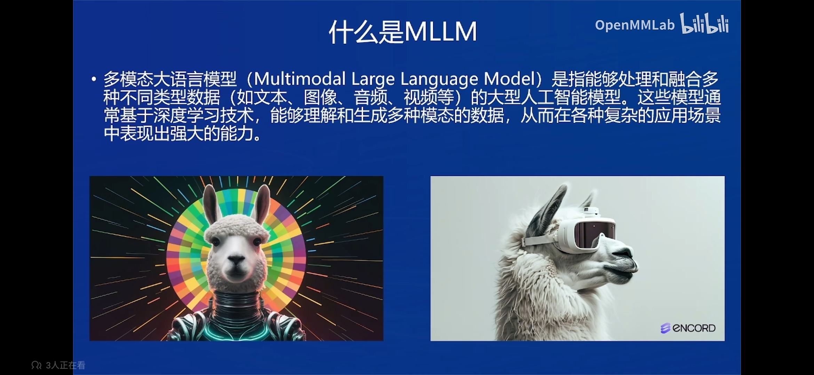

常见的 MLLM 如下，国内开源的 InternVL，Qwen-VL，国外闭源的 GPT-4o，Claude3以及开源的 LLaVA。

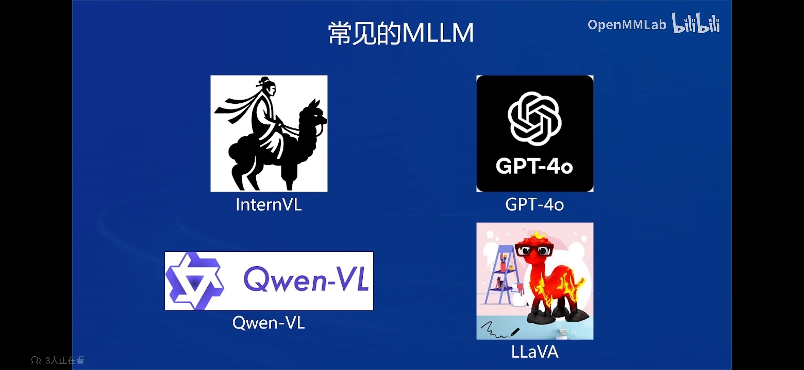

多模态模型研究的重点是不同模态特征空间的对齐。因为多模态模型通常由多个模型构成，不同模态的模型编码后的特征空间不同，对于同一语义在不同模态中的表征不同，因此需要一些设计来对齐不同模态的特征空间。

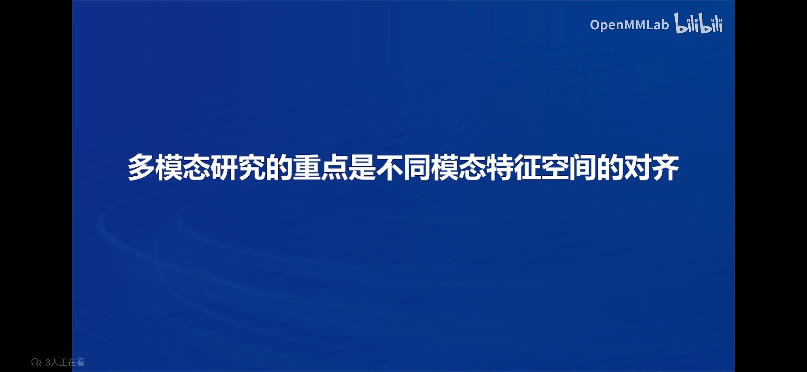

Blip2 是多模态领域最早，最有影响力的工作之一。

输入图像经过图像编码器变为图像特征，然后经过 Q-Former 和 FC 层将图像特征转换为文本空间，送入 LLM，这个过程就将图像特征对齐到文本空间。

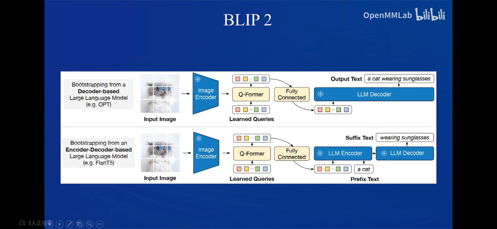

Q-Former 模块，使用一系列 transformer 模块堆叠。下图中左侧为图像编码，右侧为文本编码。左侧输入一些列 query，右侧输入文本。它们经过一个共享的 transformer 模块。之后左侧的 query 和 image 做一个 cross attn 理解图像。之后经过各自的 ffm 模块。Q-Former 学习三个 loss，分比为图文匹配loss，预测文字loss，图文对比loss。

下图右侧是三种任务的mask。第一个图文匹配不需要mask。第二个是预测文字loss，因此只需要mask未来的文字。对于对比学习，只学习自己匹配的图文匹配。

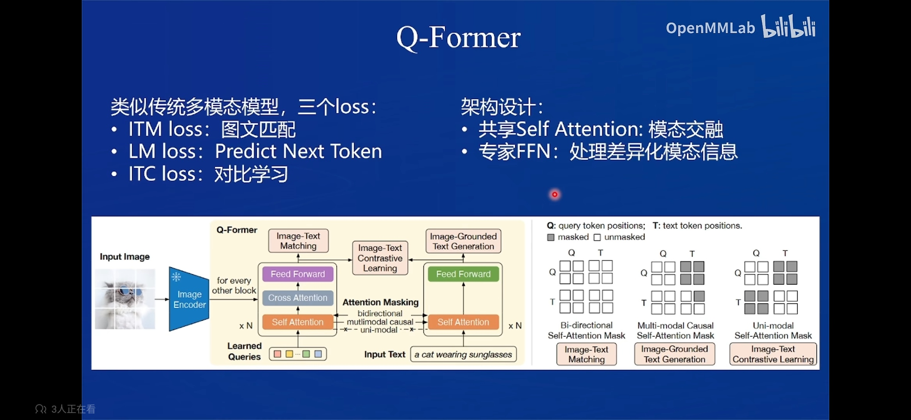

MiniGPT4，采用 Q-Former 结果作为对比模块。后面添加一个线性层，将 Q-Former 的维度映射到 LLM 的维度、

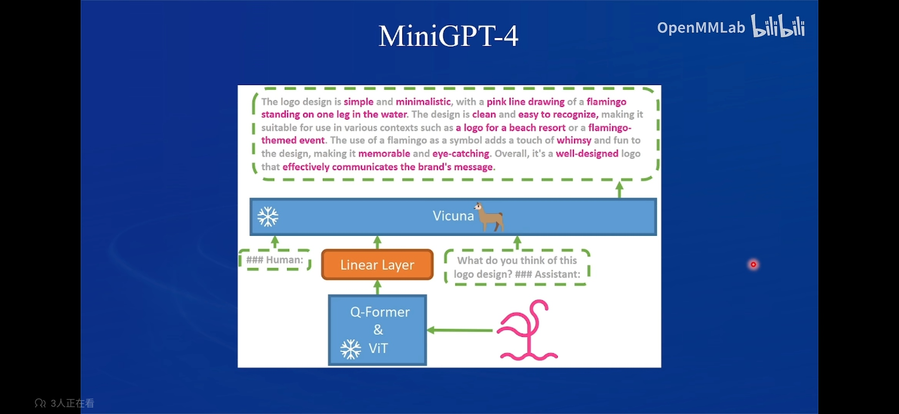

LLaVA 比较简单。只使用一个线性层将图像模态映射到语言模型空间。训练参数少，效果好。

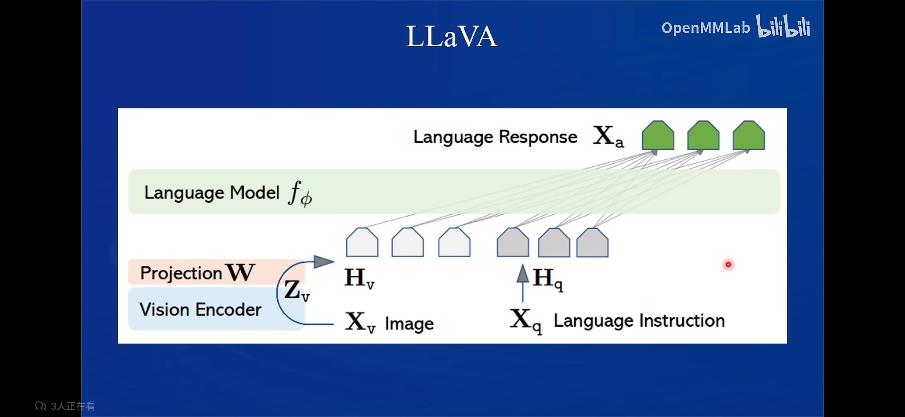

由于图像编码器的分辨率一般是固定的，因此不能很好地处理不同分辨率的图片。LLaVA-1.5-HD 将图片进行切片，分别编码以及全图缩略图编码，展平拼接后送入语言模型得到最终输出、

并且编码模型从一个线性层变为2层的线性层。

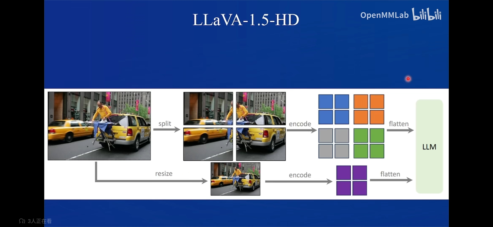

LLaVA-NeXT 使用动态分辨率策略，处理多种分辨率和长宽比的图片进行训练。输入图片时将图片调整为最接近的宽高比。

并且使用了更好的训练数据。

目前大多数开源模型都基于它设计。

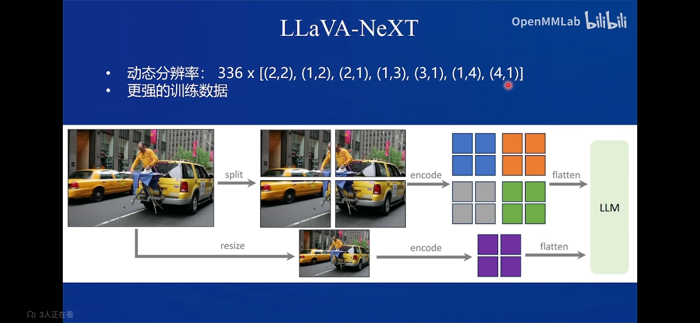

为什么用 Q-Former 的变少了、

- 训练参数多，收敛速度慢。
- 性能收益不明显，相比 MLP 并没有明显的性能提升。
- LLaVA-1.5 通过改进数据和计算量取得了优异的性能，并且推广到了多轮对话。而 Blip-2 性能提升较少，且没有推广到多轮对话。
- LLaVA 采用最简洁的结构，而更复杂的模型并没有取得更好的结果。表名在当前技术和数据条件下，简介的模型结构更有效。

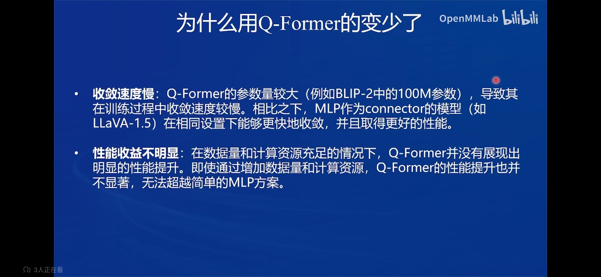

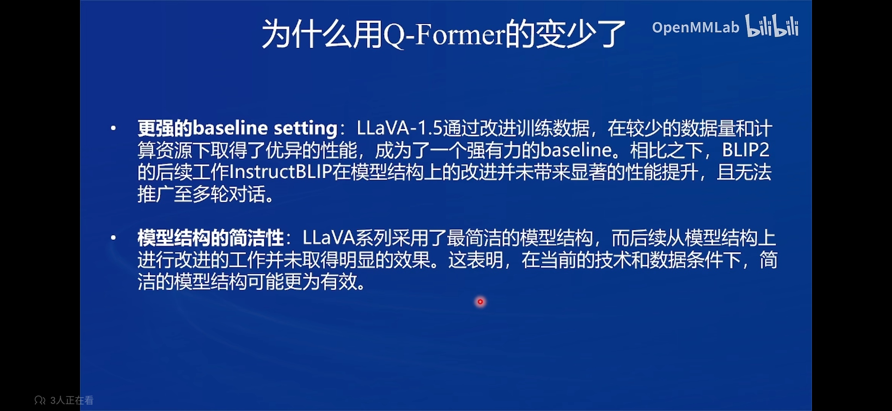

# InternVL2的模型架构和训练流程

InternVL2-26B 使用了 InternViT-6B 来作为图像编码器，然后使用一个 Pixel Shuffle 来打乱像素，之后使用一个 MLP 做投影，将图像 embedding 投影到大语言模型。

支持动态分辨率。

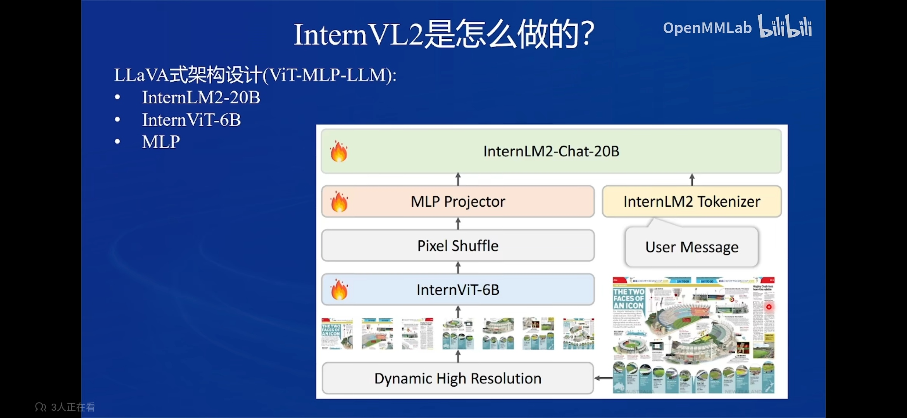

InternViT 训练流程为：

1. 先使用监督模型。
2. 使用图文对比学习。
3. 使用大语言模型做对比学习，之和和同一个大语言模型一起做生成文本任务，得到最终的模型。

作为图像编码器的改进：

V1.2 

- InternViT 使用了倒数第四层的特征作为最终特征。
- 分辨率扩展到 448 pixel。
- 与 LLM 联合训练时，在 captioning 和 OCR 数据集上训练，获取高分辨率和 OCR 能力。

V1.5

- 使用类似 LLaVA-NeXT 的动态分辨率。
- 使用了更高质量的数据。

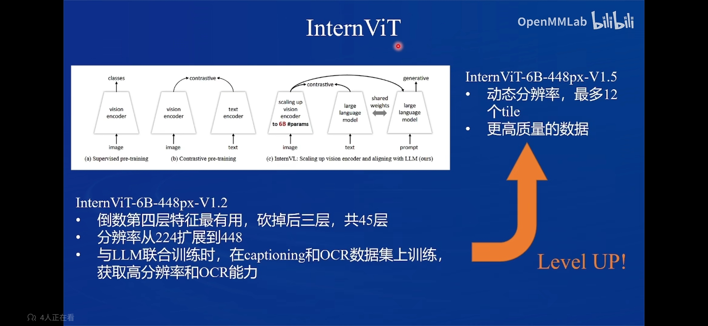

Pixel Shuffle

- 对于 448*448 的图像，ViT 的 patch 大小为14，最终得到 1024个 Token。分辨率越高的图片得到的 token 越多。

- pixel shuffle 是吧不同通道的特征拿出来，拼接到一个通道上，从（N, Cxr^2，H、W）转化为（N，C，Hxr，Wxr）。r 是上采样因子。

- 假设 r 为 0.5， 就可以把（4096\*0.5\*0.5，32，32）的图像 token 转换为(4096，32\*0.5，32\*0.5)，下采样到256个 Token 了。

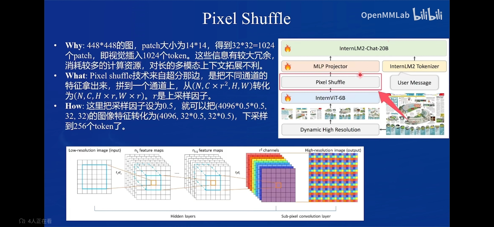

- 最多支持 12 个 tile（3x4、2x6）
- 选择最近接的长宽比，resize过去，然后切片为 448x448 大小
- 把原图 resize 到 448x448，一同喂给大模型。

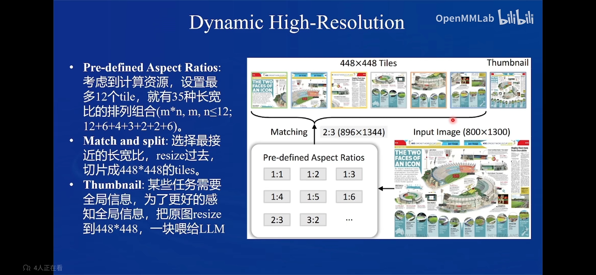

支持多任务

- 初始化一些任务特化的 embeeding，添加了一些特殊任务的路由 token
- 训练下游任务特化 embedding 时，生成路由 token 时，把任务 embedding 拼在路由 embedding 后面，送给 llm 拿到 hidden_state
- 把 hidden_state 送到路由到的解码器中，得到图像/box/mask

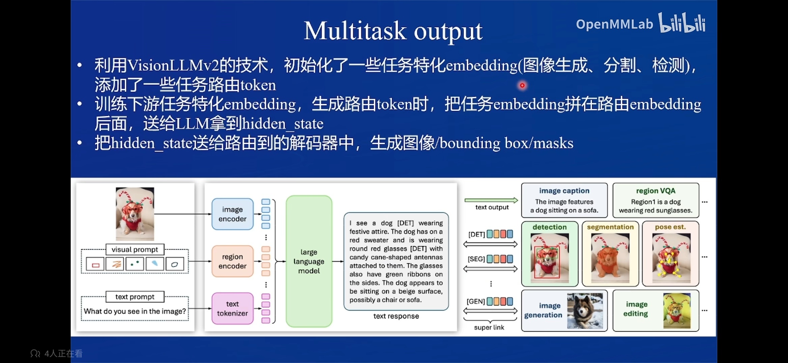

训练

- 先训练 MLP，使用高质量的图像，实现对齐
- 联合训练，实现指令遵循

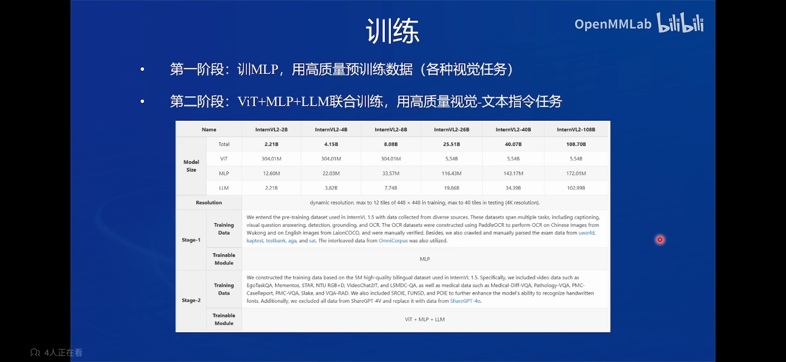

# UI界面体验与 InternVL2 的对话

## 环境配置

使用已有环境

```sh
conda activate lmdeploy
pip list | grep xtuner
pip list | grep lmdeploy
```


## 创建文件夹

```sh
cd ~
mkdir internvl && cd internvl
```

## link 模型

```sh
cd ~/internvl/
mkdir models
cd models
ls /share/new_models/OpenGVLab/
ln -s /share/new_models/OpenGVLab/InternVL2-2B InternVL2-2B
```


## 部署

### lmdeploy 基本用法

```python
## 1.导入相关依赖包
from lmdeploy import pipeline, TurbomindEngineConfig, GenerationConfig
from lmdeploy.vl import load_image

## 2.使用你的模型初始化推理管线
model_path = "models/InternVL2-2B"
pipe = pipeline(model_path,
                backend_config=TurbomindEngineConfig(session_len=8192))

## 3.读取图片（此处使用PIL读取也行）
image = load_image('MMMMMKUN3 2B-2.jpeg')

## 4.配置推理参数
gen_config = GenerationConfig(max_new_tokens=1024, do_sample=True, top_p=0.8, top_k=40, temperature=0.8)

## 5.利用 pipeline.chat 接口 进行对话，需传入生成参数
sess = pipe.chat(('describe this image', image), gen_config=gen_config)
print(f"\nresponse: {sess.response.text}\n")

## 6.之后的对话轮次需要传入之前的session，以告知模型历史上下文
sess = pipe.chat('What is the woman doing?', session=sess, gen_config=gen_config)
print(f"\nresponse: {sess.response.text}\n")
```

运行

```sh
python lmdeploy_demo.py
```

```sh
(lmdeploy) (base) root@intern-studio-030876:~/internvl# python lmdeploy_demo.py 
/root/.conda/envs/lmdeploy/lib/python3.10/site-packages/timm/models/layers/__init__.py:48: FutureWarning: Importing from timm.models.layers is deprecated, please import via timm.layers
  warnings.warn(f"Importing from {__name__} is deprecated, please import via timm.layers", FutureWarning)
InternLM2ForCausalLM has generative capabilities, as `prepare_inputs_for_generation` is explicitly overwritten. However, it doesn't directly inherit from `GenerationMixin`. From 👉v4.50👈 onwards, `PreTrainedModel` will NOT inherit from `GenerationMixin`, and this model will lose the ability to call `generate` and other related functions.
  - If you're using `trust_remote_code=True`, you can get rid of this warning by loading the model with an auto class. See https://huggingface.co/docs/transformers/en/model_doc/auto#auto-classes
  - If you are the owner of the model architecture code, please modify your model class such that it inherits from `GenerationMixin` (after `PreTrainedModel`, otherwise you'll get an exception).
  - If you are not the owner of the model architecture class, please contact the model code owner to update it.
[TM][WARNING] [LlamaTritonModel] `max_context_token_num` is not set, default to 8192.
2024-11-09 09:12:09,487 - lmdeploy - WARNING - turbomind.py:231 - get 171 model params
[WARNING] gemm_config.in is not found; using default GEMM algo                                                                                                                                                                                                    

response: This image appears to be an illustration or artwork that features a woman with exaggeratedly large breasts and long, flowing white hair. She is positioned in a way that her breasts are prominently displayed, and she is wearing a pair of high-heeled shoes. The background consists of what looks like a wooden structure with tiles, and there are some black shoes with white details on the sides. The artwork has a cartoonish and somewhat surreal style.


response: The woman in the image is lying down, with her head resting on a pillow. Her body is positioned in such a way that her breasts are prominently displayed, and she is wearing a pair of high-heeled shoes. The overall composition of the image has a cartoonish and surreal style, with exaggerated proportions and a focus on the woman's physical appearance.
```


### 网页应用部署体验

```sh
cd ~/internvl
git clone https://github.com/Control-derek/InternVL2-Tutorial.git
cd InternVL2-Tutorial
```


修改模型路径

```diff
- MMODEL_PATH = "/root/share/new_models/OpenGVLab/InternVL2-2B"
+ MODEL_PATH = "../models/InternVL2-2B"
```

运行

```sh
python demo.py
```


端口映射

```sh
ssh root@ssh.intern-ai.org.cn -p 43681 -CNg -L 1096:127.0.0.1:1096 -o StrictHostKeyChecking=no UserKnownHostsFile=/dev/null
```

浏览器访问 http://127.0.0.1:1096


# 微调 InternVL2

## 准备数据集(使用 share 数据集)

```
cd ~/internvl
mkdir datasets
cd datasets
ln -s /root/share/datasets/FoodieQA ./
```


## 准备配置文件

修改模型和数据集路径


## 开始训练

```sh
cd ~/internvl/InternVL2-Tutorial/xtuner_config
xtuner train internvl_v2_internlm2_2b_lora_finetune_food.py --deepspeed deepspeed_zero2
```


## 转换格式

微调后，把模型checkpoint的格式转化为便于测试的格式：

```sh
cd ~/internvl/InternVL2-Tutorial/xtuner_config

# 下载
https://github.com/InternLM/xtuner/blob/main/xtuner/configs/internvl/v1_5/convert_to_official.py

python convert_to_official.py internvl_v2_internlm2_2b_lora_finetune_food.py ./work_dirs/internvl_v2_internlm2_2b_lora_finetune_food/iter_640.pth ./work_dirs/internvl_v2_internlm2_2b_lora_finetune_food/lr35_ep10/ # 输出文件名可以按照喜好设置
```


## 网页demo对比

微调前


微调后


微调前


微调后


微调前


微调后


微调前


微调后


