# 多模态大模型的常见设计模式


# InternVL2的模型架构和训练流程


# UI界面体验与 InternVL2 的对话

## 环境配置

使用已有环境

```sh
conda activate lmdeploy
pip list | grep xtuner
pip list | grep lmdeploy
```

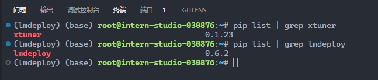

## 创建文件夹

```sh
cd ~
mkdir internvl && cd internvl
```

## link 模型

```sh
cd ~/internvl/
mkdir models
cd models
ls /share/new_models/OpenGVLab/
ln -s /share/new_models/OpenGVLab/InternVL2-2B InternVL2-2B
```

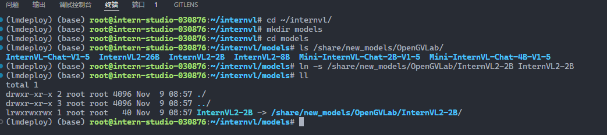

## 部署

### lmdeploy 基本用法

```python
## 1.导入相关依赖包
from lmdeploy import pipeline, TurbomindEngineConfig, GenerationConfig
from lmdeploy.vl import load_image

## 2.使用你的模型初始化推理管线
model_path = "models/InternVL2-2B"
pipe = pipeline(model_path,
                backend_config=TurbomindEngineConfig(session_len=8192))

## 3.读取图片（此处使用PIL读取也行）
image = load_image('MMMMMKUN3 2B-2.jpeg')

## 4.配置推理参数
gen_config = GenerationConfig(max_new_tokens=1024, do_sample=True, top_p=0.8, top_k=40, temperature=0.8)

## 5.利用 pipeline.chat 接口 进行对话，需传入生成参数
sess = pipe.chat(('describe this image', image), gen_config=gen_config)
print(f"\nresponse: {sess.response.text}\n")

## 6.之后的对话轮次需要传入之前的session，以告知模型历史上下文
sess = pipe.chat('What is the woman doing?', session=sess, gen_config=gen_config)
print(f"\nresponse: {sess.response.text}\n")
```

运行

```sh
python lmdeploy_demo.py
```

```sh
(lmdeploy) (base) root@intern-studio-030876:~/internvl# python lmdeploy_demo.py 
/root/.conda/envs/lmdeploy/lib/python3.10/site-packages/timm/models/layers/__init__.py:48: FutureWarning: Importing from timm.models.layers is deprecated, please import via timm.layers
  warnings.warn(f"Importing from {__name__} is deprecated, please import via timm.layers", FutureWarning)
InternLM2ForCausalLM has generative capabilities, as `prepare_inputs_for_generation` is explicitly overwritten. However, it doesn't directly inherit from `GenerationMixin`. From 👉v4.50👈 onwards, `PreTrainedModel` will NOT inherit from `GenerationMixin`, and this model will lose the ability to call `generate` and other related functions.
  - If you're using `trust_remote_code=True`, you can get rid of this warning by loading the model with an auto class. See https://huggingface.co/docs/transformers/en/model_doc/auto#auto-classes
  - If you are the owner of the model architecture code, please modify your model class such that it inherits from `GenerationMixin` (after `PreTrainedModel`, otherwise you'll get an exception).
  - If you are not the owner of the model architecture class, please contact the model code owner to update it.
[TM][WARNING] [LlamaTritonModel] `max_context_token_num` is not set, default to 8192.
2024-11-09 09:12:09,487 - lmdeploy - WARNING - turbomind.py:231 - get 171 model params
[WARNING] gemm_config.in is not found; using default GEMM algo                                                                                                                                                                                                    

response: This image appears to be an illustration or artwork that features a woman with exaggeratedly large breasts and long, flowing white hair. She is positioned in a way that her breasts are prominently displayed, and she is wearing a pair of high-heeled shoes. The background consists of what looks like a wooden structure with tiles, and there are some black shoes with white details on the sides. The artwork has a cartoonish and somewhat surreal style.


response: The woman in the image is lying down, with her head resting on a pillow. Her body is positioned in such a way that her breasts are prominently displayed, and she is wearing a pair of high-heeled shoes. The overall composition of the image has a cartoonish and surreal style, with exaggerated proportions and a focus on the woman's physical appearance.
```

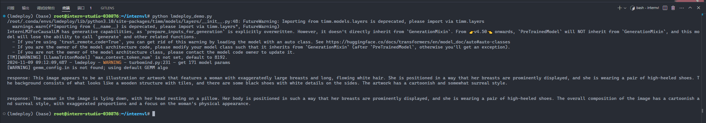

### 网页应用部署体验

```sh
cd ~/internvl
git clone https://github.com/Control-derek/InternVL2-Tutorial.git
cd InternVL2-Tutorial
```

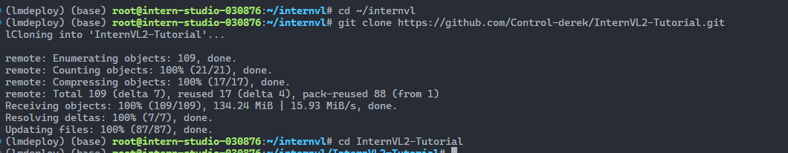

修改模型路径

```diff
- MMODEL_PATH = "/root/share/new_models/OpenGVLab/InternVL2-2B"
+ MODEL_PATH = "../models/InternVL2-2B"
```

运行

```sh
python demo.py
```

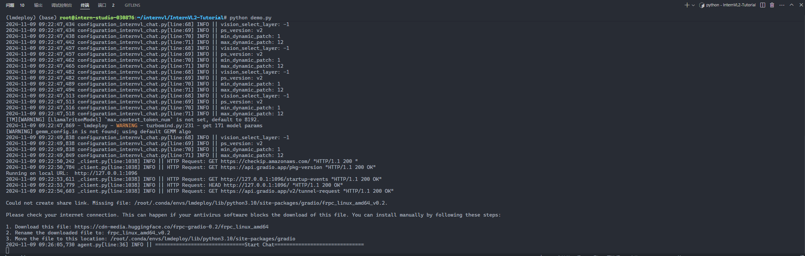


端口映射

```sh
ssh root@ssh.intern-ai.org.cn -p 43681 -CNg -L 1096:127.0.0.1:1096 -o StrictHostKeyChecking=no UserKnownHostsFile=/dev/null
```

浏览器访问 http://127.0.0.1:1096

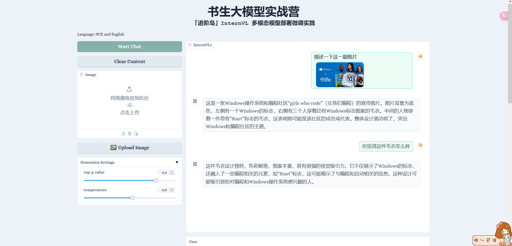

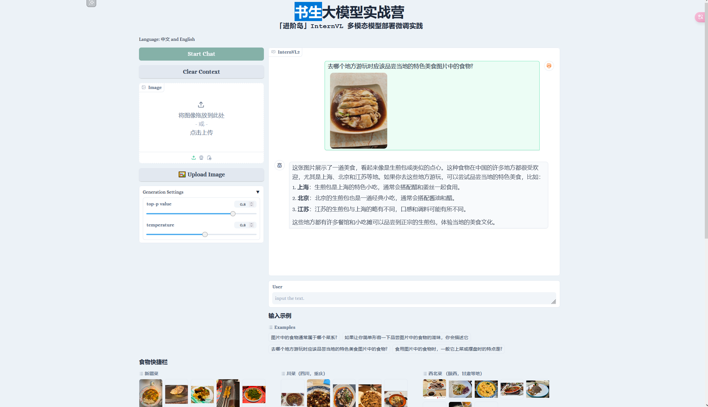

# 微调 InternVL2

## 准备数据集(使用 share 数据集)

```
cd ~/internvl
mkdir datasets
cd datasets
ln -s /root/share/datasets/FoodieQA ./
```

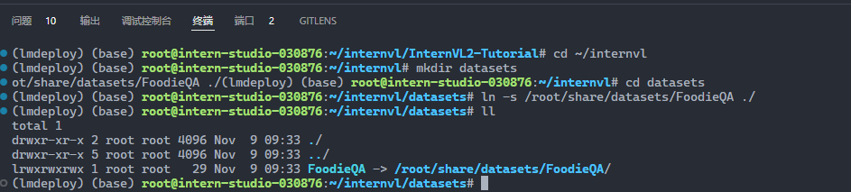

## 准备配置文件

修改模型和数据集路径


## 开始训练

```sh
cd ~/internvl/InternVL2-Tutorial/xtuner_config
xtuner train internvl_v2_internlm2_2b_lora_finetune_food.py --deepspeed deepspeed_zero2
```

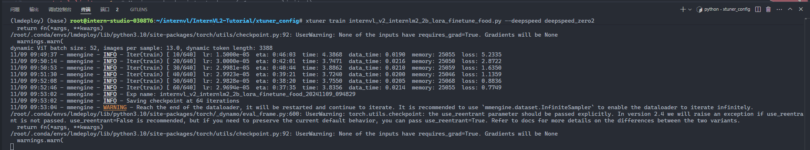

## 转换格式

微调后，把模型checkpoint的格式转化为便于测试的格式：

```sh
cd ~/internvl/InternVL2-Tutorial/xtuner_config

# 下载
https://github.com/InternLM/xtuner/blob/main/xtuner/configs/internvl/v1_5/convert_to_official.py

python convert_to_official.py internvl_v2_internlm2_2b_lora_finetune_food.py ./work_dirs/internvl_v2_internlm2_2b_lora_finetune_food/iter_640.pth ./work_dirs/internvl_v2_internlm2_2b_lora_finetune_food/lr35_ep10/ # 输出文件名可以按照喜好设置
```

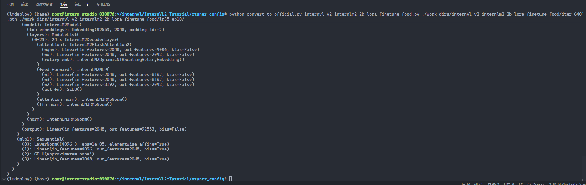

## 网页demo对比

微调前


微调后

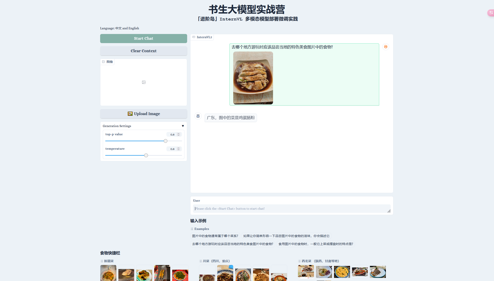

微调前


微调后

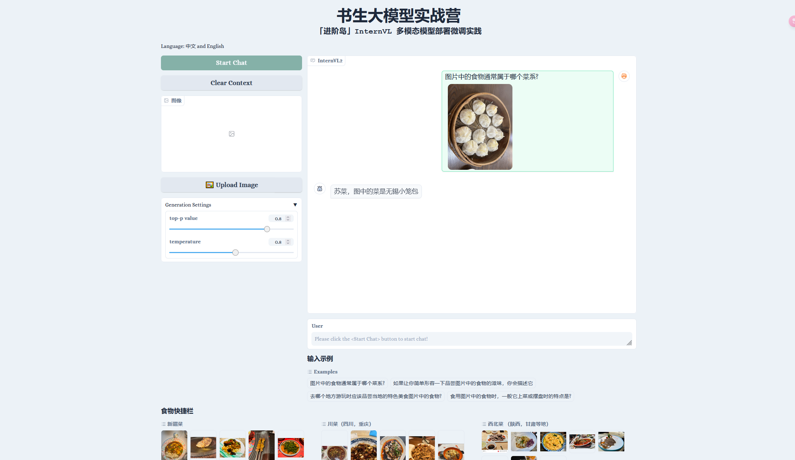

微调前

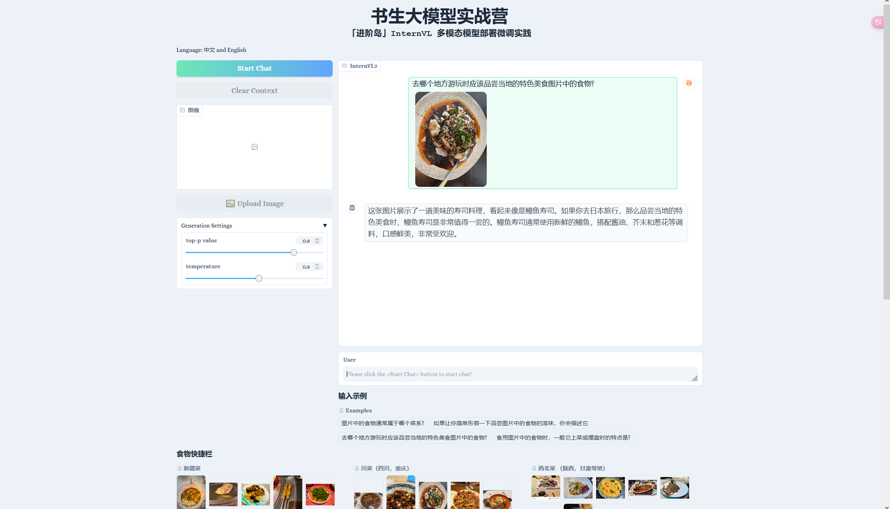

微调后

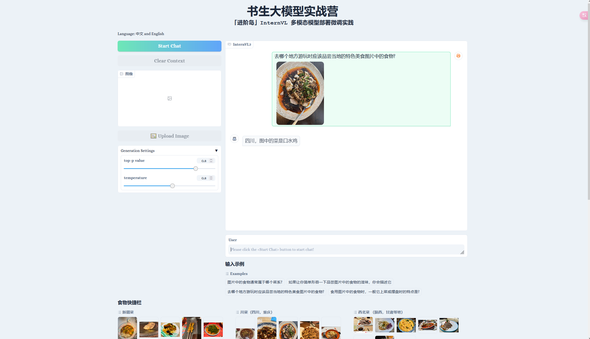

微调前

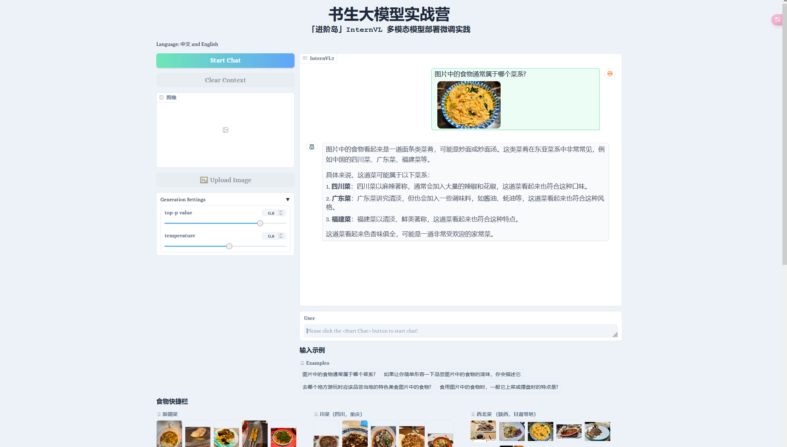

微调后

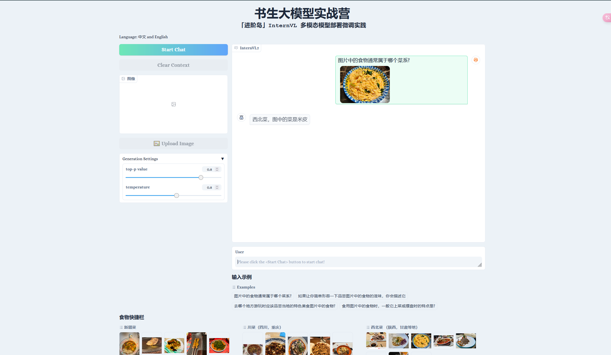
