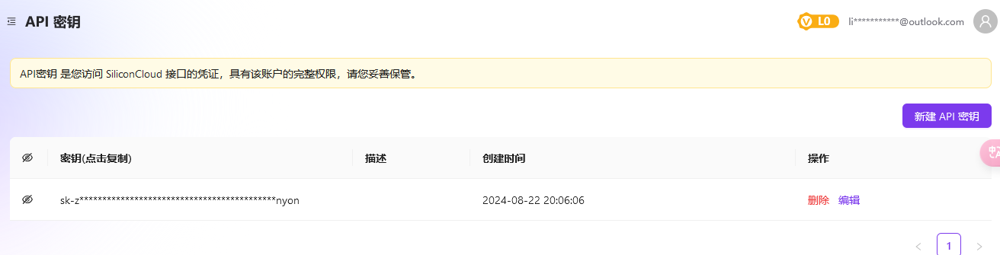
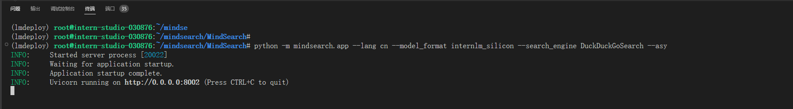
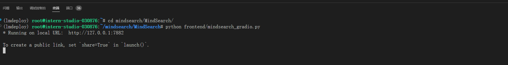
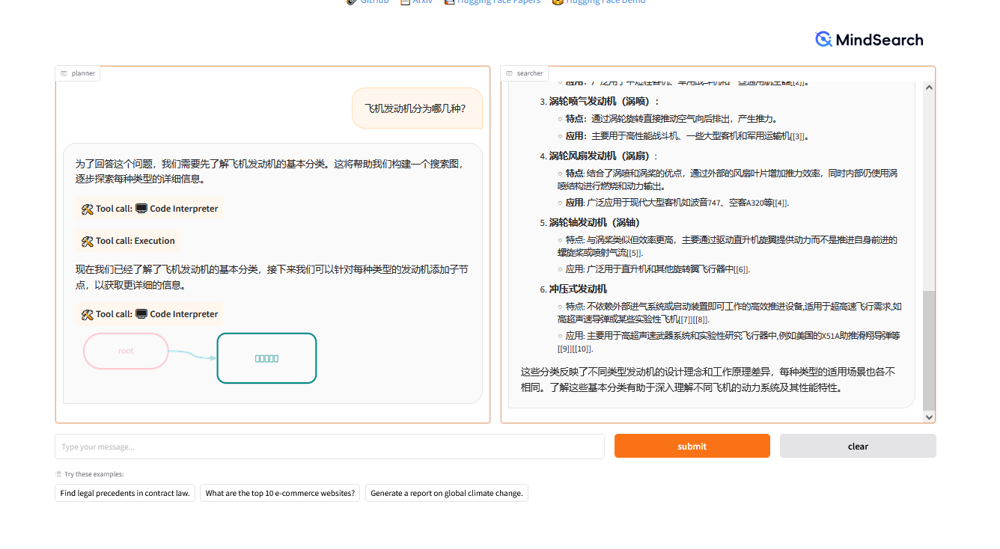
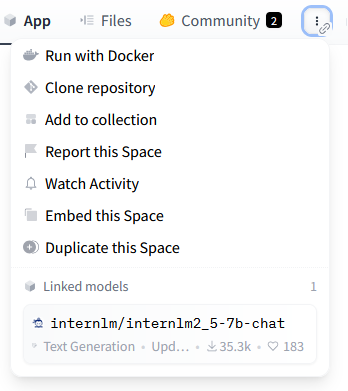
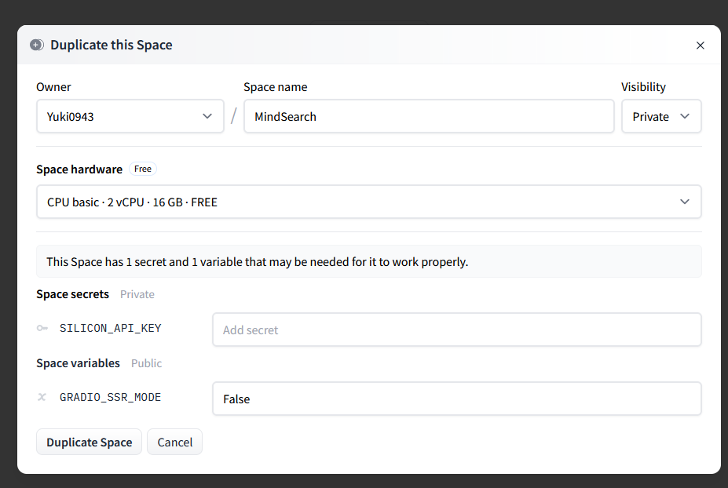
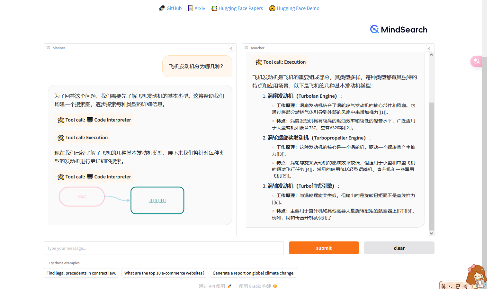

# 本地部署

## 安装 MindSearch

```sh
cd ~ && mkdir mindsearch && cd mindsearch
git clone https://github.com/InternLM/MindSearch.git && cd MindSearch && git checkout ae5b0c5
pip install -r requirements.txt
```


## 获取硅基流动API KEY

因为要使用硅基流动的 API Key，所以接下来便是注册并获取 API Key 了。 首先，我们打开它的[登录界面](https://account.siliconflow.cn/login)来注册硅基流动的账号（如果注册过，则直接登录即可）。 在完成注册后，打开[api key页面](https://cloud.siliconflow.cn/account/ak)来准备 API Key。首先创建新 API 密钥，然后点击密钥进行复制，以备后续使用。




## 启动 MindSearch

### 启动后端

由于硅基流动 API 的相关配置已经集成在了 MindSearch 中，所以我们在一个终端A中可以直接执行下面的代码来启动 MindSearch 的后端。

```sh
export SILICON_API_KEY=<上面复制的API KEY>
conda activate lmdeploy

# 进入你clone的项目目录
cd ~/mindsearch/MindSearch
python -m mindsearch.app --lang cn --model_format internlm_silicon --search_engine DuckDuckGoSearch --asy
```

- --lang: 模型的语言，en 为英语，cn 为中文。

- --model_format: 模型的格式。
  - internlm_silicon 为 InternLM2.5-7b-chat 在硅基流动上的API模型
- --search_engine: 搜索引擎。
  - DuckDuckGoSearch 为 DuckDuckGo 搜索引擎。
  - BingSearch 为 Bing 搜索引擎。
  - BraveSearch 为 Brave 搜索引擎。
  - GoogleSearch 为 Google Serper 搜索引擎。
  - TencentSearch 为 Tencent 搜索引擎。



### 启动前端

在后端启动完成后，我们打开新终端B运行如下命令来启动 MindSearch 的前端:

```sh
conda activate mindsearch

# 进入你clone的项目目录
cd ~/mindsearch/MindSearch
python frontend/mindsearch_gradio.py
```

  前后端都启动后，我们应该可以看到github自动为这两个进程做端口转发:





### 端口转发

```sh
ssh -CNg -L 8002:127.0.0.1:8002 -L 7882:127.0.0.1:7882 -L 23333:127.0.0.1:23333 root@ssh.intern-ai.org.cn -p 43681
```

### 浏览器访问 `http://127.0.0.1:7882/`

问题：飞机发动机分为哪几种？

回答成功



# 部署到自己的 HuggingFace Spaces上


在之前课程的学习中，我们已经将模型或者应用上传/部署到hugging face上过了。在这里我们介绍一种更简单的方法，它就像克隆一样，无需编写代码即可部署自己的Spaces应用~

首先我们找到InternLM官方部署的[MindSearch Spaces应用](https://huggingface.co/spaces/internlm/MindSearch)

## 选择配置

在该页面的右上角，选择Duplicate this Space



选择如下配置后，即可Duplicate Space

- Space Hardware选择第一条，即**Free的2vCPU**即可
- 填写好SILICON_API_KEY，即上面提到的硅基流动的API KEY



访问: https://huggingface.co/spaces/Yuki0943/MindSearch

## 测试结果

问题：飞机发动机分为哪几种？

回答成功

